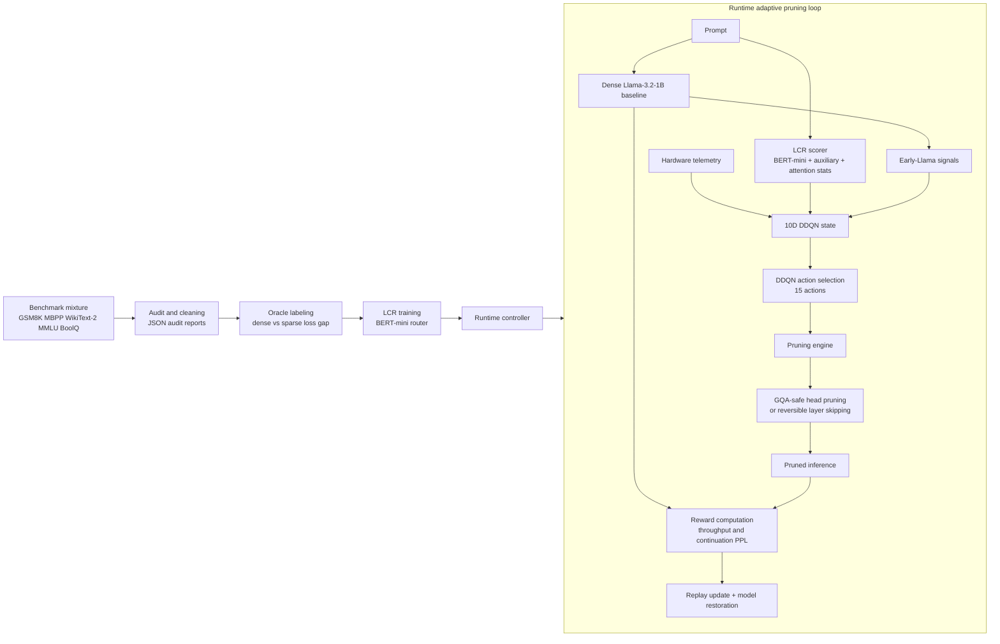
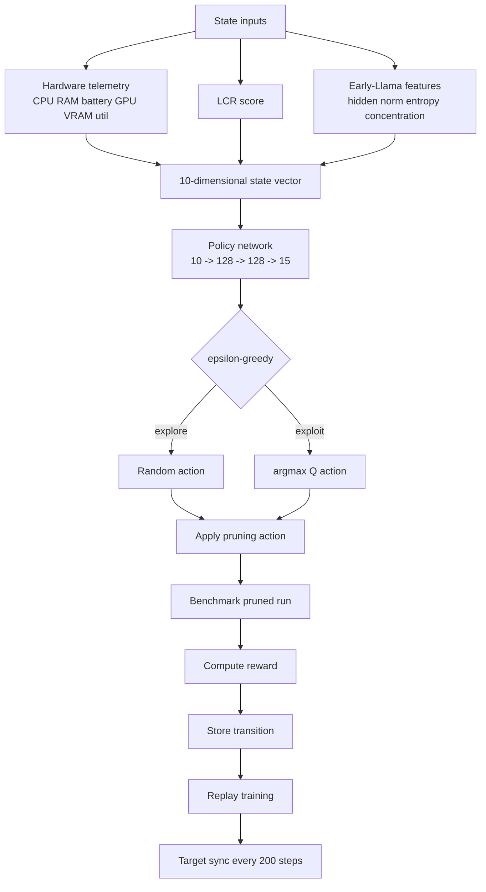

# Methodology Sections for Adaptive Pruning Research

This section has been rewritten to present the project in a thesis- and journal-ready form. Rather than describing an intended framework, it reports the methodology that is now implemented in the repository: benchmark-driven data curation, oracle sensitivity labeling, a trained BERT-mini Learned Complexity Router (LCR), a Double Deep Q-Network (DDQN) controller, and a reversible runtime pruning engine integrated with Llama-3.2-1B. To improve readability, the section is organized from problem formulation, to system design, to implementation details, and finally to interpretation of the current experimental findings.

## 4.2 Preliminary Design and Specification

The present study investigates whether structural pruning can be selected adaptively at inference time instead of being fixed offline. The implemented system, referred to in this work as CASRAP, frames runtime pruning as a decision problem in which the controller must decide how aggressively to compress the model for a given prompt while preserving acceptable output quality. The backbone model used throughout the methodology is Llama-3.2-1B, chosen because it is large enough to exhibit meaningful redundancy while still being feasible to run repeatedly in a local resource-constrained environment.

At a conceptual level, the framework is built around three observations. First, different prompts are not equally sensitive to pruning. Second, hardware state influences whether latency gains are valuable enough to justify compression. Third, not all pruning operators fail in the same way: head pruning and layer skipping induce different quality-loss patterns. The current methodology therefore replaces the earlier single heuristic prompt-complexity score with a learned prompt-sensitivity estimate and combines that estimate with hardware and shallow backbone features inside an RL controller.

Relative to the earlier design stage of the project, the methodology has changed in three important ways. First, the data pipeline is now benchmark-based, curated, and audited rather than informal. Second, the routing mechanism is now a trained model rather than a manually weighted heuristic. Third, the pruning engine is implemented as a real reversible system with grouped-query-attention-safe structural head pruning and explicit model restoration.

For clarity, the complete implemented pipeline is summarized in Table 4.2.1.

| Stage | Function | Implemented Outcome |
| --- | --- | --- |
| Prompt collection | Build heterogeneous prompt pool from public benchmarks | Mixed dataset spanning GSM8K, MBPP, WikiText-2, MMLU, and BoolQ |
| Dataset audit | Filter low-quality or malformed rows | JSON audit reports and cleaned prompt CSVs |
| Oracle labeling | Measure dense and sparse degradation | Normalized sensitivity labels derived from Llama-3.2-1B teacher-forcing loss |
| LCR training | Learn prompt sensitivity predictor | Exported BERT-mini checkpoint for runtime scoring |
| RL control | Choose pruning action per prompt | DDQN policy over 15 discrete pruning actions |
| Runtime pruning | Apply and restore structured pruning | GQA-safe head pruning, reversible layer skipping, calibrated importance ranking |
| Evaluation | Compare dense versus pruned inference | Latency, throughput, continuation perplexity, plots, and run reports |

Figure 4.2.1 summarizes the implemented end-to-end architecture from dataset preparation to runtime control.



## 4.2.1 Current System Architecture

### 4.2.1.1 Overall Framework

The current framework operates as a closed-loop inference-time controller. For each episode, the dense Llama-3.2-1B model is first evaluated on the input prompt to establish a baseline. The system then computes a learned prompt sensitivity score using the LCR, extracts cheap early-layer backbone features, and combines these with hardware telemetry to form the RL state vector. The DDQN controller selects a pruning action, the model engine applies the selected action, and inference is repeated under the pruned configuration. The observed changes in throughput and continuation perplexity are then converted into reward, and the controller is updated using experience replay. Finally, the model is restored to its dense form before the next episode begins.

This design is important for methodological validity because it prevents cross-episode contamination. Every episode compares dense and pruned inference on the same prompt, under the same runtime conditions, with restoration applied before the next prompt. Consequently, the baseline measurements remain true dense references rather than partially pruned residual states.

The runtime loop can be summarized as follows:

1. Load the dense Llama-3.2-1B backbone.
2. Compute dense baseline inference metrics.
3. Compute the LCR score and early-layer Llama features.
4. Construct the RL state vector.
5. Select a pruning action with the DDQN policy.
6. Apply the pruning action.
7. Re-measure inference under pruning.
8. Compute reward from speed-quality trade-off.
9. Update the agent and restore the dense model.

### 4.2.1.2 Benchmark Mixture Dataset and Curation

The training and routing methodology now relies on a benchmark mixture dataset rather than a single-source prompt file. This change was necessary because early experiments showed that pruning sensitivity depends strongly on prompt type. A router trained only on one domain, such as short QA or narrative text, would fail to generalize to mathematics or code-generation prompts.

The implemented mixture includes five benchmark families chosen to span distinct reasoning and linguistic regimes:

| Source | Role in Mixture | Sensitivity Relevance |
| --- | --- | --- |
| GSM8K | arithmetic and stepwise reasoning | exposes pruning sensitivity in multi-step mathematical prompts |
| MBPP | code-generation instructions | exposes syntax- and structure-sensitive prompts |
| WikiText-2 | narrative language modeling | provides redundancy-rich prompts that are often more prune-tolerant |
| MMLU | multi-domain reasoning and multiple choice | provides mixed sensitivity across subject areas |
| BoolQ | passage-grounded binary QA | emphasizes context dependency and grounded reasoning |

The builder script streams the source datasets from Hugging Face and writes them into a unified prompt schema. Two main dataset scales were used during development:

- a pilot mixture targeting 5,000 prompts, which produced 4,374 usable rows after cleaning,
- a larger mixture targeting 10,000 prompts, which produced 8,974 usable rows.

The final larger mixture contains 2,000 prompts from GSM8K, WikiText-2, MMLU, and BoolQ, and 974 prompts from MBPP, reflecting the true size of the available MBPP splits.

To make the mixture defensible for thesis use, an audit-and-clean stage was added. This stage filters short prompts, malformed entries, low-information lines, and noisy WikiText headings. The WikiText filters are stricter because raw WikiText-2 includes many section titles and metadata fragments that are not suitable as model inputs. The audit script records flagged rows, source distributions, prompt-length statistics, and cleaning thresholds in JSON reports. As a result, the dataset pipeline is no longer merely a convenience script; it is a documented curation process.

The builder also supports optional answer and evaluation fields, including multiple-choice options for MMLU and BoolQ, GSM8K answers, and MBPP test cases. This is useful because it allows the same dataset family to support both LCR training and benchmark-specific evaluation without creating misaligned prompt files by hand.

### 4.2.1.3 Oracle Labeling Protocol

The core idea behind the LCR is that it should learn prompt sensitivity with respect to the actual pruning regime used by the controller. Accordingly, oracle labels are not defined as generic prompt difficulty. Instead, they are defined as observed degradation of Llama-3.2-1B under specified pruning actions. This distinction is methodologically important because it gives the label a clear operational meaning.

For each prompt, the current oracle pipeline performs one dense teacher-forcing pass and one or more sparse teacher-forcing passes. The dense pass yields a dense loss $\ell_D$ and dense perplexity $PPL_D$. Each sparse pass yields a sparse loss $\ell_S$ and sparse perplexity $PPL_S$ under a fixed pruning configuration.

The principal label used in the current system is the non-negative loss gap:

$$
\Delta \ell = \max(0, \ell_S - \ell_D)
$$

This label is preferred over a raw perplexity gap because it is numerically better behaved and corresponds to a log-perplexity ratio rather than an exponentiated difference. In other words, it reduces the heavy-tailed instability that appears when sparse configurations occasionally produce very large perplexity spikes.

The oracle labeler was extended from a single sparse configuration to a multi-method composite protocol. In the current implementation, the principal composite labels are produced using:

- attention-head pruning at 30%, and
- transformer-layer skipping at 25%.

Each prompt therefore receives dense metrics, sparse metrics for both methods, per-method gaps, and a composite raw sensitivity score. The raw values are then normalized into $[0,1]$ using percentile-clipped min-max scaling with 5th and 95th percentile clipping:

$$
y = \mathrm{clip\_normalize}(\Delta \ell)
$$

The sidecar metadata written by the oracle script records the backbone model, sparse configurations, normalization bounds, sequence length, and runtime. This makes the labeling procedure reproducible and suitable for thesis appendices or later ablation work.

An important result from this stage is that head-pruning sensitivity and layer-skipping sensitivity are only weakly correlated. On the 10k-scale mixture, the recorded cross-method relationships are approximately:

- Spearman $\rho \approx 0.309$,
- Pearson $r \approx 0.365$.

This finding justifies the move away from simplistic single-notion prompt difficulty. It implies that pruning sensitivity is operator-dependent: a prompt that tolerates head pruning may still be fragile under layer skipping. This insight motivated the addition of multi-method label support and remains central to future multi-output routing extensions.

### 4.2.1.4 Learned Complexity Router (LCR)

The LCR has matured from an early conceptual BERT-based scorer into a trained prompt-sensitivity regressor integrated into the RL agent. The current scorer loads a fine-tuned BERT-mini backbone together with the learned regression head, auxiliary projection module, scalar-mixing parameters, and attention-statistics extractor from exported checkpoints.

The selected runtime architecture is summarized below:

```text
Input prompt
-> BERT-mini encoder (4 layers, 256 hidden, 11.3M parameters)
-> ScalarMix over embedding + 4 hidden layers
-> mean pooling -> 256-d representation

Auxiliary path
-> 9 prompt statistics + 48 attention-statistics features
-> AuxProjector(57 -> 48)

Fusion
-> [256 pooled representation ; 48 projected auxiliary representation]
-> 304-d fused vector
-> RegressorHead(304 -> 202 -> 101 -> 1)
-> sigmoid score in [0,1]
```

The prompt-level auxiliary features include token-count scaling, compression ratio, average word length, special-character ratio, unique-token ratio, code-marker intensity, numeric density, question-marker presence, and average sentence length. In addition, the model extracts internal attention descriptors from BERT-mini, such as attention entropy and concentration. This is a meaningful methodological improvement because the router is no longer based only on surface text statistics; it also uses internal representational behavior from the small router backbone.

Although the repository now supports dual-output routing infrastructure, the currently exported checkpoint remains the best-performing single-output model. The oracle and preprocessing pipeline can already produce separate labels for head pruning and layer skipping, and the runtime scorer API can expose multiple outputs, but the selected checkpoint is still the strongest single-score regressor. This is a pragmatic choice: it gave better held-out generalization and integrates directly into the present 10-dimensional RL state formulation.

If the trained checkpoint is absent, the system automatically falls back to a heuristic proxy based on prompt compression ratio, representation statistics, and prompt length. That fallback is not part of the main reported contribution, but it ensures operational robustness.

### 4.2.1.5 DDQN Pruning Controller

The pruning controller is implemented as a Double Deep Q-Network. Compared with a standard DQN, DDQN reduces Q-value overestimation by separating action selection from target evaluation. The current controller uses an MLP policy network and a matching target network of the form:

$$
10 \rightarrow 128 \rightarrow 128 \rightarrow 15
$$

where 10 is the state dimension and 15 is the number of available pruning actions.

The state vector is substantially richer than the earlier heuristic formulation. The current 10-dimensional state is composed of:

1. CPU utilization,
2. available system memory,
3. battery percentage,
4. GPU availability,
5. free GPU memory,
6. GPU utilization,
7. LCR sensitivity score,
8. layer-0 hidden-state norm,
9. layer-0 attention-entropy proxy,
10. layer-0 attention-concentration proxy.

This state design is one of the central methodological updates in the project. The controller is no longer reacting only to external hardware pressure and handcrafted prompt metadata. It now also observes low-cost internal signals from the backbone itself, allowing the policy to reason jointly about system load, prompt sensitivity, and early representation behavior.

The action space contains 15 discrete actions:

- one `none` action,
- seven attention-head pruning intensities: 5%, 10%, 15%, 20%, 25%, 30%, and 50%,
- seven transformer-layer skipping intensities: 5%, 10%, 15%, 20%, 25%, 30%, and 50%.

Training uses a replay buffer of 10,000 transitions, batch size 32, AdamW optimization, discount factor $\gamma = 0.95$, and target-network synchronization every 200 update steps. Exploration is epsilon-greedy; epsilon decays during training toward 0.1 and is set to 0 during testing for pure exploitation.

Figure 4.2.2 highlights how the runtime controller constructs the DDQN state and closes the action-reward loop.



### 4.2.1.6 Dynamic Pruning Engine

The pruning engine is now a concrete and reversible runtime component rather than a conceptual placeholder. The current engine supports:

- grouped-query-attention-safe structural head pruning,
- reversible transformer-layer skipping,
- structural feed-forward-network slicing.

In the current RL experiments, the action space exposes only attention-head pruning and layer skipping. FFN slicing is implemented in the engine but intentionally left outside the RL action space during the current training stage to avoid additional instability.

#### Attention-head pruning

Attention-head pruning is implemented structurally rather than through simple masking. The engine rebuilds the relevant projection matrices so that pruning reduces actual model dimensions and therefore real computation. Because Llama-3.2-1B uses grouped-query attention, head removal must respect grouped-query structure. The implementation therefore removes entire key-value groups and their associated query-head groups together. This is a critical correctness improvement over naive head-pruning approaches that assume each query head is independent.

#### Transformer-layer skipping

Layer pruning is implemented as reversible skipping. The engine modifies selected layer-forward paths so that the chosen layers are bypassed during inference, but the original model is restored after the episode. The first and last layers are explicitly protected from skipping to avoid catastrophic degradation from disrupting initial feature extraction or final refinement.

#### Importance calibration

Before controller training begins, the model engine performs an importance-calibration pass on a small subset of prompts. Forward hooks and forward-pre-hooks collect activation-based importance scores for:

- attention heads at each `o_proj` input,
- FFN channels at each `down_proj` input,
- transformer layers via their output activations.

These scores are then used to rank which heads, channels, or layers should be removed first. Consequently, the pruning policy is not random; it acts over an importance-aware pruning substrate.

### 4.2.1.7 Benchmarking, Reward, and Reporting

Each episode benchmarks the same prompt under both the dense and the pruned model. The primary measured outputs are inference time in milliseconds, throughput in tokens per second, and continuation perplexity. The use of continuation perplexity is important: prompt tokens are masked out when loss is computed, so the quality term reflects only the generated continuation. This gives a more faithful estimate of how pruning changes generation quality.

The reward function used in the present RL loop is:

$$
R = \alpha \cdot \frac{tok/s_{pruned} - tok/s_{base}}{tok/s_{base} + \varepsilon}
- \beta \cdot \frac{PPL_{pruned} - PPL_{base}}{PPL_{base} + \varepsilon}
$$

with $\alpha = 0.7$, $\beta = 0.3$, and $\varepsilon = 10^{-8}$. The weighting reflects the design preference to prioritize speedup while still penalizing quality loss.

To assist interpretation, the framework automatically produces plots for throughput, latency, perplexity, prompt-length versus prompt-perplexity correlation, controller overhead, reward progression, quality-versus-speed tradeoff, and action usage. Training runs are stored under numbered folders in `Training Report`, while evaluation runs are stored under numbered folders in `Test Report`. This reporting pipeline makes the experimental history much easier to audit and narrate in a thesis chapter.

## 4.2.2 Details of Implementation

### 4.2.2.1 Hardware and Software Environment

The experiments were implemented in a local consumer-grade environment, consistent with the thesis goal of resource-aware local inference rather than large-cluster deployment. The primary hardware configuration is:

- GPU: NVIDIA RTX 4060 with 8 GB VRAM,
- CPU: AMD Ryzen 7 5700X,
- RAM: 16 GB DDR4,
- storage: NVMe SSD.

The software stack consists of Python 3.9+, PyTorch, Hugging Face Transformers, Hugging Face Datasets, psutil for telemetry, matplotlib for reporting, and NVML when available for GPU monitoring. Model and dataset artifacts are cached locally through a project-scoped `HF_HOME`, and Hugging Face authentication is read from environment variables or `.env`. This makes the implementation portable and reproducible without relying on machine-specific cache locations.

### 4.2.2.2 Implemented Data and Training Utilities

One major project change is the addition of utility scripts that transform the methodology from a conceptual plan into a reproducible workflow. The current repository includes:

| Script | Current Role |
| --- | --- |
| `build_lcr_mixture_dataset.py` | streams and assembles the benchmark prompt mixture |
| `audit_lcr_mixture_dataset.py` | audits prompt quality and optionally writes cleaned datasets |
| `oracle_labeler.py` | generates dense and sparse teacher-forcing metrics and normalized sensitivity labels |
| `prepare_dual_labels.py` | prepares per-method labels and auxiliary feature columns |
| `train_tinybert_lcr.py` | trains the LCR checkpoint |
| `lcr_tinybert.py` | loads and serves the runtime LCR model |
| `smoke_test_lcr.py` | verifies end-to-end LCR inference |
| `check_tinybert_install.py` | validates BERT-mini installation |

These utilities are not peripheral. They define the actual workflow used to produce the current methodology and therefore deserve explicit mention in the chapter.

### 4.2.2.3 Selected LCR Checkpoint and Training Configuration

The currently selected router checkpoint is the run stored under `Training Report/TinyBERT Train 20`, which is also exported to the active runtime checkpoint directory. That run uses `oracle_lcr_10k_dual.csv` as input and trains a single-output regressor on the head-sensitivity target. The effective training configuration is:

- backbone: `prajjwal1/bert-mini`,
- maximum sequence length: 128,
- fused input dimension: 304,
- dropout: 0.20,
- batch size: 48,
- epochs: 50,
- patience: 20,
- learning rate: $4 \times 10^{-5}$,
- backbone learning-rate factor: 0.20,
- weight decay: 0.03,
- label smoothing: 0.01,
- source-balanced oversampling: enabled,
- loss: Huber/SmoothL1 with $\delta = 0.15$.

The training split is stratified by source to preserve domain balance in train, validation, and test partitions. Source balancing is enabled during training to prevent MBPP from becoming underrepresented relative to the larger benchmark sources.

The selected checkpoint achieves the following held-out test performance:

- MSE: 0.03997,
- $R^2$: 0.4950,
- Spearman correlation: 0.7009,
- 3-bin accuracy: 65.13%,
- 95% confidence interval for Spearman: [0.6722, 0.7265].

Per-source test performance remains strongest on WikiText-2, BoolQ, and MMLU, while GSM8K remains the hardest source. This pattern is expected because mathematical prompts are both sparse in lexical redundancy and sensitive to small changes in reasoning trajectory.

Later runs, including `TinyBERT Train 22`, were preserved for comparison but did not exceed the held-out performance of `Train 20`. The thesis should therefore treat `Train 20` as the selected and deployed LCR model.

### 4.2.2.4 Current RL Training Configuration

The implemented RL controller currently uses DDQN with a replay buffer of 10,000 transitions, batch size 32, AdamW optimization, learning rate $1 \times 10^{-4}$, discount factor 0.95, and target-network update interval of 200 steps. The epsilon schedule decays exploration toward 0.1 during training. Before training begins, the engine calibrates activation-based pruning importance on a small prompt subset.

Each episode logs the following quantities:

- prompt token length,
- prompt perplexity,
- LCR score,
- dense baseline latency, throughput, and continuation perplexity,
- LCR inference time,
- RL decision time,
- pruned model latency, throughput, and continuation perplexity,
- total pruned latency,
- chosen action,
- generated-token count,
- reward,
- epsilon.

This logging behavior is itself a methodological improvement because it allows the learning dynamics and failure modes of the controller to be interpreted directly rather than inferred from aggregate numbers alone.

### 4.2.2.5 Runtime Integration Overhead

The LCR is integrated directly into the RL agent. At runtime, the controller first attempts to load the exported BERT-mini backbone and regression head from the `checkpoints` directory. If the checkpoints exist, the learned LCR is used; otherwise, the system reverts to a heuristic fallback.

The measured controller overhead in the latest saved reports is small relative to full Llama inference but still significant enough to report explicitly. In the latest RL training run, the average LCR time is 17.74 ms and the average RL decision time is 0.76 ms. In the latest test run, the averages are 18.96 ms and 0.77 ms, respectively. These values justify including controller overhead inside total pruned latency rather than assuming action selection is cost-free.

### 4.2.2.6 Additional Engine Features and Their Current Role

The model engine also contains scaffolding for static profile swapping, 2:4 semi-structured sparsity, compilation hooks, and KV-cache compression. These are useful engineering directions, but they are not the main basis of the current reported results. In particular, the standard experimental path relies primarily on the dense-versus-pruned RL loop with structural head pruning and reversible layer skipping. For methodological clarity, the thesis should present these additional features as secondary experimental scaffolds rather than as established core contributions.

## 4.2.3 Result Analysis and Discussion

### 4.2.3.1 Interpretation of LCR Results

Among all system components, the LCR is the most mature and the most defensible as a current thesis contribution. The project has progressed from a prompt-length and prompt-perplexity heuristic to a trained reusable router that is grounded in dense-versus-sparse behavior of the target backbone. This change is not cosmetic. It changes the meaning of the routing signal from an intuition-driven difficulty proxy into a measurable sensitivity estimate.

Several empirical conclusions follow from the current LCR results. First, benchmark mixing is necessary because prompt sensitivity is domain-dependent. Second, loss-gap labeling is substantially more stable than raw perplexity-gap labeling. Third, percentile-clipped normalization reduces the influence of extreme prompts. Fourth, head-pruning sensitivity and layer-skipping sensitivity are related but not interchangeable. Fifth, the richer BERT-mini architecture with auxiliary and internal-attention features performs materially better than the earlier heuristic approach.

The held-out performance of the selected checkpoint, especially the Spearman correlation near 0.70, indicates that the router is learning meaningful ranking structure over prompt sensitivity rather than only overfitting absolute label magnitudes. This matters for the downstream controller because RL action selection depends more on relative sensitivity ordering than on perfect scalar calibration.

### 4.2.3.2 Interpretation of RL Results

The RL controller has improved substantially in engineering completeness, but its policy quality is still less mature than the router itself. This distinction should be made clearly in the thesis. The controller now operates over a meaningful state representation, a real pruning engine, and an explicit dense-versus-pruned benchmark loop. In that sense, the RL side has moved beyond proof-of-concept implementation. However, the latest stored results show that policy stability remains a major challenge.

The latest saved RL training report (`Training Report/Train 34`) records a 50-episode training run with:

- average total pruned latency of 1458.39 ms,
- average dense baseline latency of 1488.49 ms,
- average pruned perplexity of 8.60,
- average dense baseline perplexity of 2.25,
- average reward of -1.0326.

These averages indicate that the controller can obtain latency reduction, but it does so inconsistently and often at the cost of substantial quality degradation. The per-action breakdown is informative: certain actions, such as moderate head pruning or mild layer skipping, occasionally produce favorable local trade-offs, whereas more aggressive layer actions produce severe degradation.

The latest saved evaluation report (`Test Report/Test 16`) is even more revealing. In that 100-episode test run, the policy selected transformer-layer skipping at 10% intensity in 99 of 100 episodes. The aggregate results were:

- average total pruned latency of 2003.29 ms,
- average dense baseline latency of 2061.55 ms,
- average pruned perplexity of 732.97,
- average dense baseline perplexity of 2.38.

This behavior is best interpreted as policy collapse. The controller converged to a narrow action preference that occasionally yields small speed improvements but is vulnerable to catastrophic quality spikes. Therefore, the current evidence supports the claim that the adaptive-pruning pipeline is fully implemented, but it does not yet support the stronger claim that the learned RL policy is fully optimized.

### 4.2.3.3 Reader-Oriented Summary of What Changed in the Project

For the reader, the most important project changes relative to the earlier draft can be summarized succinctly:

| Earlier project state | Current project state |
| --- | --- |
| heuristic prompt-complexity score | trained BERT-mini LCR deployed at runtime |
| ad hoc prompt pool | audited five-source benchmark mixture |
| single sparse label idea | multi-method oracle labeling with loss-gap normalization |
| 7-feature controller state | 10-feature state including LCR and early-Llama signals |
| conceptual head pruning | grouped-query-attention-safe structural head pruning |
| conceptual layer pruning | reversible runtime layer skipping with restoration |
| limited reporting | automatic run folders, JSON metrics, and analysis plots |

Taken together, these updates shift the thesis from a proposal about adaptive pruning to an implemented adaptive-pruning research system with a strong learned routing component, a reproducible data and labeling pipeline, and a partially successful but still unstable RL controller.

### 4.2.3.4 Final Interpretation for the Thesis Narrative

The current methodology supports a clear and defensible thesis narrative. The strongest completed contribution is the learned prompt-sensitivity pipeline: benchmark mixture construction, audited curation, oracle labeling, BERT-mini routing, and runtime integration. The pruning engine is also implemented at a level suitable for reporting because it performs real structured operations and enforces reversibility. The main unfinished aspect is not implementation completeness, but controller stability. The present RL results show that adaptive pruning is feasible, but they also show that reward shaping and policy regularization remain open problems.

For that reason, the chapter should position the work carefully. It is accurate to claim that the project has implemented a context-aware adaptive-pruning framework and demonstrated a viable learned complexity router. It is also accurate, and scientifically stronger, to acknowledge that the current RL agent has not yet achieved consistently robust pruning decisions across all prompt types. Stating both points clearly will make the methodology read more like a journal article: precise about achievements, precise about limitations, and explicit about where the real novelty already lies.
