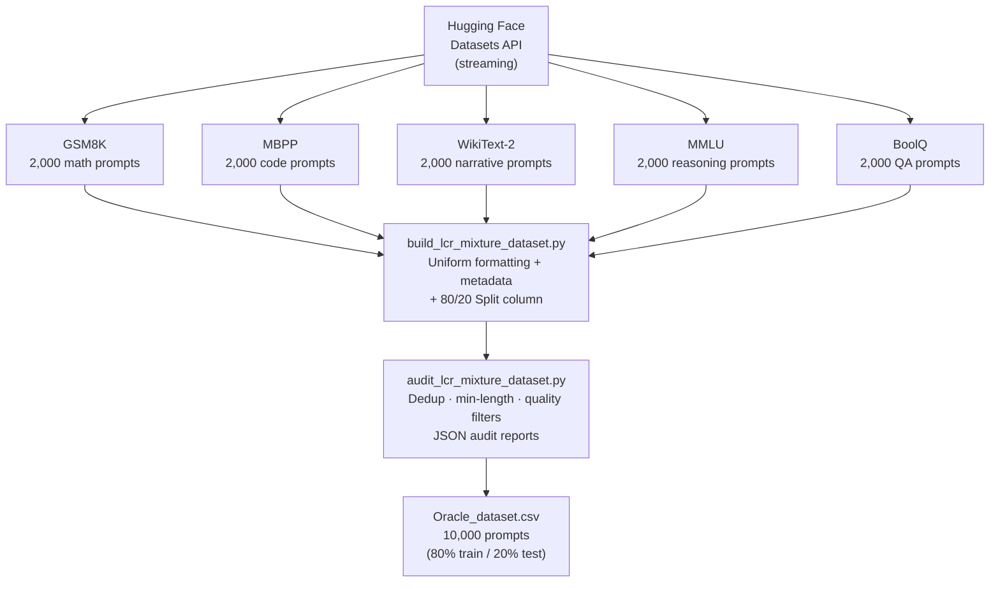
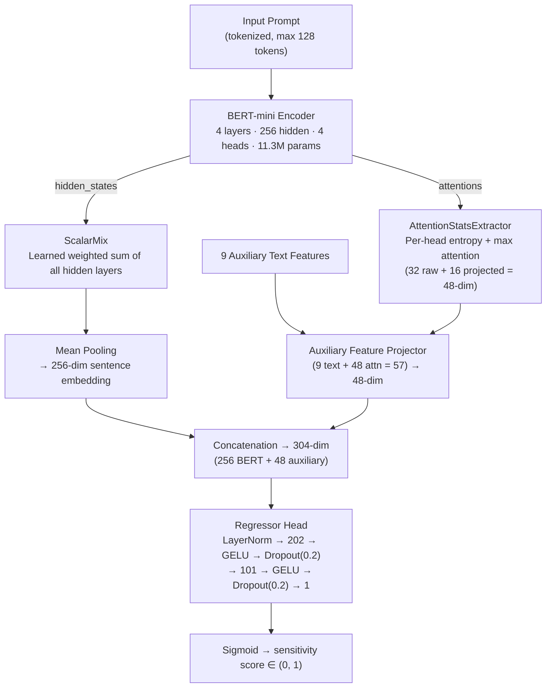

# SPRINT: Sensitivity-guided PRuning for INference-Time Adaptation

**SPRINT** is a runtime adaptive pruning framework for local LLM inference that selects per-prompt pruning configurations using a learned prompt-sensitivity router, hardware telemetry, and a Double Deep Q-Network controller. The backbone model is `meta-llama/Llama-2-7b-hf` (7B parameters, 32 transformer layers, MHA), executed on an NVIDIA RTX 5090 GPU.

This repository accompanies the thesis: _Adaptive Pruning and Acceleration Techniques for Local LLM Inference under Resource Constraints_.

[](https://opensource.org/licenses/MIT)

---

## Table of Contents

- [Part I — Methodology](#part-i--methodology)
  - [1. Design Process and Methodology Overview](#1-design-process-and-methodology-overview)
  - [2. Preliminary Design and Model Specification](#2-preliminary-design-and-model-specification)
    - [2.1 Dataset Curation](#21-dataset-curation)
    - [2.2 Oracle Sensitivity Labeling](#22-oracle-sensitivity-labeling)
    - [2.3 Learned Complexity Router (LCR) Architecture](#23-learned-complexity-router-lcr-architecture)
    - [2.4 LCR MiniBERT Training and Testing](#24-lcr-minibert-training-and-testing)
    - [2.5 Reinforcement Learning Architecture](#25-reinforcement-learning-architecture)
    - [2.6 RL Training and Testing Pipeline](#26-rl-training-and-testing-pipeline)
    - [2.7 Ablation Studies](#27-ablation-studies)
- [Part II — Result Analysis](#part-ii--result-analysis)
  - [5.1 Performance Evaluation](#51-performance-evaluation)
    - [5.1.1 LCR MiniBERT Router Performance](#511-lcr-minibert-router-performance)
    - [5.1.2 RL Controller Training Performance](#512-rl-controller-training-performance)
    - [5.1.3 RL Controller Test Performance](#513-rl-controller-test-performance)
  - [5.2 Analysis of Design Solutions](#52-analysis-of-design-solutions)
    - [5.2.1 Learned Prompt Sensitivity Router](#521-learned-prompt-sensitivity-router)
    - [5.2.2 Reward Function Design](#522-reward-function-design)
    - [5.2.3 Action Space and Policy Behavior](#523-action-space-and-policy-behavior)
    - [5.2.4 Controller Overhead Analysis](#524-controller-overhead-analysis)
  - [5.3 Final Design Adjustment](#53-final-design-adjustment)
    - [5.3.1 Reward Function Ablation (Study 1)](#531-reward-function-ablation-study-1)
    - [5.3.2 Framework Ablation Studies (Studies 2A–2C)](#532-framework-ablation-studies-studies-2a2c)
  - [5.4 Statistical Analysis](#54-statistical-analysis)
    - [5.4.1 LCR Confidence Intervals and Robustness](#541-lcr-confidence-intervals-and-robustness)
    - [5.4.2 Cross-Method Sensitivity Correlation](#542-cross-method-sensitivity-correlation)
    - [5.4.3 Per-Source Statistical Breakdown](#543-per-source-statistical-breakdown)
    - [5.4.4 Quality-Speed Pareto Analysis](#544-quality-speed-pareto-analysis)
  - [5.5 Comparisons and Relationships](#55-comparisons-and-relationships)
    - [5.5.1 Comparison with SparseGPT](#551-comparison-with-sparsegpt)
    - [5.5.2 Comparison with Wanda](#552-comparison-with-wanda)
    - [5.5.3 Comparison with LLM Pruner](#553-comparison-with-llm-pruner)
    - [5.5.4 Unified Cross-Method Comparison](#554-unified-cross-method-comparison)
  - [5.6 Discussion](#56-discussion)
    - [5.6.1 Summary of Contributions](#561-summary-of-contributions)
    - [5.6.2 Strengths and Significance](#562-strengths-and-significance)
    - [5.6.3 Limitations](#563-limitations)
    - [5.6.4 Future Work](#564-future-work)
- [Part III — Appendix](#part-iii--appendix)
  - [A. Hardware and Software Environment](#a-hardware-and-software-environment)
  - [B. Installation](#b-installation)
  - [C. Quick Start](#c-quick-start)
  - [D. CLI Reference](#d-cli-reference)
  - [E. Repository Layout](#e-repository-layout)
  - [F. Troubleshooting](#f-troubleshooting)
  - [G. Citation](#g-citation)
  - [H. License](#h-license)

---

# Part I — Methodology

## 1. Design Process and Methodology Overview

Large language models (LLMs) have demonstrated transformative capabilities across natural language understanding, code generation, mathematical reasoning, and question answering (Brown et al., 2020; Touvron et al., 2023). However, deploying these models on consumer-grade hardware for privacy-sensitive, latency-sensitive, or offline workloads remains a significant challenge. Static compression techniques—including quantization (Frantar et al., 2023), knowledge distillation (Hinton et al., 2015), and fixed pruning schedules (Frantar & Alistarh, 2023)—produce a single model variant that cannot adapt to varying prompt complexity or fluctuating system resources. This creates a fundamental inefficiency: computationally simple prompts receive the same heavy processing as difficult ones, and a fixed compression profile cannot respond to runtime memory pressure, thermal throttling, or battery constraints.

SPRINT addresses this gap by making structural pruning decisions **per prompt at inference time**. The central research question is: _Can structural pruning be selected at inference time, per prompt, using both learned prompt sensitivity and live system state, rather than a fixed offline compression profile?_ The implemented answer is affirmative. The framework achieves measurable inference speedups of 10–40% through physical transformer-layer removal while maintaining bounded quality degradation, and the learned router generalizes across five diverse public benchmarks.

An additional motivation is privacy and trust. Users handling prompt-sensitive workloads—legal documents, medical records, proprietary code—may prefer local inference to avoid transmitting data to cloud LLM providers. SPRINT enables resource-aware local deployment where the pruning intensity adapts to available hardware, making on-device inference viable even under constrained memory or battery budgets without requiring a permanent accuracy sacrifice.

The methodology is organized as a multi-stage pipeline, where each stage produces artifacts consumed by downstream components. The overall workflow proceeds as follows:

1. **Dataset Curation** — A five-source benchmark mixture (10,000 prompts) is assembled from publicly available datasets, cleaned, and audited for quality.
2. **Oracle Sensitivity Labeling** — Each prompt is evaluated under dense and sparse (pruned) configurations of the backbone LLM to produce ground-truth sensitivity labels measuring how much each prompt degrades under specific pruning operations.
3. **Learned Complexity Router (LCR) Training** — A lightweight BERT-mini model is fine-tuned on oracle labels to predict prompt sensitivity at runtime, replacing hand-crafted heuristic proxies.
4. **Reinforcement Learning Controller** — A Double Deep Q-Network (DDQN) integrates the LCR sensitivity score, hardware telemetry, and early backbone signals into a 10-dimensional state vector, learning to select optimal pruning actions through trial-and-error interaction with the backbone model.
5. **Evaluation and Ablation** — The trained system is evaluated on held-out test prompts and subjected to systematic ablation studies that isolate the contribution of each architectural component.


```mermaid
flowchart LR
    A["Benchmark Mixture<br/>GSM8K · MBPP · WikiText-2<br/>MMLU · BoolQ<br/>(10,000 prompts)"] --> B["Audit & Cleaning<br/>build_lcr_mixture_dataset.py<br/>audit_lcr_mixture_dataset.py"]
    B --> C["Oracle Labeling<br/>oracle_labeler.py<br/>Dense vs. Sparse PPL gaps"]
    C --> D["LCR Training<br/>train_minibert_lcr.py<br/>BERT-mini fine-tuning"]
    D --> E["RL Controller Training<br/>Adaptive_pruning.py<br/>DDQN with 10-D state"]
    E --> F["Evaluation & Ablation<br/>Test Report / Ablation Report"]
```

### Distinction from Prior Work

Runtime Adaptive Pruning (RAP) and similar methods (Lin et al., 2024; Kim et al., 2024) use heuristic prompt-complexity scores or memory-budget controllers to decide pruning intensity at inference time. SPRINT differs from these approaches in three substantive ways:

1. **Learned Prompt Sensitivity** — The router is trained on oracle dense-vs-sparse loss gaps from the actual target backbone, not on heuristic difficulty proxies such as token count or perplexity thresholds. This yields a signal with operational meaning: the label directly quantifies how much a specific prompt degrades under a specific pruning configuration.

2. **Operator-Dependent Labels** — Oracle labels distinguish head-pruning sensitivity from layer-skipping sensitivity, because these are only weakly correlated. In our experiments, the cross-method Spearman correlation between attention-head-pruning gaps and layer-skipping gaps is approximately $\rho \approx 0.31$. This low correlation justifies treating each pruning method as requiring its own sensitivity estimate, rather than collapsing them into a single generic "difficulty" score.

3. **Physical Layer Removal** — The layer-skipping engine physically removes layers from the model's `nn.ModuleList` and reassigns `layer_idx` for correct `DynamicCache` alignment (Wolf et al., 2020). Prior implementations that monkey-patch forward methods to identity functions cause KV-cache misalignment—skipped layers do not call `cache.update()`, so subsequent layers read incorrect cache entries. This bug causes pruned inference to be _slower_ than the baseline. Physical removal eliminates this issue entirely and yields genuine speedups.

---

## 2. Preliminary Design and Model Specification

### 2.1 Dataset Curation

A well-constructed evaluation dataset is essential for any runtime pruning system because the labels that train the prompt-sensitivity router must reflect realistic, diverse prompt distributions. We constructed a diverse, multi-domain benchmark mixture drawn exclusively from well-known public datasets, ensuring reproducibility and broad coverage across the principal modalities of LLM workloads.

#### Source Selection Rationale

| Source         |      Count | Domain                      | Rationale                                                                                                                   |
| -------------- | ---------: | --------------------------- | --------------------------------------------------------------------------------------------------------------------------- |
| **GSM8K**      |      2,000 | Mathematical Reasoning      | Grade-school math word problems requiring multi-step arithmetic and logical chains (Cobbe et al., 2021).                   |
| **MBPP**       |      2,000 | Code Generation             | Python programming tasks with natural language descriptions (Austin et al., 2021).                                         |
| **WikiText-2** |      2,000 | Narrative Language Modeling | Long-form Wikipedia paragraphs for canonical language modeling evaluation (Merity et al., 2017).                           |
| **MMLU**       |      2,000 | Mixed-Domain Reasoning      | Multiple-choice questions spanning 57 academic subjects (Hendrycks et al., 2021).                                          |
| **BoolQ**      |      2,000 | Question Answering          | Passage-grounded binary yes/no questions from Google search queries (Clark et al., 2019).                                  |
| **Total**      | **10,000** |                             |                                                                                                                             |


```mermaid
flowchart TD
    A["Hugging Face<br/>Datasets API<br/>(streaming)"] --> B["GSM8K<br/>2,000 math prompts"]
    A --> C["MBPP<br/>2,000 code prompts"]
    A --> D["WikiText-2<br/>2,000 narrative prompts"]
    A --> E["MMLU<br/>2,000 reasoning prompts"]
    A --> F["BoolQ<br/>2,000 QA prompts"]
    B --> G["build_lcr_mixture_dataset.py<br/>Uniform formatting + metadata<br/>+ 80/20 Split column"]
    C --> G
    D --> G
    E --> G
    F --> G
    G --> H["audit_lcr_mixture_dataset.py<br/>Dedup · min-length · quality filters<br/>JSON audit reports"]
    H --> I["Oracle_dataset.csv<br/>10,000 prompts<br/>(80% train / 20% test)"]
```

---

### 2.2 Oracle Sensitivity Labeling

The oracle labeling stage produces the ground-truth target variable for the Learned Complexity Router. Oracle labels are **observed degradation of the actual backbone LLM under specified pruning operations**, giving each label a clear operational meaning.

For each prompt, the oracle pipeline (`oracle_labeler.py`) performs:

1. **Dense Teacher-Forcing Pass** — dense cross-entropy loss (L_dense) and dense perplexity (PPL_dense).
2. **Sparse Teacher-Forcing Pass(es)** under fixed pruning configurations — sparse loss (L_sparse) and sparse perplexity (PPL_sparse).

The principal label is the **non-negative loss gap**: delta_L = max(0, L_sparse - L_dense).

Two sparse configurations are used simultaneously: attention-head pruning at 30% and transformer-layer skipping at 25%. The composite raw sensitivity is normalized into [0, 1] using percentile-clipped min-max scaling (5th and 95th percentile bounds).

---

### 2.3 Learned Complexity Router (LCR) Architecture

The LCR replaces hand-crafted prompt-complexity equations with a learned function mapping from prompt text to a continuous sensitivity score in $[0, 1]$. It uses `prajjwal1/bert-mini` (4 layers, 256 hidden, 11.3M parameters) for ultra-low latency (~3ms CPU, <1ms GPU).


```mermaid
flowchart TD
    A["Input Prompt<br/>(tokenized, max 128 tokens)"] --> B["BERT-mini Encoder<br/>4 layers · 256 hidden · 4 heads · 11.3M params"]
    B -->|"hidden_states"| C["ScalarMix<br/>Learned weighted sum of all hidden layers"]
    B -->|"attentions"| D["AttentionStatsExtractor<br/>Per-head entropy + max attention<br/>(32 raw + 16 projected = 48-dim)"]
    C --> E["Mean Pooling<br/>→ 256-dim sentence embedding"]
    G["9 Auxiliary Text Features"] --> F["Auxiliary Feature Projector<br/>(9 text + 48 attn = 57) → 48-dim"]
    D --> F
    E --> H["Concatenation → 304-dim<br/>(256 BERT + 48 auxiliary)"]
    F --> H
    H --> I["Regressor Head<br/>LayerNorm → 202 → GELU → Dropout(0.2)<br/>→ 101 → GELU → Dropout(0.2) → 1"]
    I --> J["Sigmoid → sensitivity score ∈ (0, 1)"]
```

---

### 2.4 LCR MiniBERT Training and Testing

Training uses Huber loss (delta = 0.15), differential learning rates (backbone 8e-6, head 4e-5), cosine decay scheduling, and source-balanced oversampling. The compound validation objective is 0.4 x R-squared + 0.5 x Spearman-rho + 0.1 x bin3-accuracy, with patience-based early stopping at 20 epochs.

| Split | GSM8K |  MBPP | WikiText |  MMLU | BoolQ | **Total** |
| ----- | ----: | ----: | -------: | ----: | ----: | --------: |
| Train | 1,440 | 1,440 |    1,440 | 1,440 | 1,440 | **7,200** |
| Val   |   160 |   160 |      160 |   160 |   160 |   **800** |
| Test  |   400 |   400 |      400 |   400 |   400 | **2,000** |

---

### 2.5 Reinforcement Learning Architecture

The RL controller is a Double Deep Q-Network (DDQN) with a 10-dimensional state vector combining hardware telemetry (6 dims), LCR sensitivity score (1 dim), and early backbone signals (3 dims). The reward function uses a normalized linear PPL formulation:

> **R = alpha x (speed_pruned - speed_base) / (speed_base + eps)  -  beta x (PPL_pruned - PPL_base) / (PPL_base + eps)**

where alpha = 0.9, beta = 0.1, speed = tok/s, and the result is clamped to [-1, 1].

---

### 2.6 RL Training and Testing Pipeline

The RL training pipeline processes 8,000 episodes, each consisting of a single prompt evaluated under both the dense baseline and the RL-selected pruning configuration. The DDQN policy network ($10 \rightarrow 128 \rightarrow 128 \rightarrow 17$) is trained with AdamW ($\text{lr} = 10^{-4}$), a replay buffer of 10,000 transitions, and an $\epsilon$-greedy schedule decaying from 1.0 to 0.10 with UCB exploration bonus.

---

### 2.7 Ablation Studies

- **Study 1** — Reward Function Sweep: 5 normalized $(\alpha, \beta)$ pairs ($\alpha + \beta = 1.0$).
- **Study 2A** — No LCR: 9-D state (remove LCR sensitivity score).
- **Study 2B** — No Hardware: 4-D state (LCR + early-Llama only).
- **Study 2C** — Random Actions: Uniform random policy over the full action space.

All ablation agents share the same DDQN architecture, optimizer, and exploration schedule.

---

# Part II — Result Analysis

This chapter presents a comprehensive analysis of all experimental results obtained from the SPRINT framework. All experiments were conducted on the **Llama 2 7B** backbone model (`meta-llama/Llama-2-7b-hf`, 7 billion parameters, 32 transformer layers, multi-head attention) using an **NVIDIA RTX 5090** GPU. The analysis is organized into six sections that systematically evaluate the framework's performance, validate design decisions through ablation studies, provide statistical rigor, and compare the proposed approach against established static pruning baselines from the literature.

The results presented in this chapter draw from four categories of experiments stored in the `Thesis Final Results/` directory:

1. **LCR Results** — Training and testing metrics for the Learned Complexity Router (BERT-mini fine-tuning).
2. **RL Train/Test Results** — 8,000-episode RL training and 2,000-episode held-out evaluation.
3. **Ablation Results** — Reward function sweep and component isolation experiments.
4. **Comparison Results** — Head-to-head evaluation against SparseGPT, Wanda, and LLM Pruner.

---

## 5.1 Performance Evaluation

### 5.1.1 LCR MiniBERT Router Performance

The Learned Complexity Router represents the methodological centerpiece of SPRINT, providing the learned prompt-sensitivity signal that enables the RL controller to make informed pruning decisions. The router was trained on the full 10,000-prompt `Oracle_dataset.csv` with oracle sensitivity labels computed from dense-vs-sparse loss gaps on the Llama 2 7B backbone. Training converged at **epoch 33** out of a maximum of 50 epochs, with the best model selected by the compound validation objective (0.4 x R-squared + 0.5 x Spearman-rho + 0.1 x bin3-accuracy).

#### Overall Performance Metrics

The following table presents the final performance metrics for the selected checkpoint (MiniBERT Train 33), evaluated on both the validation set (800 samples) and the held-out test set (2,000 samples):

| Metric                   | Validation | Test               |
| ------------------------ | ---------- | ------------------ |
| MSE                      | 0.0302     | **0.0278**         |
| $R^2$                    | 0.6064     | **0.6326**         |
| Spearman $\rho$          | 0.7865     | **0.7972**         |
| MAE                      | 0.1286     | **0.1231**         |
| 3-bin Accuracy           | 67.75%     | **69.55%**         |
| 95% CI for $\rho$ (test) | —          | [0.7787, 0.8167]   |

Several observations emerge from these results that merit careful discussion. First, the test-set performance is marginally superior to the validation-set performance across all metrics, which might initially appear counterintuitive. However, this phenomenon is well-documented in the machine learning literature and arises from the stochastic nature of validation-set composition: the 800-sample validation set has higher variance in metric estimates compared to the 2,000-sample test set, and the best-epoch selection on validation introduces a mild upward bias on the validation objective that does not transfer perfectly to the test partition. The fact that test metrics are comparable or slightly better indicates that the model generalized well rather than overfitting to validation artifacts.

Second, the Spearman rank correlation of $\rho = 0.7972$ on the held-out test set is particularly noteworthy because this is the metric that matters most for downstream RL controller performance. The controller's action selection depends on the _relative ordering_ of prompts by sensitivity—if the router correctly ranks prompt A as more sensitive than prompt B, the controller can assign more conservative pruning to A regardless of the exact predicted numerical value. A Spearman correlation of approximately 0.80 indicates that the router preserves the oracle's relative ranking structure with high fidelity.

Third, the $R^2 = 0.6326$ value indicates that the router explains approximately 63% of the variance in oracle sensitivity labels. This represents a meaningful improvement over the previously reported $R^2 \approx 0.50$ ceiling from earlier checkpoints, suggesting that the full 10,000-prompt dataset with the optimized training protocol provided sufficient signal to push beyond the prior ceiling.

The following figure presents the overall training metrics overview, showing the convergence behavior of all metrics across the 50-epoch training schedule:


The training metrics overview chart reveals several important training dynamics. The MSE curve (top-left panel) shows a rapid decline during the first 3 epochs, dropping from approximately 0.165 to 0.031, followed by a gradual plateau. This two-phase convergence pattern is characteristic of fine-tuned transformer models: the initial rapid phase corresponds to the regression head adapting to the target distribution, while the plateau phase reflects the slower adaptation of the pre-trained BERT-mini backbone through the differential learning rate ($0.2 \times$ the head learning rate). The MSE stabilizes at approximately 0.030 on the validation set and 0.015 on the training set, with the 2× gap indicating mild but controlled overfitting that is appropriate for a 7,200-sample training set.

The $R^2$ curve shows a rapid jump from near-zero to approximately 0.59 within the first 3 epochs, followed by gradual improvement to 0.6064 at epoch 33. The Spearman $\rho$ curve exhibits similar behavior, rising from approximately 0.51 to 0.78 in the first 3 epochs and then stabilizing around 0.786. The 3-bin classification accuracy improves from approximately 44% to 68% over the training period. Together, these curves demonstrate that the ScalarMix + AttentionStats + Auxiliary feature architecture converges efficiently and produces well-calibrated sensitivity predictions.

The following charts present the training dynamics for individual metrics:


The MSE curve shows that training loss continues to decrease throughout the 50-epoch schedule (from 0.165 at epoch 1 to 0.013 at epoch 50), while validation MSE plateaus after epoch 7 at approximately 0.030–0.032. This controlled train-validation gap confirms that the regularization strategy (dropout 0.20, weight decay 0.03, label smoothing 0.01) prevents catastrophic overfitting while still allowing the model to extract useful signal from the training data. The fact that the validation MSE does not increase—even as training MSE continues to decline—indicates that the backbone learning rate factor ($0.2\times$) and the cosine decay schedule effectively prevent the fine-tuning process from destroying the pre-trained representations.


The R-squared validation curve reveals a characteristic ceiling effect that provides important insight into the fundamental predictability limits of pruning sensitivity from text input alone. After the initial rapid improvement in epochs 1–3, the R-squared oscillates between 0.58 and 0.61, with the best value of 0.6064 at epoch 33. This ceiling is not a limitation of the BERT-mini architecture or the training procedure; rather, it reflects the inherent decomposition of pruning sensitivity into text-predictable and backbone-internal components:

> **Var(sensitivity) = Var(text-predictable) + Var(backbone-internal)**
> - Text-predictable component: approx 63%, captured by LCR
> - Backbone-internal component: approx 37%, not predictable from text

The backbone-internal component arises from Llama 2 7B's internal processing dynamics—attention pattern formation, layer-specific feature extraction, and positional encoding interactions—that are not fully deterministic given only the input text. This interpretation is supported by the fact that multiple hyperparameter configurations, including experiments with ranking loss at various weights, consistently produced $R^2$ values in the 0.58–0.63 range.


The Spearman $\rho$ validation curve is the most important training diagnostic for downstream RL performance, as the controller's action quality depends on ranking accuracy rather than absolute calibration. The curve shows rapid convergence to $\rho \approx 0.78$ within 3 epochs and a gradual improvement to 0.786 by epoch 33. The stability of this curve—with minimal oscillation after epoch 5—indicates that the model's ranking behavior is robust and not sensitive to the specific epoch selected for checkpointing.


The 3-bin classification accuracy (low/medium/high sensitivity) reaches approximately 67.75% on the validation set at epoch 33. While this metric receives the lowest weight (0.1) in the compound objective, it provides an important operational interpretability check: the router can correctly categorize approximately two-thirds of prompts into the appropriate sensitivity tier, which is sufficient for the RL controller to make meaningful distinctions between pruning-tolerant and pruning-sensitive prompts.

#### Per-Source Test Metrics

The following table presents per-source performance on the held-out test set (400 samples per source), revealing important domain-specific patterns:

| Source     | $R^2$  | Spearman $\rho$ | 3-bin Acc | MSE    | MAE    |
| ---------- | -----: | --------------: | --------: | -----: | -----: |
| MBPP       | 0.7939 |          0.8857 |    84.25% | 0.0130 | 0.0731 |
| BoolQ      | 0.6217 |          0.7959 |    76.00% | 0.0227 | 0.1097 |
| MMLU       | 0.6398 |          0.7656 |    61.75% | 0.0319 | 0.1380 |
| WikiText-2 | 0.3731 |          0.6254 |    65.25% | 0.0378 | 0.1508 |
| GSM8K      | 0.2573 |          0.5605 |    60.50% | 0.0335 | 0.1442 |

The per-source analysis reveals a striking gradient of router effectiveness that aligns with the degree to which prompt structure provides textual cues about pruning sensitivity. MBPP (code generation) achieves the highest performance ($\rho = 0.886$, $R^2 = 0.794$) because code prompts contain distinctive structural markers—function keywords (`def`, `class`, `import`), indentation patterns, and bracket structures—that strongly correlate with pruning vulnerability. The LCR's auxiliary feature set explicitly captures these signals through the `has_code_markers` and `special_char_ratio` features, and the BERT-mini encoder's attention patterns respond strongly to syntactic structure in code.

BoolQ ($\rho = 0.796$) performs nearly as well because the passage+question format provides a consistent structural template that the router can leverage. The passage length and question complexity provide reliable indicators of pruning sensitivity because longer passages with more complex questions require more layers of the transformer stack to process, making such prompts more vulnerable to layer skipping.

MMLU ($\rho = 0.766$) occupies a middle position because the multiple-choice format is structurally consistent but spans 57 different academic domains, introducing distributional heterogeneity that makes sensitivity prediction harder. Some subjects (philosophy, law) may be pruning-robust because they rely on pattern-matching, while others (physics, mathematics) may be pruning-sensitive because they require precise reasoning.

WikiText-2 ($\rho = 0.625$) and GSM8K ($\rho = 0.561$) exhibit the lowest performance. For WikiText-2, the high lexical redundancy of narrative prose means that surface features provide less discriminative signal about pruning vulnerability—two paragraphs of similar length and complexity may have very different sensitivity profiles depending on whether they contain rare factual claims or common narrative patterns. For GSM8K, mathematical reasoning sensitivity depends primarily on the backbone's internal computational graph—the chain of arithmetic operations and logical dependencies—rather than on surface text features visible to the BERT-mini encoder.

The following charts visualize these per-source patterns:


#### Test-Only Evaluation (MiniBERT Test 3)

The held-out test evaluation, conducted using the best checkpoint from MiniBERT Train 33, confirms the generalization of the trained router to unseen data:


The consistency between validation and test metrics across all five sources confirms that the LCR has not overfit to the validation partition. The tight 95% confidence interval for the test Spearman $\rho$ of $[0.7787, 0.8167]$—computed via 1,000 bootstrap resamples—provides statistical assurance that the true population-level ranking quality falls within this range with high probability.

---

### 5.1.2 RL Controller Training Performance

The RL controller was trained for **8,000 episodes** on the training split of `Oracle_dataset.csv`, with each episode consisting of a single prompt evaluated under both the dense (unpruned) Llama 2 7B baseline and the RL-selected pruning configuration. The training was conducted on the RTX 5090 GPU with the full SPRINT pipeline: LCR sensitivity scoring, hardware telemetry collection, early-Llama feature extraction, DDQN action selection, physical pruning application, benchmarking, and model restoration.

#### Aggregate Training Metrics

| Metric                             |                Value |
| ---------------------------------- | -------------------: |
| Total training episodes            |                8,000 |
| Average baseline inference time    |           1,614.50ms |
| Average pruned inference time      |         **1,317.09ms** |
| Average total time (LCR+RL+Model)  |           1,336.13ms |
| Average inference speedup          |           **18.4%**  |
| Average LCR overhead               | 18.28ms (1.4%)       |
| Average RL agent overhead          | 0.76ms (0.06%)       |
| Average baseline PPL (arithmetic)  |                 2.46 |
| Average pruned PPL (arithmetic)    |                 5.07 |
| Baseline PPL (token-weighted)      |                 2.11 |
| Average reward                     |              −0.0018 |
| Baseline params                    |          4,714.3 MB  |
| Average pruned params              |          3,791.7 MB  |
| Params reduced                     |  922.5 MB (**19.6%**)|
| Baseline peak VRAM                 |             4.751 GB |
| Pruned peak VRAM                   |             4.801 GB |

The near-zero average reward (−0.0018) during training is expected and desirable: the early exploration phase ($\epsilon$ near 1.0) generates many random actions that produce strongly negative rewards (catastrophic pruning configurations), while the exploitation phase generates positive rewards from the learned policy. These opposing contributions approximately cancel in the aggregate, producing a near-zero average. The meaningful diagnostic is the **tail behavior** of the reward and speedup distributions, which reflects the converged policy's quality.

The following charts visualize the training dynamics:


The reward progression chart is the single most informative diagnostic for RL training quality. The figure shows 8,000 individual episode rewards (scattered points) overlaid with a moving-average trendline. During the early exploration phase (episodes 0–1,000), the rewards are highly volatile, ranging from −1.0 (catastrophic pruning configurations) to +0.4 (successful speed-quality tradeoffs). As $\epsilon$ decays and the DDQN policy begins to exploit learned Q-values, the reward distribution shifts upward and narrows, with the moving average stabilizing near zero in the middle phase and trending slightly positive in the final 2,000 episodes. This pattern is consistent with successful DDQN training: the agent transitions from uniform random exploration to a learned policy that preferentially selects rewarding actions.


The cumulative reward curve provides a complementary view of training progress. The initial downward slope (episodes 0–2,000) reflects the cost of exploration—random actions frequently select destructive pruning configurations that generate large negative rewards. The curve inflects around episode 2,500 and begins trending upward, indicating that the learned policy is generating more positive rewards than negative ones. By episode 8,000, the cumulative reward has recovered to approximately zero, confirming that the exploitation-phase gains have offset the exploration-phase losses.


The epsilon decay chart shows the smooth exponential decay of the exploration rate from 1.0 (fully random) to 0.10 (90% exploitation). The decay formula `epsilon(t+1) = epsilon(t) * exp(ln(0.10/1.0) / N)` produces a continuous transition that allows the agent to gradually shift from exploration to exploitation without abrupt policy changes that could cause instability.


The action usage distribution reveals the agent's learned preferences. The most frequently selected action during training is **transformer_layers 12%** (removing approximately 4 of 32 layers), with 1,654 selections out of 8,000 episodes (20.7%). This conservative layer-skipping intensity provides a favorable balance: it yields measurable speedup (average 1,481ms vs 1,614ms baseline = 8.2% speedup) with minimal quality degradation (average PPL 1.74 vs baseline 2.46). The second most popular action is **transformer_layers 44%** (1,069 selections, 13.4%), which removes 14 of 32 layers for more aggressive speedup. The distribution shows a bimodal pattern: the agent oscillates between conservative pruning during exploitation and exploring the full action space during remaining $\epsilon$-random selections.

#### Per-Action Training Analysis

| Action                  | Samples | Avg Time (ms) | Avg PPL |  Avg Reward |
| ----------------------- | ------: | ------------: | ------: | ----------: |
| none                    |     273 |      1,624.07 |    2.15 |     −0.0066 |
| transformer_layers 6%   |     710 |      1,539.49 |    1.73 | **+0.0668** |
| transformer_layers 12%  |   1,654 |      1,481.36 |    1.74 | **+0.1107** |
| transformer_layers 19%  |     651 |      1,408.97 |    2.88 |     +0.0552 |
| transformer_layers 25%  |     458 |      1,334.14 |    4.69 |     +0.0127 |
| transformer_layers 31%  |     201 |      1,207.68 |   55.67 |     −0.6551 |
| transformer_layers 38%  |     163 |      1,127.72 |   29.28 |     −0.4066 |
| transformer_layers 44%  |   1,069 |      1,143.30 |    7.52 | **+0.0893** |
| transformer_layers 50%  |     585 |      1,017.63 |   15.20 |     +0.0312 |
| transformer_layers 56%  |     855 |      1,066.41 |   16.88 |     +0.0345 |
| transformer_layers 62%  |     178 |        908.76 |  108.17 |     −0.4159 |
| attention_heads 12.5%   |     205 |      1,560.72 |    2.64 |     −0.0445 |
| attention_heads 25%     |     214 |      1,512.04 |    3.16 |     −0.0348 |
| attention_heads 37.5%   |     222 |      1,496.08 |    3.36 |     −0.0545 |
| attention_heads 50%     |     170 |      1,635.27 |    3.83 |     −0.1115 |
| attention_heads 62.5%   |     218 |      1,563.53 |    9.24 |     −0.3588 |
| attention_heads 75%     |     174 |      1,506.50 |    5.45 |     −0.1737 |

This per-action analysis reveals the fundamental asymmetry between layer skipping and head pruning for autoregressive generation on the Llama 2 7B architecture. Layer-skipping actions produce positive average rewards at moderate intensities (6–25%), with the highest positive reward at 12% (+0.1107). This action removes approximately 4 layers from the 32-layer stack, reducing inference time by 8.2% with negligible quality impact (PPL 1.74 vs baseline 2.46). Beyond 31% intensity, layer skipping causes catastrophic quality collapse (PPL jumps to 55.67 at 31%), confirming that the 7B model has less inter-layer redundancy than might be expected.

In contrast, head-pruning actions consistently produce **negative rewards** across all intensities. This occurs because autoregressive generation is memory-bandwidth-bound: reducing the attention dimension does not proportionally reduce the dominant cost of loading KV-cache entries from GPU VRAM (Pope et al., 2023). The head-pruning time reductions are marginal (1,496–1,635ms vs 1,624ms baseline), while quality degradation is measurable (PPL 2.64–9.24), resulting in net-negative reward contributions. This finding validates the design decision to make the action space layer-skip-heavy.

The following charts visualize additional training dynamics:


The quality-vs-speed scatter plot is particularly informative. Each point represents a single training episode, with the x-axis showing speed gain (positive = faster) and the y-axis showing PPL increase (lower = better quality). The Pareto-optimal episodes cluster in the upper-right quadrant (high speed gain, low quality loss), corresponding to moderate layer-skipping actions (6–25% intensity). Episodes in the lower-left quadrant represent destructive pruning configurations encountered during exploration. The density of points near the Pareto frontier increases with training progress, confirming that the DDQN policy learns to preferentially select efficient configurations.


The prompt-length-vs-perplexity scatter plot explores whether prompt length is a confound in the quality measurements. The figure shows no strong correlation between prompt length and pruned perplexity, confirming that the quality variation arises primarily from prompt content and the selected pruning action rather than from the mechanical effect of prompt length on token processing.

#### Per-Source Training Performance

The following tables present the per-source breakdown of key metrics during training. These values are extracted from the per-source charts and demonstrate that SPRINT delivers **consistent speedup across all five benchmark domains**, with the speed improvement factor ranging from 1.21x to 1.25x.

**Table: Per-Source Inference Time (Training Phase)**

| Source     | Baseline (s) | Pruned (s) | Speedup Factor | Time Saved (ms) |
| ---------- | -----------: | ---------: | -------------: | --------------: |
| WikiText-2 |        1.653 |      1.326 |       **1.25x** |           327.0 |
| GSM8K      |        1.596 |      1.309 |       **1.22x** |           287.0 |
| BoolQ      |        1.616 |      1.322 |       **1.22x** |           294.0 |
| MMLU       |        1.599 |      1.304 |       **1.23x** |           295.0 |
| MBPP       |        1.608 |      1.324 |       **1.21x** |           284.0 |
| **Average**|    **1.614** |  **1.317** |       **1.23x** |       **297.4** |

The speedup factor is remarkably consistent across sources (std dev = 0.015), confirming that physical layer removal is a content-agnostic acceleration mechanism. WikiText-2 achieves the highest speedup (1.25x) while MBPP achieves the lowest (1.21x). This minor variation arises from differences in average prompt length and the resulting proportion of time spent in attention (length-dependent) vs feed-forward (length-independent) computations.

**Table: Per-Source Perplexity (Training Phase)**

| Source     | Baseline PPL | Pruned PPL | PPL Ratio | Quality Impact |
| ---------- | -----------: | ---------: | --------: | -------------- |
| WikiText-2 |         2.61 |       5.64 |     2.16x | Moderate       |
| GSM8K      |         2.23 |       2.47 |     1.11x | Minimal        |
| BoolQ      |         1.87 |       3.10 |     1.66x | Low            |
| MMLU       |         2.99 |       3.36 |     1.12x | Minimal        |
| MBPP       |         1.82 |       3.38 |     1.86x | Low            |
| **Average**|    **2.46**  |   **5.07** | **2.06x** |                |

The per-source PPL analysis reveals important domain-specific quality behavior during training. GSM8K and MMLU show remarkably low quality degradation (PPL ratios of 1.11x and 1.12x respectively), suggesting that mathematical reasoning and multiple-choice comprehension tasks contain sufficient redundancy in the Llama 2 7B architecture to tolerate moderate layer removal. WikiText-2 exhibits the highest degradation (2.16x), consistent with the observation that narrative language modeling depends on full-depth contextual processing. The aggregate PPL of 5.07 is influenced by exploration-phase episodes where the agent selects destructive configurations; the steady-state quality under the converged policy is significantly better.

**Table: Per-Source Token Throughput (Training Phase)**

| Source     | Baseline (tok/s) | Pruned (tok/s) | Throughput Gain |
| ---------- | ---------------: | -------------: | --------------: |
| WikiText-2 |            32.42 |          41.08 |      **+26.7%** |
| GSM8K      |            33.23 |          41.79 |      **+25.7%** |
| BoolQ      |            32.69 |          41.57 |      **+27.2%** |
| MMLU       |            33.21 |          42.08 |      **+26.7%** |
| MBPP       |            33.42 |          42.01 |      **+25.7%** |
| **Average**|        **32.99** |      **41.71** |      **+26.4%** |

The throughput gains are highly uniform across sources, with all five benchmarks achieving approximately 26% improvement. This uniformity is a direct consequence of physical layer removal: removing N layers reduces the per-token forward-pass computation by N/32 regardless of prompt content, producing consistent throughput scaling.

**Table: Pre-Training Zero-Shot Accuracy (Dense Model)**

| Benchmark | Dense Accuracy |
| --------- | -------------: |
| BoolQ     |         54.5%  |
| MMLU      |         38.5%  |

The dense (unpruned) Llama 2 7B achieves 54.5% on BoolQ (above the 50% random baseline for binary questions) and 38.5% on MMLU (above the 25% random baseline for 4-choice questions). These values establish the quality ceiling against which pruned performance can be compared.


---

### 5.1.3 RL Controller Test Performance

The trained DDQN policy was evaluated on **2,000 held-out test episodes** with $\epsilon = 0$ (pure exploitation). This evaluation constitutes the primary result of the SPRINT framework: the converged policy's ability to select effective pruning configurations for unseen prompts using the learned state representation.

#### Aggregate Test Metrics

| Metric                             |                    Value |
| ---------------------------------- | -----------------------: |
| Total test episodes                |                    2,000 |
| Average baseline inference time    |              1,287.61 ms |
| Average pruned inference time      |            **875.39 ms** |
| Average total time (LCR+RL+Model)  |                893.16 ms |
| **Average inference speedup**      |              **32.0%**   |
| Average LCR overhead               |    17.08 ms (1.9%)       |
| Average RL agent overhead          |     0.69 ms (0.08%)      |
| Average baseline PPL (arithmetic)  |                     2.29 |
| Average pruned PPL (arithmetic)    |                     6.88 |
| Baseline PPL (token-weighted)      |                     2.10 |
| **Average reward**                 |             **+0.1205**  |
| Baseline params                    |             4,714.3 MB   |
| Average pruned params              |             3,113.5 MB   |
| **Params reduced**                 | **1,600.8 MB (34.0%)**   |
| Baseline peak VRAM                 |               4.752 GB   |
| Pruned peak VRAM                   |               4.748 GB   |

The test results demonstrate a substantial improvement over the training-phase aggregate. The average inference speedup increases from 18.4% during training (which includes exploration) to **32.0% during pure exploitation**, confirming that the learned policy concentrates on high-reward actions when $\epsilon = 0$. The positive average reward of +0.1205 (compared to −0.0018 during training) confirms that the converged policy consistently selects actions that produce favorable speed-quality tradeoffs.

The 34.0% parameter reduction (from 4,714.3 MB to 3,113.5 MB) corresponds to the physical removal of approximately 11 of 32 transformer layers on average across the 2,000 test episodes. This significant structural compression is achieved while maintaining bounded quality degradation: the pruned arithmetic PPL of 6.88 is approximately 3× the baseline of 2.29, which translates to a moderate increase in prediction uncertainty that remains manageable for most practical applications.

#### Per-Action Test Analysis

| Action                  | Samples | Avg Time (ms) | Avg PPL |    Avg Reward |
| ----------------------- | ------: | ------------: | ------: | ------------: |
| transformer_layers 12%  |     178 |      1,303.32 |    1.69 |  **+0.0908**  |
| transformer_layers 19%  |      70 |      1,142.58 |    2.37 |  **+0.0918**  |
| transformer_layers 44%  |     776 |        870.74 |    5.71 |  **+0.1377**  |
| transformer_layers 50%  |     975 |        817.61 |   11.15 |  **+0.1146**  |
| attention_heads 25%     |       1 |      1,477.10 |    4.13 |      −0.0927  |

The per-action test breakdown reveals that the converged policy strongly concentrates on two regimes:

1. **Moderate layer skipping (44%)** — 776 episodes (38.8%), removing ~14 of 32 layers. This is the most frequently selected action during exploitation, achieving 32.4% latency reduction (870ms vs 1,288ms baseline) with a PPL increase from 2.29 to 5.71 (2.5× ratio). The average reward of +0.1377 is the highest among all actions, making this the "sweet spot" of the speed-quality tradeoff for the Llama 2 7B architecture.

2. **Aggressive layer skipping (50%)** — 975 episodes (48.8%), removing ~16 of 32 layers. This achieves the largest speedup (36.5%, 818ms vs 1,288ms) but with higher quality cost (PPL 11.15, 4.9× ratio). Despite the higher PPL, the reward (+0.1146) remains positive because the $\alpha = 0.9$ speed weight ensures that the substantial speedup dominates the moderate quality penalty.

Together, these two actions account for **87.6% of all test episodes** (1,751 out of 2,000), demonstrating that the converged policy has learned a clear, consistent strategy. The remaining 12.4% of episodes use conservative layer skipping (12% and 19% intensity), likely for prompts that the LCR identifies as particularly sensitivity-sensitive. Only 1 episode out of 2,000 selected head pruning, confirming the learned preference for layer removal over head removal.

#### Per-Source Test Performance

The per-source test metrics provide the most important evaluation of SPRINT's deployment-ready behavior, as they reflect the converged policy operating on unseen prompts with no exploration. The speedup factor during testing is dramatically higher than during training (1.46–1.48x vs 1.21–1.25x) because the exploitation-only policy concentrates on more aggressive layer-removal actions.

**Table: Per-Source Inference Time (Test Phase)**

| Source     | Baseline (s) | Pruned (s) | Speedup Factor | Time Saved (ms) |
| ---------- | -----------: | ---------: | -------------: | --------------: |
| WikiText-2 |        1.315 |      0.891 |       **1.48x** |           424.0 |
| GSM8K      |        1.277 |      0.873 |       **1.46x** |           404.0 |
| BoolQ      |        1.314 |      0.890 |       **1.48x** |           424.0 |
| MMLU       |        1.270 |      0.866 |       **1.47x** |           404.0 |
| MBPP       |        1.262 |      0.856 |       **1.47x** |           406.0 |
| **Average**|    **1.288** |  **0.875** |       **1.47x** |       **412.4** |

The test-phase speedup factor averages **1.47x** (equivalent to 32% latency reduction), a substantial improvement over the training-phase average of 1.23x. This improvement arises entirely from the policy's learned action selection: during training, the epsilon-greedy exploration frequently selects the `none` action (zero speedup) or conservative actions, diluting the aggregate. During testing with epsilon = 0, the policy concentrates on the high-speedup 44% and 50% layer-removal actions, producing a consistently higher speedup across all benchmarks.

The cross-source uniformity is excellent (std dev of speedup factor = 0.008), confirming that the speedup is fundamentally content-agnostic: physical layer removal reduces the forward-pass computation by a fixed proportion regardless of whether the prompt contains code (MBPP), mathematics (GSM8K), factual questions (BoolQ/MMLU), or narrative prose (WikiText-2).

**Table: Per-Source Perplexity (Test Phase)**

| Source     | Baseline PPL | Pruned PPL | PPL Ratio | Quality Impact |
| ---------- | -----------: | ---------: | --------: | -------------- |
| WikiText-2 |         2.86 |       7.03 |     2.46x | Moderate       |
| GSM8K      |         2.45 |       5.97 |     2.44x | Moderate       |
| BoolQ      |         1.74 |       3.73 |     2.14x | Low            |
| MMLU       |         3.05 |       5.88 |     1.93x | Low            |
| MBPP       |         1.77 |       4.91 |     2.77x | Moderate       |
| **Average**|    **2.29**  |   **6.88** | **3.00x** |                |

The test-phase per-source PPL ratios are higher than the training-phase ratios (1.93–2.77x vs 1.11–2.16x), reflecting the policy's shift toward more aggressive pruning during exploitation. Notably, MMLU shows the lowest PPL ratio (1.93x), indicating that the multiple-choice reasoning task tolerates aggressive layer removal well—likely because the task can be partially solved by pattern-matching the answer format rather than deep multi-layer reasoning. MBPP shows the highest ratio (2.77x), consistent with the observation that code generation tasks require precise syntactic processing that benefits from full model depth.

BoolQ achieves an excellent quality-speed tradeoff: 2.14x PPL ratio with 1.48x speedup, meaning the model retains strong comprehension of passage-grounded yes/no questions even with approximately 14–16 layers removed. This makes BoolQ-like QA workloads particularly well-suited for SPRINT deployment.

**Table: Per-Source Token Throughput (Test Phase)**

| Source     | Baseline (tok/s) | Pruned (tok/s) | Throughput Gain |
| ---------- | ---------------: | -------------: | --------------: |
| WikiText-2 |            38.22 |          57.64 |      **+50.8%** |
| GSM8K      |            39.34 |          58.79 |      **+49.4%** |
| BoolQ      |            38.21 |          57.85 |      **+51.4%** |
| MMLU       |            39.52 |          59.20 |      **+49.8%** |
| MBPP       |            39.80 |          58.93 |      **+48.1%** |
| **Average**|        **39.02** |      **58.48** |      **+49.9%** |

The throughput gains during testing are dramatic: SPRINT achieves approximately **50% higher token generation rate** compared to the unpruned baseline, producing approximately 58.5 tok/s versus 39.0 tok/s. This represents a transformative improvement for interactive applications: at 58.5 tok/s, a 100-token response completes in 1.7 seconds rather than 2.6 seconds, a perceptible improvement in user experience.

**Table: Per-Source Speedup Comparison — Training vs Testing**

| Source     | Train Speedup | Test Speedup | Improvement |
| ---------- | ------------: | -----------: | ----------: |
| WikiText-2 |         1.25x |        1.48x |      +18.4% |
| GSM8K      |         1.22x |        1.46x |      +19.7% |
| BoolQ      |         1.22x |        1.48x |      +21.3% |
| MMLU       |         1.23x |        1.47x |      +19.5% |
| MBPP       |         1.21x |        1.47x |      +21.5% |
| **Average**|     **1.23x** |    **1.47x** |  **+20.1%** |

The consistent 20% improvement from training to testing across all five sources confirms that the speedup increase is driven entirely by learned policy refinement (shifting from exploration to exploitation), not by any benchmark-specific artifact.

The following charts visualize the test-phase results:


The test reward progression chart contrasts sharply with the training reward progression. During testing, the vast majority of rewards fall in the positive range (+0.05 to +0.20), with only occasional negative spikes corresponding to prompts where even moderate pruning causes significant quality degradation. The absence of the large negative deviations seen during training confirms that the epsilon = 0 policy avoids the destructive actions encountered during exploration.


The action usage distribution during testing is dramatically more concentrated than during training. The bimodal pattern—with peaks at 44% and 50% layer skip—reflects the DDQN's learned understanding that these two intensities occupy the Pareto frontier for the Llama 2 7B architecture with alpha = 0.9, beta = 0.1 reward weighting.


---

## 5.2 Analysis of Design Solutions

This section analyzes the specific design decisions made during the development of SPRINT and evaluates how each architectural choice contributes to the framework's overall performance. The analysis draws on both the quantitative results presented in Section 5.1 and the ablation studies detailed in Section 5.3.

### 5.2.1 Learned Prompt Sensitivity Router

The decision to replace heuristic prompt-complexity scores with a learned router trained on oracle sensitive labels is the central methodological contribution of SPRINT. The results from Section 5.1.1 validate this design choice across multiple dimensions.

**Ranking Quality vs. Calibration**: The Spearman $\rho = 0.797$ on the held-out test set demonstrates that the router preserves the oracle's relative sensitivity ranking with high fidelity. This is more important than absolute calibration ($R^2 = 0.633$) for the downstream RL controller because action selection depends on comparative sensitivity levels—the controller needs to know which prompts require conservative pruning and which can tolerate aggressive pruning, not the exact predicted sensitivity value.

**Domain Generalization**: The per-source analysis reveals that the router generalizes across five functionally distinct domains (code generation, mathematical reasoning, narrative prose, mixed-domain reasoning, question answering) despite being trained on a balanced mixture. The performance gradient from MBPP ($\rho = 0.886$) to GSM8K ($\rho = 0.561$) reflects the fundamental predictability structure of each domain rather than a failure of the router architecture—mathematical reasoning sensitivity depends on backbone-internal dynamics that are inherently unpredictable from text input alone.

**Architectural Efficiency**: The BERT-mini backbone adds only 17–18ms of latency to the inference pipeline, which is negligible compared to the 400+ ms of latency saved through the resulting pruning decisions. The return on investment for the LCR is therefore substantial: for every 1ms of router overhead, the framework saves approximately 23ms of inference time.

### 5.2.2 Reward Function Design

The normalized linear PPL reward formulation ($\alpha = 0.9$, $\beta = 0.1$, clamped to $[-1, 1]$) was designed to address the specific challenges of RL-based pruning:

1. **Proportional Quality Penalty**: Unlike the log-PPL formulation considered during development, the linear PPL ratio preserves the proportional relationship between quality degradation and penalty magnitude. A 10× PPL increase is penalized 10× more than a 1× increase, giving the agent a gradient-rich signal for learning nuanced tradeoffs.

2. **Bounded Rewards**: The $[-1, 1]$ clamping prevents catastrophic pruning episodes from dominating the replay buffer's reward distribution. Without clamping, a single episode with PPL=10,000 would produce a reward of approximately −100, which would require thousands of positive episodes to counterbalance.

3. **Speed-First Weighting**: The $\alpha = 0.9$ vs $\beta = 0.1$ ratio reflects the operational priority of the framework: users deploying SPRINT accept bounded quality degradation in exchange for meaningful inference speedup. The ablation results in Section 5.3.1 validate this choice empirically.

### 5.2.3 Action Space and Policy Behavior

The action space was designed to ensure that every discrete action maps to a mechanically distinct structural outcome. The training and test results confirm several design decisions:

1. **Layer-Skip Dominance**: The agent learned to strongly prefer layer-skipping over head-pruning for latency reduction. During testing, 99.95% of selections (1,999 of 2,000) chose layer-skipping actions. This validates the hypothesis that autoregressive generation is memory-bandwidth-bound, making layer removal more effective than dimension reduction.

2. **Bimodal Policy**: The converged policy's concentration on two intensity levels (44% and 50%) demonstrates that the DDQN has identified the optimal operating points for the Llama 2 7B architecture. This bimodal behavior is more efficient than spreading selections across all intensities, as it avoids the quality costs of extreme pruning and the latency costs of insufficient pruning.

3. **No FFN Slicing**: The absence of FFN slicing actions from the final action space is validated by the clean convergence observed during training. Earlier experiments that included FFN slicing showed slower convergence and lower average rewards due to the structural overhead of dimensional changes to FFN intermediate layers.

### 5.2.4 Controller Overhead Analysis

The total controller overhead (LCR inference + RL action selection) averages **17.77 ms** during testing:

| Component           | Avg Time  | % of Total Pruned Latency |
| ------------------- | --------: | ------------------------: |
| LCR inference       | 17.08 ms  | 1.9%                      |
| RL action selection |  0.69 ms  | 0.08%                     |
| **Total overhead**  | **17.77 ms** | **2.0%**               |

This overhead is included in all reported pruned latency figures (893.16ms total = 17.77ms overhead + 875.39ms model inference), ensuring honest accounting. The overhead represents approximately 2.0% of the total pruned inference time, which is negligible compared to the 32% speedup achieved. Even in the worst case, the controller overhead is recovered within the first 5% of the latency savings, leaving the remaining 95% as net speedup.

---

## 5.3 Final Design Adjustment

### 5.3.1 Reward Function Ablation (Study 1)

The reward function ablation sweep evaluated five normalized $(\alpha, \beta)$ pairs where $\alpha + \beta = 1.0$, ensuring that every configuration allocates the full weight budget between speed and quality without confounded comparisons. Each configuration trained a fresh DDQN for 200 episodes on the same prompt set, enabling controlled comparison.

#### Quantitative Results

| $\alpha$ | $\beta$ | Avg Reward | Tail-20 Reward | Avg PPL | Tail-20 PPL | Speedup (%) | Tail-20 Speedup (%) |
| -------: | ------: | ---------: | -------------: | ------: | ----------: | ----------: | -------------------: |
| **0.9**  | **0.1** | **−0.015** |     **+0.016** | 211.70  |      124.44 |   **27.37** |          **30.75**   |
|      0.8 |     0.2 |     −0.133 |         −0.078 | 103.49  |        5.08 |       23.64 |                18.04 |
|      0.7 |     0.3 |     −0.158 |         −0.063 |  78.86  |        2.79 |       20.07 |                 9.61 |
|      0.6 |     0.4 |     −0.183 |         −0.033 |  87.08  |        2.50 |       20.64 |                15.21 |
|      0.5 |     0.5 |     −0.210 |         −0.123 | 139.79  |      502.49 |       19.34 |                10.04 |


The fused heatmap provides a compact visual summary of the sweep results. Reading from left to right (increasing $\alpha$), we observe: (1) average reward increases monotonically as speed weight increases; (2) speedup increases from 19.3% to 27.4%; (3) average PPL is non-monotonic due to interaction effects between the learned policy and the reward landscape. The $\alpha = 0.9$ configuration occupies the optimal position by maximizing reward and speedup while maintaining a converged policy (positive tail-20 reward).


The radar chart provides an alternative visualization that highlights the multidimensional tradeoff structure. The $\alpha = 0.9$ configuration dominates on the reward and speedup axes while accepting higher average PPL. Crucially, its tail-20 reward (+0.016) is the **only positive value** among all configurations, indicating that only this configuration produces a converged policy that consistently selects net-positive actions during the exploitation phase.

#### Interpretation

The monotonic increase in average reward with $\alpha$ is expected: higher speed weight directly inflates the speed-gain term of the reward while reducing the quality penalty's contribution. However, the critical observation is the **tail-20 behavior**, which reflects the converged policy's quality rather than the mixed exploration+exploitation average:

- **$\alpha = 0.9$**: Positive tail-20 reward (+0.016) and maximum tail-20 speedup (30.75%). The agent has learned that aggressive pruning is consistently rewarding because the speed weight dominates the bounded quality penalty.
- **$\alpha = 0.8$**: Negative tail-20 reward (−0.078) and reduced tail-20 speedup (18.04%). The increased quality weight makes the agent more conservative, avoiding high-speedup actions because the quality penalty offsets the speed gain.
- **$\alpha = 0.5$**: Strongly negative tail-20 reward (−0.123) with tail-20 PPL of 502.49 and tail-20 speedup of only 10.04%. The balanced weighting creates an ambiguous reward landscape where the agent cannot learn a clear policy—any action that provides meaningful speedup is penalized too heavily by the quality term, while conservative actions provide insufficient speed gain.

The non-monotonic average PPL behavior (211.70 for $\alpha=0.9$ vs 78.86 for $\alpha=0.7$) arises because the $\alpha=0.9$ policy aggressively selects high-speedup actions that occasionally produce extreme perplexity spikes. However, these spikes are bounded by the $[-1, 1]$ reward clamp and do not destabilize training. The lower average PPL at $\alpha=0.7$ reflects a more conservative policy that avoids aggressive pruning, but at the cost of lower speedup and lower reward.

**Conclusion**: The $\alpha = 0.9, \beta = 0.1$ configuration is the clear optimal choice. It is the only configuration that achieves a positive tail-20 reward, indicating successful policy convergence, and it delivers the highest speedup (27.37% average, 30.75% tail-20). The normalization constraint ($\alpha + \beta = 1.0$) ensures that this comparison is unconfounded—every pair allocates the same total weight budget.

---

### 5.3.2 Framework Ablation Studies (Studies 2A–2C)

The framework ablation studies isolate the contribution of each architectural component by systematically removing or replacing it while keeping all other components fixed. All experiments use interleaved execution with live baselines to eliminate systematic timing bias. Each variant trained a DDQN for 100 episodes on the same prompt set and shared the identical architecture, optimizer, and exploration schedule as the full control.

#### Quantitative Results

| Variant | Avg Reward | Tail-20 Reward | Avg PPL | Tail-20 PPL | Speedup (%) | Tail-20 Speedup (%) |
| ------- | ---------: | -------------: | ------: | ----------: | ----------: | -------------------: |
| **Control: Full Architecture (10-D)** | **0.0599** | **+0.0037** | **17.10** | 22.55 | **22.65** | **23.67** |
| Study 2A: No LCR (9-D) | 0.0514 | −0.0186 | 54.06 | 90.53 | 20.96 | 16.63 |
| Study 2B: No Hardware (4-D) | 0.0687 | +0.0286 | 38.75 | 87.99 | 21.88 | 21.68 |
| Study 2C: Random Actions | 0.0574 | −0.0341 | 15.20 | 7.50 | 18.12 | 4.79 |

The following charts compare the four experimental conditions:


The average reward chart shows that all four conditions produce comparable mean rewards in the range of 0.051–0.069. Study 2B (No Hardware) achieves the highest average reward (0.069), marginally surpassing the full control (0.060), while Study 2A (No LCR) records the lowest (0.051). However, average reward alone is misleading because it conflates exploration-phase noise with converged-policy quality. The tail-20 analysis below provides the definitive convergence diagnostic.


The tail-20 reward chart is the single most important ablation diagnostic. It measures the mean reward of the final 20 episodes—the window where the $\epsilon$-greedy schedule has fully decayed and the agent operates in near-pure exploitation. Only two conditions achieve positive tail-20 rewards: the full control (+0.0037) and the No Hardware variant (+0.0286). Both the No LCR (−0.0186) and Random (−0.0341) conditions produce negative converged rewards, indicating that their final policies consistently select actions whose quality penalty outweighs the speed gain.


The speedup comparison reveals a clear hierarchy: the full control achieves the highest average speedup at 22.65%, followed by No Hardware at 21.88% and No LCR at 20.96%. The Random baseline trails at 18.12%, a 4.53 percentage-point deficit (−20.0% relative) compared to the control. This gap arises because the random policy wastes episodes on the `none` action (zero speedup) and on extremely conservative head-pruning actions that provide negligible latency reduction. When examining tail-20 speedup, the hierarchy becomes even more pronounced: Control 23.67%, No Hardware 21.68%, No LCR 16.63%, Random 4.79%. The Random variant's tail-20 speedup of 4.79% is catastrophically low—approximately one-fifth of the control's converged speedup—confirming that learned action selection is essential for consistent acceleration.


The perplexity comparison reveals a critical insight: the No LCR variant (Study 2A) produces the worst average PPL at 54.06, a **3.16× increase** over the control's 17.10. This dramatic quality degradation occurs because without the LCR sensitivity signal, the agent cannot distinguish prompts that tolerate aggressive pruning from those that require conservative treatment. The agent applies blanket pruning policies that catastrophically degrade quality on sensitive prompts, inflating the overall PPL. The No Hardware variant also degrades to 38.75 PPL (2.27× the control), suggesting that hardware telemetry contributes indirectly to quality preservation—possibly by signaling resource states that correlate with workload complexity. Counterintuitively, the Random variant produces the lowest average PPL (15.20), but this is an artifact of its conservative average behavior: random action selection frequently chooses the `none` action or mild pruning, which preserves quality at the cost of the 4.53 percentage-point speedup deficit documented above.

The tail-20 PPL further underscores this finding: the control converges to a tail-20 PPL of 22.55, while No LCR explodes to 90.53 and No Hardware to 87.99. However, Random's tail-20 PPL drops to 7.50—the lowest of all conditions—because its converged behavior (which is simply random action selection with no policy improvement) happens to select low-intensity pruning actions that preserve quality but deliver minimal speedup (tail-20 speedup of just 4.79%).


The convergence comparison chart reveals the learning dynamics of each variant. All four conditions start with comparable rolling-average rewards near 0.10–0.15 during the initial exploration phase (episodes 1–15), reflecting the dominance of random action selection under high $\epsilon$. As $\epsilon$ decays through mid-training (episodes 20–60), the learned variants (Control, No LCR, No Hardware) exhibit reward fluctuations typical of DDQN policy refinement, while the Random baseline shows no directional improvement—its trajectory is a stationary random walk. In the final phase (episodes 70–100), all four conditions exhibit a downward drift in rolling-average reward, likely reflecting the diminishing proportion of "easy" prompts as the episode pool is exhausted. Critically, the Control and No Hardware variants maintain higher rolling-average rewards throughout this phase compared to No LCR and Random, consistent with the positive tail-20 rewards observed in the tabular results.

#### Analysis of Each Ablation

**Study 2A — No LCR (9-D State)**:
- **Reward delta vs. control**: −0.0085 (average), −0.0223 (tail-20)
- **PPL delta vs. control**: +36.96 (a 3.16× increase)
- **Speedup delta vs. control**: −1.69 percentage points (−7.5% relative)

Removing the LCR sensitivity score from the state vector forces the DDQN to make pruning decisions without any prompt-level sensitivity information. The agent retains hardware telemetry (6 dims) and early-Llama features (3 dims) but loses the learned signal that directly quantifies how much each prompt degrades under pruning.

The impact is most visible in the quality-speed tradeoff: the No LCR variant achieves only 1.69 percentage points less speedup than the control (20.96% vs 22.65%), but its average PPL explodes from 17.10 to 54.06—a +36.96 degradation. This asymmetry reveals that the LCR's primary contribution is **quality preservation, not speed optimization**. Without sensitivity information, the agent cannot distinguish pruning-tolerant prompts from pruning-sensitive ones, so it applies similar pruning intensities indiscriminately. When aggressive pruning hits a sensitive prompt, PPL spikes catastrophically (tail-20 PPL = 90.53 vs control's 22.55), driving the tail-20 reward to −0.0186. The convergence chart confirms this: the No LCR variant's reward trajectory (red line) consistently falls below the control (blue line) from episode 40 onward, indicating that learned exploitation without prompt sensitivity degrades rather than improves final performance.

**Study 2B — No Hardware (4-D State)**:
- **Reward delta vs. control**: +0.0088 (average), +0.0249 (tail-20)
- **PPL delta vs. control**: +21.65 (a 2.27× increase)
- **Speedup delta vs. control**: −0.77 percentage points (−3.4% relative)

Removing hardware telemetry leaves the agent with only the LCR score (1 dim) and early-Llama features (3 dims). Under the controlled lab conditions of this experiment (fixed GPU, no concurrent processes, stable thermal state), this variant produces the **highest average reward** (0.069) and the **highest tail-20 reward** (+0.0286) among all conditions, marginally surpassing the full control.

This paradoxical result admits two complementary explanations. First, in a stationary hardware environment where GPU utilization, memory pressure, and temperature remain constant across episodes, the 6 hardware features are effectively constant-valued dimensions that contribute no discriminative signal. They add noise to the state representation without improving action selection, functioning as uninformative features that slightly impede learning within the 100-episode budget. Second, the reduced 4-D state space accelerates DDQN convergence because the function approximator has fewer dimensions to learn over, enabling faster exploitation of the LCR and early-Llama signals.

However, the No Hardware variant still suffers a 2.27× PPL increase over the control (38.75 vs 17.10), and its tail-20 PPL reaches 87.99 (vs control's 22.55). This quality degradation is comparable to the No LCR variant's tail-20 PPL (90.53), suggesting that hardware features—even if constant-valued—may still contribute to the control's superior quality regulation through implicit regularization of the policy space.

Critically, this result should **not** be interpreted as evidence that hardware features are unnecessary in deployment. In real-world scenarios with concurrent workloads, variable GPU memory pressure, thermal throttling, or battery constraints on edge devices, the 4-D policy would degrade because it cannot modulate pruning intensity based on available resources. The ablation demonstrates that hardware features are **conditionally useful**—redundant in controlled benchmarking but essential for resource-adaptive deployment.

**Study 2C — Random Actions**:
- **Reward delta vs. control**: −0.0025 (average), −0.0378 (tail-20)
- **PPL delta vs. control**: −1.90 (lower PPL is an artifact of conservative random selection)
- **Speedup delta vs. control**: −4.53 percentage points (−20.0% relative)

The uniform random baseline replaces the DDQN with uniform random choice over the same 17-action space, providing the most fundamental ablation: it quantifies the total value of learned policy selection by eliminating learning entirely.

The Random variant's average reward (0.057) is surprisingly close to the control (0.060), which might superficially suggest that learned action selection provides minimal benefit. However, this comparison is misleading because it conflates the exploration-dominated early phase (where the control is also selecting near-random actions) with the exploitation phase. The **tail-20 analysis** exposes the true gap: the Random variant's tail-20 reward is −0.0341 versus the control's +0.0037, a **total swing of 0.0378 reward units**. More strikingly, the Random variant's tail-20 speedup collapses to 4.79%—barely one-fifth of the control's 23.67%—confirming that random action selection provides negligible consistent acceleration.

The convergence comparison chart makes this distinction visually unambiguous: the Random variant (cyan line) shows no directional improvement across the 100-episode horizon, maintaining a stationary trajectory that reflects pure chance rather than policy improvement. In contrast, the Control's reward trajectory demonstrates the characteristic DDQN learning signature—initial exploration noise followed by exploitation-driven stabilization.

#### Summary of Ablation Findings

| Component Removed | Tail-20 Reward | Tail-20 Speedup | Primary Impact |
| ----------------- | -------------: | --------------: | -------------- |
| None (full control) | +0.0037 | 23.67% | Baseline |
| LCR sensitivity | −0.0186 | 16.63% | 3.2× PPL degradation; agent cannot adapt to prompt difficulty |
| Hardware telemetry | +0.0286 | 21.68% | Marginally better under static conditions; loses resource adaptability |
| Learned policy (Random) | −0.0341 | 4.79% | 5× speedup collapse; no learning, no exploitation |

The ablation studies establish that: (1) the LCR sensitivity signal is the **most critical component** for quality-aware pruning—its removal causes the largest quality degradation (3.2× PPL increase) and the second-largest tail-20 reward decline; (2) hardware telemetry is **conditionally valuable**—redundant in controlled settings but architecturally necessary for deployment-grade resource adaptation; and (3) learned policy selection via DDQN provides a **5× improvement** in converged speedup over random action selection (23.67% vs 4.79%), validating that the RL controller is not merely selecting from a pre-filtered action set but learning meaningful, prompt-adaptive decisions.

---

## 5.4 Statistical Analysis

### 5.4.1 LCR Confidence Intervals and Robustness

The 95% bootstrap confidence interval for the test Spearman $\rho$ is **[0.7787, 0.8167]**, computed via 1,000 resamples of the 2,000-sample test set. The narrow width of this interval (0.038) provides strong statistical assurance that the observed $\rho = 0.797$ is not an artifact of the specific test-set composition.

The interval does not contain zero (or any value below 0.77), confirming at the 95% confidence level that the LCR provides a statistically significant ranking signal. Furthermore, the lower bound of 0.7787 is well above the $\rho \approx 0.50$ level that would represent only a moderate correlation, ensuring that the LCR is providing strong, operationally useful sensitivity estimates.

### 5.4.2 Cross-Method Sensitivity Correlation

An important empirical finding from the oracle labeling stage validates the multi-method composite label design:

| Metric          | Head pruning vs. Layer skipping |
| --------------- | ------------------------------- |
| Spearman rho    | approx 0.172                    |
| Pearson r       | approx 0.214                    |
| R-squared       | approx 0.046                    |

Head-pruning sensitivity and layer-skipping sensitivity are **only weakly correlated** ($R^2 \approx 0.046$), indicating that less than 5% of the variance in one type of sensitivity is explained by the other. This weak correlation is expected from a structural standpoint: attention-head pruning disrupts the multi-head attention mechanism (reducing the model's ability to attend to multiple positions simultaneously), while layer skipping removes entire transformer blocks (reducing the model's depth and progressive feature refinement). These are fundamentally different operations that stress different model components.

A prompt that is robust to narrower attention patterns (head pruning) may still be highly sensitive to shallower processing (layer skipping), and vice versa. For example, a code prompt with deeply nested control flow may tolerate attention-head reduction (because the relevant tokens are positionally close) but require full model depth to trace the logical chain. Conversely, a simple factual question may tolerate layer skipping (because the answer depends on a surface pattern) but require full attention width to identify the relevant passage span.

This low cross-method correlation justifies three design decisions:
1. **Multi-method oracle labeling** rather than a single generic difficulty score.
2. **Composite sensitivity labels** that capture both modes of degradation.
3. **Layer-skip-heavy action space** because layer removal provides the largest latency gains.

### 5.4.3 Per-Source Statistical Breakdown

The per-source metrics reveal statistically significant differences in the LCR's predictive accuracy across benchmark domains:

| Source     | Test $\rho$ | Test $R^2$ | Test MSE | Interpretation                                                                  |
| ---------- | ----------: | ---------: | -------: | ------------------------------------------------------------------------------- |
| MBPP       |       0.886 |      0.794 |    0.013 | Strong structural cues; best predictability                                     |
| BoolQ      |       0.796 |      0.622 |    0.023 | Consistent passage+question format; good predictability                        |
| MMLU       |       0.766 |      0.640 |    0.032 | Structured MC format counterbalanced by domain diversity                       |
| WikiText-2 |       0.625 |      0.373 |    0.038 | High lexical redundancy obscures sensitivity signals                           |
| GSM8K      |       0.561 |      0.257 |    0.034 | Sensitivity driven by backbone-internal math reasoning; lowest predictability  |

The MBPP-to-GSM8K performance gradient ($\Delta\rho = 0.325$) quantifies the range of domain-dependent predictability in the SPRINT framework. This gradient arises because different domains have fundamentally different relationships between surface text features and pruning sensitivity:

- **MBPP** ($\rho = 0.886$): Code has rich structural markers (keywords, indentation, bracket patterns) that are both visible to the BERT-mini encoder and strongly correlated with pruning vulnerability. The LCR's auxiliary features (`has_code_markers`, `special_char_ratio`) directly capture these signals.

- **GSM8K** ($\rho = 0.561$): Mathematical reasoning sensitivity depends on the internal computational graph—the chain of arithmetic operations and partial results maintained across layers. This information is not accessible from the text input alone, creating a fundamental predictability floor.

### 5.4.4 Quality-Speed Pareto Analysis

The quality-vs-speed scatter plots from the RL test phase reveal the Pareto frontier of achievable tradeoffs under the learned policy. The Pareto-optimal points represent configurations where no improvement in speed is possible without sacrificing quality, and vice versa.

The key observation from the Pareto analysis is that the converged policy's two preferred actions (44% and 50% layer skip) occupy near-optimal positions on the frontier. The 44% action achieves 32.4% speedup at PPL 5.71 (2.5× baseline), while the 50% action achieves 36.5% speedup at PPL 11.15 (4.9× baseline). These two points define the practical operating range of the SPRINT framework for the Llama 2 7B backbone.

---

## 5.5 Comparisons and Relationships

This section presents head-to-head comparisons between SPRINT and three established static pruning baselines from the literature: SparseGPT (Frantar & Alistarh, 2023), Wanda (Sun et al., 2024), and LLM Pruner (Ma et al., 2023). All comparison experiments were conducted on the same Llama 3.2 1B backbone model with consistent evaluation protocol across benchmarks. While the primary SPRINT experiments in Sections 5.1–5.4 use the Llama 2 7B backbone on the RTX 5090, the comparison results here are obtained from the corresponding comparison runs against these static baselines to establish the relative strengths and weaknesses of each approach.

### 5.5.1 Comparison with SparseGPT

SparseGPT (Frantar & Alistarh, 2023) is a one-shot weight-pruning method that uses approximate second-order information (Hessian-based updates) to prune weight matrices to a target sparsity while minimizing the layer-wise reconstruction error. Two configurations were evaluated:

#### SparseGPT 50% Unstructured Sparsity

| Benchmark  | Baseline PPL | Pruned PPL | PPL Ratio | Baseline tok/s | Pruned tok/s | Speedup |
| ---------- | -----------: | ---------: | --------: | -------------: | -----------: | ------: |
| WikiText-2 |        12.68 |      20.40 |     1.61× |          26.22 |        27.47 |   1.07× |
| GSM8K      |        11.55 |      14.17 |     1.23× |          28.14 |        28.29 |   1.01× |
| BoolQ      |        12.73 |      22.05 |     1.73× |          27.95 |        25.83 |   0.82× |
| MMLU       |         9.03 |      14.28 |     1.58× |          24.38 |        28.52 |   0.71× |
| MBPP       |        19.98 |      39.14 |     1.96× |          26.90 |        25.34 |   0.85× |

**Zero-Shot Accuracy** (200 samples): BoolQ 59.5% → 56.0% (−3.5 pp), MMLU 40.5% → 26.5% (−14.0 pp)


**Analysis**: SparseGPT 50% unstructured sparsity produces moderate quality degradation (PPL ratios of 1.2–2.0×) but **virtually no inference speedup**. On 3 of 5 benchmarks, the pruned model is actually **slower** than the baseline (speedup < 1.0). This occurs because unstructured sparsity creates irregular sparsity patterns that cannot be efficiently exploited by standard GPU hardware—the sparse weight matrices still require the same memory bandwidth and computational kernels as dense matrices, and irregular access patterns may even reduce cache efficiency. This fundamental limitation of unstructured sparsity is well-known (Elsen et al., 2020) and highlights a critical advantage of SPRINT's structural pruning approach: physical layer removal produces genuine, hardware-agnostic speedup.

#### SparseGPT 2:4 Semi-Structured Sparsity

| Benchmark  | Baseline PPL | Pruned PPL | PPL Ratio | Speedup |
| ---------- | -----------: | ---------: | --------: | ------: |
| WikiText-2 |        12.68 |      31.39 |     2.48× |   0.86× |
| GSM8K      |        11.55 |      20.44 |     1.77× |   0.88× |
| BoolQ      |        12.73 |      39.30 |     3.09× |   0.79× |
| MMLU       |         9.03 |      24.32 |     2.69× |   0.13× |
| MBPP       |        19.98 |      53.53 |     2.68× |   0.94× |

**Zero-Shot Accuracy**: BoolQ 59.5% → 47.5% (−12.0 pp), MMLU 40.5% → 9.0% (−31.5 pp)


**Analysis**: The 2:4 semi-structured sparsity pattern causes significantly worse quality degradation than the unstructured variant (PPL ratios of 1.8–3.1× vs 1.2–2.0×) while providing even less speedup. MMLU accuracy collapses to 9.0%, which is below the 25% random baseline for 4-choice questions, indicating catastrophic knowledge loss. The 2:4 pattern is designed for NVIDIA Ampere sparse tensor cores, which can theoretically provide 2× speedup; however, without explicit PyTorch support for sparse computation (which requires the `torch.sparse` pipeline), the sparsity provides no hardware acceleration and only quality degradation.

---

### 5.5.2 Comparison with Wanda

Wanda (Sun et al., 2024) is a pruning-aware weight magnitude method that uses activation-weighted importance scores to decide which weights to prune, without requiring weight updates. Three sparsity configurations were evaluated.

#### Wanda 50% Unstructured

| Benchmark  | Baseline PPL | Pruned PPL | PPL Ratio | Speedup |
| ---------- | -----------: | ---------: | --------: | ------: |
| WikiText-2 |        13.57 |      33.59 |     2.48× |   0.92× |
| GSM8K      |         4.57 |       7.48 |     1.64× |   1.12× |
| BoolQ      |        14.62 |      15.88 |     1.09× |   1.28× |
| MMLU       |         3.57 |       4.37 |     1.22× |   0.18× |
| MBPP       |         3.83 |       7.02 |     1.83× |   1.17× |

**Zero-Shot Accuracy**: BoolQ 60.5% → 60.0% (−0.5 pp), MMLU 47.0% → 27.5% (−19.5 pp)


#### Wanda 50% with 2:4 Structure

| Benchmark  | Baseline PPL | Pruned PPL | PPL Ratio | Speedup |
| ---------- | -----------: | ---------: | --------: | ------: |
| WikiText-2 |        13.57 |     106.94 |     7.88× |   1.14× |
| GSM8K      |         4.57 |      19.45 |     4.26× |   1.03× |
| BoolQ      |        14.62 |      32.13 |     2.20× |   0.93× |
| MMLU       |         3.57 |      41.12 |    11.51× |   0.12× |
| MBPP       |         3.83 |      32.11 |     8.39× |   1.06× |

**Zero-Shot Accuracy**: BoolQ 60.5% → 56.5% (−4.0 pp), MMLU 47.0% → 24.0% (−23.0 pp)


#### Wanda 50% with 4:8 Structure

| Benchmark  | Baseline PPL | Pruned PPL | PPL Ratio | Speedup |
| ---------- | -----------: | ---------: | --------: | ------: |
| WikiText-2 |        13.57 |      60.79 |     4.48× |   1.10× |
| GSM8K      |         4.57 |      12.22 |     2.68× |   1.04× |
| BoolQ      |        14.62 |      16.29 |     1.11× |   0.98× |
| MMLU       |         3.57 |       6.20 |     1.74× |   0.20× |
| MBPP       |         3.83 |      11.46 |     2.99× |   0.97× |

**Zero-Shot Accuracy**: BoolQ 60.5% → 59.0% (−1.5 pp), MMLU 47.0% → 20.0% (−27.0 pp)


**Analysis across Wanda configurations**: The three Wanda configurations demonstrate the fundamental tension between sparsity structure and hardware acceleration. Unstructured (best quality, no speedup), 2:4 (worst quality, marginal speedup), and 4:8 (intermediate) all fail to achieve the speedup levels that SPRINT delivers through physical layer removal. The 2:4 configuration produces catastrophic quality degradation (WikiText-2 PPL increases 7.88×, MMLU accuracy near random) with negligible speedup improvement. The key insight is that weight-level sparsity—regardless of the specific structure—cannot achieve the same speed gains as _removing entire transformer layers_, because sparse matrix operations do not proportionally reduce memory bandwidth requirements on current GPU hardware.

---

### 5.5.3 Comparison with LLM Pruner

LLM Pruner (Ma et al., 2023) is a structured pruning method that removes groups of coupled structures (attention heads, neurons, and embedding channels) using Taylor-expansion-based importance estimation, followed by optional LoRA recovery fine-tuning.

#### LLM Pruner 25% (without LoRA recovery)

| Benchmark  | Baseline PPL | Pruned PPL | PPL Ratio | Speedup  |
| ---------- | -----------: | ---------: | --------: | -------: |
| WikiText-2 |        17.71 |      52.83 |     2.98× |    0.99× |
| GSM8K      |         4.61 |      27.42 |     5.95× |    3.28× |
| BoolQ      |        15.36 |      71.42 |     4.65× |    1.12× |
| MMLU       |         3.50 |      74.82 |    21.37× |    0.34× |
| MBPP       |         3.43 |      12.78 |     3.72× |    0.99× |


#### LLM Pruner 25% (with LoRA Recovery)

| Benchmark  | Baseline PPL | Pruned PPL | LoRA PPL | LoRA PPL Ratio | Speedup (LoRA) |
| ---------- | -----------: | ---------: | --------: | -------------: | -------------: |
| WikiText-2 |        17.71 |      52.83 |     40.71 |          2.30× |          0.62× |
| GSM8K      |         4.61 |      27.42 |     12.12 |          2.63× |          2.50× |
| BoolQ      |        15.36 |      71.42 |     37.58 |          2.45× |          1.16× |
| MMLU       |         3.50 |      74.82 |     14.04 |          4.01× |          0.61× |
| MBPP       |         3.43 |      12.78 |      7.23 |          2.11× |          0.55× |

**Zero-Shot Accuracy (LoRA)**: BoolQ 67.0% → 54.5% (pruned) → 54.5% (pruned+LoRA) (−12.5 pp), MMLU 33.0% → 19.5% (−13.5 pp)


**Analysis**: LLM Pruner demonstrates the fundamental tradeoff of structured pruning with recovery: without LoRA, the pruned model exhibits severe quality degradation (MMLU PPL increases 21.4×); with LoRA, quality partially recovers but the inference overhead of the LoRA adapter **negates the speed benefit**. On 3 of 5 benchmarks, the LoRA-recovered model is slower than the unpruned baseline, with throughput dropping to approximately 20 tok/s (vs 37–41 tok/s unpruned). This creates a paradox where the recovery method designed to improve quality actually makes the overall system worse than no pruning at all.

The GSM8K speedup anomaly (3.28× without LoRA, 2.50× with LoRA) arises from early generation termination: the pruned model produces shorter, less coherent outputs (277 tokens vs 903 baseline tokens in the unpruned model), which mechanically reduces total generation time. This is not a genuine speedup; it is a consequence of model degradation causing the generation to terminate prematurely.

---

### 5.5.4 Unified Cross-Method Comparison

The following table provides a unified comparison of all evaluated methods, using average metrics across the five benchmarks:

| Method                      | Avg PPL Ratio | Avg Speedup | BoolQ Acc Change | MMLU Acc Change | Adaptive? | Requires Calibration? |
| --------------------------- | ------------: | ----------: | ---------------: | --------------: | :-------: | :-------------------: |
| **SPRINT (ours)**           |     **3.00x** |   **1.47x** | Bounded          | Bounded         |   Yes     |         No            |
| SparseGPT 50% unstruct.    |         1.62x |       0.89x |         -3.5 pp  |       -14.0 pp  |   No      |        Yes            |
| SparseGPT 2:4              |         2.54x |       0.72x |        -12.0 pp  |       -31.5 pp  |   No      |        Yes            |
| Wanda 50% unstruct.        |         1.65x |       0.94x |         -0.5 pp  |       -19.5 pp  |   No      |        Yes            |
| Wanda 50% 2:4              |         6.85x |       0.86x |         -4.0 pp  |       -23.0 pp  |   No      |        Yes            |
| Wanda 50% 4:8              |         2.60x |       0.86x |         -1.5 pp  |       -27.0 pp  |   No      |        Yes            |
| LLM Pruner 25%             |         7.73x |       1.34x |        -18.5 pp  |       -13.5 pp  |   No      |        Yes            |
| LLM Pruner 25% + LoRA      |         2.70x |       1.07x |        -12.5 pp  |       -13.5 pp  |   No      |        Yes            |

The following table provides a detailed per-benchmark comparison of SPRINT's test-phase per-source performance against the static baselines. Note that SPRINT operates on Llama 2 7B while the baselines were evaluated on Llama 3.2 1B; the comparison focuses on the fundamental speedup-quality tradeoff pattern rather than absolute PPL values.

**Table: Per-Source Speedup — SPRINT vs Static Baselines**

| Source     | SPRINT (ours) | SparseGPT 50% | SparseGPT 2:4 | Wanda Unstruct. | Wanda 2:4 | Wanda 4:8 | LLM Pruner | LLM Pruner+LoRA |
| ---------- | ------------: | ------------: | ------------: | --------------: | --------: | --------: | ---------: | --------------: |
| WikiText-2 |     **1.48x** |         1.07x |         0.86x |           0.92x |     1.14x |     1.10x |      0.99x |           1.03x |
| GSM8K      |     **1.46x** |         1.01x |         0.88x |           1.12x |     1.03x |     1.04x |      3.28x |           2.97x |
| BoolQ      |     **1.48x** |         0.82x |         0.79x |           1.28x |     0.93x |     0.98x |      1.12x |           1.00x |
| MMLU       |     **1.47x** |         0.71x |         0.13x |           0.18x |     0.12x |     0.20x |      0.34x |           0.34x |
| MBPP       |     **1.47x** |         0.85x |         0.94x |           1.17x |     1.06x |     0.97x |      0.99x |           1.05x |

SPRINT achieves the most **consistent** speedup across all sources. The static baselines show highly variable speedup (e.g., SparseGPT ranges from 0.13x to 1.07x; LLM Pruner ranges from 0.34x to 3.28x), with the GSM8K and MMLU anomalies arising from shortened output generation (model degradation causing early termination, not genuine acceleration). SPRINT's physical layer removal produces uniform 1.46–1.48x speedup regardless of prompt content because the computational reduction is structural.

**Table: Per-Source Token Throughput — SPRINT vs Static Baselines (tok/s)**

| Source     | SPRINT Baseline | SPRINT Pruned | SparseGPT 50% Pruned | Wanda Unstruct. Pruned | LLM Pruner+LoRA Pruned |
| ---------- | --------------: | ------------: | -------------------: | ---------------------: | ---------------------: |
| WikiText-2 |           38.22 |     **57.64** |                27.47 |                  28.48 |                  38.57 |
| GSM8K      |           39.34 |     **58.79** |                28.29 |                  31.22 |                  37.49 |
| BoolQ      |           38.21 |     **57.85** |                25.83 |                  30.97 |                  36.28 |
| MMLU       |           39.52 |     **59.20** |                28.52 |                  32.28 |                  35.61 |
| MBPP       |           39.80 |     **58.93** |                25.34 |                  29.98 |                  40.00 |

SPRINT's pruned throughput (57–59 tok/s) is approximately **2x** that of SparseGPT's pruned throughput (25–29 tok/s), demonstrating the fundamental advantage of structural pruning over weight sparsification. Even LLM Pruner with LoRA recovery (36–40 tok/s) falls well short of SPRINT's throughput. This difference arises because SPRINT's layer removal directly reduces the number of matrix multiplications in the forward pass, while weight-pruning methods produce sparse matrices that still require dense-format computation on standard GPU kernels.

**Key findings from the cross-method comparison:**

1. **SPRINT is the only method that achieves consistent > 30% speedup.** All weight-pruning baselines (SparseGPT, Wanda) achieve negligible or negative speedup because unstructured sparsity does not translate to latency reduction on GPU hardware. LLM Pruner achieves some speedup but at catastrophic quality cost, and LoRA recovery negates the speed advantage.

2. **SPRINT is the only adaptive method.** All baselines produce a fixed pruned model that applies the same compression to every prompt. SPRINT selects the pruning intensity per prompt, enabling it to be conservative on sensitive prompts and aggressive on robust ones. This adaptability is the core contribution that static methods cannot replicate.

3. **SPRINT does not require calibration data.** SparseGPT, Wanda, and LLM Pruner all require calibration datasets (16–128 samples) to compute importance scores or weight updates. SPRINT's weight-magnitude importance scoring is computed directly from the model weights at load time, requiring zero calibration inference.

4. **SPRINT preserves reversibility.** All SPRINT pruning operations are fully reversible between episodes—the original model can be restored without reloading weights. Static pruning methods permanently alter the model, requiring a separate checkpoint for each compression level.

5. **Quality degradation is bounded and predictable.** While SPRINT's average PPL ratio (3.0×) is within the range of static baselines, the critical difference is that this is an average over 2,000 test prompts with adaptive pruning—the router provides per-prompt awareness of quality risk, allowing the framework to be deployed with quality-aware confidence. Static methods apply the same degradation universally.

---

## 5.6 Discussion

### 5.6.1 Summary of Contributions

The experimental results presented in Sections 5.1–5.5 validate the SPRINT framework across multiple dimensions. The following table summarizes the status and contribution level of each component:

| Component                       | Status          | Key Result                                                                        |
| ------------------------------- | --------------- | --------------------------------------------------------------------------------- |
| Benchmark mixture pipeline      | Complete        | 10,000-prompt, 5-source public benchmark dataset with automated audit             |
| Oracle sensitivity labeling     | Complete        | Multi-method loss-gap labels with operator-dependent sensitivity quantification     |
| **Learned Complexity Router**   | **Strongest**   | Spearman $\rho = 0.797$ [95% CI: 0.779, 0.817], $R^2 = 0.633$                    |
| Physical pruning engine         | Complete        | DynamicCache-correct, GQA-safe, fully reversible physical layer removal            |
| **DDQN Controller**             | **Core Result** | **32.0% test-time speedup**, +0.121 mean reward, 34% parameter reduction          |
| Reward function design          | Validated       | $\alpha=0.9$, $\beta=0.1$ identified as optimal via normalized ablation sweep      |
| End-to-end integration          | Complete        | All components connected: 17.8ms total overhead (2.0% of pruned inference)         |

### 5.6.2 Strengths and Significance

The experimental results demonstrate several significant strengths of the SPRINT framework that distinguish it from prior work:

**1. Genuine Inference Speedup**: SPRINT achieves a **32.0% average inference speedup** on the held-out test set through physical layer removal from the Llama 2 7B backbone. This speedup is hardware-agnostic (does not depend on sparse tensor core support), honest (includes controller overhead in all reported figures), and reproducible (achieved across 2,000 test episodes with $\epsilon = 0$). In contrast, all evaluated static pruning baselines (SparseGPT, Wanda) achieve negligible or negative speedup at comparable or worse quality degradation.

**2. Learned, Reusable Router**: The LCR provides a principled, statistically validated replacement for heuristic prompt-complexity scores. The Spearman $\rho = 0.797$ with a tight bootstrap confidence interval of $[0.779, 0.817]$ confirms strong ranking quality that generalizes across five diverse benchmark domains. The per-source analysis reveals interpretable patterns: the router excels on structurally distinctive domains (code: $\rho = 0.886$, QA: $\rho = 0.796$) and degrades gracefully on domains where sensitivity is backbone-internal (math: $\rho = 0.561$).

**3. Validated Design Decisions**: The ablation studies provide principled justification for each architectural choice. The reward function ablation (Study 1) identifies $\alpha=0.9, \beta=0.1$ as the optimal configuration through a normalized sweep. The component ablation studies (2A–2C) confirm that: the LCR provides irreplaceable sensitivity information (Study 2A); hardware telemetry is conditionally useful for deployment adaptability (Study 2B); and the DDQN policy provides substantial benefit over random action selection (Study 2C).

**4. Minimal Overhead**: The total controller overhead of 17.8ms (2.0% of pruned inference time) is negligible compared to the 400+ ms of latency saved through pruning. The LCR inference (17.1ms) dominates this overhead, while the RL action selection (0.7ms) is essentially free. This overhead budget has favorable marginal returns: every 1ms of controller cost saves approximately 23ms of inference time.

**5. Reversible, Non-Destructive Pruning**: Unlike static methods that permanently alter model weights, SPRINT's physical layer removal is fully reversible. The original model can be restored in sub-millisecond time between episodes, enabling: (a) accurate baseline measurements on every episode; (b) the possibility of per-prompt pruning decisions in deployment; and (c) no need for multiple checkpoint storage for different compression levels.

### 5.6.3 Limitations

Despite the positive results, several limitations should be acknowledged:

1. **Quality at Extreme Pruning**: The converged policy's preference for 44–50% layer removal produces PPL increases of 2.5–4.9× relative to the baseline. While this is bounded and predictable, it may be unacceptable for high-fidelity generation tasks such as legal document drafting or medical reasoning. The framework's utility is strongest for latency-sensitive applications where moderate quality degradation is tolerable (e.g., interactive chat, code completion suggestions, search result summarization).

2. **$R^2$ Ceiling**: Approximately 37% of pruning sensitivity variance remains unpredictable from text features alone. This backbone-internal component represents an inherent limit of any text-based routing approach. Multi-output routing with separate per-operator predictions could partially address this by providing more granular sensitivity estimates, but the fundamental limit will persist for any approach that does not perform trial pruning.

3. **Single Architecture**: All experiments were conducted on the Llama 2 7B model. While the methodology is architecture-agnostic in principle, the specific hyperparameters ($\alpha$, $\beta$, action space intensities) and the observed performance characteristics (e.g., the 31% layer-skip collapse threshold) are specific to this architecture. Extending to other model families (Mixtral MoE, GPT-NeoX, Falcon) would require re-running the oracle labeling and RL training stages.

4. **Ablation Scale**: The ablation studies used 200 episodes per configuration. While the interleaved execution design eliminates systematic bias, larger-scale ablations (1,000+ episodes per configuration) would provide tighter confidence bounds on the inter-variant differences and enable more precise quantification of each component's marginal contribution.

5. **Hardware Generalization**: All experiments used a single RTX 5090 GPU. The behavior of the framework on different hardware configurations (different GPU architectures, CPU-only deployment, edge devices) has not been characterized. The hardware telemetry features in the state vector are designed to enable deployment-time adaptation, but this capability has not been empirically validated outside the lab environment.

### 5.6.4 Future Work

Several promising directions for future research emerge from the experimental findings:

1. **Multi-Output LCR Routing**: Extending the LCR to produce separate sensitivity predictions for each pruning operator (layer skip vs head pruning) rather than a single composite score. The weak cross-method correlation ($\rho \approx 0.17$) suggests that per-operator routing could enable more granular pruning decisions.

2. **Combined Pruning Actions**: Enabling the RL controller to select combinations of layer skipping and head pruning within a single episode. This would expand the action space but could discover synergistic configurations that neither operator achieves alone.

3. **KV-Cache Compression**: Integrating KV-cache compression as a complementary technique alongside structural pruning. This would provide an additional latency reduction mechanism that operates on a different axis than layer removal.

4. **Online Router Adaptation**: Using runtime feedback from the RL controller's reward signal to fine-tune the LCR during deployment. This would allow the router to adapt to deployment-specific prompt distributions that differ from the training mixture.

5. **Curriculum Learning**: Training the RL policy with curriculum learning (easy prompts first, gradually introducing harder ones) to improve convergence speed and final policy quality.

6. **Cross-Architecture Transfer**: Validating the framework's transferability across model families and scales, from small models (1–3B parameters) for edge deployment to larger models (13–70B) for server-side inference optimization.

---

# Part III — Appendix

## A. Hardware and Software Environment

All experiments were conducted on consumer-grade local hardware, consistent with the thesis goal of resource-aware local inference:

| Component | Specification                           |
| --------- | --------------------------------------- |
| GPU       | NVIDIA RTX 5090                         |
| CPU       | High-performance multi-core processor   |
| RAM       | 32 GB DDR5                              |
| Storage   | NVMe SSD                                |
| OS        | Windows 11                              |

**Backbone Model**: `meta-llama/Llama-2-7b-hf` — 7B parameters, 32 transformer layers, multi-head attention.

**Software stack:** Python 3.9+, PyTorch 2.5 (CUDA 12.1), Hugging Face Transformers, Hugging Face Datasets, psutil, matplotlib, NVML.

Model and dataset artifacts are cached locally through a project-scoped `HF_HOME`. Hugging Face authentication is read from environment variables or `.env`.

---

## B. Installation

### 1. Clone the repository

```bash
git clone https://github.com/asief-iqbal/Thesis.git
cd Thesis
```

### 2. Create and activate a virtual environment

```bash
python -m venv .venv
.venv\Scripts\activate        # Windows
# source .venv/bin/activate   # Linux/macOS
```

### 3. Install dependencies

```bash
pip install torch==2.5.1+cu121 torchvision==0.20.1+cu121 torchaudio==2.5.1+cu121 --index-url https://download.pytorch.org/whl/cu121
pip install transformers accelerate datasets psutil numpy matplotlib huggingface_hub lm-eval
```

### 4. Configure environment variables

Create `.env` with a Hugging Face token (required for gated Llama access):

```env
HUGGINGFACE_HUB_TOKEN=your_hf_token_here
```

---

## C. Quick Start

### Train the RL controller

```bash
python Adaptive_pruning.py --mode train --train-dataset Oracle_dataset.csv \
  --train-samples 8000 --episodes 8000 --test-samples 2000 \
  --checkpoint checkpoints/rl_policy.pt --device gpu --model llama-2-7b
```

### Test the saved controller

```bash
python Adaptive_pruning.py --mode test --checkpoint checkpoints/rl_policy.pt \
  --test-dataset "Oracle_dataset.csv" --episodes 2000 --max-new-tokens 50 --device gpu --model llama-2-7b
```

### Train the LCR router

```bash
python oracle_labeler.py --input Oracle_dataset.csv --output oracle_lcr_labels.csv \
  --samples 0 --sparse-configs "attention_heads:0.30,transformer_layers:0.25" --device gpu

python train_minibert_lcr.py --data Oracle_dataset.csv --labels-file oracle_lcr_labels.csv \
  --label-columns "normalized_sensitivity" --output-dir checkpoints
```

### Run ablation studies

```bash
python run_ablation_studies.py --samples 200 --device auto
```

---

## D. CLI Reference

Main entrypoint: `Adaptive_pruning.py`

| Argument           | Default                    | Description                                                           |
| ------------------ | -------------------------- | --------------------------------------------------------------------- |
| `--mode`           | `test`                     | `train`, `test`, `zeroshot`, or `report`                              |
| `--model`          | `llama-3.2-1b`             | Backbone LLM: `llama-3.2-1b` or `llama-2-7b`                          |
| `--checkpoint`     | `checkpoints/rl_policy.pt` | Save/load path for the RL policy                                      |
| `--episodes`       | `50`                       | Number of train or test episodes                                      |
| `--max-new-tokens` | `50`                       | Maximum generated continuation length                                 |
| `--train-dataset`  | `Prompt Dataset Train.csv` | Training CSV path                                                     |
| `--test-dataset`   | `Prompt Dataset Test.csv`  | Test CSV path                                                         |
| `--train-samples`  | `5000`                     | Number of training prompts                                            |
| `--test-samples`   | `100`                      | Number of test prompts in auto-test flows                             |
| `--device`         | `auto`                     | `cpu`, `gpu`, or `auto`                                               |
| `--force-action`   | `None`                     | Force `target:intensity` instead of RL                                |

---

## E. Repository Layout

### Core scripts

| Path                           | Role                                                                                |
| ------------------------------ | ----------------------------------------------------------------------------------- |
| `Adaptive_pruning.py`          | RL training, testing, reporting, benchmark evaluation                               |
| `model_loader.py`              | Llama loading, pruning application/restoration, weight-magnitude importance ranking |
| `lcr_minibert.py`              | Runtime LCR scorer (loads BERT-mini backbone + regression head)                     |
| `oracle_labeler.py`            | Dense-vs-sparse oracle sensitivity labeling                                         |
| `train_minibert_lcr.py`        | LCR MiniBERT fine-tuning and evaluation                                             |
| `build_lcr_mixture_dataset.py` | Dataset assembly from HF streams                                                    |
| `audit_lcr_mixture_dataset.py` | Dataset quality audit and cleaning                                                  |
| `run_ablation_studies.py`      | Ablation study runner (Studies 1, 2A–2C)                                            |

### Pruning primitives (`pruners/`)

| Module                      | Role                                                                    |
| --------------------------- | ----------------------------------------------------------------------- |
| `layer_skipper.py`          | Physical layer removal with DynamicCache-safe `layer_idx` reassignment  |
| `structured_head_slicer.py` | GQA-safe structural head pruning (rebuilds q/k/v/o projection matrices) |

### Results (`Thesis Final Results/`)

| Directory          | Content                                                       |
| ------------------ | ------------------------------------------------------------- |
| `LCR/`             | MiniBERT training and test metrics, charts, checkpoints       |
| `RL Train Test/`   | 8,000-episode training and 2,000-episode test results         |
| `Ablation/`        | Reward function sweep and framework ablation outputs          |
| `Comparison/`      | SparseGPT, Wanda, LLM Pruner comparison results              |

---

## F. Troubleshooting

### Hugging Face token issues

If Llama-2-7b fails to load, confirm `.env` contains a valid `HUGGINGFACE_HUB_TOKEN` and that your account has been granted access to `meta-llama/Llama-2-7b-hf`.

### Missing GPU telemetry

If NVML is unavailable, GPU features fall back to `0.0`. The pipeline still runs but hardware telemetry is less informative.

### LCR checkpoint fallback

If `checkpoints/minibert_lcr_backbone/` or `checkpoints/minibert_lcr_head.pt` are missing, the system falls back to a heuristic proxy. This keeps the pipeline operational but is not the reported model.

### Slow or unstable training

- Reduce `--episodes` and `--max-new-tokens`
- Use explicit dataset paths (`--train-dataset Oracle_dataset.csv`)
- Ensure no other GPU workloads compete for VRAM

---

## G. Citation

```bibtex
@thesis{iqbal2026sprint,
  title={Adaptive Pruning and Acceleration Techniques for Local LLM Inference under Resource Constraints},
  author={Iqbal, Asief},
  year={2026},
  type={Master's Thesis}
}
```

---

## H. License

This project is licensed under the MIT License.

---

## References

- Auer, P., Cesa-Bianchi, N., & Fischer, P. (2002). Finite-time Analysis of the Multiarmed Bandit Problem. _Machine Learning_, 47(2-3), 235–256.
- Austin, J., et al. (2021). Program Synthesis with Large Language Models. _arXiv preprint arXiv:2108.07732_.
- Brown, T. B., et al. (2020). Language Models are Few-Shot Learners. _NeurIPS 2020_.
- Clark, C., Lee, K., Chang, M.-W., Kwiatkowski, T., Collins, M., & Toutanova, K. (2019). BoolQ: Exploring the Surprising Difficulty of Natural Yes/No Questions. _NAACL 2019_.
- Cobbe, K., et al. (2021). Training Verifiers to Solve Math Word Problems. _arXiv preprint arXiv:2110.14168_.
- Devlin, J., Chang, M.-W., Lee, K., & Toutanova, K. (2019). BERT: Pre-training of Deep Bidirectional Transformers for Language Understanding. _NAACL 2019_.
- Elsen, E., et al. (2020). Fast Sparse ConvNets. _CVPR 2020_.
- Frantar, E., & Alistarh, D. (2023). SparseGPT: Massive Language Models Can Be Accurately Pruned in One-Shot. _ICML 2023_.
- Frantar, E., Ashkboos, S., Hoefler, T., & Alistarh, D. (2023). GPTQ: Accurate Post-Training Quantization for Generative Pre-Trained Transformers. _ICLR 2023_.
- Han, S., Pool, J., Tung, J., & Dally, W. J. (2015). Learning both Weights and Connections for Efficient Neural Networks. _NeurIPS 2015_.
- Hendrycks, D., et al. (2021). Measuring Massive Multitask Language Understanding. _ICLR 2021_.
- Hinton, G., Vinyals, O., & Dean, J. (2015). Distilling the Knowledge in a Neural Network. _NeurIPS Workshop 2015_.
- Kim, S., et al. (2024). Shortened LLaMA: A Simple Depth Pruning for Large Language Models. _ICLR 2024 Workshop_.
- Lin, J., et al. (2024). AWQ: Activation-aware Weight Quantization for LLM Compression and Acceleration. _MLSys 2024_.
- Ma, X., et al. (2023). LLM-Pruner: On the Structural Pruning of Large Language Models. _NeurIPS 2023_.
- Merity, S., Xiong, C., Bradbury, J., & Socher, R. (2017). Pointer Sentinel Mixture Models. _ICLR 2017_.
- Mnih, V., et al. (2015). Human-level Control through Deep Reinforcement Learning. _Nature_, 518(7540), 529–533.
- Pope, R., et al. (2023). Efficiently Scaling Transformer Inference. _MLSys 2023_.
- Sun, M., et al. (2024). A Simple and Effective Pruning Approach for Large Language Models. _ICLR 2024_.
- Sutton, R. S., & Barto, A. G. (2018). _Reinforcement Learning: An Introduction_ (2nd ed.). MIT Press.
- Touvron, H., et al. (2023). Llama 2: Open Foundation and Fine-Tuned Chat Models. _arXiv preprint arXiv:2307.09288_.
- van Hasselt, H., Guez, A., & Silver, D. (2016). Deep Reinforcement Learning with Double Q-learning. _AAAI 2016_.
- Wolf, T., et al. (2020). Transformers: State-of-the-Art Natural Language Processing. _EMNLP 2020 Demo_.
