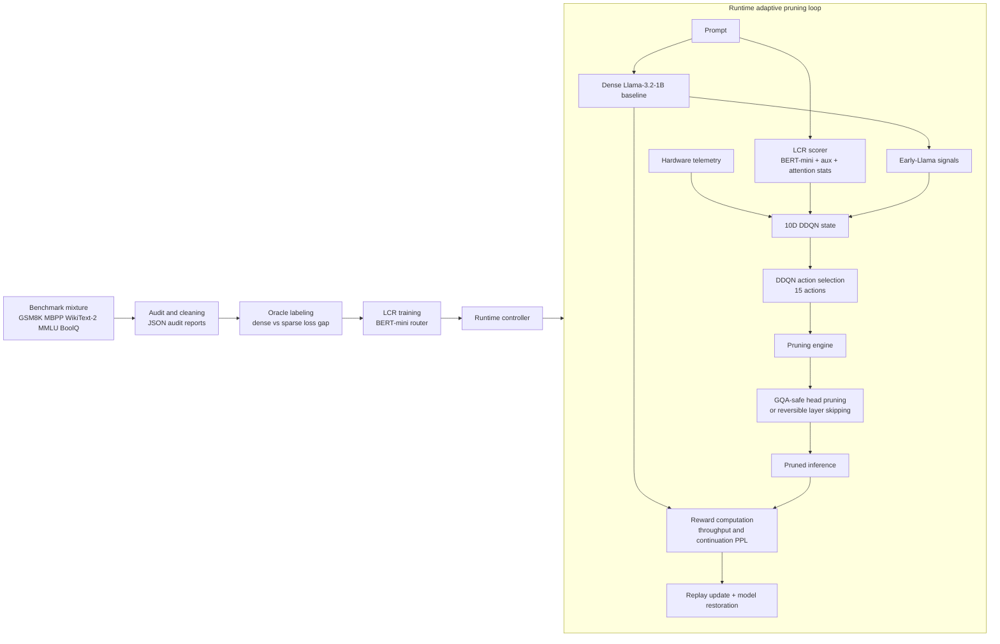
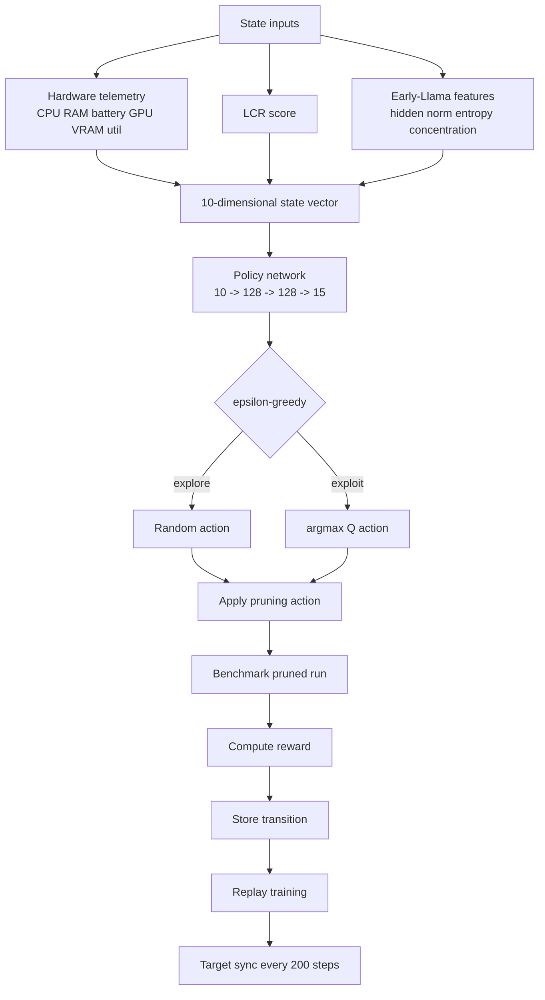
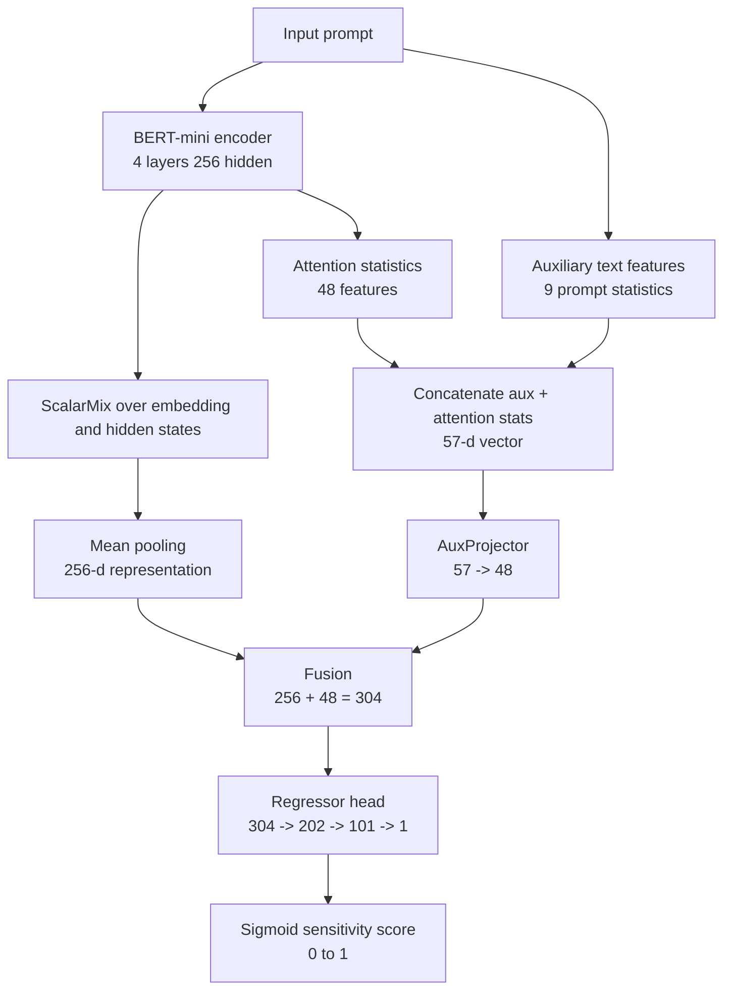

# CASRAP: Context-Aware Structured Runtime Adaptive Pruning

CASRAP is a local inference research framework for adaptive structural pruning of Llama-3.2-1B. The current repository no longer reflects an early heuristic prototype. It now contains a benchmark-based data pipeline, oracle sensitivity labeling, a trained BERT-mini Learned Complexity Router (LCR), a Double Deep Q-Network (DDQN) pruning controller, and a reversible runtime pruning engine with grouped-query-attention-safe head pruning and transformer-layer skipping.

The project is organized around a single research question: can pruning be selected at inference time, per prompt, using both prompt sensitivity and hardware state rather than a fixed offline compression profile? The present answer is partially yes. The routing and pruning infrastructure are implemented end to end, the learned LCR is strong and reusable, and the RL controller is functional but still unstable on the latest stored runs.

[](https://opensource.org/licenses/MIT)

## Table of Contents

- [Project Status](#project-status)
- [What Changed](#what-changed)
- [Current Architecture](#current-architecture)
- [Repository Workflow](#repository-workflow)
- [Datasets and Labeling](#datasets-and-labeling)
- [Runtime Components](#runtime-components)
- [Diagrams](#diagrams)
- [Installation](#installation)
- [Quick Start](#quick-start)
- [Usage](#usage)
- [CLI Arguments](#cli-arguments)
- [Repository Layout](#repository-layout)
- [Reports and Outputs](#reports-and-outputs)
- [Current Findings](#current-findings)
- [Limitations](#limitations)
- [Troubleshooting](#troubleshooting)
- [Citation](#citation)
- [License](#license)

## Project Status

This repository now reflects the implemented architecture described in the thesis methodology, not the earlier proposal-stage design.

- Backbone model: `meta-llama/Llama-3.2-1B`
- Router: fine-tuned `prajjwal1/bert-mini` LCR with auxiliary text features and internal attention statistics
- Controller: DDQN with a 10-dimensional state vector and 15 discrete actions
- Runtime pruning: GQA-safe structural attention-head pruning and reversible transformer-layer skipping
- Additional engine support: structural FFN slicing, static-profile scaffolding, 2:4 sparsity scaffold, KV-cache compression scaffold
- Data pipeline: benchmark mixture from GSM8K, MBPP, WikiText-2, MMLU, and BoolQ
- Reporting: numbered training and test run folders with metrics, plots, and summaries

## What Changed

Earlier project versions described a heuristic prompt-complexity system and a smaller RL state. The current repository has moved beyond that design.

| Earlier state | Current implemented state |
| --- | --- |
| heuristic prompt-complexity score | trained BERT-mini LCR used at runtime |
| ad hoc prompt pool | audited five-source benchmark mixture |
| single sparse comparison | dense-vs-sparse oracle labeling with multi-method support |
| 7-feature controller state | 10-feature state including LCR and early-Llama signals |
| conceptual head pruning | grouped-query-attention-safe structural head pruning |
| conceptual layer pruning | reversible layer skipping with restoration |
| limited logging | per-episode metrics, plots, JSON artifacts, organized run folders |

The strongest mature contribution is the learned prompt-sensitivity pipeline. The pruning engine is implemented and reversible. The RL controller is complete enough for experimentation, but the latest saved evaluation indicates policy collapse under some conditions, so the controller should be described as implemented but not fully optimized.

## Current Architecture

CASRAP is a closed-loop runtime controller. Each episode evaluates a prompt with the dense model, estimates prompt sensitivity with the LCR, extracts cheap early-Llama signals, combines them with hardware telemetry, selects a pruning action using DDQN, benchmarks the pruned run, computes reward, updates the agent, and restores the dense model.

### Core pipeline

1. Build and audit a heterogeneous benchmark prompt mixture.
2. Generate oracle sensitivity labels from dense-vs-sparse teacher-forcing loss.
3. Train and export the BERT-mini LCR checkpoint.
4. Load Llama-3.2-1B and calibrate pruning importance scores.
5. For each prompt, compute dense baseline metrics.
6. Compute the LCR score and early-layer backbone features.
7. Build the DDQN state vector and choose a pruning action.
8. Apply pruning, benchmark the pruned run, compute reward, and restore the model.

### DDQN state vector

The live controller uses a 10-dimensional state vector:

1. CPU utilization
2. Available system memory
3. Battery percentage
4. GPU availability
5. Free GPU memory
6. GPU utilization
7. LCR sensitivity score
8. Layer-0 hidden-state norm
9. Layer-0 attention-entropy proxy
10. Layer-0 attention-concentration proxy

### Action space

The RL action space contains 15 discrete actions:

- `none`
- `attention_heads` at 5%, 10%, 15%, 20%, 25%, 30%, 50%
- `transformer_layers` at 5%, 10%, 15%, 20%, 25%, 30%, 50%

Structural FFN slicing exists in the engine but is intentionally not exposed in the current RL action space because it introduced additional instability during this stage of experimentation.

### Reward function

The current reward uses relative throughput gain and relative continuation-perplexity penalty:

$$
R = \alpha \cdot \frac{tok/s_{pruned} - tok/s_{base}}{tok/s_{base} + \varepsilon}
- \beta \cdot \frac{PPL_{pruned} - PPL_{base}}{PPL_{base} + \varepsilon}
$$

with $\alpha = 0.7$, $\beta = 0.3$, and $\varepsilon = 10^{-8}$.

## Repository Workflow

The repository is now best understood as four linked stages.

### 1. Dataset construction and audit

- `build_lcr_mixture_dataset.py` creates the mixed benchmark prompt set.
- `audit_lcr_mixture_dataset.py` filters malformed or low-value rows and writes audit reports.

### 2. Oracle sensitivity labeling

- `oracle_labeler.py` runs dense and sparse teacher-forcing passes on Llama-3.2-1B.
- Labels are based on the non-negative loss gap $\Delta \ell = \max(0, \ell_S - \ell_D)$.
- Metadata files record normalization bounds, sparse settings, sequence length, and runtime.

### 3. LCR preprocessing and training

- `prepare_dual_labels.py` prepares per-method labels and auxiliary columns.
- `train_tinybert_lcr.py` trains the router.
- `lcr_tinybert.py` loads the exported backbone and head for runtime scoring.

### 4. RL training and evaluation

- `Adaptive_pruning.py` runs training, testing, reporting, and benchmark-specific evaluation.
- `model_loader.py` loads the backbone, applies pruning, restores the model, and calibrates pruning importance.

## Datasets and Labeling

### Benchmark mixture

The current project uses a five-source benchmark mixture:

| Source | Why it is included |
| --- | --- |
| GSM8K | arithmetic and multi-step reasoning sensitivity |
| MBPP | code-generation prompts with syntax sensitivity |
| WikiText-2 | redundancy-rich narrative language modeling |
| MMLU | mixed-domain reasoning and multiple choice |
| BoolQ | passage-grounded binary QA |

Two main scales were used during development:

- pilot 5k target: 4,374 usable rows after cleaning
- larger 10k target: 8,974 usable rows after cleaning

The final larger mixture contains 2,000 prompts each from GSM8K, WikiText-2, MMLU, and BoolQ, plus 974 prompts from MBPP.

### Canonical dataset file

If you want the single cleaned mixture file with optional evaluation fields, use:

- `lcr_mixture.final.csv`

It includes prompt metadata and optional benchmark-specific answer columns where available.

### Oracle labels

The current oracle pipeline compares dense inference against sparse configurations for:

- attention-head pruning at 30%
- transformer-layer skipping at 25%

The repository can produce multi-method labels, but the selected runtime checkpoint is still the strongest single-output router. Cross-method sensitivity correlation is weak, which is why the project moved away from treating prompt difficulty as a single heuristic concept.

## Runtime Components

### Learned Complexity Router

The current router is a fine-tuned BERT-mini model that combines pooled backbone representations with explicit auxiliary features and attention-derived statistics.

- backbone: `prajjwal1/bert-mini`
- input truncation: 128 tokens
- auxiliary prompt features: 9
- attention-statistics features: 48
- fused representation: 304 dimensions
- exported runtime checkpoint: `checkpoints/tinybert_lcr_backbone` + `checkpoints/tinybert_lcr_head.pt`

The currently selected checkpoint corresponds to `Training Report/TinyBERT Train 20`, which achieved:

- MSE: 0.03997
- $R^2$: 0.4950
- Spearman: 0.7009
- 3-bin accuracy: 65.13%

### DDQN controller

The controller uses:

- policy and target MLPs: $10 \rightarrow 128 \rightarrow 128 \rightarrow 15$
- replay buffer size: 10,000
- batch size: 32
- optimizer: AdamW
- learning rate: $1 \times 10^{-4}$
- discount factor: 0.95
- target update interval: 200 steps

### Pruning engine

The runtime engine supports:

- GQA-safe structural attention-head pruning
- reversible transformer-layer skipping
- structural FFN slicing
- activation-based importance calibration for heads, FFN channels, and layers
- full model restoration between episodes

The current RL loop exposes only head pruning and layer skipping. That separation matters: the engine is broader than the current action space.

## Diagrams

### End-to-end system diagram


```mermaid
flowchart LR
    A[Benchmark mixture<br/>GSM8K MBPP WikiText-2 MMLU BoolQ] --> B[Audit and cleaning<br/>JSON audit reports]
    B --> C[Oracle labeling<br/>dense vs sparse loss gap]
    C --> D[LCR training<br/>BERT-mini router]
    D --> E[Runtime controller]

    subgraph Runtime [Runtime adaptive pruning loop]
        F[Prompt] --> G[Dense Llama-3.2-1B baseline]
        F --> H[LCR scorer<br/>BERT-mini + aux + attention stats]
        G --> I[Early-Llama signals]
        J[Hardware telemetry] --> K[10D DDQN state]
        H --> K
        I --> K
        K --> L[DDQN action selection<br/>15 actions]
        L --> M[Pruning engine]
        M --> N[GQA-safe head pruning<br/>or reversible layer skipping]
        N --> O[Pruned inference]
        G --> P[Reward computation<br/>throughput and continuation PPL]
        O --> P
        P --> Q[Replay update + model restoration]
    end

    E --> Runtime
```

### Runtime controller diagram


```mermaid
flowchart TD
    A[State inputs] --> B[Hardware telemetry<br/>CPU RAM battery GPU VRAM util]
    A --> C[LCR score]
    A --> D[Early-Llama features<br/>hidden norm entropy concentration]
    B --> E[10-dimensional state vector]
    C --> E
    D --> E
    E --> F[Policy network<br/>10 -> 128 -> 128 -> 15]
    F --> G{epsilon-greedy}
    G -->|explore| H[Random action]
    G -->|exploit| I[argmax Q action]
    H --> J[Apply pruning action]
    I --> J
    J --> K[Benchmark pruned run]
    K --> L[Compute reward]
    L --> M[Store transition]
    M --> N[Replay training]
    N --> O[Target sync every 200 steps]
```

### LCR architecture diagram


```mermaid
flowchart TD
    A[Input prompt] --> B[BERT-mini encoder<br/>4 layers 256 hidden]
    B --> C[ScalarMix over embedding and hidden states]
    C --> D[Mean pooling<br/>256-d representation]

    A --> E[Auxiliary text features<br/>9 prompt statistics]
    B --> F[Attention statistics<br/>48 features]
    E --> G[Concatenate aux + attention stats<br/>57-d vector]
    F --> G
    G --> H[AuxProjector<br/>57 -> 48]
    D --> I[Fusion<br/>256 + 48 = 304]
    H --> I
    I --> J[Regressor head<br/>304 -> 202 -> 101 -> 1]
    J --> K[Sigmoid sensitivity score<br/>0 to 1]
```

The same synchronized diagrams are also stored in `diagram.md`.

## Installation

### 1. Clone the repository

```bash
git clone https://github.com/asief-iqbal/Thesis.git
cd Thesis
```

### 2. Create and activate a virtual environment

```bash
python -m venv .venv
.venv\Scripts\activate
```

### 3. Install dependencies

```bash
pip install torch==2.5.1+cu121 torchvision==0.20.1+cu121 torchaudio==2.5.1+cu121 --index-url https://download.pytorch.org/whl/cu121
pip install transformers accelerate datasets psutil numpy matplotlib huggingface_hub lm-eval
```

### 4. Configure environment variables

Create `.env` with a Hugging Face token for Llama access:

```env
HUGGINGFACE_HUB_TOKEN=your_hf_token_here
```

The repository automatically uses a project-local `HF_HOME` cache when none is set.

## Quick Start

### Train the RL controller

```bash
python Adaptive_pruning.py --mode train --episodes 50 --checkpoint checkpoints/rl_policy.pt --train-dataset "lcr_mixture.final.csv" --train-samples 500 --max-new-tokens 20 --device gpu
```

### Test the saved controller

```bash
python Adaptive_pruning.py --mode test --checkpoint checkpoints/rl_policy.pt --test-dataset "lcr_mixture.final.csv" --episodes 100 --max-new-tokens 50 --device gpu
```

### Run benchmark-specific evaluation

```bash
python Adaptive_pruning.py --mode test --wikitext2 --eval-samples 1000 --device gpu
python Adaptive_pruning.py --mode test --boolq --eval-samples 1000 --device gpu
python Adaptive_pruning.py --mode test --mmlu --eval-samples 1000 --device gpu
```

### Train the LCR

```bash
python train_tinybert_lcr.py --train-file oracle_lcr_10k_dual.csv --output-dir checkpoints
```

## Usage

### Recommended workflow

1. Build or reuse the cleaned benchmark mixture.
2. Generate oracle labels from dense and sparse teacher-forcing loss.
3. Train the LCR and export checkpoints.
4. Train or evaluate the RL controller.
5. Inspect numbered folders under `Training Report` and `Test Report`.

### Forcing a specific pruning action during evaluation

You can bypass the learned policy during test-time comparison:

```bash
python Adaptive_pruning.py --mode test --wikitext2 --force-action attention_heads:0.15 --eval-samples 500 --device gpu
python Adaptive_pruning.py --mode test --boolq --force-action transformer_layers:0.10 --eval-samples 500 --device gpu
```

This is useful for ablations and per-method comparisons.

## CLI Arguments

The main entrypoint is `Adaptive_pruning.py`.

| Argument | Default | Description |
| --- | --- | --- |
| `--mode` | `test` | `train`, `test`, or `report` |
| `--checkpoint` | `checkpoints/rl_policy.pt` | Save/load path for the RL policy |
| `--episodes` | `50` | Number of train or test episodes |
| `--max-new-tokens` | `50` | Maximum generated continuation length |
| `--train-dataset` | `Prompt Dataset Train.csv` | Training CSV path |
| `--test-dataset` | `Prompt Dataset Test.csv` | Test CSV path |
| `--train-samples` | `5000` | Number of training prompts |
| `--test-samples` | `100` | Number of test prompts in auto-test flows |
| `--device` | `auto` | `cpu`, `gpu`, or `auto` |
| `--wikitext2` | `False` | Run WikiText-2 comparative evaluation |
| `--boolq` | `False` | Run BoolQ zero-shot evaluation |
| `--hellaswag` | `False` | Run HellaSwag zero-shot evaluation |
| `--mmlu` | `False` | Run MMLU zero-shot evaluation |
| `--eval-samples` | `1000` | Number of samples for benchmark-specific evaluation |
| `--eval-seed` | `42` | Random seed for evaluation sampling |
| `--eval-max-seq-len` | `512` | Sequence length cap during eval |
| `--wikitext-min-cont-tokens` | `32` | Minimum continuation tokens for WikiText-2 PPL |
| `--force-action` | `None` | Force `target:intensity` instead of RL selection |
| `--lm-eval` | `False` | Run lm-eval-harness tasks |
| `--eval-tasks` | `boolq,hellaswag,mmlu` | lm-eval task list |
| `--static-profiles` | `False` | Static profile scaffold flag |
| `--sparsity-2to4` | `False` | 2:4 sparsity scaffold flag |
| `--compile` | `False` | Compile-profile scaffold flag |
| `--kv-compress` | `False` | KV compression scaffold flag |
| `--kv-keep-ratio` | `1.0` | Fraction of KV tokens retained |

## Repository Layout

| Path | Role |
| --- | --- |
| `Adaptive_pruning.py` | RL training, testing, reporting, benchmark evaluation |
| `model_loader.py` | Llama loading, pruning, restoration, importance calibration |
| `lcr_tinybert.py` | Runtime LCR scorer |
| `build_lcr_mixture_dataset.py` | Benchmark mixture builder |
| `audit_lcr_mixture_dataset.py` | Dataset audit and cleaning |
| `oracle_labeler.py` | Dense-vs-sparse oracle labeling |
| `prepare_dual_labels.py` | Label and feature preparation |
| `train_tinybert_lcr.py` | LCR training script |
| `smoke_test_lcr.py` | End-to-end LCR validation |
| `check_tinybert_install.py` | TinyBERT environment check |
| `pruners/` | Head, FFN, and layer pruning implementations |
| `Training Report/` | Saved RL and LCR training outputs |
| `Test Report/` | Saved evaluation outputs |
| `Methodology.md` | Thesis/journal methodology chapter |
| `diagram.md` | Synchronized Mermaid diagrams for the current architecture |

## Reports and Outputs

The project generates numbered run folders and artifacts for both training and evaluation.

Typical outputs include:

- `training_metrics.json`
- `training_report.txt`
- `token_speed_compare.png`
- `inference_time_compare.png`
- `perplexity_compare.png`
- `length_vs_ppl.png`
- `pruning_action_usage.png`
- benchmark-specific evaluation summaries under `Test Report/Test N`

The saved reports are part of the thesis evidence trail. They are not just debugging artifacts.

## Current Findings

### LCR results

The LCR is the strongest current contribution in the repository.

- best selected runtime checkpoint: `Training Report/TinyBERT Train 20`
- held-out Spearman: 0.7009
- held-out $R^2$: 0.4950
- strongest held-out sources: WikiText-2, BoolQ, MMLU
- hardest source: GSM8K

### RL results

The RL controller is implemented and measurable, but not yet stable enough to claim strong generalization.

- latest stored training run: latency improved on average, but with quality degradation and negative average reward
- latest stored test run: near-collapse to one layer-skipping action with catastrophic perplexity spikes

That is the correct scientific framing for the current repository state: the adaptive pruning system is real, the LCR works well, and the RL controller still requires reward-shaping and policy-stabilization work.

## Limitations

- The controller currently uses a single LCR score in the state, even though the repository supports richer multi-method label preparation.
- Structural FFN slicing is implemented but not yet integrated into the RL action space.
- Additional acceleration scaffolds, such as 2:4 sparsity and KV compression, are present but not central to the reported thesis results.
- The CLI still defaults to legacy CSV filenames, so you should explicitly pass the intended dataset path for reproducible runs.

## Troubleshooting

### Hugging Face token issues

If Llama-3.2-1B fails to load, confirm that `.env` contains a valid `HUGGINGFACE_HUB_TOKEN`.

### Missing GPU telemetry

If NVML is unavailable, GPU utilization falls back to `0.0`. The project still runs, but telemetry is less informative.

### Slow or unstable training

- Reduce `--episodes`
- Reduce `--train-samples`
- Reduce `--max-new-tokens`
- Use explicit dataset paths instead of relying on defaults

### LCR checkpoint fallback

If the exported BERT-mini checkpoints are missing, the system falls back to a heuristic proxy. That keeps the pipeline operational, but it is not the main reported model.

## Citation

```bibtex
@misc{iqbal2026casrap,
  title={CASRAP: Context-Aware Structured Runtime Adaptive Pruning for Local LLM Inference},
  author={Asief Iqbal},
  year={2026},
  howpublished={\url{https://github.com/asief-iqbal/Thesis}},
  note={Repository containing the benchmark mixture pipeline, oracle sensitivity labeling, BERT-mini LCR, DDQN pruning controller, and reversible runtime pruning engine used in the thesis implementation.}
}
```

## License

MIT License.
