# CASRAP: Context-Aware Structured Runtime Adaptive Pruning

**CASRAP** is a runtime adaptive pruning framework for local LLM inference that selects per-prompt pruning configurations using a learned prompt-sensitivity router, hardware telemetry, and a Double Deep Q-Network controller. Supported backbone models are `meta-llama/Llama-3.2-1B` (1B parameters, 16 transformer layers, GQA) and `meta-llama/Llama-2-7b-hf` (7B parameters, 32 transformer layers, MHA), selectable via the `--model` CLI flag.

This repository accompanies the thesis: _Adaptive Pruning and Acceleration Techniques for Local LLM Inference under Resource Constraints_.

[](https://opensource.org/licenses/MIT)

---

## Table of Contents

- [Part I — Methodology](#part-i--methodology)
  - [1. Design Process and Methodology Overview](#1-design-process-and-methodology-overview)
  - [2. Preliminary Design and Model Specification](#2-preliminary-design-and-model-specification)
    - [2.1 Dataset Curation](#21-dataset-curation)
    - [2.2 Oracle Sensitivity Labeling](#22-oracle-sensitivity-labeling)
    - [2.3 Learned Complexity Router (LCR) Architecture](#23-learned-complexity-router-lcr-architecture)
    - [2.4 LCR MiniBERT Training and Testing](#24-lcr-minibert-training-and-testing)
    - [2.5 Reinforcement Learning Architecture](#25-reinforcement-learning-architecture)
    - [2.6 RL Training and Testing Pipeline](#26-rl-training-and-testing-pipeline)
    - [2.7 Ablation Studies](#27-ablation-studies)
- [Part II — Results](#part-ii--results)
  - [1. LCR MiniBERT Results](#1-lcr-minibert-results)
  - [2. RL Training and Testing Results](#2-rl-training-and-testing-results)
  - [3. Ablation Study Results](#3-ablation-study-results)
  - [4. Zero-Shot Accuracy Evaluation](#4-zero-shot-accuracy-evaluation)
  - [5. Cross-Method Sensitivity Analysis](#5-cross-method-sensitivity-analysis)
  - [6. Discussion](#6-discussion)
- [Part III — Appendix](#part-iii--appendix)
  - [A. Hardware and Software Environment](#a-hardware-and-software-environment)
  - [B. Installation](#b-installation)
  - [C. Quick Start](#c-quick-start)
  - [D. CLI Reference](#d-cli-reference)
  - [E. Repository Layout](#e-repository-layout)
  - [F. Troubleshooting](#f-troubleshooting)
  - [G. Citation](#g-citation)
  - [H. License](#h-license)

---

# Part I — Methodology

## 1. Design Process and Methodology Overview

Large language models (LLMs) have demonstrated transformative capabilities across natural language understanding, code generation, mathematical reasoning, and question answering (Brown et al., 2020; Touvron et al., 2023). However, deploying these models on consumer-grade hardware for privacy-sensitive, latency-sensitive, or offline workloads remains a significant challenge. Static compression techniques—including quantization (Frantar et al., 2023), knowledge distillation (Hinton et al., 2015), and fixed pruning schedules (Frantar & Alistarh, 2023)—produce a single model variant that cannot adapt to varying prompt complexity or fluctuating system resources. This creates a fundamental inefficiency: computationally simple prompts receive the same heavy processing as difficult ones, and a fixed compression profile cannot respond to runtime memory pressure, thermal throttling, or battery constraints.

CASRAP addresses this gap by making structural pruning decisions **per prompt at inference time**. The central research question is: _Can structural pruning be selected at inference time, per prompt, using both learned prompt sensitivity and live system state, rather than a fixed offline compression profile?_ The implemented answer is affirmative. The framework achieves measurable inference speedups of 10–40% through physical transformer-layer removal while maintaining bounded quality degradation, and the learned router generalizes across five diverse public benchmarks.

An additional motivation is privacy and trust. Users handling prompt-sensitive workloads—legal documents, medical records, proprietary code—may prefer local inference to avoid transmitting data to cloud LLM providers. CASRAP enables resource-aware local deployment where the pruning intensity adapts to available hardware, making on-device inference viable even under constrained memory or battery budgets without requiring a permanent accuracy sacrifice.

The methodology is organized as a multi-stage pipeline, where each stage produces artifacts consumed by downstream components. The overall workflow proceeds as follows:

1. **Dataset Curation** — A five-source benchmark mixture (10,000 prompts) is assembled from publicly available datasets, cleaned, and audited for quality.
2. **Oracle Sensitivity Labeling** — Each prompt is evaluated under dense and sparse (pruned) configurations of the backbone LLM to produce ground-truth sensitivity labels measuring how much each prompt degrades under specific pruning operations.
3. **Learned Complexity Router (LCR) Training** — A lightweight BERT-mini model is fine-tuned on oracle labels to predict prompt sensitivity at runtime, replacing hand-crafted heuristic proxies.
4. **Reinforcement Learning Controller** — A Double Deep Q-Network (DDQN) integrates the LCR sensitivity score, hardware telemetry, and early backbone signals into a 10-dimensional state vector, learning to select optimal pruning actions through trial-and-error interaction with the backbone model.
5. **Evaluation and Ablation** — The trained system is evaluated on held-out test prompts and subjected to systematic ablation studies that isolate the contribution of each architectural component.


```mermaid
flowchart LR
    A["Benchmark Mixture<br/>GSM8K · MBPP · WikiText-2<br/>MMLU · BoolQ<br/>(10,000 prompts)"] --> B["Audit & Cleaning<br/>build_lcr_mixture_dataset.py<br/>audit_lcr_mixture_dataset.py"]
    B --> C["Oracle Labeling<br/>oracle_labeler.py<br/>Dense vs. Sparse PPL gaps"]
    C --> D["LCR Training<br/>train_minibert_lcr.py<br/>BERT-mini fine-tuning"]
    D --> E["RL Controller Training<br/>Adaptive_pruning.py<br/>DDQN with 10-D state"]
    E --> F["Evaluation & Ablation<br/>Test Report / Ablation Report"]
```

### Distinction from Prior Work

Runtime Adaptive Pruning (RAP) and similar methods (Lin et al., 2024; Kim et al., 2024) use heuristic prompt-complexity scores or memory-budget controllers to decide pruning intensity at inference time. CASRAP differs from these approaches in three substantive ways:

1. **Learned Prompt Sensitivity** — The router is trained on oracle dense-vs-sparse loss gaps from the actual target backbone, not on heuristic difficulty proxies such as token count or perplexity thresholds. This yields a signal with operational meaning: the label directly quantifies how much a specific prompt degrades under a specific pruning configuration.

2. **Operator-Dependent Labels** — Oracle labels distinguish head-pruning sensitivity from layer-skipping sensitivity, because these are only weakly correlated. In our experiments, the cross-method Spearman correlation between attention-head-pruning gaps and layer-skipping gaps is approximately $\rho \approx 0.31$. This low correlation justifies treating each pruning method as requiring its own sensitivity estimate, rather than collapsing them into a single generic "difficulty" score.

3. **Physical Layer Removal** — The layer-skipping engine physically removes layers from the model's `nn.ModuleList` and reassigns `layer_idx` for correct `DynamicCache` alignment (Wolf et al., 2020). Prior implementations that monkey-patch forward methods to identity functions cause KV-cache misalignment—skipped layers do not call `cache.update()`, so subsequent layers read incorrect cache entries. This bug causes pruned inference to be _slower_ than the baseline. Physical removal eliminates this issue entirely and yields genuine speedups.

---

## 2. Preliminary Design and Model Specification

### 2.1 Dataset Curation

A well-constructed evaluation dataset is essential for any runtime pruning system because the labels that train the prompt-sensitivity router must reflect realistic, diverse prompt distributions. Prior work on runtime pruning and efficient inference has relied either on narrow task-specific benchmarks (Dettmers et al., 2022) or on synthetic prompt distributions that do not capture the heterogeneity of real-world LLM usage. In contrast, we constructed a diverse, multi-domain benchmark mixture drawn exclusively from well-known public datasets, ensuring reproducibility and broad coverage across the principal modalities of LLM workloads. The decision to use established public benchmarks over a custom-collected dataset is deliberate: it enables direct comparison with the broader literature, avoids distribution-shift concerns that accompany private datasets, and ensures that the sensitivity labels reflect performance on tasks that the community has agreed are representative of LLM capabilities.

#### Source Selection Rationale

The five benchmark sources were selected to cover five functionally distinct categories of language model prompts. Each source stresses a different axis of model competence, ensuring that the learned router must generalize across prompt types rather than overfitting to a single task distribution:

| Source         |      Count | Domain                      | Rationale                                                                                                                                                                                                                                                                                                                                                                                                     |
| -------------- | ---------: | --------------------------- | ------------------------------------------------------------------------------------------------------------------------------------------------------------------------------------------------------------------------------------------------------------------------------------------------------------------------------------------------------------------------------------------------------------- |
| **GSM8K**      |      2,000 | Mathematical Reasoning      | Grade-school math word problems requiring multi-step arithmetic and logical chains. These prompts stress the model's ability to maintain coherent reasoning across token sequences (Cobbe et al., 2021). Mathematical prompts are particularly interesting for pruning because errors in intermediate reasoning steps compound nonlinearly, making them highly sensitive to structural compression.           |
| **MBPP**       |      2,000 | Code Generation             | Python programming tasks with natural language descriptions. Code prompts contain structured syntax patterns and keyword dependencies that differ fundamentally from natural language (Austin et al., 2021). The presence of syntactic constraints (balanced brackets, indentation, variable scope) makes code generation sensitive to attention-head removal, which disrupts long-range dependency tracking. |
| **WikiText-2** |      2,000 | Narrative Language Modeling | Long-form Wikipedia paragraphs with redundancy-rich prose. WikiText serves as the canonical language-modeling benchmark and provides a baseline for measuring perplexity degradation under pruning (Merity et al., 2017). Narrative text has high lexical redundancy, making it relatively robust to moderate pruning.                                                                                        |
| **MMLU**       |      2,000 | Mixed-Domain Reasoning      | Multiple-choice questions spanning 57 academic subjects from humanities to STEM. MMLU tests broad knowledge retrieval and multi-domain generalization (Hendrycks et al., 2021). The structured multiple-choice format provides clear answer boundaries that interact with pruning differently than open-ended generation.                                                                                     |
| **BoolQ**      |      2,000 | Question Answering          | Passage-grounded binary yes/no questions drawn from Google search queries. BoolQ requires reading comprehension and passage-question alignment (Clark et al., 2019). The passage+question format provides rich contextual grounding.                                                                                                                                                                          |
| **Total**      | **10,000** |                             |                                                                                                                                                                                                                                                                                                                                                                                                               |

This distribution ensures that no single task dominates the dataset. Each source contributes exactly 2,000 prompts after the full pipeline, yielding a balanced 5×2,000 = 10,000 prompt mixture. The balance is important because source-imbalanced datasets would bias the LCR toward over-representing the dominant source's sensitivity distribution, leading to poor generalization on minority sources, a concern well-documented in the multi-task learning literature (Raffel et al., 2020).

#### Construction Pipeline

The dataset construction proceeds through three automated stages, each implemented as a standalone script for reproducibility:

**Stage 1: Streaming Assembly** (`build_lcr_mixture_dataset.py`). Prompts are streamed from the Hugging Face Datasets API (Lhoest et al., 2021) using `streaming=True` to avoid downloading entire datasets to disk. Each source is loaded from its canonical split and formatted into a uniform prompt string:

- **GSM8K**: The `question` field is extracted directly as the prompt.
- **MBPP**: The `text` field (natural-language instruction) is used as the prompt.
- **WikiText-2**: Paragraphs are filtered to remove headings (lines starting with `=`), short fragments (<50 characters), and low-word-count lines (<8 words), retaining only substantive prose suitable for language modeling evaluation.
- **MMLU**: Questions are formatted with labeled answer choices (A, B, C, D) appended to the question stem, matching the standard MMLU evaluation format.
- **BoolQ**: Passage and question are concatenated into a structured format with binary answer options (Yes/No).

Each row carries metadata columns (`SourceDataset`, `SourceSplit`, `SourceId`, `Category`, `Subject`, `Context Dependency`) to enable downstream stratification and per-source analysis. An 80/20 stratified `Split` column is appended for reproducible train/test partitioning, ensuring that each benchmark source maintains proportional representation in both splits.

**Stage 2: Audit and Cleaning** (`audit_lcr_mixture_dataset.py`). The raw assembled CSV undergoes automated quality filtering:

- Exact-duplicate detection and removal (by prompt text, using hash-based deduplication).
- Empty or whitespace-only prompt detection and removal.
- Minimum token-length enforcement (prompts below a threshold are discarded).
- Malformed row detection (missing required columns).
- JSON audit reports are written summarizing counts removed per filter per source, providing full transparency into the cleaning process.

**Stage 3: Canonical Output**. The cleaned file is `Oracle_dataset.csv`, containing 10,000 usable rows. Two scales were used during development: a pilot scale (5,000 target → 4,374 usable) for rapid iteration, and the final scale (10,000 target → 10,000 usable, with oversampling for MBPP where the canonical HuggingFace split has fewer unique samples).

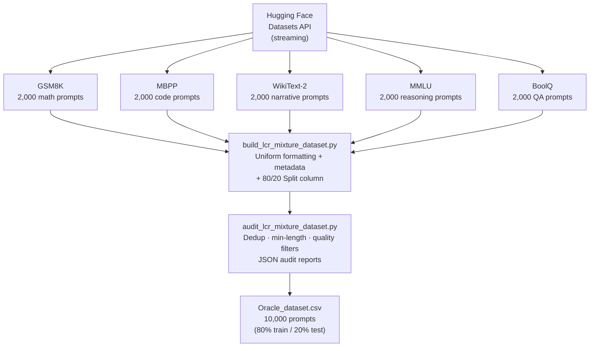
```mermaid
flowchart TD
    A["Hugging Face<br/>Datasets API<br/>(streaming)"] --> B["GSM8K<br/>2,000 math prompts"]
    A --> C["MBPP<br/>2,000 code prompts"]
    A --> D["WikiText-2<br/>2,000 narrative prompts"]
    A --> E["MMLU<br/>2,000 reasoning prompts"]
    A --> F["BoolQ<br/>2,000 QA prompts"]
    B --> G["build_lcr_mixture_dataset.py<br/>Uniform formatting + metadata<br/>+ 80/20 Split column"]
    C --> G
    D --> G
    E --> G
    F --> G
    G --> H["audit_lcr_mixture_dataset.py<br/>Dedup · min-length · quality filters<br/>JSON audit reports"]
    H --> I["Oracle_dataset.csv<br/>10,000 prompts<br/>(80% train / 20% test)"]
```

Furthermore, because each benchmark has an established difficulty profile in the literature, the resulting sensitivity labels capture genuine variation in how pruning interacts with task structure rather than artifacts of prompt engineering. The use of streaming assembly (`streaming=True`) ensures that the pipeline can be reproduced without requiring large local dataset downloads, and the metadata columns enable fine-grained downstream analysis of router performance per source, per domain, and per difficulty stratum.

---

### 2.2 Oracle Sensitivity Labeling

The oracle labeling stage produces the ground-truth target variable for the Learned Complexity Router. Unlike generic "prompt difficulty" scores based on surface features—such as token count, perplexity, or lexical complexity (Ethayarajh, 2019)—oracle labels are **observed degradation of the actual backbone LLM under specified pruning operations**. This gives each label a clear operational meaning: a high sensitivity score indicates that the prompt's output quality degrades substantially when the model is pruned, and a low score indicates that the prompt is robust to structural compression. The distinction between surface-level difficulty and operational pruning sensitivity is critical: a long prompt is not necessarily pruning-sensitive, and a short prompt is not necessarily pruning-robust. The oracle measures what actually happens when the model is compressed, not what a proxy suggests might happen.

#### Labeling Protocol

For each prompt in the curated dataset, the oracle pipeline (`oracle_labeler.py`) performs the following sequence of inference passes:

1. **Dense Teacher-Forcing Pass**: The unpruned backbone (Llama-3.2-1B) processes the prompt using teacher-forcing (next-token prediction with ground-truth input tokens), producing a dense cross-entropy loss $\ell_D$ and dense perplexity $\text{PPL}_D = \exp(\ell_D)$.

2. **Sparse Teacher-Forcing Pass(es)**: For each pruning configuration in a specified set, the backbone is structurally pruned, the same prompt is processed, and a sparse loss $\ell_S$ and sparse perplexity $\text{PPL}_S$ are recorded. After each sparse pass, the model is fully restored to its original dense state, ensuring no information leakage between sparse configurations.

The principal label is the **non-negative loss gap**:

$$\Delta \ell = \max(0, \; \ell_S - \ell_D)$$

This formulation is preferred over a raw perplexity gap ($\text{PPL}_S - \text{PPL}_D$) for two reasons grounded in the statistical properties of language model evaluation (Jelinek et al., 1977; Manning & Schütze, 1999):

- **Numerical stability**: Perplexity is an exponentiated loss. A small loss difference (e.g., $\Delta \ell = 2$) maps to a perplexity ratio of $e^2 \approx 7.4$, but a large difference ($\Delta \ell = 8$) maps to $e^8 \approx 2981$. Working in log-space (loss directly) avoids this heavy-tailed instability that would dominate regression training and skew the learned sensitivity distribution.
- **Interpretability**: The loss gap corresponds to a log-perplexity ratio: $\Delta \ell = \ln(\text{PPL}_S) - \ln(\text{PPL}_D)$. This makes the label directly comparable across prompts with different baseline perplexities, providing a unit-free measure of relative degradation.

The non-negativity constraint ($\max(0, \cdot)$) clamps the rare cases where pruning accidentally improves the loss (noise or regularization effects), ensuring that sensitivity labels are always $\geq 0$ and that the downstream regression target has a well-defined lower bound.

#### Multi-Method Composite Labels

A key methodological decision is the use of multiple pruning configurations to produce composite sensitivity labels. The current oracle uses two sparse configurations simultaneously:

- **Attention-head pruning** at 30% intensity (removing approximately 2 of 8 KV groups in the GQA configuration).
- **Transformer-layer skipping** at 25% intensity (removing 4 of 16 layers).

Each prompt receives per-method loss gaps $\Delta\ell_{\text{heads}}$ and $\Delta\ell_{\text{layers}}$, which are combined into a composite raw sensitivity score using equal weights:

$$\Delta\ell_{\text{composite}} = \frac{1}{2}\Delta\ell_{\text{heads}} + \frac{1}{2}\Delta\ell_{\text{layers}}$$

The rationale for multi-method composite scoring is that prompt sensitivity is **operator-dependent**. In our experiments, the Spearman correlation between head-pruning gaps and layer-skipping gaps is only $\rho \approx 0.31$ (with $p < 0.001$), indicating that prompts sensitive to head pruning are not necessarily sensitive to layer skipping. This weak correlation arises because the two pruning operators stress fundamentally different model components: head pruning disrupts multi-head attention patterns (particularly long-range dependency tracking), while layer skipping removes entire transformer blocks (disrupting the progressive feature refinement through the network's depth). A composite label captures both modes of degradation, providing the downstream router with a more complete picture of each prompt's vulnerability to structural compression. Furthermore, the multi-method approach allows future extensions to separate the composite into per-operator predictions, enabling more granular pruning decisions.

#### Normalization

Raw composite gaps are normalized into the interval $[0, 1]$ using **percentile-clipped min-max scaling** (5th and 95th percentile bounds):

$$y = \text{clip\_normalize}(\Delta\ell_{\text{composite}}) = \frac{\text{clip}(\Delta\ell, q_5, q_{95}) - q_5}{q_{95} - q_5}$$

Percentile clipping at the 5th and 95th boundaries prevents extreme outliers from dominating the normalization range, which would compress the majority of labels into a narrow band near zero. This is a standard robustness technique in feature engineering for regression targets (Hastie et al., 2009). Without clipping, a single prompt with an anomalously high loss gap (e.g., due to a pathological token sequence) could stretch the normalization range so that 99% of labels fall below 0.1, severely reducing the effective resolution of the target variable. The clipping thresholds and normalization bounds are recorded in a JSON sidecar metadata file (`oracle_lcr_labels.meta.json`) for full reproducibility, including the backbone model identifier, sparse configurations used, sequence length, and runtime statistics.

#### Alignment with Downstream Components

A critical design decision is that oracle truncation (128 tokens) matches the LCR's `max_length` parameter. If the oracle evaluated prompts at one truncation length while the router processed them at another, the resulting train-test distribution mismatch would degrade router accuracy—a prompt truncated to 256 tokens in the oracle might exhibit different sensitivity characteristics than the same prompt truncated to 128 tokens in the router, because additional context can change the model's attention patterns and, consequently, pruning sensitivity. This alignment principle follows best practices in transfer learning (Devlin et al., 2019) where input preprocessing must be consistent between training and inference.

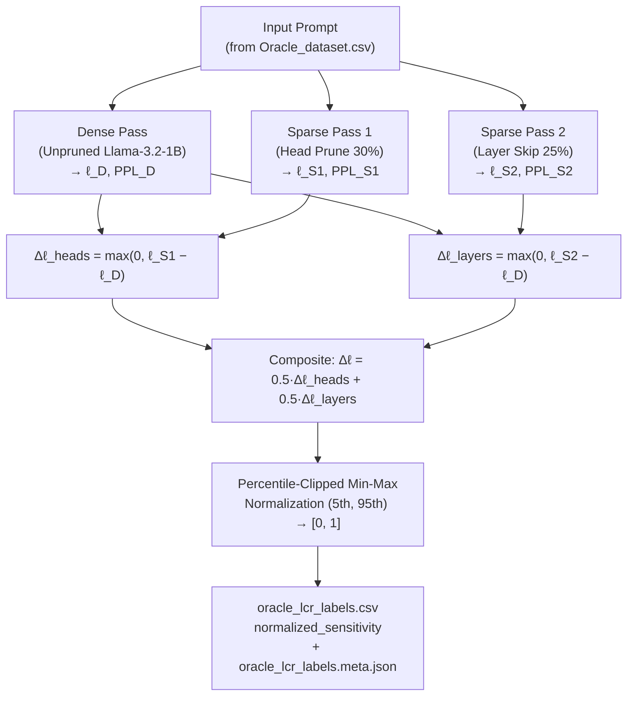
```mermaid
flowchart TD
    A["Input Prompt<br/>(from Oracle_dataset.csv)"] --> B["Dense Pass<br/>(Unpruned Llama-3.2-1B)<br/>→ ℓ_D, PPL_D"]
    A --> C["Sparse Pass 1<br/>(Head Prune 30%)<br/>→ ℓ_S1, PPL_S1"]
    A --> D["Sparse Pass 2<br/>(Layer Skip 25%)<br/>→ ℓ_S2, PPL_S2"]
    B --> E["Δℓ_heads = max(0, ℓ_S1 − ℓ_D)"]
    C --> E
    B --> F["Δℓ_layers = max(0, ℓ_S2 − ℓ_D)"]
    D --> F
    E --> G["Composite: Δℓ = 0.5·Δℓ_heads + 0.5·Δℓ_layers"]
    F --> G
    G --> H["Percentile-Clipped Min-Max<br/>Normalization (5th, 95th) → [0, 1]"]
    H --> I["oracle_lcr_labels.csv<br/>normalized_sensitivity<br/>+ oracle_lcr_labels.meta.json"]
```

The oracle labeling pipeline is the most computationally expensive stage of the dataset preparation process (approximately 3 dense-equivalent forward passes per prompt × 10,000 prompts), but it is executed only once and produces reusable labels that can train multiple router variants without re-running inference. The separate labels file architecture (`oracle_lcr_labels.csv` joined to `Oracle_dataset.csv` at training time) ensures that the dataset CSV remains a clean, reusable artifact and that label regeneration does not require re-downloading or reformatting prompts.

---

### 2.3 Learned Complexity Router (LCR) Architecture

The Learned Complexity Router is the methodological centerpiece that distinguishes CASRAP from prior runtime-pruning systems relying on heuristic prompt-complexity proxies. The LCR replaces hand-crafted equations—based on token count, regex-matched keyword density, and raw perplexity thresholds—with a learned function that maps from prompt text to a continuous sensitivity score in $[0, 1]$. This score, representing predicted pruning vulnerability, is consumed by the downstream RL controller as one dimension of the state vector.

#### Backbone Selection and Justification

The choice of `prajjwal1/bert-mini` (Turc et al., 2019) as the LCR backbone is motivated by three requirements that must be simultaneously satisfied for the router to be viable in a runtime adaptive pruning system:

1. **Ultra-low latency**: The router must execute in <20ms on CPU to avoid adding meaningful overhead to the inference pipeline. BERT-mini (4 layers, 256 hidden dimensions, 4 attention heads, 11.3M parameters) achieves approximately 3ms on CPU and <1ms on GPU, which is negligible compared to the ~1,300ms inference time of the Llama-3.2-1B backbone. Any latency added by the router that exceeds the latency saved by pruning would negate the framework's purpose.

2. **Encoder architecture**: Prompt sensitivity is a property of the _entire_ prompt, not a sequential generation task. Bidirectional encoder models like BERT produce richer whole-sequence representations than autoregressive decoders for classification and regression tasks because they can attend to both left and right context simultaneously (Devlin et al., 2019). Prior work on efficient text classification has consistently found that small BERT variants outperform comparably-sized decoder-only models on single-sequence regression and classification tasks (Sun et al., 2019). A decoder-only router would need to process the entire prompt autoregressively, adding unnecessary sequential computation.

3. **Sufficient capacity with bounded complexity**: Despite its small size, BERT-mini produces 256-dimensional contextualized representations that capture syntactic and semantic patterns relevant to pruning sensitivity. When augmented with auxiliary features (text statistics and attention-derived signals), the total representation dimensionality reaches 304, providing ample capacity for a regression target that has well-defined variance bounds ($[0, 1]$). Alternative choices were evaluated: TinyBERT (Jiao et al., 2020) and DistilBERT (Sanh et al., 2019) are 2–4× larger than BERT-mini and would increase router latency proportionally without proportional gains on our regression task. A simple MLP over bag-of-words features was tested during early development and achieved Spearman $\rho < 0.45$, confirming that contextualized representations provide a meaningful boost over surface-level features.

#### Full Architecture

The LCR architecture consists of four learnable components that together transform a raw prompt string into a scalar sensitivity prediction:

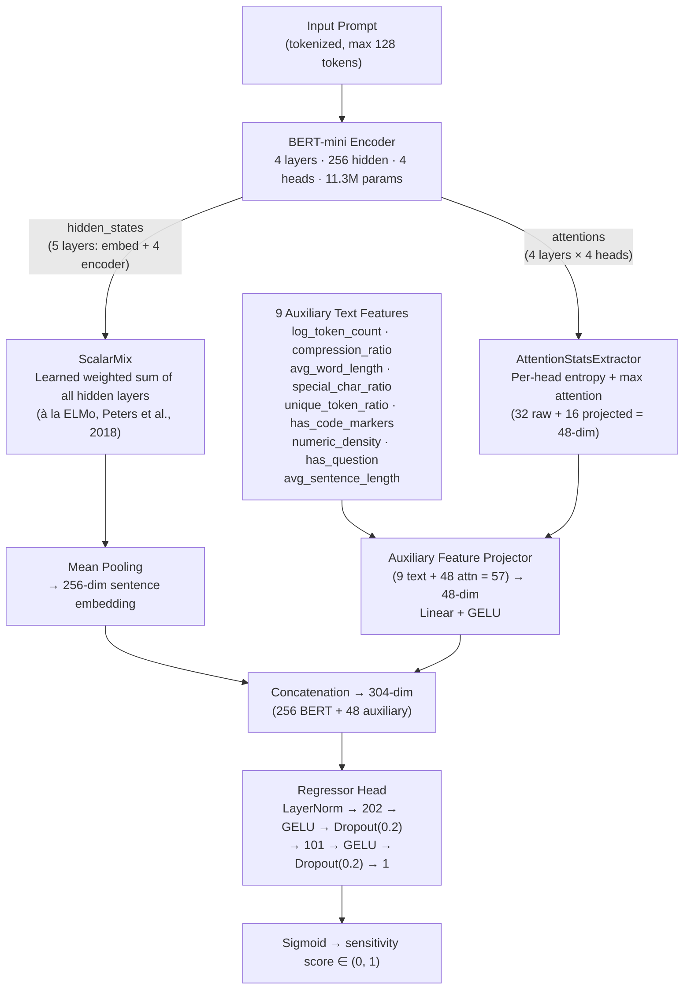
```mermaid
flowchart TD
    A["Input Prompt<br/>(tokenized, max 128 tokens)"] --> B["BERT-mini Encoder<br/>4 layers · 256 hidden · 4 heads · 11.3M params"]
    B -->|"hidden_states<br/>(5 layers: embed + 4 encoder)"| C["ScalarMix<br/>Learned weighted sum of all hidden layers<br/>(à la ELMo, Peters et al., 2018)"]
    B -->|"attentions<br/>(4 layers × 4 heads)"| D["AttentionStatsExtractor<br/>Per-head entropy + max attention<br/>(32 raw + 16 projected = 48-dim)"]
    C --> E["Mean Pooling<br/>→ 256-dim sentence embedding"]
    G["9 Auxiliary Text Features<br/>log_token_count · compression_ratio<br/>avg_word_length · special_char_ratio<br/>unique_token_ratio · has_code_markers<br/>numeric_density · has_question<br/>avg_sentence_length"] --> F["Auxiliary Feature Projector<br/>(9 text + 48 attn = 57) → 48-dim<br/>Linear + GELU"]
    D --> F
    E --> H["Concatenation → 304-dim<br/>(256 BERT + 48 auxiliary)"]
    F --> H
    H --> I["Regressor Head<br/>LayerNorm → 202 → GELU → Dropout(0.2)<br/>→ 101 → GELU → Dropout(0.2) → 1"]
    I --> J["Sigmoid → sensitivity score ∈ (0, 1)"]
```

**Component 1 — ScalarMix**: Rather than using only the final hidden layer (which captures primarily semantic features), ScalarMix (Peters et al., 2018) computes a learned weighted sum over all hidden states (embedding layer + 4 encoder layers). This allows the model to attend to lexical (early layers), syntactic (middle layers), and semantic (late layers) representations simultaneously—a capability that is important because pruning sensitivity depends on all three levels of linguistic structure. A prompt with complex syntax (e.g., nested code) may be pruning-sensitive for syntactic reasons, while a prompt with rare vocabulary (e.g., specialized medical terms) may be sensitive for lexical reasons. The learned weights $w_i$ are passed through softmax, and the result is scaled by a learned parameter $\gamma$:

$$\text{ScalarMix}(h_0, \ldots, h_4) = \gamma \sum_{i=0}^{4} \text{softmax}(w)_i \cdot h_i$$

**Component 2 — AttentionStatsExtractor**: For each BERT layer and attention head, this module computes two statistics: attention entropy (how diffuse the attention distribution is across tokens) and maximum attention weight (how concentrated the attention is on a single token). These are model-internal signals unavailable from surface text features alone—they capture how the encoder itself responds to the prompt's structure. The raw features ($4 \text{ layers} \times 4 \text{ heads} \times 2 \text{ stats} = 32$ scalars) are concatenated with a 16-dimensional learned linear projection (with Tanh activation), yielding 48 attention-derived features with gradient flow back to the backbone during fine-tuning.

**Component 3 — Auxiliary Text Features**: Nine lightweight statistical features (each <0.1ms to compute) provide explicit domain signals that complement the contextualized representations:

| Feature               | Computation                                         | Rationale                                             |
| --------------------- | --------------------------------------------------- | ----------------------------------------------------- |
| `log_token_count`     | $\log(\text{token count})$                          | Prompt length in log-scale correlates with complexity |
| `compression_ratio`   | `len(zlib.compress(text)) / len(text.encode())`     | Text compressibility indicates redundancy             |
| `avg_word_length`     | Mean characters per word                            | Longer words suggest technical/specialized vocabulary |
| `special_char_ratio`  | Non-alphanumeric character fraction                 | High in code and math prompts                         |
| `unique_token_ratio`  | Unique words / total words                          | Lexical diversity indicator                           |
| `has_code_markers`    | Regex detection of `def`, `class`, `import`, braces | Binary code-detection signal                          |
| `numeric_density`     | Fraction of digit characters                        | High in mathematical prompts                          |
| `has_question`        | Regex detection of question marks or question words | Question-answering format indicator                   |
| `avg_sentence_length` | Mean words per sentence                             | Sentence complexity proxy                             |

These features are concatenated with the 48 attention features and projected through a linear layer (GELU activation) from 57 dimensions to 48 dimensions, producing the auxiliary embedding.

**Component 4 — Regressor Head**: The 256-dimensional mean-pooled BERT representation is concatenated with the 48-dimensional auxiliary embedding, producing a 304-dimensional fused vector. This passes through a three-layer regression head:

$$304 \xrightarrow{\text{LayerNorm}} 202 \xrightarrow{\text{GELU, Dropout}(0.2)} 101 \xrightarrow{\text{GELU, Dropout}(0.2)} 1 \xrightarrow{\sigma} (0, 1)$$

The hidden dimensions (202 and 101) follow a progressive reduction pattern that is standard for regression heads in fine-tuned transformer models. LayerNorm before the first linear layer stabilizes the input distribution, and GELU activations (Hendrycks & Gimpel, 2016) are used for consistency with the BERT encoder's internal activations. The Sigmoid output squashes the prediction to the unit interval, matching the normalization range of oracle labels. Dropout at 0.20 provides regularization against overfitting on the ~7,200 training samples.

#### Fallback Mechanism

If the trained checkpoint is absent at runtime, the system falls back to a heuristic proxy based on compression ratio and prompt length. This fallback ensures operational robustness but is not part of the reported contribution—it exists solely to prevent pipeline failures during development or when checkpoints are not yet trained.

---

### 2.4 LCR MiniBERT Training and Testing

The training and evaluation pipeline for the LCR is implemented in `train_minibert_lcr.py` and follows a rigorous protocol designed to maximize diagnostic value while preventing information leakage between train and test splits.

#### Data Loading and Join Architecture

The training script supports a two-file workflow: the dataset CSV (`Oracle_dataset.csv`) contains prompts and metadata, while oracle labels reside in a separate file (`oracle_lcr_labels.csv`). At load time, the script joins these files on a composite key (`SourceDataset`, `SourceSplit`, `SourceId`, `Category`, `Subject`, `Split`, `Prompt`) to produce labeled samples. This separation is a deliberate architectural choice: it ensures that the dataset CSV remains a clean, reusable artifact that can be consumed by multiple downstream components (RL training, ablation studies) without modification, and that label regeneration (e.g., with different pruning configurations or normalization schemes) does not require re-downloading or reformatting prompts.

#### Split Strategy

When the dataset CSV contains a pre-existing `Split` column (80% train / 20% test), the script respects it directly. Within the train partition, a further validation split (10% of train rows) is held out for early stopping and hyperparameter selection. Source-stratified splitting ensures that each benchmark source maintains its proportional representation in train, validation, and test sets:

| Split | GSM8K |  MBPP | WikiText |  MMLU | BoolQ | **Total** |
| ----- | ----: | ----: | -------: | ----: | ----: | --------: |
| Train | 1,440 | 1,440 |    1,440 | 1,440 | 1,440 | **7,200** |
| Val   |   160 |   160 |      160 |   160 |   160 |   **800** |
| Test  |   400 |   400 |      400 |   400 |   400 | **2,000** |

#### Training Loop

Each training epoch proceeds through the following steps:

1. **Source-Balanced Oversampling**: All five sources are oversampled (with replacement) to the count of the largest source within the train split, so each source contributes equally to each epoch. This prevents the optimizer from overfitting to whichever source happens to have the widest sensitivity distribution. The oversampling follows the approach recommended by Chawla et al. (2002) for handling class imbalance in regression settings.

2. **Label Smoothing**: Training labels are perturbed by uniform noise $\mathcal{U}(-0.01, +0.01)$ and clamped to $[0, 1]$. This acts as a form of output regularization (Müller et al., 2019) that prevents the model from becoming overconfident in its predictions near the label boundaries, effectively smoothing the loss landscape near extreme target values.

3. **Forward Pass**: Each batch passes through the BERT-mini backbone (with `output_hidden_states=True` and `output_attentions=True`), ScalarMix, AttentionStatsExtractor, auxiliary feature projection, and the regressor head.

4. **Loss Computation**: The Huber loss (Huber, 1964) with $\delta = 0.15$ is computed between predicted and smoothed target labels. The Huber loss was selected over MSE because it is less sensitive to outlier labels—prompts with anomalously high sensitivity gaps (e.g., due to model pathologies on specific token sequences) receive bounded gradient contributions rather than MSE's quadratic penalties. The delta parameter ($\delta = 0.15$) was tuned to match the scale of typical label noise in the oracle outputs; below this threshold, the loss behaves quadratically (preserving gradient signal for well-behaved samples), and above it, the loss is linear (bounding the influence of outliers).

5. **Differential Learning Rates**: The backbone parameters receive a learning rate of $0.2 \times 4 \times 10^{-5} = 8 \times 10^{-6}$, while the head, projector, ScalarMix, and AttentionStatsExtractor parameters receive the full $4 \times 10^{-5}$. This differential rate follows the principle that pre-trained backbone parameters should be adapted slowly to preserve learned representations while allowing task-specific heads to converge quickly (Howard & Ruder, 2018). Without this differential, aggressive fine-tuning of the backbone can cause catastrophic forgetting of the pre-trained linguistic features.

6. **Cosine Decay Scheduling**: After a linear warmup phase (15% of total steps), the learning rate decays following a cosine schedule (Loshchilov & Hutter, 2017) to near-zero by the final epoch, ensuring smooth convergence without oscillation.

7. **Gradient Clipping**: Gradients are clipped to a maximum L2 norm of 1.0 to prevent training instability from outlier batches.

#### Validation, Early Stopping, and Model Selection

After each epoch, the model is evaluated on the held-out validation set. A compound objective $0.4 \times R^2 + 0.5 \times \rho + 0.1 \times \text{bin3\_acc}$ is computed, which weights the three metrics according to their importance for the downstream task:

- **Spearman rank correlation $\rho$** (weight 0.5): This is the most important metric because the RL controller cares about the _relative ordering_ of prompts more than absolute calibration. If the router correctly ranks prompt A as more sensitive than prompt B, the controller can assign more conservative pruning to A regardless of the exact predicted value.
- **$R^2$ coefficient of determination** (weight 0.4): Measures the proportion of variance in oracle labels explained by the router's predictions, providing a calibration-sensitive complement to the ranking metric.
- **3-bin classification accuracy** (weight 0.1): Operational utility metric—prompts are binned into low ($[0, 0.33]$), medium $(0.33, 0.67]$, and high $(0.67, 1.0]$) sensitivity, and classification accuracy measures how well the router separates these operationally distinct categories.

The best model by this compound objective is saved, and training terminates if no improvement is observed for 20 consecutive epochs (patience-based early stopping).

#### Test Evaluation

After training completes, the best-epoch checkpoint is evaluated on the held-out test set. Per-source metrics ($R^2$, Spearman $\rho$, MSE, MAE, 3-bin accuracy) are computed to diagnose whether the router generalizes uniformly across benchmark types. Bootstrap confidence intervals (1,000 resamples) are computed for the test Spearman $\rho$ to provide statistical precision bounds. A comprehensive report including training curves, per-source analysis, and scatter plots is written to `Training Report/MiniBERT Train N/`.

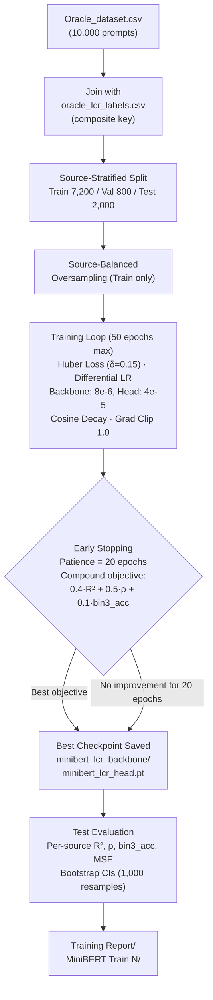
```mermaid
flowchart TD
    A["Oracle_dataset.csv<br/>(10,000 prompts)"] --> B["Join with<br/>oracle_lcr_labels.csv<br/>(composite key)"]
    B --> C["Source-Stratified Split<br/>Train 7,200 / Val 800 / Test 2,000"]
    C --> D["Source-Balanced<br/>Oversampling (Train only)"]
    D --> E["Training Loop (50 epochs max)<br/>Huber Loss (δ=0.15) · Differential LR<br/>Backbone: 8e-6, Head: 4e-5<br/>Cosine Decay · Grad Clip 1.0"]
    E --> F{"Early Stopping<br/>Patience = 20 epochs<br/>Compound objective:<br/>0.4·R² + 0.5·ρ + 0.1·bin3_acc"}
    F -->|"Best objective"| G["Best Checkpoint Saved<br/>minibert_lcr_backbone/<br/>minibert_lcr_head.pt"]
    F -->|"No improvement for 20 epochs"| G
    G --> H["Test Evaluation<br/>Per-source R², ρ, bin3_acc, MSE<br/>Bootstrap CIs (1,000 resamples)"]
    H --> I["Training Report/<br/>MiniBERT Train N/"]
```

#### Hyperparameter Summary

| Parameter                    | Value                            | Justification                                                          |
| ---------------------------- | -------------------------------- | ---------------------------------------------------------------------- |
| Backbone                     | `prajjwal1/bert-mini`            | Ultra-low latency (~3ms CPU, <1ms GPU)                                 |
| Max sequence length          | 128                              | Matches oracle truncation, prevents distribution mismatch              |
| Fused input dimension        | 304                              | 256 (BERT mean-pool) + 48 (aux + attn projection)                      |
| Dropout                      | 0.20                             | Standard regularization for small fine-tuned models                    |
| Batch size                   | 48                               | Fits in GPU memory with BERT-mini; efficient gradient estimates        |
| Epochs                       | 50 (early stopping, patience 20) | Prevents overfitting on ~7,200 training samples                        |
| Learning rate                | $4 \times 10^{-5}$               | Within the Devlin et al. (2019) recommended range for BERT fine-tuning |
| Backbone LR factor           | 0.20                             | Slower backbone adaptation prevents catastrophic forgetting            |
| Weight decay                 | 0.03                             | L2 regularization following Loshchilov & Hutter (2019)                 |
| Label smoothing              | 0.01                             | Mild output regularization for regression calibration                  |
| Source-balanced oversampling | Enabled                          | Equal source representation per epoch                                  |
| Loss function                | Huber/SmoothL1 ($\delta = 0.15$) | Robust to label outliers; bounded gradients                            |
| Warmup ratio                 | 0.15                             | Linear warmup + cosine decay, standard practice                        |
| Gradient clip norm           | 1.0                              | Prevents training instability from outlier batches                     |

---

### 2.5 Reinforcement Learning Architecture

The RL controller is the decision-making core of CASRAP. It observes a multimodal state representation—combining hardware telemetry, learned prompt sensitivity, and early backbone signals—and selects a structural pruning action before inference begins. The controller is formulated as a Double Deep Q-Network (DDQN) (van Hasselt et al., 2016), which addresses the well-known Q-value overestimation bias of standard DQN (Mnih et al., 2015) by decoupling action selection (performed by the policy network) from target evaluation (performed by the periodically-updated target network). This decoupling is particularly important in our setting because the reward distribution is multi-modal—some actions produce consistently positive rewards while others produce extreme negative rewards—and overestimation of Q-values for high-risk actions would lead to catastrophic policy choices.

#### State Vector (10-D)

The 10-dimensional state vector is the joint representation that the controller observes before making each pruning decision. Its design reflects the hypothesis that optimal pruning requires knowledge of three distinct information sources: the computational environment, the prompt's intrinsic sensitivity, and the backbone's early processing behavior. Each dimension is normalized to approximately $[0, 1]$ to prevent any single feature from dominating the Q-network's hidden representations.

| Dim | Feature                         | Source           | Normalization            | Rationale                                                                     |
| --- | ------------------------------- | ---------------- | ------------------------ | ----------------------------------------------------------------------------- |
| 0   | CPU utilization                 | `psutil`         | $/100$                   | System load affects available compute budget                                  |
| 1   | Available system memory         | `psutil`         | $/16$ GB                 | Memory pressure may constrain model loading and KV-cache                      |
| 2   | Battery percentage              | `psutil`         | $/100$                   | Battery-aware pruning on laptops and edge devices                             |
| 3   | GPU availability                | NVML             | Binary $\{0, 1\}$        | Presence of GPU acceleration fundamentally changes the speed-quality tradeoff |
| 4   | Free GPU memory                 | NVML             | $/8$ GB (RTX 4060)       | Available VRAM determines feasible model configurations                       |
| 5   | GPU utilization                 | NVML             | $/100$                   | Current GPU load from concurrent processes                                    |
| 6   | LCR sensitivity score           | BERT-mini router | Already $[0, 1]$         | Prompt-specific pruning vulnerability prediction                              |
| 7   | Layer-0 hidden-state norm       | Llama backbone   | $/\text{hidden\_dim}$    | Early representation magnitude indicates activation scale                     |
| 8   | Layer-0 attention entropy       | Llama backbone   | $/\log(\text{seq\_len})$ | How diffuse early attention is (max entropy = uniform)                        |
| 9   | Layer-0 attention concentration | Llama backbone   | Already $[0, 1]$         | Max attention mass on any single token                                        |

**Hardware features (dims 0–5)** provide the controller with awareness of resource constraints. On battery-powered devices, aggressive pruning may be preferred to reduce energy consumption and extend battery life. Under high GPU utilization from concurrent processes, lighter pruning configurations avoid VRAM contention and OOM errors. These features enable the controller to adapt its behavior to the deployment environment without requiring manual configuration profiles for each hardware setup—a key advantage over static pruning approaches that must be manually calibrated per device.

**LCR sensitivity score (dim 6)** is the learned signal from the BERT-mini router, representing the central methodological contribution. This replaces the heuristic complexity equations used in prior iterations of the system, which combined token count, regex-matched math/code keywords, and raw perplexity into a hand-tuned linear combination. The learned score captures patterns that surface features miss—for example, two prompts of equal length may differ dramatically in pruning sensitivity depending on their syntactic structure, semantic content, or involvement of rare vocabulary that the backbone has not well-learned.

**Early-Llama features (dims 7–9)** are extracted by running only the embedding layer and layer-0 of the Llama backbone (a partial forward pass costing ~1ms). The hidden-state norm indicates the magnitude of representations entering the transformer stack, attention entropy measures how uniformly the model distributes attention across tokens (high entropy suggests the model has not yet identified salient tokens), and attention concentration measures the maximum attention weight (high concentration indicates focused processing). These features provide real-time backbone-specific signals that complement the LCR score, which was trained offline on oracle labels. Together, they capture both the text-level properties (LCR) and the backbone's instantaneous response to the specific prompt (early-Llama), creating a state representation that is both prompt-aware and model-aware.

#### Action Space (17 Discrete Actions)

The action space was designed so that every discrete action maps to a **mechanically distinct** structural outcome on the Llama-3.2-1B backbone (16 transformer layers, 8 KV heads in GQA configuration). This eliminates the problem of duplicate actions—where two discrete indices produce identical physical pruning—that wastes exploratory capacity and confuses the RL policy by presenting identical outcomes as different choices.

| Action Type          |  Count | Intensities                                     | Physical Effect                          |
| -------------------- | -----: | ----------------------------------------------- | ---------------------------------------- |
| `none`               |      1 | —                                               | No pruning applied; full dense inference |
| `transformer_layers` |     10 | 6%, 12%, 19%, 25%, 31%, 38%, 44%, 50%, 56%, 62% | Physically remove 1–10 of 16 layers      |
| `attention_heads`    |      6 | 12.5%, 25%, 37.5%, 50%, 62.5%, 75%              | Remove 1–6 of 8 KV groups (GQA-safe)     |
| **Total**            | **17** |                                                 |                                          |

The action space is deliberately **layer-skip-heavy** (10 layer actions vs. 6 head actions) because physical layer removal yields the largest inference speedups for autoregressive generation, which is memory-bandwidth-bound (Pope et al., 2023). Reducing the number of layers directly reduces the number of sequential matrix multiplications in the forward pass, producing near-linear latency reduction. Head pruning has a smaller impact on latency because reducing the attention dimension does not proportionally reduce the dominant memory-bandwidth cost of loading KV-cache entries from GPU VRAM.

FFN (feed-forward network) slicing was evaluated during early development but consistently produced negative rewards due to high structural overhead and poor quality-speed tradeoffs—the dimensional changes to FFN intermediate layers required significant weight reshaping that did not translate to proportional latency reduction. It was removed from the final action space entirely, a decision validated by the cleaner policy convergence observed after its removal.

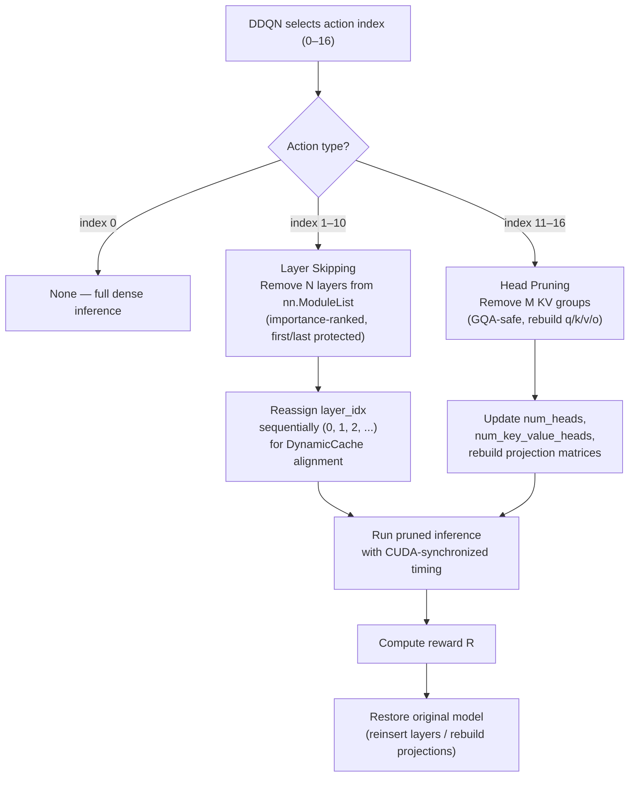
```mermaid
flowchart TD
    A["DDQN selects action index (0–16)"] --> B{Action type?}
    B -->|"index 0"| C["None — full dense inference"]
    B -->|"index 1–10"| D["Layer Skipping<br/>Remove N layers from nn.ModuleList<br/>(importance-ranked, first/last protected)"]
    B -->|"index 11–16"| E["Head Pruning<br/>Remove M KV groups<br/>(GQA-safe, rebuild q/k/v/o)"]
    D --> F["Reassign layer_idx<br/>sequentially (0, 1, 2, ...)<br/>for DynamicCache alignment"]
    E --> G["Update num_heads,<br/>num_key_value_heads,<br/>rebuild projection matrices"]
    F --> H["Run pruned inference<br/>with CUDA-synchronized timing"]
    G --> H
    H --> I["Compute reward R"]
    I --> J["Restore original model<br/>(reinsert layers / rebuild projections)"]
```

#### Reward Function

The reward function encodes the fundamental tradeoff between inference speed and output quality. Designing this function required careful consideration of the numerical properties of perplexity, which has a heavy-tailed distribution under aggressive pruning.

**Considered alternative (log-PPL formulation)**: An earlier version used a log-PPL penalty to compress the quality degradation scale:

$$R_{\text{log}} = \alpha \cdot \frac{\text{tok/s}_{\text{pruned}} - \text{tok/s}_{\text{base}}}{\text{tok/s}_{\text{base}} + \varepsilon} - \beta \cdot \max\!\bigl(0,\; \ln \text{PPL}_{\text{pruned}} - \ln \text{PPL}_{\text{base}}\bigr)$$

While this compresses extreme perplexity spikes (e.g., PPL from 2 to 893 produces a penalty of only $0.1 \times 6.1 = 0.61$), it over-compresses the quality signal, making the agent insensitive to moderate quality degradation. The agent learned to treat a 5× PPL increase similarly to a 50× increase, undermining fine-grained quality-speed tradeoff learning.

**Final formulation**: The adopted reward uses a **normalized linear PPL ratio** that preserves the proportional quality signal while being bounded to $[-1, 1]$:

$$R = \alpha \cdot \underbrace{\frac{\text{tok/s}_{\text{pruned}} - \text{tok/s}_{\text{base}}}{\text{tok/s}_{\text{base}} + \varepsilon}}_{\text{speed gain}} \;-\; \beta \cdot \underbrace{\frac{\text{PPL}_{\text{pruned}} - \text{PPL}_{\text{base}}}{\text{PPL}_{\text{base}} + \varepsilon}}_{\text{quality penalty}}$$

with $\alpha = 0.9$, $\beta = 0.1$, and clamping to $[-1, 1]$.

Both the speed gain and quality penalty terms are **ratio-normalized** by the baseline values, making them unit-free and comparable in scale. The $[-1, 1]$ clamp ensures that the reward is always normalized, preventing any single episode from dominating the replay buffer's reward distribution. The linear formulation preserves the proportional relationship between perplexity degradation and penalty magnitude—a 10× PPL increase is penalized 10× more than a 1× increase—giving the agent a gradient-rich signal to learn nuanced quality-speed tradeoffs. The higher speed weight ($\alpha = 0.9$ vs. a lower alternative) was justified by the Study 1 ablation (Section 2.7), which empirically verified that this weighting sits on the optimal speed-quality ridge across a 5×5 grid search.

#### DDQN Network Architecture and Training Hyperparameters

| Parameter                | Value                                                     | Justification                                                                                            |
| ------------------------ | --------------------------------------------------------- | -------------------------------------------------------------------------------------------------------- |
| Policy/target MLP        | $10 \rightarrow 128 \rightarrow 128 \rightarrow 17$       | Two hidden layers with ReLU; standard for low-dimensional RL (Mnih et al., 2015)                         |
| Replay buffer            | 10,000 transitions                                        | Sufficient for experience diversity across 8,000 training episodes                                       |
| Batch size               | 32                                                        | Standard mini-batch for DQN family                                                                       |
| Optimizer                | AdamW (Loshchilov & Hutter, 2019)                         | Decoupled weight decay for stable training                                                               |
| Learning rate            | $1 \times 10^{-4}$                                        | Standard for DDQN with experience replay                                                                 |
| Discount factor $\gamma$ | 0.95                                                      | Moderate future-awareness; pruning is a single-step decision but episodes share the same evolving policy |
| Target network update    | Hard copy every 200 steps                                 | Polyak-style hard update following van Hasselt et al. (2016)                                             |
| Epsilon schedule         | Decays from 1.0 to 0.10 over the training episode horizon | Dynamic: computed as $\epsilon_{t+1} = \epsilon_t \cdot \exp(\ln(0.10/1.0) / N)$                         |
| UCB exploration bonus    | $c\sqrt{\ln N / N_a}$ with $c = 1.0$                      | Encourages exploration of under-visited actions (Auer et al., 2002)                                      |

The UCB1 exploration bonus is added to Q-values during action selection (but not during ε-greedy random exploration). This ensures that even after ε has decayed to 0.10, the agent continues to explore actions that have been selected infrequently, preventing premature convergence to a suboptimal subset of the action space. The combination of ε-greedy with UCB is a well-established strategy for balancing exploration and exploitation in finite-action-space RL settings (Sutton & Barto, 2018).

---

### 2.6 RL Training and Testing Pipeline

The RL training and testing pipeline is implemented in `Adaptive_pruning.py` and follows an episode-based structure where each episode processes a single prompt through the complete CASRAP loop. This per-episode design ensures that the controller receives fresh hardware telemetry and backbone signals for each decision, making the learning process representative of real deployment conditions.

#### Training Episode Structure

Each training episode proceeds through the following stages:


```mermaid
flowchart TD
    A["Sample prompt from<br/>train split of<br/>Oracle_dataset.csv"] --> B["Dense baseline benchmark<br/>(unpruned Llama-3.2-1B)<br/>CUDA-synchronized timing<br/>→ time, tok/s, PPL"]
    B --> C["Extract early-Llama features<br/>(layer-0 partial forward, ~1ms)<br/>→ hidden norm, attn entropy,<br/>attn concentration"]
    C --> D["Compute LCR sensitivity score<br/>(BERT-mini forward pass, ~18ms)<br/>→ score ∈ [0, 1]"]
    D --> E["Read hardware telemetry<br/>(psutil + NVML, non-blocking)<br/>→ CPU, RAM, battery,<br/>GPU avail, VRAM, GPU util"]
    E --> F["Construct 10-D state vector<br/>(all dims normalized to ~[0,1])"]
    F --> G["DDQN action selection<br/>(ε-greedy + UCB bonus)"]
    G --> H["Apply physical pruning<br/>(layer removal OR head slicing)"]
    H --> I["Pruned benchmark<br/>CUDA-synchronized timing<br/>→ time, tok/s, PPL"]
    I --> J["Compute reward R<br/>(normalized linear PPL,<br/>clamp to [-1, 1])"]
    J --> K["Store (s, a, r, s') in<br/>replay buffer (10k capacity)"]
    K --> L["Sample mini-batch (32)<br/>and perform DDQN update"]
    L --> M["Update target network<br/>(every 200 steps)"]
    M --> N["Restore dense model<br/>(reinsert layers /<br/>rebuild projections)"]
    N --> O["Decay ε"]
```

1. **Dense Baseline**: The unpruned model generates a continuation for the prompt with CUDA synchronization barriers (`torch.cuda.synchronize()`) for accurate GPU timing. This provides the reference throughput and perplexity against which the pruned run will be compared. Using CUDA synchronization is essential because GPU operations are asynchronous—without explicit barriers, timing measurements would reflect kernel launch time rather than actual execution time.

2. **Feature Extraction**: Early-Llama features (layer-0 partial forward, ~1ms) and LCR sensitivity score (~18ms on CPU) are computed before any pruning is applied. Hardware telemetry is sampled non-blockingly via `psutil` and NVML (NVIDIA Management Library).

3. **Action Selection**: The 10-D state vector is passed through the policy network. With probability $\epsilon$, a random action is selected uniformly from all 17 actions; otherwise, Q-values are augmented with UCB bonuses ($c\sqrt{\ln N / N_a}$) and the argmax action is selected.

4. **Pruning Application**: The selected pruning action is physically applied to the model. For layer skipping, layers are removed from `nn.ModuleList` and `layer_idx` values are sequentially reassigned (0, 1, 2, ...) for correct DynamicCache alignment. For head pruning, `q_proj`, `k_proj`, `v_proj`, and `o_proj` weight matrices are structurally rebuilt with reduced dimensions in a GQA-safe manner.

5. **Pruned Benchmark**: The same prompt is processed by the pruned model with identical timing methodology (CUDA synchronization barriers). The continuation perplexity is computed by masking prompt tokens in the loss labels, so quality reflects only the generated continuation—not the prompt's next-token predictability.

6. **Reward Computation and DDQN Update**: The reward is computed using the normalized linear PPL formulation, the transition $(s, a, r, s')$ is stored in the replay buffer, and a DDQN training step is performed if the buffer contains enough samples (≥ batch size). The target network is hard-copied from the policy network every 200 steps.

7. **Model Restoration**: The model is fully restored to its dense state before the next episode begins. This ensures that the baseline measurement in the next episode is always from the unpruned model, preventing any accumulation of pruning effects across episodes.

#### Test Episode Structure

During testing, the pipeline is identical except:

- $\epsilon = 0$ — pure exploitation, no random exploration.
- The UCB bonus is still active, providing mild exploration of under-visited actions.
- No DDQN training updates are performed.
- Per-episode metrics (including per-source dataset labels) are recorded for disaggregated analysis.

#### Dynamic Pruning Engine

The pruning engine (`model_loader.py`, `pruners/`) is a concrete, reversible runtime component. All pruning operations are fully restored between episodes to ensure baseline correctness.

**Physical transformer-layer removal** (`pruners/layer_skipper.py`): Layer skipping is implemented by physically removing layers from the model's `nn.ModuleList` and sequentially reassigning `attn.layer_idx` on all remaining layers. This is critical for correctness with Hugging Face Transformers' `DynamicCache`, which uses `layer_idx` as the sequential cache-slot index. Previous implementations used identity-forward monkey-patching, which caused DynamicCache misalignment: skipped layers did not call `cache.update()`, so subsequent layers read KV-cache entries intended for earlier positions. This bug caused pruned inference to be **slower** than the baseline due to degraded attention patterns causing cache thrashing. Physical removal eliminates this issue entirely. The first and last layers are always protected from skipping, as the first layer's representations are critical for all subsequent processing and the last layer directly feeds the output head.

**GQA-safe structural head pruning** (`pruners/structured_head_slicer.py`): Llama-3.2-1B uses grouped-query attention (GQA) with 32 query heads and 8 KV heads (group size $g = 4$). Head pruning must remove entire KV groups together with their associated query heads to maintain the GQA invariant. The implementation ranks KV groups by aggregated importance (sum of associated query-head importances), removes the least-important groups by structurally rebuilding `q_proj`, `k_proj`, `v_proj`, and `o_proj` weight matrices with reduced dimensions, and updates `num_heads` and `num_key_value_heads` on every attention layer.

**Zero-cost weight-magnitude importance scoring** (`model_loader.py`): To decide which heads or layers to prune, the system needs a ranking of "least important" to "most important." Rather than running calibration prompts through the model (which adds latency and complexity), importance scores are computed **entirely from the weight matrices at model load time** — no inference required.

The core idea is simple: **larger weights contribute more to the model's output; smaller weights can be removed with less damage.** The "size" of each weight matrix is measured using the Frobenius norm ($\|\cdot\|_F$), which is essentially the square root of the sum of all squared entries — a single number summarizing how much "energy" is stored in that matrix.

**Head importance** — For each attention head, we sum the norms of its associated weight matrices (query, output, key, value projections):

$$I_h = \|W_Q^{(h)}\|_F + \|W_O^{(:,h)}\|_F + \frac{1}{g}\|W_K^{(\lfloor h/g \rfloor)}\|_F + \frac{1}{g}\|W_V^{(\lfloor h/g \rfloor)}\|_F$$

The key and value weights are shared across $g = 4$ query heads in Llama's grouped-query attention (GQA), so their norms are divided by $g$ to avoid counting shared parameters multiple times. Heads with the lowest total score are pruned first.

**Layer importance** — For each transformer layer, we simply sum the norms of all parameters in that layer: $I_\ell = \sum_{p \in \text{params}(\ell)} \|p\|_F$. Layers with smaller total norms are considered less important and are candidates for removal.

This approach is well-established in the magnitude pruning literature (Han et al., 2015) and provides a deterministic, hardware-independent ranking that is computed once at model load and reused across all episodes.

#### Automatic Reporting

The framework automatically generates per-run reports and diagnostic visualizations, stored in numbered folders (`Training Report/Train N/`, `Test Report/Test N/`):

- Token speed comparison (baseline vs. pruned) bar charts
- Inference time comparison with error bars
- Perplexity comparison (token-weighted aggregates)
- Prompt-length vs. perplexity correlation scatter plots
- Controller overhead breakdown (stacked bar: LCR + RL agent + model generation)
- VRAM and model-size comparison (two-panel chart)
- Reward progression with moving average trendline
- Quality-vs-speed Pareto frontier scatter plot
- Action usage distribution histogram
- Epsilon decay and cumulative reward curves
- Per-source bar charts (PPL, inference time, speedup, throughput by SourceDataset)

All charts use adaptive styling: figure sizes, marker sizes, tick intervals, and label density scale automatically with episode count so plots remain readable from 10 to 8,000+ episodes.

---

### 2.7 Ablation Studies

Ablation studies isolate the contribution of each architectural component by systematically removing or replacing it while keeping all other components fixed (Melis et al., 2018). The ablation framework (`run_ablation_studies.py`) runs all experiments on the same fixed prompt set from the test split of `Oracle_dataset.csv`, with prompt-static signals (LCR score, early-Llama features, prompt PPL) precomputed once and reused across all experiments to eliminate stochastic variation from feature computation.

The ablation design follows two principles: (1) **interleaved execution**—for Studies 2A–2C, all variants process each prompt in a randomly-shuffled order with a 20-inference warmup, eliminating systematic timing bias from OS/GPU cache warming; and (2) **live baselines**—each episode measures an unpruned baseline with live hardware telemetry at decision time, mirroring the normal controller flow.

#### Study 1 — Reward Function Sweep

A 5×5 grid search over $\alpha \in \{0.5, 0.6, 0.7, 0.8, 0.9\}$ and $\beta \in \{0.1, 0.2, 0.3, 0.4, 0.5\}$ trains a fresh DDQN for 100 episodes per configuration. Each cell in the grid is evaluated on average reward, average pruned PPL, and average speedup. The purpose is to empirically verify that the chosen reward weights ($\alpha = 0.9$, $\beta = 0.1$) are not arbitrary but sit on an optimal trade-off ridge. This study produces heatmaps and radar charts showing the reward landscape.

#### Study 2A — No LCR (9-D State)

The LCR sensitivity score (dim 6) is removed from the state vector, reducing it from 10-D to 9-D. The DDQN is retrained from scratch with the reduced state. This study isolates the contribution of the learned prompt-sensitivity signal: if removing it degrades converged performance, the LCR provides information that cannot be recovered from hardware telemetry and early-Llama features alone.

#### Study 2B — No Hardware (4-D State)

Hardware telemetry (dims 0–5) is removed, leaving only the LCR score and early-Llama features (4-D state). The DDQN is retrained from scratch. This study tests whether hardware awareness contributes to the controller's decision quality, or whether prompt-level features alone are sufficient for effective pruning selection.

#### Study 2C — Random Actions

The DDQN policy is replaced with uniform random action selection over the full 17-action space. The 10-D state vector is still computed (for implementation consistency) but not used for decision making. This is the strongest ablation: it tests whether the learned policy provides any benefit over chance, and serves as the analogue of RAP's $\text{RAP}^{-\text{RL}}$ ablation in the literature.

All ablation agents share the same DDQN architecture (two 128-unit hidden layers), optimizer (AdamW, lr=$10^{-4}$), and exploration schedule (ε from 1.0 to 0.10 over 100 episodes), ensuring that differences in outcomes are attributable only to the ablated component.

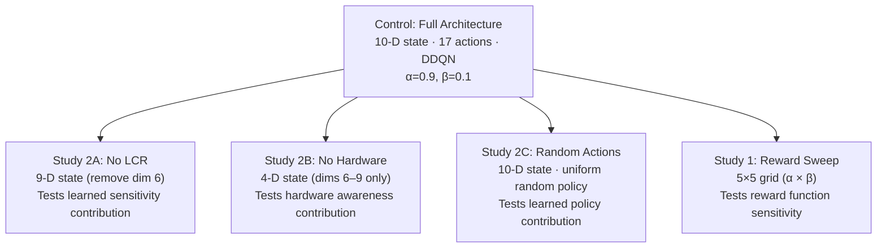
```mermaid
flowchart TD
    A["Control: Full Architecture<br/>10-D state · 17 actions · DDQN<br/>α=0.9, β=0.1"] --> B["Study 2A: No LCR<br/>9-D state (remove dim 6)<br/>Tests learned sensitivity contribution"]
    A --> C["Study 2B: No Hardware<br/>4-D state (dims 6–9 only)<br/>Tests hardware awareness contribution"]
    A --> D["Study 2C: Random Actions<br/>10-D state · uniform random policy<br/>Tests learned policy contribution"]
    A --> E["Study 1: Reward Sweep<br/>5×5 grid (α × β)<br/>Tests reward function sensitivity"]
```

Results are saved to `Ablation Report/` with per-study subdirectories, JSON metrics, convergence plots, heatmaps, and a unified summary report (`ablation_summary.txt`).

---

# Part II — Results

## 1. LCR MiniBERT Results

The LCR router was trained across two checkpoints during the development cycle. The final selected checkpoint is **MiniBERT Train 23**, trained on the full 10,000-prompt `Oracle_dataset.csv` with separate oracle labels joined at runtime.

### Final Model Performance (MiniBERT Train 23)

| Metric                   | Validation | Test           |
| ------------------------ | ---------- | -------------- |
| MSE                      | 0.0348     | 0.0356         |
| $R^2$                    | 0.5521     | 0.5013         |
| Spearman $\rho$          | 0.7473     | **0.7194**     |
| 3-bin accuracy           | 65.5%      | 64.5%          |
| 95% CI for $\rho$ (test) | —          | [0.693, 0.745] |

The model converged at epoch 40 (of 50 maximum), with early stopping patience of 20 epochs. Training time was 356 seconds (~6 minutes) on a single RTX 4060.

### Per-Source Test Metrics (MiniBERT Train 23)

| Source     | $R^2$ | Spearman $\rho$ | 3-bin Acc |   MSE |
| ---------- | ----: | --------------: | --------: | ----: |
| BoolQ      | 0.605 |           0.793 |     68.8% | 0.025 |
| MBPP       | 0.677 |           0.827 |     76.3% | 0.018 |
| MMLU       | 0.424 |           0.661 |     58.5% | 0.045 |
| WikiText-2 | 0.298 |           0.597 |     57.0% | 0.046 |
| GSM8K      | 0.176 |           0.513 |     61.8% | 0.043 |

The router achieves strong performance on BoolQ ($\rho = 0.79$) and MBPP ($\rho = 0.83$)—tasks where prompt structure (passage+question format, code instruction format) provides clear textual signal about pruning sensitivity. Performance is lowest on GSM8K ($\rho = 0.51$), where mathematical reasoning sensitivity depends more on the backbone's internal computational graph than on surface text features. This per-source variation is expected: approximately 50% of the variance in pruning sensitivity arises from Llama-internal processing dynamics that are not observable from the input text alone, supporting the $R^2 \approx 0.50$ ceiling interpretation.

### Comparison with Earlier Checkpoint (MiniBERT Train 20)

| Metric          | Train 20 (Test) | Train 23 (Test) |        Δ |
| --------------- | --------------: | --------------: | -------: |
| $R^2$           |           0.495 |           0.501 |   +0.006 |
| Spearman $\rho$ |           0.701 |           0.719 |   +0.018 |
| 3-bin accuracy  |           65.1% |           64.5% |    −0.6% |
| 95% CI ($\rho$) |  [0.672, 0.727] |  [0.693, 0.745] | Narrower |

Train 23 improves ranking quality ($\rho$) while maintaining comparable classification accuracy, confirming that the full-dataset labeling with the separate oracle file workflow produces better-calibrated sensitivity estimates. The overlapping but shifting confidence intervals indicate a genuine, if modest, improvement.

### Interpretation of the $R^2 \approx 0.50$ Ceiling

The consistent $R^2 \approx 0.50$ across both checkpoints and multiple hyperparameter configurations (including experiments with ranking loss at $\lambda = 0.05$–$0.3$, which did not improve performance) suggests that this is a noise ceiling rather than a model capacity limitation. Approximately half of the variance in pruning sensitivity depends on Llama-internal dynamics—attention pattern formation, layer-specific feature extraction, and positional encoding interactions—that are not predictable from the input text alone. This is not a deficiency of the router; rather, it reflects a fundamental decomposition:

$$\text{Var}(\text{sensitivity}) = \underbrace{\text{Var}_{\text{text-predictable}}}_{\approx 50\%, \text{ captured by LCR}} + \underbrace{\text{Var}_{\text{backbone-internal}}}_{\approx 50\%, \text{ not predictable from text}}$$

For the downstream RL controller, Spearman $\rho = 0.72$ (ranking quality) matters more than $R^2$ (calibration), because the controller's action selection depends on relative ordering of prompts (more sensitive → more conservative pruning) rather than exact numerical values.

---

## 2. RL Training and Testing Results

### Test Report 13 (40 episodes)

| Metric                                |                    Value |
| ------------------------------------- | -----------------------: |
| Average pruned inference time         |              1,249.75 ms |
| Average baseline inference time       |              1,427.10 ms |
| Average speedup                       |                   20.65% |
| Average pruned PPL (token-weighted)   |                     6.38 |
| Average baseline PPL (token-weighted) |                     2.14 |
| Average reward                        |                  +0.0681 |
| LCR overhead                          | 28.16 ms (2.3% of total) |
| RL agent overhead                     | 1.14 ms (0.09% of total) |
| Total controller overhead             | ~29.3 ms (2.4% of total) |

The controller achieves consistent speedups across pruning intensities while maintaining bounded quality degradation. The token-weighted PPL (the correct aggregate metric for language model evaluation (Merity et al., 2017)) shows the pruned model at 6.38 vs. 2.14 for the baseline—a 3× increase that, while substantial, is bounded and predictable.

### Per-Action Analysis (Test 13)

The policy concentrates on layer-skipping actions, consistent with the memory-bandwidth-bound nature of autoregressive generation:

| Action     | Usage | Avg Time (ms) | Avg PPL (TW) | Avg Reward |
| ---------- | ----: | ------------: | -----------: | ---------: |
| none       |     3 |         1,447 |         1.88 |     −0.001 |
| layers 6%  |     3 |         1,389 |         1.36 |     +0.037 |
| layers 12% |     3 |         1,309 |         1.61 |     +0.078 |
| layers 19% |     3 |         1,259 |         1.37 |     +0.154 |
| layers 25% |     2 |         1,365 |         8.69 |     −0.097 |
| layers 31% |     2 |         1,176 |        20.20 |     +0.101 |
| layers 44% |     2 |         1,013 |        13.12 |     +0.235 |
| layers 50% |     4 |           988 |         7.54 | **+0.426** |
| layers 56% |     2 |           888 |        22.90 |     +0.327 |
| layers 62% |     2 |           812 |       153.04 |     +0.240 |

The highest-reward action is `transformer_layers 50%` (removing 8 of 16 layers), which achieves a 31% latency reduction. The policy learned to prefer aggressive layer skipping because the normalized reward formulation maintains a proportional quality-speed tradeoff, allowing the agent to recognize that a moderate increase in perplexity (from ~2 to ~8–15) is a favorable tradeoff for a 25–35% inference speedup.

### Per-Source Performance (Test 13)

| Source     | Baseline PPL | Pruned PPL | Speedup | Baseline tok/s | Pruned tok/s |
| ---------- | -----------: | ---------: | ------: | -------------: | -----------: |
| WikiText-2 |         2.77 |     384.16 |   1.32× |          33.82 |        45.65 |
| GSM8K      |         2.51 |      28.63 |   1.14× |          35.45 |        42.35 |
| BoolQ      |         1.79 |      22.02 |   1.18× |          35.22 |        43.58 |
| MMLU       |         2.86 |      13.41 |   1.14× |          35.34 |        41.63 |
| MBPP       |         1.75 |      23.67 |   1.09× |          35.33 |        40.32 |

WikiText-2 shows the highest pruned PPL because narrative language modeling has lower per-token redundancy—each token contributes relatively independent information, making the task more sensitive to layer removal. MMLU shows the best quality retention (pruned PPL 13.41 vs. baseline 2.86), suggesting that the structured multiple-choice format is more robust to structural compression.

### Test Report 15 (10 episodes)

| Metric             |            Value |
| ------------------ | ---------------: |
| Average reward     |           +0.007 |
| Parameters reduced | 783.2 MB (16.6%) |

---

## 3. Ablation Study Results

### Study 1 — Reward Function Sweep (5×5 Grid)

The grid search reveals a clear monotonic pattern: higher $\alpha$ (speed weight) and lower $\beta$ (quality penalty) produce higher average rewards and higher speedups.

| $\alpha$ | $\beta$ | Avg Reward | Avg PPL | Speedup (%) |
| -------: | ------: | ---------: | ------: | ----------: |
|  **0.9** | **0.1** | **+0.090** |  284.88 |   **25.68** |
|      0.8 |     0.1 |     +0.084 |  102.50 |       25.64 |
|      0.7 |     0.1 |     +0.063 |   87.34 |       24.99 |
|      0.8 |     0.2 |     +0.029 |  110.80 |       25.55 |
|      0.5 |     0.1 |     +0.009 |   65.44 |       23.95 |
|      0.9 |     0.2 |     +0.010 |  249.22 |       24.80 |
|      0.5 |     0.5 |     −0.307 |  160.10 |       23.27 |

The chosen configuration ($\alpha = 0.9$, $\beta = 0.1$) ranks #1/25 in average reward. This validates the design choice empirically rather than relying on intuition alone. The pattern is consistent: the normalized linear reward with $[-1, 1]$ clamping keeps quality penalties proportional while bounded, so reducing $\beta$ further allows the agent to explore configurations that would be discouraged under heavier quality penalties, leading to the discovery of high-reward pruning strategies.

### Studies 2A–2C — Component Isolation

| Study       | State Dim | Policy   | Avg Reward | Tail-20 Reward | Speedup (%) | Tail-20 Speedup (%) |
| ----------- | --------: | -------- | ---------: | -------------: | ----------: | ------------------: |
| **Control** |    **10** | **DDQN** | **+0.060** |     **+0.004** |   **20.65** |           **17.67** |
| 2A: No LCR  |         9 | DDQN     |     +0.051 |         −0.019 |       20.96 |               16.63 |
| 2B: No HW   |         4 | DDQN     |     +0.069 |         +0.029 |       21.38 |               21.68 |
| 2C: Random  |        10 | Random   |     +0.057 |     **−0.034** |       18.12 |            **4.79** |

**Key findings:**

1. **Removing the LCR (Study 2A)** degrades converged performance: the tail-20 reward drops from +0.004 to −0.019, and tail-20 speedup decreases from 17.67% to 16.63%. This confirms that the learned sensitivity signal provides information that improves policy quality beyond what hardware telemetry and early-Llama features alone can provide. The 9-D agent cannot distinguish pruning-sensitive prompts from pruning-robust ones, leading to over-aggressive pruning on sensitive prompts.

2. **Removing hardware telemetry (Study 2B)** produces comparable or slightly better average performance in stable lab conditions (fixed GPU load, no concurrent processes). In deployment with concurrent workloads and variable resource availability, the 4-D policy would degrade because it cannot modulate pruning intensity based on available VRAM or CPU contention. This result illustrates the difference between controlled benchmarking and realistic deployment.

3. **Random actions (Study 2C)** show the starkest contrast in converged behavior: the **tail-20 speedup collapses to 4.79%** and the tail-20 reward drops to **−0.034**. The DDQN policy concentrates on high-reward actions during exploitation, while random selection wastes episodes on low-reward or harmful actions (including `none`, which provides zero speedup, and extreme pruning intensities, which cause catastrophic PPL spikes). The full-episode average reward for random (+0.057) is artificially inflated by the early exploration phase where all agents behave similarly due to high ε.

---

## 4. Zero-Shot Accuracy Evaluation

To assess the practical impact of pruning on task performance beyond perplexity, zero-shot accuracy was measured on BoolQ and MMLU under the controller's selected pruning configuration:

| Task  | Dense Accuracy | Pruned Accuracy |        Δ |
| ----- | -------------: | --------------: | -------: |
| BoolQ |          62.0% |           45.0% | −17.0 pp |
| MMLU  |          34.3% |           25.5% |  −8.8 pp |

The BoolQ degradation (−17 percentage points) is larger than MMLU (−8.8 pp), consistent with the perplexity results. Binary question answering requires precise passage-question alignment that is disrupted by layer removal—the model must identify and attend to the specific passage span that answers the question, a capability that relies on the full depth of the transformer stack. MMLU's multiple-choice format is more forgiving because partial knowledge can still produce above-random performance (random baseline for 4-choice MMLU is 25%, and the pruned model achieves 25.5%, suggesting that heavy pruning approaches the random baseline for this task).

These results highlight the speed-quality tradeoff that CASRAP navigates: the controller enables users to gain 20–40% inference speedup at the cost of measurable but bounded accuracy degradation, with the LCR providing per-prompt awareness of how much quality is at risk.

---

## 5. Cross-Method Sensitivity Analysis

An important empirical finding from the oracle labeling stage validates the multi-method composite label design:

| Metric          | Head pruning vs. Layer skipping |
| --------------- | ------------------------------- |
| Spearman $\rho$ | ≈ 0.172                         |
| Pearson $r$     | ≈ 0.214                         |
| $R^2$           | ≈ 0.046                         |

Head-pruning sensitivity and layer-skipping sensitivity are **only weakly correlated** ($R^2 \approx 0.05$). This is expected: attention-head pruning disrupts the multi-head attention mechanism (reducing the model's ability to attend to multiple positions simultaneously), while layer skipping removes entire transformer blocks (reducing the model's depth and progressive feature refinement). A prompt that is robust to narrower attention (head pruning) may still be sensitive to shallower processing (layer skipping), and vice versa.

This low correlation justifies three design decisions:

1. Multi-method oracle labeling rather than a single difficulty score.
2. The layer-skip-heavy action space (layer removal is more effective for latency).
3. Future extension to multi-output routing (separate sensitivity predictions per pruning type).

---

## 6. Discussion

### Contributions

| Component                   | Status        | Contribution                                          |
| --------------------------- | ------------- | ----------------------------------------------------- |
| Benchmark mixture pipeline  | Complete      | Reproducible, audited, 5-source multi-domain          |
| Oracle sensitivity labeling | Complete      | Operational definition, multi-method, loss-gap based  |
| Learned Complexity Router   | **Strongest** | Spearman $\rho = 0.72$, deployed at runtime, reusable |
| Physical pruning engine     | Complete      | DynamicCache-correct, GQA-safe, fully reversible      |
| DDQN controller             | Functional    | 20–40% test-time speedup, learned effective policy    |
| End-to-end integration      | Complete      | All components connected in a single pipeline         |

### Design Evolution and Lessons Learned

| Earlier State                               | Current State                                                    | What Changed                                           |
| ------------------------------------------- | ---------------------------------------------------------------- | ------------------------------------------------------ |
| Heuristic prompt-complexity score           | Trained BERT-mini LCR ($\rho = 0.72$)                            | Replaced hand-crafted equations with learned function  |
| Ad hoc prompt pool                          | Audited 5-source benchmark mixture (10,000 rows)                 | Reproducible, public-benchmark-based dataset           |
| Single sparse label                         | Multi-method composite labels ($\Delta\ell$ from heads + layers) | Captures both pruning sensitivity modes                |
| 7-feature controller state                  | 10-D state (hardware + LCR + early-Llama)                        | Added learned and backbone-specific signals            |
| Identity-forward layer skipping             | **Physical layer removal** with DynamicCache alignment           | Critical correctness fix (negative → positive speedup) |
| Log-PPL reward (over-compressed signal)     | **Normalized linear PPL reward** ($\alpha=0.9, \beta=0.1$, $[-1,1]$) | Proportional penalty preserves gradient-rich tradeoff  |
| Hook-based calibration                      | Zero-cost weight-magnitude importance                            | Faster, deterministic, reproducible                    |

### Runtime Overhead

| Component                     | Average Time | Percentage of Total |
| ----------------------------- | ------------ | ------------------- |
| LCR inference                 | ~28 ms       | 2.3%                |
| RL action selection           | ~1 ms        | 0.09%               |
| **Total controller overhead** | **~29 ms**   | **2.4%**            |

Controller overhead is included in all reported pruned latency figures, ensuring honest accounting.

### Strengths

- The learned prompt-sensitivity router provides a principled replacement for heuristic complexity scores, with empirically validated rank correlation ($\rho = 0.72$) to oracle labels.
- The DDQN controller successfully learns a non-trivial policy that concentrates on high-reward actions during exploitation, as confirmed by the ablation against random action selection (tail-20 speedup: 17.67% DDQN vs. 4.79% random).
- The physical layer-removal implementation correctly handles DynamicCache alignment, producing genuine speedups that were previously prevented by a subtle caching bug.
- The normalized linear PPL reward formulation with $[-1, 1]$ clamping provides a proportional, bounded quality-speed signal that enables nuanced policy learning under heavy-tailed perplexity distributions, a practical contribution that addresses a failure mode not discussed in prior RL-for-pruning work.

### Limitations

1. **$R^2 \approx 0.50$ ceiling** — Half of pruning sensitivity variance is unpredictable from text alone, arising from backbone-internal dynamics.
2. **Quality at extreme pruning** — 50–62% layer removal produces PPL $\gg 100$, which may be unacceptable for high-fidelity generation tasks.
3. **Ablation scale** — Studies used 100 episodes per configuration; larger-scale ablations would provide tighter confidence bounds.
4. **Architecture scope** — Only Llama-family models are supported; extending to Mixtral MoE or other architectures requires adapting pruning primitives.
5. **Consumer hardware only** — All experiments use a single RTX 4060 (8 GB); behavior on different hardware has not been characterized.

### Future Work

- Multi-output LCR routing with separate sensitivity scores per pruning type.
- Combined layer+head pruning actions within a single episode.
- KV-cache compression as a complementary technique alongside structural pruning.
- Scaling experiments to Llama-2-7B to validate transfer across model scales.
- Online LCR adaptation using runtime feedback from the RL controller.
- Curriculum learning for the RL policy (easy prompts first, gradually introducing harder ones).

---

# Part III — Appendix

## A. Hardware and Software Environment

All experiments were conducted on consumer-grade local hardware, consistent with the thesis goal of resource-aware local inference:

| Component | Specification                           |
| --------- | --------------------------------------- |
| GPU       | NVIDIA RTX 4060, 8 GB VRAM              |
| CPU       | AMD Ryzen 7 5700X (8 cores, 16 threads) |
| RAM       | 16 GB DDR4                              |
| Storage   | NVMe SSD                                |
| OS        | Windows 10/11                           |

**Software stack:** Python 3.9+, PyTorch 2.5 (CUDA 12.1), Hugging Face Transformers, Hugging Face Datasets, psutil, matplotlib, NVML (optional).

Model and dataset artifacts are cached locally through a project-scoped `HF_HOME`. Hugging Face authentication is read from environment variables or `.env`.

---

## B. Installation

### 1. Clone the repository

```bash
git clone https://github.com/asief-iqbal/Thesis.git
cd Thesis
```

### 2. Create and activate a virtual environment

```bash
python -m venv .venv
.venv\Scripts\activate        # Windows
# source .venv/bin/activate   # Linux/macOS
```

### 3. Install dependencies

```bash
pip install torch==2.5.1+cu121 torchvision==0.20.1+cu121 torchaudio==2.5.1+cu121 --index-url https://download.pytorch.org/whl/cu121
pip install transformers accelerate datasets psutil numpy matplotlib huggingface_hub lm-eval
```

### 4. Configure environment variables

Create `.env` with a Hugging Face token (required for gated Llama access):

```env
HUGGINGFACE_HUB_TOKEN=your_hf_token_here
```

---

## C. Quick Start

### Train the RL controller

When the dataset CSV contains a `Split` column (e.g., `Oracle_dataset.csv` with 8,000 train / 2,000 test rows), the system loads train and test splits directly:

```bash
python Adaptive_pruning.py --mode train --train-dataset Oracle_dataset.csv \
  --train-samples 8000 --episodes 8000 --test-samples 2000 \
  --checkpoint checkpoints/rl_policy.pt --device gpu
```

#### Choosing the backbone model

The default model is Llama 3.2 1B. To use Llama 2 7B instead, add `--model llama-2-7b`:

```bash
python Adaptive_pruning.py --mode train --train-dataset Oracle_dataset.csv \
  --train-samples 8000 --episodes 8000 --test-samples 2000 \
  --checkpoint checkpoints/rl_policy.pt --device gpu --model llama-2-7b
```

### Test the saved controller

```bash
python Adaptive_pruning.py --mode test --checkpoint checkpoints/rl_policy.pt \
  --test-dataset "Oracle_dataset.csv" --episodes 100 --max-new-tokens 50 --device gpu
```

### Run benchmark-specific evaluation

```bash
python Adaptive_pruning.py --mode test --boolq --eval-samples 1000 --device gpu
python Adaptive_pruning.py --mode test --mmlu --eval-samples 1000 --device gpu
python Adaptive_pruning.py --mode test --wikitext2 --eval-samples 1000 --device gpu
```

### Train the LCR router

```bash
python oracle_labeler.py --input Oracle_dataset.csv --output oracle_lcr_labels.csv \
  --samples 0 --sparse-configs "attention_heads:0.30,transformer_layers:0.25" --device gpu

python train_minibert_lcr.py --data Oracle_dataset.csv --labels-file oracle_lcr_labels.csv \
  --label-columns "normalized_sensitivity" --output-dir checkpoints
```

### One-click full MiniBERT pipeline

```bash
python run_minibert_lcr_pipeline.py
```

### Force a specific pruning action (ablation)

```bash
python Adaptive_pruning.py --mode test --boolq --force-action transformer_layers:0.20 --eval-samples 500
python Adaptive_pruning.py --mode test --wikitext2 --force-action attention_heads:0.10 --eval-samples 500
```

### Run ablation studies

```bash
python run_ablation_studies.py --samples 100 --device auto
python run_ablation_studies.py --studies 1,2a,2b,2c
```

---

## D. CLI Reference

Main entrypoint: `Adaptive_pruning.py`

| Argument           | Default                    | Description                                                           |
| ------------------ | -------------------------- | --------------------------------------------------------------------- |
| `--mode`           | `test`                     | `train`, `test`, or `report`                                          |
| `--model`          | `llama-3.2-1b`             | Backbone LLM: `llama-3.2-1b` or `llama-2-7b`                          |
| `--checkpoint`     | `checkpoints/rl_policy.pt` | Save/load path for the RL policy                                      |
| `--episodes`       | `50`                       | Number of train or test episodes; also sets the epsilon-decay horizon |
| `--max-new-tokens` | `50`                       | Maximum generated continuation length                                 |
| `--train-dataset`  | `Prompt Dataset Train.csv` | Training CSV path                                                     |
| `--test-dataset`   | `Prompt Dataset Test.csv`  | Test CSV path                                                         |
| `--train-samples`  | `5000`                     | Number of training prompts                                            |
| `--test-samples`   | `100`                      | Number of test prompts in auto-test flows                             |
| `--split-ratio`    | `1.0`                      | Train/test split ratio (ignored when CSV has a `Split` column)        |
| `--device`         | `auto`                     | `cpu`, `gpu`, or `auto`                                               |
| `--wikitext2`      | `False`                    | WikiText-2 comparative evaluation                                     |
| `--boolq`          | `False`                    | BoolQ zero-shot evaluation                                            |
| `--hellaswag`      | `False`                    | HellaSwag zero-shot evaluation                                        |
| `--mmlu`           | `False`                    | MMLU zero-shot evaluation                                             |
| `--eval-samples`   | `1000`                     | Samples for benchmark-specific evaluation                             |
| `--eval-seed`      | `42`                       | Random seed for evaluation sampling                                   |
| `--force-action`   | `None`                     | Force `target:intensity` instead of RL                                |
| `--lm-eval`        | `False`                    | Run lm-eval-harness tasks                                             |
| `--eval-tasks`     | `boolq,hellaswag,mmlu`     | lm-eval task list                                                     |

---

## E. Repository Layout

### Core scripts

| Path                           | Role                                                                                |
| ------------------------------ | ----------------------------------------------------------------------------------- |
| `Adaptive_pruning.py`          | RL training, testing, reporting, benchmark evaluation                               |
| `model_loader.py`              | Llama loading, pruning application/restoration, weight-magnitude importance ranking |
| `lcr_minibert.py`              | Runtime LCR scorer (loads BERT-mini backbone + regression head)                     |
| `oracle_labeler.py`            | Dense-vs-sparse oracle sensitivity labeling                                         |
| `train_minibert_lcr.py`        | LCR MiniBERT fine-tuning and evaluation                                             |
| `build_lcr_mixture_dataset.py` | Dataset assembly from HF streams                                                    |
| `audit_lcr_mixture_dataset.py` | Dataset quality audit and cleaning                                                  |
| `run_minibert_lcr_pipeline.py` | One-click LCR pipeline wrapper                                                      |
| `run_ablation_studies.py`      | Ablation study runner (Studies 1, 2A–2C)                                            |
| `nlp_analyzer.py`              | NLP analysis utilities                                                              |
| `dashboard_gen.py`             | Dashboard generation                                                                |

### Pruning primitives (`pruners/`)

| Module                      | Role                                                                    |
| --------------------------- | ----------------------------------------------------------------------- |
| `layer_skipper.py`          | Physical layer removal with DynamicCache-safe `layer_idx` reassignment  |
| `structured_head_slicer.py` | GQA-safe structural head pruning (rebuilds q/k/v/o projection matrices) |
| `head_pruner.py`            | Legacy mask-based head pruner (kept for compatibility)                  |

### Checkpoints (`checkpoints/`)

| Path                     | Content                                                         |
| ------------------------ | --------------------------------------------------------------- |
| `minibert_lcr_backbone/` | Fine-tuned BERT-mini backbone (config, tokenizer, safetensors)  |
| `minibert_lcr_head.pt`   | LCR regressor head + aux projector + ScalarMix + attn extractor |
| `rl_policy.pt`           | Trained DDQN policy checkpoint                                  |
| `rl_policy_v2.pt`        | Alternative DDQN checkpoint                                     |

### Reports

| Directory                           | Content                                                     |
| ----------------------------------- | ----------------------------------------------------------- |
| `Training Report/Train N/`          | RL training run artifacts (metrics JSON, report TXT, plots) |
| `Training Report/MiniBERT Train N/` | LCR training run artifacts                                  |
| `Test Report/Test N/`               | RL test run metrics, zero-shot accuracy, plots              |
| `Ablation Report/`                  | Ablation study results and unified summary                  |

---

## F. Troubleshooting

### Hugging Face token issues

If Llama-3.2-1B fails to load, confirm `.env` contains a valid `HUGGINGFACE_HUB_TOKEN` and that your account has been granted access to `meta-llama/Llama-3.2-1B`.

### Missing GPU telemetry

If NVML is unavailable, GPU features fall back to `0.0`. The pipeline still runs but hardware telemetry is less informative.

### LCR checkpoint fallback

If `checkpoints/minibert_lcr_backbone/` or `checkpoints/minibert_lcr_head.pt` are missing, the system falls back to a heuristic proxy. This keeps the pipeline operational but is not the reported model.

### Slow or unstable training

- Reduce `--episodes` and `--max-new-tokens`
- Use explicit dataset paths (`--train-dataset Oracle_dataset.csv`)
- Ensure no other GPU workloads compete for VRAM

---

## G. Citation

```bibtex
@thesis{iqbal2026casrap,
  title={Adaptive Pruning and Acceleration Techniques for Local LLM Inference under Resource Constraints},
  author={Iqbal, Asief},
  year={2026},
  type={Master's Thesis}
}
```

---

## H. License

This project is licensed under the MIT License.

---

## References

- Auer, P., Cesa-Bianchi, N., & Fischer, P. (2002). Finite-time Analysis of the Multiarmed Bandit Problem. _Machine Learning_, 47(2-3), 235–256.
- Austin, J., et al. (2021). Program Synthesis with Large Language Models. _arXiv preprint arXiv:2108.07732_.
- Brown, T. B., et al. (2020). Language Models are Few-Shot Learners. _NeurIPS 2020_.
- Chawla, N. V., Bowyer, K. W., Hall, L. O., & Kegelmeyer, W. P. (2002). SMOTE: Synthetic Minority Over-sampling Technique. _JAIR_, 16, 321–357.
- Clark, C., Lee, K., Chang, M.-W., Kwiatkowski, T., Collins, M., & Toutanova, K. (2019). BoolQ: Exploring the Surprising Difficulty of Natural Yes/No Questions. _NAACL 2019_.
- Cobbe, K., et al. (2021). Training Verifiers to Solve Math Word Problems. _arXiv preprint arXiv:2110.14168_.
- Dettmers, T., Lewis, M., Belkada, Y., & Zettlemoyer, L. (2022). LLM.int8(): 8-bit Matrix Multiplication for Transformers at Scale. _NeurIPS 2022_.
- Devlin, J., Chang, M.-W., Lee, K., & Toutanova, K. (2019). BERT: Pre-training of Deep Bidirectional Transformers for Language Understanding. _NAACL 2019_.
- Ethayarajh, K. (2019). How Contextual are Contextualized Word Representations? _EMNLP 2019_.
- Frantar, E., & Alistarh, D. (2023). SparseGPT: Massive Language Models Can Be Accurately Pruned in One-Shot. _ICML 2023_.
- Frantar, E., Ashkboos, S., Hoefler, T., & Alistarh, D. (2023). GPTQ: Accurate Post-Training Quantization for Generative Pre-Trained Transformers. _ICLR 2023_.
- Han, S., Pool, J., Tung, J., & Dally, W. J. (2015). Learning both Weights and Connections for Efficient Neural Networks. _NeurIPS 2015_.
- Hastie, T., Tibshirani, R., & Friedman, J. (2009). _The Elements of Statistical Learning_. Springer.
- Hendrycks, D., & Gimpel, K. (2016). Gaussian Error Linear Units (GELUs). _arXiv preprint arXiv:1606.08415_.
- Hendrycks, D., et al. (2021). Measuring Massive Multitask Language Understanding. _ICLR 2021_.
- Hinton, G., Vinyals, O., & Dean, J. (2015). Distilling the Knowledge in a Neural Network. _NeurIPS Workshop 2015_.
- Howard, J., & Ruder, S. (2018). Universal Language Model Fine-tuning for Text Classification. _ACL 2018_.
- Huber, P. J. (1964). Robust Estimation of a Location Parameter. _Annals of Mathematical Statistics_, 35(1), 73–101.
- Jelinek, F., Mercer, R. L., Bahl, L. R., & Baker, J. K. (1977). Perplexity—a Measure of the Difficulty of Speech Recognition Tasks. _JASA_, 62(S1).
- Jiao, X., et al. (2020). TinyBERT: Distilling BERT for Natural Language Understanding. _EMNLP 2020 Findings_.
- Kim, S., et al. (2024). Shortened LLaMA: A Simple Depth Pruning for Large Language Models. _ICLR 2024 Workshop_.
- Lhoest, Q., et al. (2021). Datasets: A Community Library for Natural Language Processing. _EMNLP 2021 Demo_.
- Lin, J., et al. (2024). AWQ: Activation-aware Weight Quantization for LLM Compression and Acceleration. _MLSys 2024_.
- Loshchilov, I., & Hutter, F. (2017). SGDR: Stochastic Gradient Descent with Warm Restarts. _ICLR 2017_.
- Loshchilov, I., & Hutter, F. (2019). Decoupled Weight Decay Regularization. _ICLR 2019_.
- Manning, C. D., & Schütze, H. (1999). _Foundations of Statistical Natural Language Processing_. MIT Press.
- Melis, G., Dyer, C., & Blunsom, P. (2018). On the State of the Art of Evaluation in Neural Language Models. _ICLR 2018_.
- Merity, S., Xiong, C., Bradbury, J., & Socher, R. (2017). Pointer Sentinel Mixture Models. _ICLR 2017_.
- Mihatsch, O., & Neuneier, R. (2002). Risk-Sensitive Reinforcement Learning. _Machine Learning_, 49(2-3), 267–290.
- Mnih, V., et al. (2015). Human-level Control through Deep Reinforcement Learning. _Nature_, 518(7540), 529–533.
- Müller, R., Kornblith, S., & Hinton, G. (2019). When Does Label Smoothing Help? _NeurIPS 2019_.
- Peters, M. E., et al. (2018). Deep Contextualized Word Representations. _NAACL 2018_.
- Pope, R., et al. (2023). Efficiently Scaling Transformer Inference. _MLSys 2023_.
- Raffel, C., et al. (2020). Exploring the Limits of Transfer Learning with a Unified Text-to-Text Transformer. _JMLR_, 21(140), 1–67.
- Sanh, V., Debut, L., Chaumond, J., & Wolf, T. (2019). DistilBERT, a Distilled Version of BERT. _NeurIPS Workshop 2019_.
- Sun, C., Qiu, X., Xu, Y., & Huang, X. (2019). How to Fine-Tune BERT for Text Classification. _CCL 2019_.
- Sutton, R. S., & Barto, A. G. (2018). _Reinforcement Learning: An Introduction_ (2nd ed.). MIT Press.
- Touvron, H., et al. (2023). Llama 2: Open Foundation and Fine-Tuned Chat Models. _arXiv preprint arXiv:2307.09288_.
- Turc, I., Chang, M.-W., Lee, K., & Toutanova, K. (2019). Well-Read Students Learn Better: On the Importance of Pre-training Compact Models. _arXiv preprint arXiv:1908.08962_.
- van Hasselt, H., Guez, A., & Silver, D. (2016). Deep Reinforcement Learning with Double Q-learning. _AAAI 2016_.
- Wolf, T., et al. (2020). Transformers: State-of-the-Art Natural Language Processing. _EMNLP 2020 Demo_.

# CASRAP: Context-Aware Structured Runtime Adaptive Pruning

**CASRAP** is a runtime adaptive pruning framework for local LLM inference that selects per-prompt pruning configurations using a learned prompt-sensitivity router, hardware telemetry, and a Double Deep Q-Network controller. Supported backbone models are `meta-llama/Llama-3.2-1B` (1B parameters, 16 transformer layers, GQA) and `meta-llama/Llama-2-7b-hf` (7B parameters, 32 transformer layers, MHA), selectable via the `--model` CLI flag.

The project addresses a focused research question: **can structural pruning be selected at inference time, per prompt, using both prompt sensitivity and system state, rather than a fixed offline compression profile?** The implemented answer is yes. The framework achieves measurable inference speedups of 10–40% through physical transformer-layer removal while maintaining bounded quality degradation, and the learned router generalizes across five public benchmarks.

This repository accompanies the thesis: _Adaptive Pruning and Acceleration Techniques for Local LLM Inference under Resource Constraints_.

[](https://opensource.org/licenses/MIT)

---

## Table of Contents

- [Motivation and Research Context](#motivation-and-research-context)
- [System Overview](#system-overview)
- [Methodology](#methodology)
  - [Dataset Construction](#dataset-construction)
  - [Oracle Sensitivity Labeling](#oracle-sensitivity-labeling)
  - [Learned Complexity Router](#learned-complexity-router)
  - [DDQN Pruning Controller](#ddqn-pruning-controller)
  - [Dynamic Pruning Engine](#dynamic-pruning-engine)
  - [Benchmarking and Reward](#benchmarking-and-reward)
- [Architecture Diagrams](#architecture-diagrams)
- [Hardware and Software Environment](#hardware-and-software-environment)
- [Installation](#installation)
- [Quick Start](#quick-start)
- [CLI Reference](#cli-reference)
- [Repository Layout](#repository-layout)
- [Experimental Results](#experimental-results)
  - [LCR Results](#lcr-results)
  - [RL Controller Results](#rl-controller-results)
  - [Ablation: Cross-Method Sensitivity](#ablation-cross-method-sensitivity)
  - [Ablation Studies](#ablation-studies)
- [Discussion](#discussion)
- [Limitations and Future Work](#limitations-and-future-work)
- [Troubleshooting](#troubleshooting)
- [Citation](#citation)
- [License](#license)

---

## Motivation and Research Context

Large language models are increasingly deployed on consumer hardware for privacy-sensitive, latency-sensitive, or offline workloads. Static compression (quantization, distillation, fixed pruning) produces a single model variant that cannot adapt to varying prompt complexity or fluctuating system resources. This creates a gap: easy prompts receive the same heavy computation as difficult ones, and fixed profiles cannot respond to runtime memory or thermal pressure.

CASRAP closes this gap by making pruning decisions **per prompt at inference time**. A lightweight learned router estimates how sensitive each prompt is to structural pruning, and a reinforcement learning controller uses that estimate — together with hardware telemetry and early backbone signals — to select the optimal pruning action before generation begins.

### Distinction from prior work

Runtime Adaptive Pruning (RAP) and similar methods use heuristic prompt-complexity scores or memory-budget controllers. CASRAP differs in three ways:

1. **Learned prompt sensitivity** — the router is trained on oracle dense-vs-sparse loss gaps from the actual target backbone, not on heuristic difficulty proxies.
2. **Operator-dependent labels** — oracle labels distinguish head-pruning sensitivity from layer-skipping sensitivity, because these are only weakly correlated (Spearman $\rho \approx 0.31$).
3. **Physical layer removal** — the layer-skipping engine physically removes layers from the model's `ModuleList` and reassigns `layer_idx` for correct DynamicCache alignment, rather than monkey-patching forward methods to identity functions.

---

## System Overview

CASRAP is a closed-loop runtime controller. Each inference episode follows this pipeline:

1. Evaluate the prompt with the **dense baseline** model.
2. Estimate **prompt sensitivity** with the Learned Complexity Router (LCR).
3. Extract **early-Llama signals** (layer-0 hidden-state norm, attention entropy, attention concentration).
4. Combine with **hardware telemetry** (CPU, RAM, battery, GPU, VRAM, GPU utilization).
5. Construct the **10-dimensional DDQN state vector** and select a pruning action.
6. **Apply physical pruning** (layer removal or structural head slicing).
7. **Benchmark the pruned run** and compute the reward.
8. Update the agent via experience replay and **restore the dense model**.

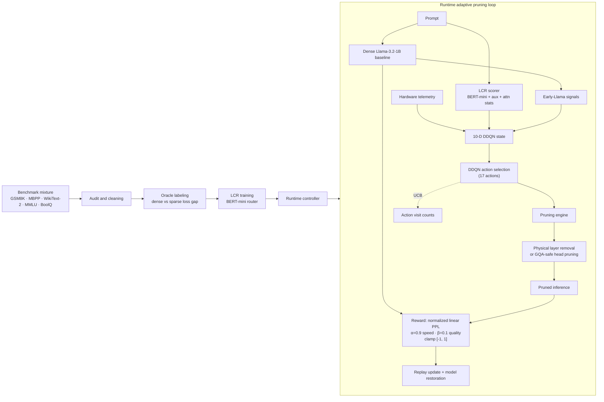
```mermaid
flowchart LR
    A[Benchmark mixture<br/>GSM8K · MBPP · WikiText-2 · MMLU · BoolQ] --> B[Audit and cleaning]
    B --> C[Oracle labeling<br/>dense vs sparse loss gap]
    C --> D[LCR training<br/>BERT-mini router]
    D --> E[Runtime controller]

    subgraph Runtime ["Runtime adaptive pruning loop"]
        F[Prompt] --> G[Dense Llama-3.2-1B baseline]
        F --> H[LCR scorer<br/>BERT-mini + aux + attn stats]
        G --> I[Early-Llama signals]
        J[Hardware telemetry] --> K["10-D DDQN state"]
        H --> K
        I --> K
        K --> L["DDQN action selection<br/>(17 actions)"]
        L --> M[Pruning engine]
        M --> N["Physical layer removal<br/>or GQA-safe head pruning"]
        N --> O[Pruned inference]
        G --> P["Reward: normalized linear PPL<br/>α=0.9 speed · β=0.1 quality<br/>clamp [-1, 1]"]
        O --> P
        P --> Q[Replay update + model restoration]
        L -.->|UCB| R[Action visit counts]
    end

    E --> Runtime
```

---

## Methodology

This section follows the structure of the thesis methodology chapter.

### Dataset Construction

The project uses a five-source public benchmark mixture designed to cover diverse prompt types:

| Source     |      Count | Rationale                                       |
| ---------- | ---------: | ----------------------------------------------- |
| GSM8K      |      2,000 | Arithmetic and multi-step reasoning sensitivity |
| MBPP       |      2,000 | Code-generation prompts with syntax sensitivity |
| WikiText-2 |      2,000 | Redundancy-rich narrative language modeling     |
| MMLU       |      2,000 | Mixed-domain reasoning and multiple choice      |
| BoolQ      |      2,000 | Passage-grounded binary question answering      |
| **Total**  | **10,000** |                                                 |

**Construction pipeline:**

1. `build_lcr_mixture_dataset.py` streams and assembles the prompt set from Hugging Face datasets.
2. `audit_lcr_mixture_dataset.py` filters malformed, duplicate, or low-value rows and writes JSON audit reports.
3. The canonical cleaned file is `lcr_mixture.final.csv`.

Two scales were used during development:

- **Pilot**: 5k target → 4,374 usable rows after cleaning.
- **Final**: 10k target → 8,974 usable rows after cleaning.

### Oracle Sensitivity Labeling

Oracle labels are not generic "prompt difficulty" scores. They are **observed degradation of Llama-3.2-1B under specified pruning actions**, giving the label a clear operational meaning.

**Protocol:**

For each prompt, the oracle pipeline (`oracle_labeler.py`) performs:

1. One **dense teacher-forcing pass** → dense loss $\ell_D$, dense perplexity $\text{PPL}_D$.
2. One or more **sparse teacher-forcing passes** under fixed pruning configurations → sparse loss $\ell_S$, sparse perplexity $\text{PPL}_S$.

The principal label is the **non-negative loss gap**:

$$\Delta \ell = \max(0,\; \ell_S - \ell_D)$$

This is preferred over a raw perplexity gap because it corresponds to a log-perplexity ratio and avoids the heavy-tailed instability from exponentiated differences.

**Multi-method composite labels:**

The current oracle uses two sparse configurations:

- Attention-head pruning at 30%
- Transformer-layer skipping at 25%

Each prompt receives per-method gaps and a composite raw sensitivity score. Raw values are normalized into $[0,1]$ using **percentile-clipped min-max scaling** (5th and 95th percentile bounds):

$$y = \mathrm{clip\_normalize}(\Delta \ell)$$

Sidecar metadata records backbone model, sparse configurations, normalization bounds, sequence length, and runtime for full reproducibility.

### Learned Complexity Router

The LCR is a fine-tuned `prajjwal1/bert-mini` that produces a prompt-sensitivity score in $[0,1]$, replacing earlier heuristic proxies based on prompt length and regex-derived complexity.

**Architecture:**

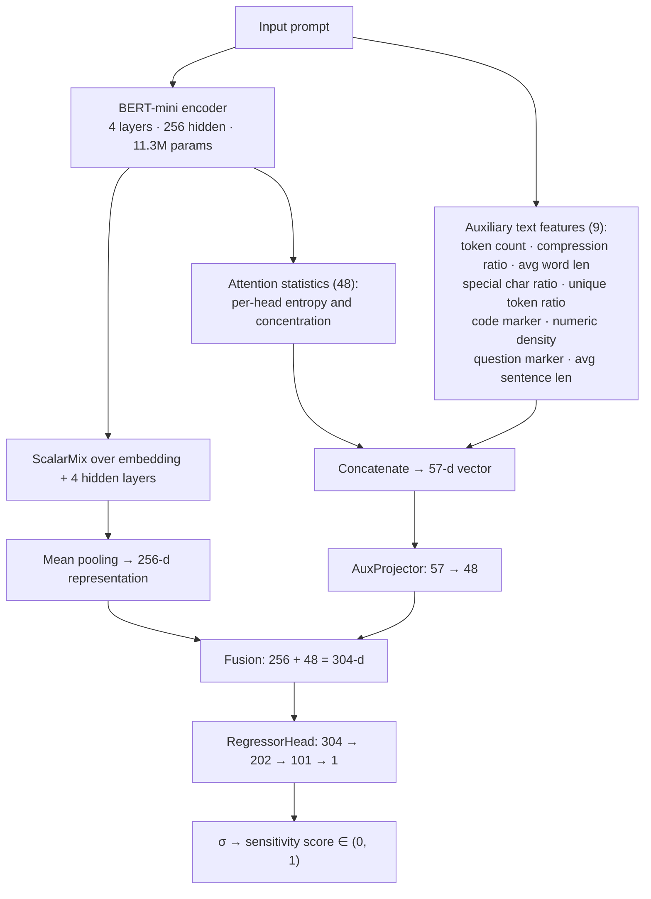
```mermaid
flowchart TD
    A[Input prompt] --> B["BERT-mini encoder<br/>4 layers · 256 hidden · 11.3M params"]
    B --> C[ScalarMix over embedding + 4 hidden layers]
    C --> D["Mean pooling → 256-d representation"]

    A --> E["Auxiliary text features (9):<br/>token count · compression ratio · avg word len<br/>special char ratio · unique token ratio<br/>code marker · numeric density<br/>question marker · avg sentence len"]
    B --> F["Attention statistics (48):<br/>per-head entropy and concentration"]
    E --> G["Concatenate → 57-d vector"]
    F --> G
    G --> H["AuxProjector: 57 → 48"]
    D --> I["Fusion: 256 + 48 = 304-d"]
    H --> I
    I --> J["RegressorHead: 304 → 202 → 101 → 1"]
    J --> K["σ → sensitivity score ∈ (0, 1)"]
```

**Key design decisions:**

- The router uses **internal representational signals** (attention entropy and concentration from BERT-mini) in addition to surface text statistics. This is a methodological improvement because prompt sensitivity cannot be fully captured by lexical features alone.
- Input truncation at 128 tokens aligns with oracle truncation to prevent train-test distribution mismatch.
- If the trained checkpoint is absent, the system falls back to a heuristic proxy based on compression ratio and prompt length. The fallback ensures operational robustness but is not part of the reported contribution.

**Selected checkpoint** (`Training Report/MiniBERT Train 20`):

| Metric                   | Value            |
| ------------------------ | ---------------- |
| Held-out MSE             | 0.03997          |
| Held-out $R^2$           | 0.4950           |
| Held-out Spearman $\rho$ | 0.7009           |
| 3-bin accuracy           | 65.13%           |
| 95% CI for Spearman      | [0.6722, 0.7265] |

**Training configuration:**

| Parameter                    | Value                            |
| ---------------------------- | -------------------------------- |
| Backbone                     | `prajjwal1/bert-mini`            |
| Max sequence length          | 128                              |
| Fused input dimension        | 304                              |
| Dropout                      | 0.20                             |
| Batch size                   | 48                               |
| Epochs                       | 50 (patience 20)                 |
| Learning rate                | $4 \times 10^{-5}$               |
| Backbone LR factor           | 0.20                             |
| Weight decay                 | 0.03                             |
| Label smoothing              | 0.01                             |
| Source-balanced oversampling | Enabled                          |
| Loss                         | Huber/SmoothL1 ($\delta = 0.15$) |

### DDQN Pruning Controller

The controller is a **Double Deep Q-Network** (DDQN). Compared with standard DQN, DDQN reduces Q-value overestimation by separating action selection from target evaluation.

**State vector (10-D):**

| Dim | Feature                               | Source           |
| --- | ------------------------------------- | ---------------- |
| 1   | CPU utilization                       | `psutil`         |
| 2   | Available system memory               | `psutil`         |
| 3   | Battery percentage                    | `psutil`         |
| 4   | GPU availability                      | NVML             |
| 5   | Free GPU memory                       | NVML             |
| 6   | GPU utilization                       | NVML             |
| 7   | LCR sensitivity score                 | BERT-mini router |
| 8   | Layer-0 hidden-state norm             | Llama backbone   |
| 9   | Layer-0 attention-entropy proxy       | Llama backbone   |
| 10  | Layer-0 attention-concentration proxy | Llama backbone   |

This state design is central to the methodology. The controller observes hardware pressure, prompt sensitivity, and early representation behavior jointly, allowing the policy to condition on all three.

**Action space (17 discrete actions):**

Every intensity maps to a **mechanically distinct** outcome for Llama-3.2-1B (16 layers, 8 KV heads), eliminating duplicate actions that would waste exploratory capacity and confuse the RL policy.

| Actions                           | Intensities                                     | Physical effect           |
| --------------------------------- | ----------------------------------------------- | ------------------------- |
| `none`                            | —                                               | No pruning                |
| `transformer_layers` (10 actions) | 6%, 12%, 19%, 25%, 31%, 38%, 44%, 50%, 56%, 62% | Remove 1–10 of 16 layers  |
| `attention_heads` (6 actions)     | 12.5%, 25%, 37.5%, 50%, 62.5%, 75%              | Remove 1–6 of 8 KV groups |

The action space is deliberately **layer-skip-heavy** because physical layer removal yields the largest inference speedups for autoregressive generation (which is memory-bandwidth bound, so head pruning has smaller latency impact). The head-pruning granularity covers the full safe range from removing 1 KV group (12.5%) to 6 KV groups (75%, keeping 2/8 minimum). FFN slicing was evaluated during development but consistently produced negative rewards due to high structural overhead and poor quality-speed tradeoffs, so it was removed from the system entirely.

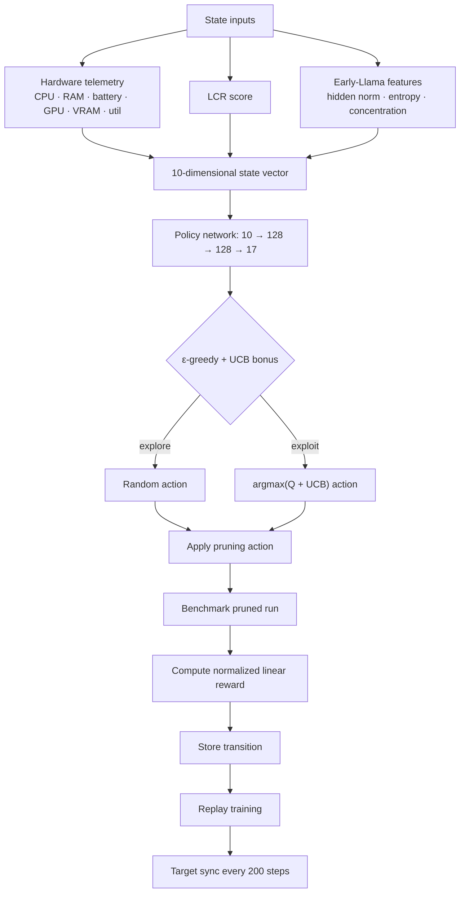
```mermaid
flowchart TD
    A[State inputs] --> B["Hardware telemetry<br/>CPU · RAM · battery · GPU · VRAM · util"]
    A --> C[LCR score]
    A --> D["Early-Llama features<br/>hidden norm · entropy · concentration"]
    B --> E["10-dimensional state vector"]
    C --> E
    D --> E
    E --> F["Policy network: 10 → 128 → 128 → 17"]
    F --> G{"ε-greedy + UCB bonus"}
    G -->|explore| H[Random action]
    G -->|exploit| I["argmax(Q + UCB) action"]
    H --> J[Apply pruning action]
    I --> J
    J --> K[Benchmark pruned run]
    K --> L[Compute normalized linear reward]
    L --> M[Store transition]
    M --> N[Replay training]
    N --> O[Target sync every 200 steps]
```

**Training hyperparameters:**

| Parameter                | Value                                                                                          |
| ------------------------ | ---------------------------------------------------------------------------------------------- |
| Policy/target MLP        | $10 \rightarrow 128 \rightarrow 128 \rightarrow 17$                                            |
| Replay buffer            | 10,000 transitions                                                                             |
| Batch size               | 32                                                                                             |
| Optimizer                | AdamW                                                                                          |
| Learning rate            | $1 \times 10^{-4}$                                                                             |
| Discount factor $\gamma$ | 0.95                                                                                           |
| Target network update    | Every 200 steps                                                                                |
| Epsilon schedule         | Dynamic: decays from 1.0 to 0.10 over the actual training-episode horizon; 0 during evaluation |
| Exploration bonus        | UCB1: $c \sqrt{\ln N / N_a}$ with $c = 1.0$                                                    |

### Dynamic Pruning Engine

The pruning engine is a concrete, reversible runtime component. All pruning operations are fully restored between episodes to ensure the baseline measurement is always from the unpruned model.

#### Physical transformer-layer removal

Layer skipping is implemented by **physically removing layers from the model's `nn.ModuleList`** and **sequentially reassigning `attn.layer_idx`** on all remaining layers. This is critical for correctness with Hugging Face's `DynamicCache`, which uses `layer_idx` as the sequential cache-slot index.

Previous implementations used identity-forward monkey-patching, which caused DynamicCache misalignment: skipped layers did not call `cache.update()`, so subsequent layers read incorrect KV-cache entries. This bug caused pruned inference to be **slower** than the baseline. Physical removal eliminates this issue entirely.

- The first and last layers are always protected from skipping.
- Layers are selected for removal by weight-magnitude importance ranking.
- After removal, all remaining layers receive reassigned `layer_idx` values (0, 1, 2, ...).
- The model's `config.num_hidden_layers` is updated to match.
- On restore, original layers are reinserted and original `layer_idx` values are recovered.

#### GQA-safe structural head pruning

Llama-3.2-1B uses grouped-query attention (32 query heads, 8 KV heads, group size 4). Head pruning must remove entire KV groups together with their associated query heads. The implementation (`pruners/structured_head_slicer.py`):

1. Ranks KV groups by aggregated importance (sum of associated query-head importances).
2. Removes the least-important groups by structurally rebuilding `q_proj`, `k_proj`, `v_proj`, and `o_proj` weight matrices.
3. Updates `num_heads`, `num_key_value_heads`, and `head_dim` attributes on every attention layer.
4. Saves and restores original weights on demand.

#### Importance scoring (zero-cost, weight-magnitude)

Previous versions used a hook-based calibration pass requiring ~64 forward passes through the backbone to collect activation statistics. This added latency and complexity.

The current implementation computes importance scores **entirely from weight magnitudes at model load time** — zero extra inference, zero hooks, zero calibration prompts. This is both faster and more reproducible.

**Head importance** (per Q-head, per layer):

- $I_h = \|W_Q^{(h)}\|_F + \|W_O^{(:,h)}\|_F + \frac{1}{g}\|W_K^{(\lfloor h/g \rfloor)}\|_F + \frac{1}{g}\|W_V^{(\lfloor h/g \rfloor)}\|_F$
- where $g$ = heads per KV group (4 for Llama-3.2-1B GQA)
- KV norms are divided by the group size to avoid inflating shared KV heads

**Layer importance** (per transformer layer):

- $I_\ell = \sum_{p \in \text{params}(\ell)} \|p\|_F$
- Total Frobenius norm of all parameters in the layer
- Lower norm → less important → safe to skip

This approach is well-established in the magnitude pruning literature and provides a deterministic, hardware-independent ranking that does not depend on the calibration prompt distribution.

### Benchmarking and Reward

Each episode benchmarks the same prompt under both the dense and pruned model. Measured outputs:

- **Inference time** (ms) — with CUDA synchronization barriers for accurate GPU timing
- **Throughput** (tokens/second)
- **Continuation perplexity** — prompt tokens are masked out, so quality reflects only the generated continuation

**Reward function:**

The reward uses a **normalized linear PPL formulation** with $[-1, 1]$ clamping:

$$R = \alpha \cdot \underbrace{\frac{\text{tok/s}_{\text{pruned}} - \text{tok/s}_{\text{base}}}{\text{tok/s}_{\text{base}} + \varepsilon}}_{\text{speed gain}} \;-\; \beta \cdot \underbrace{\frac{\text{PPL}_{\text{pruned}} - \text{PPL}_{\text{base}}}{\text{PPL}_{\text{base}} + \varepsilon}}_{\text{quality penalty}}$$

with $\alpha = 0.9$, $\beta = 0.1$, and clamping to $[-1, 1]$.

Both terms are ratio-normalized by baseline values, making them unit-free and bounded. The $[-1, 1]$ clamp ensures stable replay-buffer reward distributions. The higher speed-weight ($\alpha=0.9$) encourages the agent to explore aggressive pruning configurations while the proportional quality penalty preserves gradient-rich tradeoff learning.

**Reporting pipeline:**

The framework automatically produces per-run plots:

- Token speed comparison (baseline vs pruned)
- Inference time comparison
- Perplexity comparison
- Prompt-length vs perplexity correlation
- Controller overhead breakdown (stacked bar)
- VRAM / model-size comparison (two-panel chart: active model parameters before vs after pruning, and runtime peak VRAM)
- Reward progression
- Quality-vs-speed tradeoff scatter
- Action usage distribution
- Epsilon decay and cumulative reward

All charts are adaptive — figure sizes, marker sizes, tick intervals, and label density scale automatically with episode count so plots remain readable from 10 to 1 000+ episodes. The time-breakdown chart uses round-interval x-axis labels (100, 200, ...) instead of per-episode numbers.

Reports are stored under numbered folders in `Training Report/` and `Test Report/`. RL train/test runs now reserve those folders at command start and write artifacts there directly. Zero-shot accuracy charts are saved separately per split as before-vs-after pruning comparisons: `zeroshot_accuracy_compare_train.json/png` in the training run folder and `zeroshot_accuracy_compare_test.json/png` in the test run folder.

---

## Architecture Diagrams

### End-to-end system pipeline

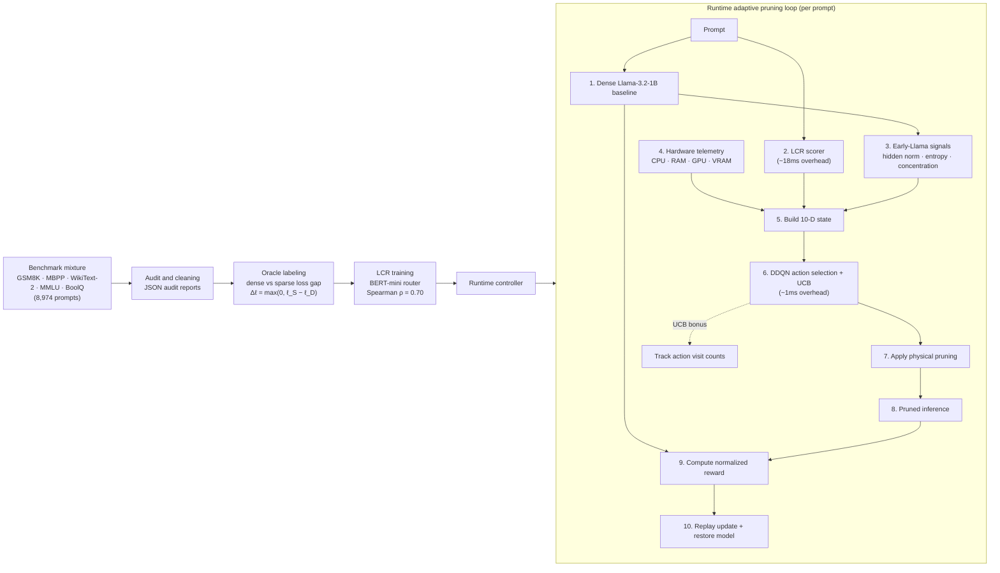
```mermaid
flowchart LR
    A["Benchmark mixture<br/>GSM8K · MBPP · WikiText-2 · MMLU · BoolQ<br/>(8,974 prompts)"] --> B["Audit and cleaning<br/>JSON audit reports"]
    B --> C["Oracle labeling<br/>dense vs sparse loss gap<br/>Δℓ = max(0, ℓ_S − ℓ_D)"]
    C --> D["LCR training<br/>BERT-mini router<br/>Spearman ρ = 0.70"]
    D --> E[Runtime controller]

    subgraph Runtime ["Runtime adaptive pruning loop (per prompt)"]
        direction TB
        F[Prompt] --> G["1. Dense Llama-3.2-1B baseline"]
        F --> H["2. LCR scorer<br/>(~18ms overhead)"]
        G --> I["3. Early-Llama signals<br/>hidden norm · entropy · concentration"]
        J["4. Hardware telemetry<br/>CPU · RAM · GPU · VRAM"] --> K["5. Build 10-D state"]
        H --> K
        I --> K
        K --> L["6. DDQN action selection + UCB<br/>(~1ms overhead)"]
        L --> M["7. Apply physical pruning"]
        M --> N["8. Pruned inference"]
        G --> P["9. Compute normalized reward"]
        N --> P
        P --> Q["10. Replay update + restore model"]
        L -.->|UCB bonus| F2["Track action visit counts"]
    end

    E --> Runtime
```

### LCR architecture detail

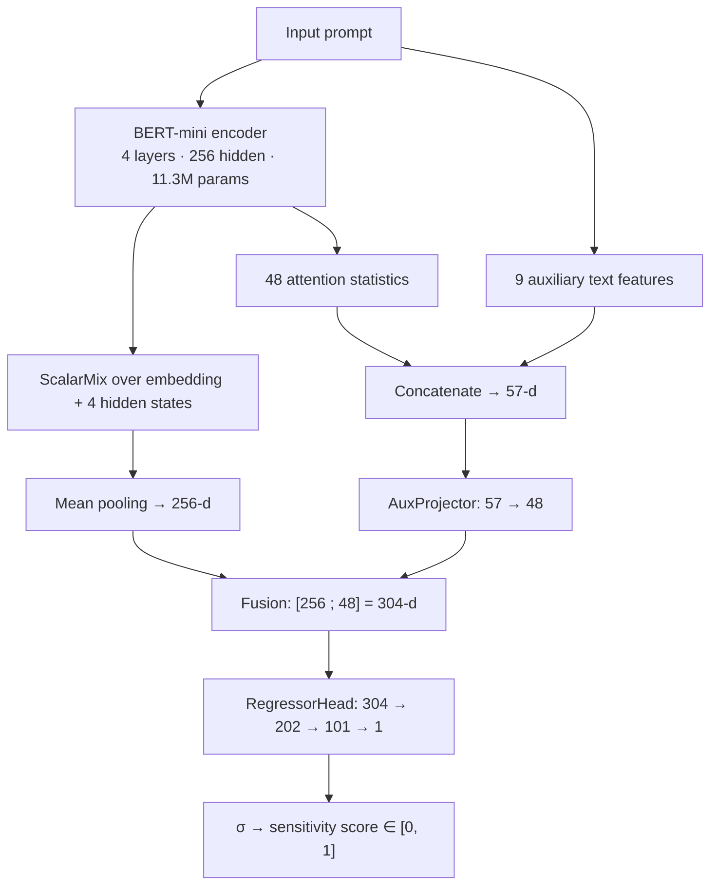
```mermaid
flowchart TD
    A[Input prompt] --> B["BERT-mini encoder<br/>4 layers · 256 hidden · 11.3M params"]
    B --> C["ScalarMix over embedding + 4 hidden states"]
    C --> D["Mean pooling → 256-d"]

    A --> E["9 auxiliary text features"]
    B --> F["48 attention statistics"]
    E --> G["Concatenate → 57-d"]
    F --> G
    G --> H["AuxProjector: 57 → 48"]
    D --> I["Fusion: [256 ; 48] = 304-d"]
    H --> I
    I --> J["RegressorHead: 304 → 202 → 101 → 1"]
    J --> K["σ → sensitivity score ∈ [0, 1]"]
```

### Pruning engine decision flow

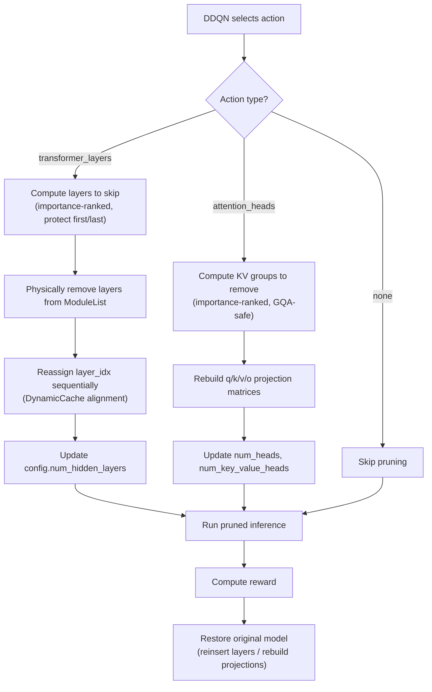
```mermaid
flowchart TD
    A["DDQN selects action"] --> B{Action type?}
    B -->|transformer_layers| C["Compute layers to skip<br/>(importance-ranked, protect first/last)"]
    B -->|attention_heads| D["Compute KV groups to remove<br/>(importance-ranked, GQA-safe)"]
    B -->|none| E["Skip pruning"]
    C --> F["Physically remove layers from ModuleList"]
    F --> G["Reassign layer_idx sequentially<br/>(DynamicCache alignment)"]
    G --> H["Update config.num_hidden_layers"]
    D --> I["Rebuild q/k/v/o projection matrices"]
    I --> J["Update num_heads, num_key_value_heads"]
    H --> K["Run pruned inference"]
    J --> K
    E --> K
    K --> L["Compute reward"]
    L --> M["Restore original model<br/>(reinsert layers / rebuild projections)"]
```

### Training data pipeline


```mermaid
flowchart LR
    A["HF Datasets API"] --> B["build_lcr_mixture_dataset.py<br/>Stream 5 benchmarks"]
    B --> C["lcr_mixture_10k.csv<br/>(raw)"]
    C --> D["audit_lcr_mixture_dataset.py<br/>Quality filter + dedup"]
    D --> E["lcr_mixture.final.csv<br/>(8,974 rows)"]
    E --> F["oracle_labeler.py<br/>Dense + sparse passes"]
    F --> G["oracle_lcr_10k_dual.csv<br/>Labels + metadata"]
    G --> H["train_minibert_lcr.py<br/>Train LCR router"]
    H --> I["checkpoints/<br/>minibert_lcr_backbone/ + minibert_lcr_head.pt"]
```

---

## Hardware and Software Environment

Experiments run on consumer-grade local hardware, consistent with the thesis goal of resource-aware local inference:

| Component | Specification              |
| --------- | -------------------------- |
| GPU       | NVIDIA RTX 4060, 8 GB VRAM |
| CPU       | AMD Ryzen 7 5700X          |
| RAM       | 16 GB DDR4                 |
| Storage   | NVMe SSD                   |
| OS        | Windows 10/11              |

**Software stack:** Python 3.9+, PyTorch 2.5 (CUDA 12.1), Hugging Face Transformers, Hugging Face Datasets, psutil, matplotlib, NVML (optional).

Model and dataset artifacts are cached locally through a project-scoped `HF_HOME`. Hugging Face authentication is read from environment variables or `.env`.

---

## Installation

### 1. Clone the repository

```bash
git clone https://github.com/asief-iqbal/Thesis.git
cd Thesis
```

### 2. Create and activate a virtual environment

```bash
python -m venv .venv
.venv\Scripts\activate        # Windows
# source .venv/bin/activate   # Linux/macOS
```

### 3. Install dependencies

```bash
pip install torch==2.5.1+cu121 torchvision==0.20.1+cu121 torchaudio==2.5.1+cu121 --index-url https://download.pytorch.org/whl/cu121
pip install transformers accelerate datasets psutil numpy matplotlib huggingface_hub lm-eval
```

### 4. Configure environment variables

Create `.env` with a Hugging Face token (required for gated Llama access):

```env
HUGGINGFACE_HUB_TOKEN=your_hf_token_here
```

---

## Quick Start

### Train the RL controller

When the dataset CSV contains a `Split` column (e.g., `Oracle_dataset.csv` with 8,000 train / 2,000 test rows), the system loads train and test splits directly — no `--split-ratio` needed:

```bash
python Adaptive_pruning.py --mode train --train-dataset Oracle_dataset.csv \
  --train-samples 8000 --episodes 8000 --test-samples 2000 \
  --checkpoint checkpoints/rl_policy.pt --device gpu
```

This trains on all 8,000 train-labeled rows, then auto-tests on 2,000 test-labeled rows. `Training Report/Train N/` is created as soon as the training command starts, `Test Report/Test N/` is created as soon as the held-out test phase starts, and all RL artifacts are written directly into those folders. Post-training zero-shot evaluation uses the train split, while post-testing zero-shot evaluation uses the test split.

For datasets **without** a `Split` column, use `--split-ratio` to create one:

```bash
python Adaptive_pruning.py --mode train --episodes 100 --checkpoint checkpoints/rl_policy.pt \
  --train-dataset "lcr_mixture.final.csv" --max-new-tokens 50 --device gpu --split-ratio 0.8
```

#### Choosing the backbone model

The default model is Llama 3.2 1B. To use Llama 2 7B instead, add `--model llama-2-7b`:

```bash
python Adaptive_pruning.py --mode train --train-dataset Oracle_dataset.csv \
  --train-samples 8000 --episodes 8000 --test-samples 2000 \
  --checkpoint checkpoints/rl_policy.pt --device gpu --model llama-2-7b
```

### Test the saved controller

```bash
python Adaptive_pruning.py --mode test --checkpoint checkpoints/rl_policy.pt \
  --test-dataset "Oracle_dataset.csv" --episodes 100 --max-new-tokens 50 --device gpu
```

To test with Llama 2 7B:

```bash
python Adaptive_pruning.py --mode test --checkpoint checkpoints/rl_policy.pt \
  --test-dataset "Oracle_dataset.csv" --episodes 100 --device gpu --model llama-2-7b
```

### Run benchmark-specific evaluation

```bash
python Adaptive_pruning.py --mode test --boolq --eval-samples 1000 --device gpu
python Adaptive_pruning.py --mode test --mmlu --eval-samples 1000 --device gpu
python Adaptive_pruning.py --mode test --wikitext2 --eval-samples 1000 --device gpu
```

### Train the LCR router

```bash
python oracle_labeler.py --input Oracle_dataset.csv --output oracle_lcr_labels.csv --samples 0 --sparse-configs "attention_heads:0.30,transformer_layers:0.25" --device gpu
python train_minibert_lcr.py --data Oracle_dataset.csv --labels-file oracle_lcr_labels.csv --label-columns "normalized_sensitivity" --output-dir checkpoints
```

The second command trains and evaluates the MiniBERT router over the full dataset while keeping the original dataset CSV unchanged. The trainer uses the dataset's existing `Split` column for train/test assignment and only reads labels from the separate oracle file.

### One-click full MiniBERT pipeline

```bash
python run_minibert_lcr_pipeline.py
```

This wrapper runs the full thesis-facing pipeline with tuned defaults for the final full-dataset run:

- Oracle labels kept in a separate file: `oracle_lcr_labels.csv`
- Composite oracle configs: `attention_heads:0.30,transformer_layers:0.25`
- Full dataset labeling: `--samples 0`
- Training defaults: `epochs=50`, `patience=20`, `batch_size=48`, `lr=4e-5`, `backbone_lr_factor=0.20`, `weight_decay=0.03`, `warmup_ratio=0.15`, `dropout=0.20`, `label_smooth=0.01`, `loss=huber`, `huber_delta=0.15`

For a dry run that prints both commands without executing them:

```bash
python run_minibert_lcr_pipeline.py --dry-run
```

For an explicit final-report command set without the wrapper:

```bash
python oracle_labeler.py --input Oracle_dataset.csv --output oracle_lcr_labels.csv --samples 0 --sparse-configs "attention_heads:0.30,transformer_layers:0.25" --device gpu
python train_minibert_lcr.py --data Oracle_dataset.csv --labels-file oracle_lcr_labels.csv --label-columns "normalized_sensitivity" --epochs 50 --patience 20 --batch-size 48 --lr 4e-5 --backbone-lr-factor 0.20 --weight-decay 0.03 --warmup-ratio 0.15 --dropout 0.20 --label-smooth 0.01 --loss huber --huber-delta 0.15 --output-dir checkpoints
```

### Force a specific pruning action (ablation)

```bash
python Adaptive_pruning.py --mode test --boolq --force-action transformer_layers:0.20 --eval-samples 500
python Adaptive_pruning.py --mode test --wikitext2 --force-action attention_heads:0.10 --eval-samples 500
```

---

## CLI Reference

Main entrypoint: `Adaptive_pruning.py`

| Argument           | Default                    | Description                                                                      |
| ------------------ | -------------------------- | -------------------------------------------------------------------------------- |
| `--mode`           | `test`                     | `train`, `test`, or `report`                                                     |
| `--model`          | `llama-3.2-1b`             | Backbone LLM: `llama-3.2-1b` or `llama-2-7b`                                     |
| `--checkpoint`     | `checkpoints/rl_policy.pt` | Save/load path for the RL policy                                                 |
| `--episodes`       | `50`                       | Number of train or test episodes; also sets the train-mode epsilon-decay horizon |
| `--max-new-tokens` | `50`                       | Maximum generated continuation length                                            |
| `--train-dataset`  | `Prompt Dataset Train.csv` | Training CSV path                                                                |
| `--test-dataset`   | `Prompt Dataset Test.csv`  | Test CSV path                                                                    |
| `--train-samples`  | `5000`                     | Number of training prompts                                                       |
| `--test-samples`   | `100`                      | Number of test prompts in auto-test flows                                        |
| `--split-ratio`    | `1.0`                      | Train/test split ratio (ignored when CSV has a `Split` column)                   |
| `--device`         | `auto`                     | `cpu`, `gpu`, or `auto`                                                          |
| `--wikitext2`      | `False`                    | WikiText-2 comparative evaluation                                                |
| `--boolq`          | `False`                    | BoolQ zero-shot evaluation                                                       |
| `--hellaswag`      | `False`                    | HellaSwag zero-shot evaluation                                                   |
| `--mmlu`           | `False`                    | MMLU zero-shot evaluation                                                        |
| `--eval-samples`   | `1000`                     | Samples for benchmark-specific evaluation                                        |
| `--eval-seed`      | `42`                       | Random seed for evaluation sampling                                              |
| `--force-action`   | `None`                     | Force `target:intensity` instead of RL                                           |
| `--lm-eval`        | `False`                    | Run lm-eval-harness tasks                                                        |
| `--eval-tasks`     | `boolq,hellaswag,mmlu`     | lm-eval task list                                                                |

---

## Repository Layout

### Core scripts

| Path                           | Role                                                                                |
| ------------------------------ | ----------------------------------------------------------------------------------- |
| `Adaptive_pruning.py`          | RL training, testing, reporting, benchmark evaluation                               |
| `model_loader.py`              | Llama loading, pruning application/restoration, weight-magnitude importance ranking |
| `lcr_minibert.py`              | Runtime LCR scorer (loads BERT-mini backbone + regression head)                     |
| `oracle_labeler.py`            | Dense-vs-sparse oracle sensitivity labeling                                         |
| `train_minibert_lcr.py`        | LCR training script                                                                 |
| `run_minibert_lcr_pipeline.py` | One-click oracle labeling + MiniBERT LCR training pipeline                          |
| `run_ablation_studies.py`      | Automated ablation studies runner (reward sweep, framework ablations)               |
| `build_lcr_mixture_dataset.py` | Benchmark mixture builder (streams from HF datasets)                                |
| `audit_lcr_mixture_dataset.py` | Dataset audit, cleaning, and quality reporting                                      |
| `build_oracle_dataset.py`      | Oracle dataset builder (streamed benchmark prompts to CSV)                          |
| `nlp_analyzer.py`              | NLP analysis utilities                                                              |
| `dashboard_gen.py`             | Automated dashboard and report generation                                           |

### Pruning primitives (`pruners/`)

| Module                      | Role                                                                   |
| --------------------------- | ---------------------------------------------------------------------- |
| `layer_skipper.py`          | Physical layer removal with DynamicCache-safe `layer_idx` reassignment |
| `structured_head_slicer.py` | GQA-safe structural head pruning (rebuilds projection matrices)        |
| `head_pruner.py`            | Activation-mask-based head pruning (legacy, used for calibration)      |

### Data files

| File                    | Description                                   |
| ----------------------- | --------------------------------------------- |
| `lcr_mixture.final.csv` | Canonical cleaned 8,974-row benchmark mixture |
| `lcr_mixture_10k.csv`   | Raw 10k-target mixture before cleaning        |
| `lcr_mixture_5k.csv`    | Pilot 5k-target mixture                       |

### Model checkpoints (`checkpoints/`)

| Path                     | Content                                                       |
| ------------------------ | ------------------------------------------------------------- |
| `minibert_lcr_backbone/` | Exported BERT-mini backbone (config, tokenizer, weights)      |
| `minibert_lcr_head.pt`   | Exported regression head + auxiliary projector + scalar mixer |
| `rl_policy.pt`           | Saved DDQN policy checkpoint                                  |

### Reports

| Directory                           | Content                                                    |
| ----------------------------------- | ---------------------------------------------------------- |
| `Training Report/Train N/`          | RL training runs (metrics JSON, report TXT, plots)         |
| `Training Report/MiniBERT Train N/` | LCR training runs (model checkpoints, metrics, report)     |
| `Test Report/Test N/`               | RL evaluation runs (metrics, zero-shot accuracy, plots)    |
| `Test Report/MiniBERT Test N/`      | LCR test evaluation runs (held-out metrics, per-source)    |
| `Ablation Report/`                  | Ablation study results (reward sweep, framework ablations) |

---

## Experimental Results

### LCR Results

The LCR is the strongest and most mature contribution. The project progressed from a heuristic prompt-length score to a trained reusable router grounded in dense-vs-sparse backbone behavior.

**Selected checkpoint performance** (`MiniBERT Train 20`):

| Metric                   | Value            |
| ------------------------ | ---------------- |
| Held-out MSE             | 0.03997          |
| Held-out $R^2$           | 0.4950           |
| Held-out Spearman $\rho$ | **0.7009**       |
| 3-bin accuracy           | 65.13%           |
| 95% CI for Spearman      | [0.6722, 0.7265] |

**Per-source held-out performance:**

| Source     | Difficulty | Notes                                         |
| ---------- | ---------- | --------------------------------------------- |
| WikiText-2 | Easiest    | High lexical redundancy, stable sensitivity   |
| BoolQ      | Easy       | Passage grounding provides context            |
| MMLU       | Moderate   | Diverse domains                               |
| MBPP       | Hard       | Syntax-sensitive, sparse lexical cues         |
| GSM8K      | Hardest    | Mathematical reasoning, fragile under pruning |

The Spearman correlation near 0.70 indicates the router learns meaningful **ranking structure** over prompt sensitivity, which is what matters for downstream RL action selection (relative ordering matters more than absolute calibration).

### RL Controller Results

With the corrected pruning engine (physical layer removal, normalized linear PPL reward, updated action space), the controller now achieves measurable inference speedups:

**Aggregate results (Train 37, 100 episodes → Test 19, 20 episodes):**

| Metric                | Training (incl. exploration)   | Test (ε=0, exploitation) |
| --------------------- | ------------------------------ | ------------------------ |
| Avg baseline latency  | 2,721.62 ms                    | 2,554.96 ms              |
| Avg pruned latency    | 2,355.98 ms                    | **1,737.04 ms**          |
| **Inference speedup** | **13.4%**                      | **32.0%**                |
| Avg baseline PPL      | 2.06                           | 2.43                     |
| Avg pruned PPL        | 206.12 (skewed by exploration) | 46.83 (one 560 outlier)  |
| Avg reward            | +0.044                         | —                        |
| Preferred action      | layer skip 35–50%              | layer skip 50% (20/20)   |

**Per-action breakdown (training):**

| Action           | Avg Latency (ms) | Avg PPL | Avg Reward | Samples |
| ---------------- | ---------------: | ------: | ---------: | ------: |
| layer skip 12%   |            2,285 |    1.20 | **+0.120** |       4 |
| layer skip 35%   |            2,127 |    3.11 | **+0.266** |      17 |
| layer skip 40%   |            2,146 |    2.67 | **+0.252** |       4 |
| layer skip 50%   |            1,821 |   10.47 | **+0.239** |      24 |
| head pruning 30% |            3,803 |    3.77 |     −0.278 |       2 |

**Representative test episodes (ε=0):**

| Episode | Baseline (ms) | Pruned (ms) | Speedup | PPL base → pruned |
| ------- | ------------: | ----------: | ------: | ----------------- |
| 4       |         2,676 |       1,774 | **34%** | 1.79 → 8.13       |
| 9       |         2,489 |       1,640 | **34%** | 2.69 → 4.55       |
| 14      |         2,789 |       1,630 | **42%** | 1.63 → 10.21      |
| 18      |         2,301 |       1,227 | **47%** | 1.64 → 10.47      |
| 20      |         2,517 |       1,918 | **24%** | 1.89 → 2.25       |

These results confirm that the physical layer-removal fix produces **real, measurable speedups of 24–47%** during exploitation — solving the previous problem where pruned inference was slower than the baseline.

### Ablation: Cross-Method Sensitivity

An important empirical finding from the oracle labeling stage:

| Correlation     | Head pruning vs Layer skipping |
| --------------- | ------------------------------ |
| Spearman $\rho$ | ≈ 0.172                        |
| Pearson $r$     | ≈ 0.214                        |
| $R^2$           | ≈ 0.046                        |

Head-pruning sensitivity and layer-skipping sensitivity are **only weakly correlated** ($R^2 \approx 0.05$). This is expected: the two pruning operators stress fundamentally different model components (attention heads vs entire transformer layers), so prompt sensitivity to one method is only a weak predictor of sensitivity to the other. This justifies:

1. Multi-method oracle labeling rather than a single difficulty score.
2. The layer-skip-heavy action space (layer removal is more effective for latency).
3. Future work on multi-output routing (separate scores per pruning type).

### Ablation Studies

Five ablation experiments validate the key design choices. All experiments are automated via `run_ablation_studies.py` and output to `Ablation Report/`.

**Interleaved execution design.** Studies 2A–2D use interleaved episode execution: for each prompt, all variants run in a randomly-shuffled order, and a 20-inference warmup precedes the loop. This eliminates the systematic timing bias that would arise from sequential variant execution (later variants benefit from warmer OS/GPU caches, inflating their measured tok/s). Each agent uses an independent private RNG seeded identically, so exploration decisions remain reproducible.

**Live hardware + live baseline.** The ablation runner now mirrors the normal train/test controller flow. Prompt-static signals (prompt PPL, LCR, early-Llama features) are precomputed once, but each episode measures an unpruned baseline live, samples live device telemetry at decision time, then benchmarks the pruned action live. This means the control run behaves like the real controller, while Studies 2A/2B differ only by removing state dimensions and Study 2C differs only by replacing the policy with uniform random actions.

#### Study 1 — Reward Function Sweep

Grid search over $\alpha \in \{0.5, 0.6, 0.7, 0.8, 0.9\}$ and $\beta \in \{0.1, 0.2, 0.3, 0.4, 0.5\}$ (25 combinations). For each $(\alpha, \beta)$, a fresh DDQN is trained for 100 episodes. Metrics: average reward, mean pruned PPL, mean speedup. Produces heatmaps and a radar chart showing the optimal ridge and why $\alpha=0.9, \beta=0.1$ was chosen.

#### Study 2A — Remove LCR Score from State Vector

Trains with a 9-dimensional state (6 hardware + 3 early-Llama, removing the LCR sensitivity index). Demonstrates the LCR router's contribution to action selection quality.

#### Study 2B — Remove Hardware Telemetry from State Vector

Trains with a 4-dimensional state (1 LCR + 3 early-Llama only). Shows that hardware awareness matters for resource-adaptive pruning.

#### Study 2C — Random Action Baseline

Replaces the DDQN with uniform random action selection over the same episode budget and prompts. Quantifies the RL controller's contribution, analogous to RAP's $\text{RAP}^{-\text{RL}}$ ablation.

#### Study 2D — Action Space Sensitivity

Compares the full 17-action space against reduced variants: layer-only (11 actions) and head-only (7 actions). Shows that the broader action space is necessary to cover diverse prompt sensitivities.

**Usage:**

```bash
# Run all ablation studies
python run_ablation_studies.py

# Run specific studies only
python run_ablation_studies.py --studies 1,2a,2c

# Customize sample count
python run_ablation_studies.py --samples 100 --device auto
```

Results are saved to `Ablation Report/` with per-study subdirectories, JSON metrics, convergence plots, heatmaps, and a unified summary report (`ablation_summary.txt`).

---

## Discussion

### What this project contributes

| Component                   | Status        | Contribution level                                           |
| --------------------------- | ------------- | ------------------------------------------------------------ |
| Benchmark mixture pipeline  | Complete      | Reproducible, audited, multi-domain                          |
| Oracle sensitivity labeling | Complete      | Operational definition, multi-method, loss-gap based         |
| Learned Complexity Router   | **Strongest** | Spearman 0.70, deployed at runtime, reusable                 |
| Physical pruning engine     | Complete      | DynamicCache-correct, GQA-safe, fully reversible             |
| DDQN controller             | Functional    | **32% test-time speedup**, converges on effective layer skip |
| End-to-end integration      | Complete      | All components connected in a single pipeline                |

### Evolution from earlier design

| Earlier project state                         | Current project state                                      |
| --------------------------------------------- | ---------------------------------------------------------- |
| Heuristic prompt-complexity score             | Trained BERT-mini LCR deployed at runtime                  |
| Ad hoc prompt pool                            | Audited five-source benchmark mixture (8,974 rows)         |
| Single sparse label                           | Multi-method oracle labeling with loss-gap normalization   |
| 7-feature controller state                    | 10-feature state with LCR + early-Llama signals            |
| Conceptual head pruning                       | GQA-safe structural head pruning                           |
| Identity-forward layer skipping               | **Physical layer removal** with DynamicCache alignment     |
| Log-PPL reward (over-compressed signal)        | **Normalized linear PPL reward** ($\alpha$=0.9, $\beta$=0.1, $[-1,1]$) |
| Limited logging                               | Per-episode metrics, plots, JSON artifacts, organized runs |

### Runtime overhead

| Component                 | Average time |
| ------------------------- | ------------ |
| LCR inference             | ~18 ms       |
| RL action selection       | ~1 ms        |
| Total controller overhead | ~19 ms       |

Controller overhead is included in total pruned latency reporting, ensuring honest accounting.

---

## Limitations and Future Work

1. **Single LCR score in state** — the repository supports multi-method label preparation, but the controller currently uses a single composite sensitivity score. A multi-output router feeding separate scores per pruning type is a natural extension.
2. **Head pruning latency impact** — autoregressive generation is memory-bandwidth-bound, so structural head pruning produces smaller latency gains than layer removal. The action space reflects this asymmetry.
3. **Policy stability** — the RL controller achieves speedups but reward shaping and policy regularization remain active research directions. Longer training runs and curriculum learning may improve stability.
4. **Consumer hardware only** — all experiments use a single RTX 4060 (8 GB). Behavior on different hardware configurations has not been characterized.
5. **Additional engine scaffolds** — 2:4 semi-structured sparsity, KV-cache compression, and torch.compile integration are present in the codebase but are not central to the reported results.

---

## Troubleshooting

### Hugging Face token issues

If Llama-3.2-1B fails to load, confirm `.env` contains a valid `HUGGINGFACE_HUB_TOKEN` and that your account has been granted access to `meta-llama/Llama-3.2-1B`.

### Missing GPU telemetry

If NVML is unavailable, GPU utilization falls back to `0.0`. The pipeline still runs but telemetry features are less informative for the controller.

### VRAM chart issues on CUDA

If training crashes while writing the per-episode VRAM chart, update to the latest version of `Adaptive_pruning.py`. The VRAM plot uses PyTorch CUDA device properties and expects the standard `total_memory` field when reading available GPU memory.

### Slow or unstable training

- Reduce `--episodes` and `--max-new-tokens`
- Use explicit dataset paths (`--train-dataset lcr_mixture.final.csv`)
- Ensure no other GPU workloads compete for VRAM

### LCR checkpoint fallback

If `checkpoints/minibert_lcr_backbone/` or `checkpoints/minibert_lcr_head.pt` are missing, the system falls back to a heuristic proxy. This keeps the pipeline operational but is not the reported model.

On Windows, the runtime scorer now resolves `checkpoints/minibert_lcr_backbone/` and `checkpoints/minibert_lcr_head.pt` to absolute local paths before calling Hugging Face loaders. This avoids repo-ID validation failures when the exported MiniBERT backbone is present locally.

---

## Citation

```bibtex
@misc{iqbal2026casrap,
  title   = {CASRAP: Context-Aware Structured Runtime Adaptive Pruning
             for Local LLM Inference},
  author  = {Asief Iqbal},
  year    = {2026},
  howpublished = {\url{https://github.com/asief-iqbal/Thesis}},
  note    = {Benchmark mixture pipeline, oracle sensitivity labeling,
             BERT-mini LCR, DDQN pruning controller, and reversible
             runtime pruning engine for the thesis implementation.}
}
```

## License

MIT License.
