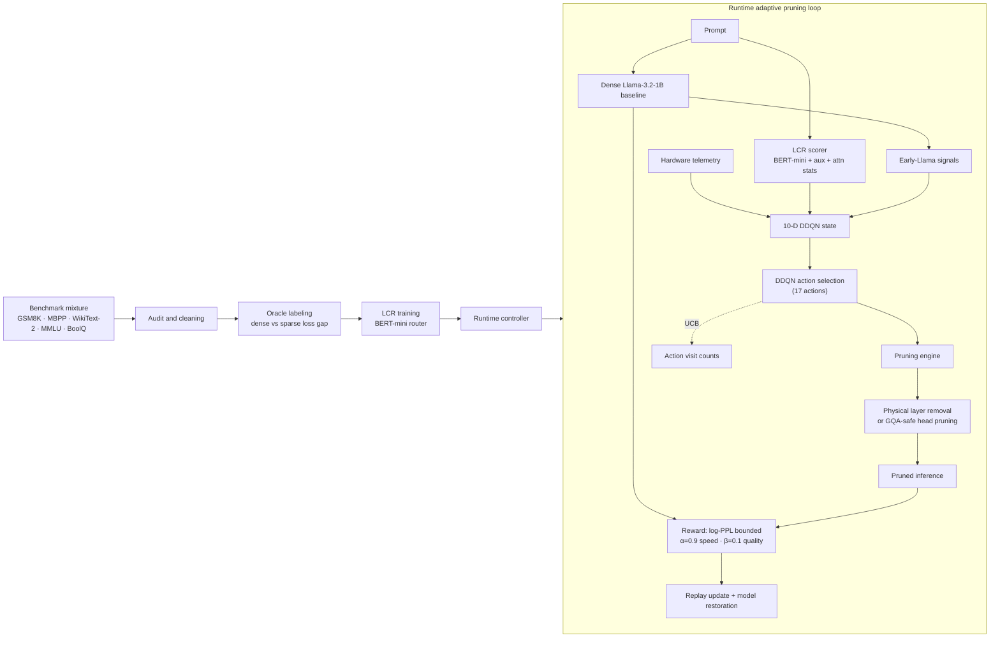
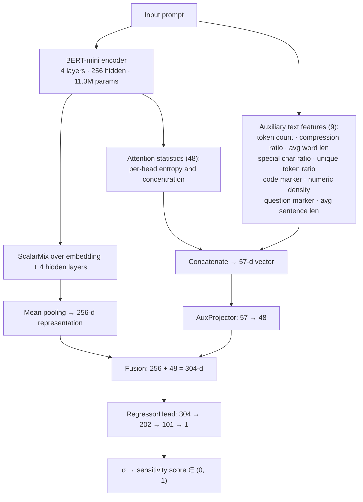
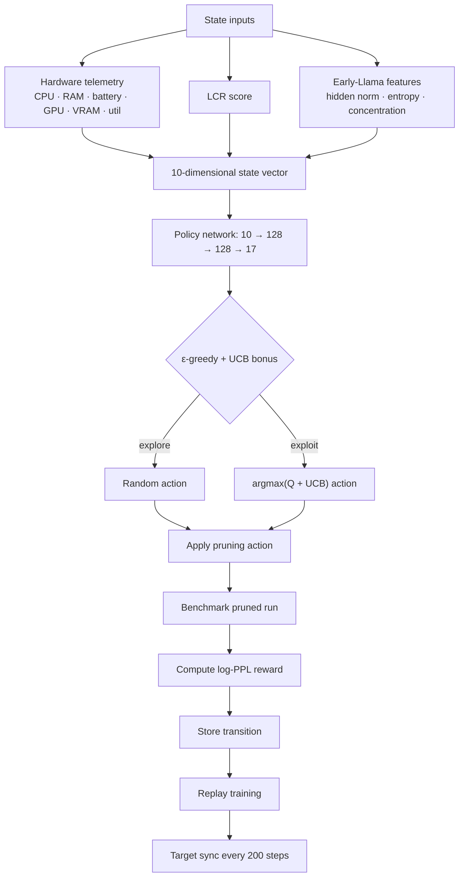
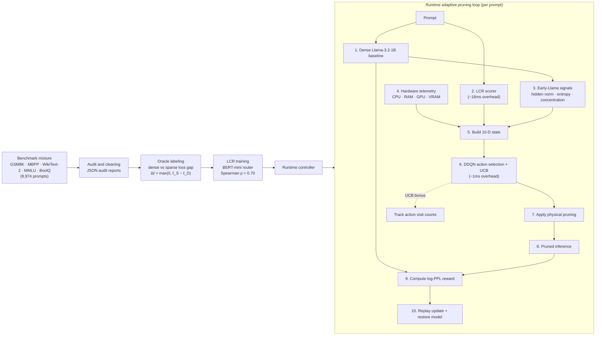
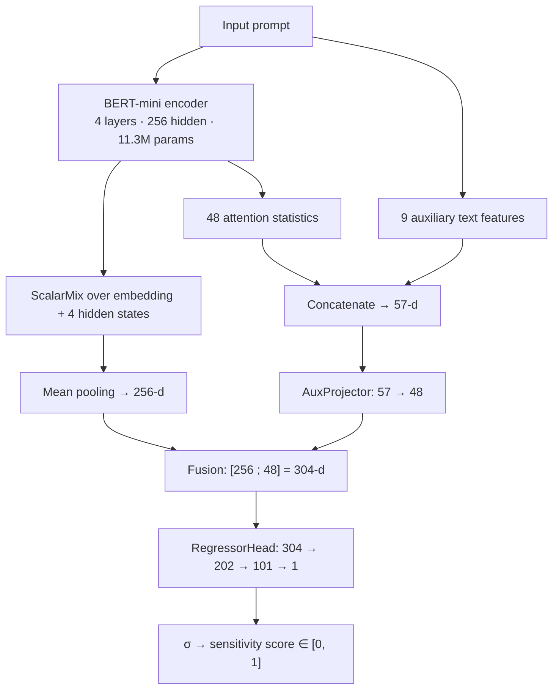
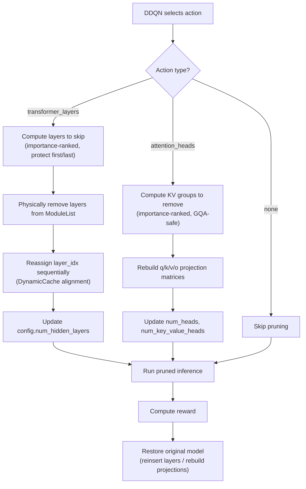

# CASRAP: Context-Aware Structured Runtime Adaptive Pruning

**CASRAP** is a runtime adaptive pruning framework for local LLM inference that selects per-prompt pruning configurations using a learned prompt-sensitivity router, hardware telemetry, and a Double Deep Q-Network controller. Supported backbone models are `meta-llama/Llama-3.2-1B` (1B parameters, 16 transformer layers, GQA) and `meta-llama/Llama-2-7b-hf` (7B parameters, 32 transformer layers, MHA), selectable via the `--model` CLI flag.

The project addresses a focused research question: **can structural pruning be selected at inference time, per prompt, using both prompt sensitivity and system state, rather than a fixed offline compression profile?** The implemented answer is yes. The framework achieves measurable inference speedups of 10–40% through physical transformer-layer removal while maintaining bounded quality degradation, and the learned router generalizes across five public benchmarks.

This repository accompanies the thesis: _Adaptive Pruning and Acceleration Techniques for Local LLM Inference under Resource Constraints_.

[](https://opensource.org/licenses/MIT)

---

## Table of Contents

- [Motivation and Research Context](#motivation-and-research-context)
- [System Overview](#system-overview)
- [Methodology](#methodology)
  - [Dataset Construction](#dataset-construction)
  - [Oracle Sensitivity Labeling](#oracle-sensitivity-labeling)
  - [Learned Complexity Router](#learned-complexity-router)
  - [DDQN Pruning Controller](#ddqn-pruning-controller)
  - [Dynamic Pruning Engine](#dynamic-pruning-engine)
  - [Benchmarking and Reward](#benchmarking-and-reward)
- [Architecture Diagrams](#architecture-diagrams)
- [Hardware and Software Environment](#hardware-and-software-environment)
- [Installation](#installation)
- [Quick Start](#quick-start)
- [CLI Reference](#cli-reference)
- [Repository Layout](#repository-layout)
- [Experimental Results](#experimental-results)
  - [LCR Results](#lcr-results)
  - [RL Controller Results](#rl-controller-results)
  - [Ablation: Cross-Method Sensitivity](#ablation-cross-method-sensitivity)
  - [Ablation Studies](#ablation-studies)
- [Discussion](#discussion)
- [Limitations and Future Work](#limitations-and-future-work)
- [Troubleshooting](#troubleshooting)
- [Citation](#citation)
- [License](#license)

---

## Motivation and Research Context

Large language models are increasingly deployed on consumer hardware for privacy-sensitive, latency-sensitive, or offline workloads. Static compression (quantization, distillation, fixed pruning) produces a single model variant that cannot adapt to varying prompt complexity or fluctuating system resources. This creates a gap: easy prompts receive the same heavy computation as difficult ones, and fixed profiles cannot respond to runtime memory or thermal pressure.

CASRAP closes this gap by making pruning decisions **per prompt at inference time**. A lightweight learned router estimates how sensitive each prompt is to structural pruning, and a reinforcement learning controller uses that estimate — together with hardware telemetry and early backbone signals — to select the optimal pruning action before generation begins.

### Distinction from prior work

Runtime Adaptive Pruning (RAP) and similar methods use heuristic prompt-complexity scores or memory-budget controllers. CASRAP differs in three ways:

1. **Learned prompt sensitivity** — the router is trained on oracle dense-vs-sparse loss gaps from the actual target backbone, not on heuristic difficulty proxies.
2. **Operator-dependent labels** — oracle labels distinguish head-pruning sensitivity from layer-skipping sensitivity, because these are only weakly correlated (Spearman $\rho \approx 0.31$).
3. **Physical layer removal** — the layer-skipping engine physically removes layers from the model's `ModuleList` and reassigns `layer_idx` for correct DynamicCache alignment, rather than monkey-patching forward methods to identity functions.

---

## System Overview

CASRAP is a closed-loop runtime controller. Each inference episode follows this pipeline:

1. Evaluate the prompt with the **dense baseline** model.
2. Estimate **prompt sensitivity** with the Learned Complexity Router (LCR).
3. Extract **early-Llama signals** (layer-0 hidden-state norm, attention entropy, attention concentration).
4. Combine with **hardware telemetry** (CPU, RAM, battery, GPU, VRAM, GPU utilization).
5. Construct the **10-dimensional DDQN state vector** and select a pruning action.
6. **Apply physical pruning** (layer removal or structural head slicing).
7. **Benchmark the pruned run** and compute the reward.
8. Update the agent via experience replay and **restore the dense model**.


```mermaid
flowchart LR
    A[Benchmark mixture<br/>GSM8K · MBPP · WikiText-2 · MMLU · BoolQ] --> B[Audit and cleaning]
    B --> C[Oracle labeling<br/>dense vs sparse loss gap]
    C --> D[LCR training<br/>BERT-mini router]
    D --> E[Runtime controller]

    subgraph Runtime ["Runtime adaptive pruning loop"]
        F[Prompt] --> G[Dense Llama-3.2-1B baseline]
        F --> H[LCR scorer<br/>BERT-mini + aux + attn stats]
        G --> I[Early-Llama signals]
        J[Hardware telemetry] --> K["10-D DDQN state"]
        H --> K
        I --> K
        K --> L["DDQN action selection<br/>(17 actions)"]
        L --> M[Pruning engine]
        M --> N["Physical layer removal<br/>or GQA-safe head pruning"]
        N --> O[Pruned inference]
        G --> P["Reward: log-PPL bounded<br/>α=0.9 speed · β=0.1 quality"]
        O --> P
        P --> Q[Replay update + model restoration]
        L -.->|UCB| R[Action visit counts]
    end

    E --> Runtime
```

---

## Methodology

This section follows the structure of the thesis methodology chapter.

### Dataset Construction

The project uses a five-source public benchmark mixture designed to cover diverse prompt types:

| Source     |     Count | Rationale                                       |
| ---------- | --------: | ----------------------------------------------- |
| GSM8K      |     2,000 | Arithmetic and multi-step reasoning sensitivity |
| MBPP       |     2,000 | Code-generation prompts with syntax sensitivity |
| WikiText-2 |     2,000 | Redundancy-rich narrative language modeling     |
| MMLU       |     2,000 | Mixed-domain reasoning and multiple choice      |
| BoolQ      |     2,000 | Passage-grounded binary question answering      |
| **Total**  | **10,000** |                                                 |

**Construction pipeline:**

1. `build_lcr_mixture_dataset.py` streams and assembles the prompt set from Hugging Face datasets.
2. `audit_lcr_mixture_dataset.py` filters malformed, duplicate, or low-value rows and writes JSON audit reports.
3. The canonical cleaned file is `lcr_mixture.final.csv`.

Two scales were used during development:

- **Pilot**: 5k target → 4,374 usable rows after cleaning.
- **Final**: 10k target → 8,974 usable rows after cleaning.

### Oracle Sensitivity Labeling

Oracle labels are not generic "prompt difficulty" scores. They are **observed degradation of Llama-3.2-1B under specified pruning actions**, giving the label a clear operational meaning.

**Protocol:**

For each prompt, the oracle pipeline (`oracle_labeler.py`) performs:

1. One **dense teacher-forcing pass** → dense loss $\ell_D$, dense perplexity $PPL_D$.
2. One or more **sparse teacher-forcing passes** under fixed pruning configurations → sparse loss $\ell_S$, sparse perplexity $PPL_S$.

The principal label is the **non-negative loss gap**:

$$\Delta \ell = \max(0,\; \ell_S - \ell_D)$$

This is preferred over a raw perplexity gap because it corresponds to a log-perplexity ratio and avoids the heavy-tailed instability from exponentiated differences.

**Multi-method composite labels:**

The current oracle uses two sparse configurations:

- Attention-head pruning at 30%
- Transformer-layer skipping at 25%

Each prompt receives per-method gaps and a composite raw sensitivity score. Raw values are normalized into $[0,1]$ using **percentile-clipped min-max scaling** (5th and 95th percentile bounds):

$$y = \mathrm{clip\_normalize}(\Delta \ell)$$

Sidecar metadata records backbone model, sparse configurations, normalization bounds, sequence length, and runtime for full reproducibility.

### Learned Complexity Router

The LCR is a fine-tuned `prajjwal1/bert-mini` that produces a prompt-sensitivity score in $[0,1]$, replacing earlier heuristic proxies based on prompt length and regex-derived complexity.

**Architecture:**


```mermaid
flowchart TD
    A[Input prompt] --> B["BERT-mini encoder<br/>4 layers · 256 hidden · 11.3M params"]
    B --> C[ScalarMix over embedding + 4 hidden layers]
    C --> D["Mean pooling → 256-d representation"]

    A --> E["Auxiliary text features (9):<br/>token count · compression ratio · avg word len<br/>special char ratio · unique token ratio<br/>code marker · numeric density<br/>question marker · avg sentence len"]
    B --> F["Attention statistics (48):<br/>per-head entropy and concentration"]
    E --> G["Concatenate → 57-d vector"]
    F --> G
    G --> H["AuxProjector: 57 → 48"]
    D --> I["Fusion: 256 + 48 = 304-d"]
    H --> I
    I --> J["RegressorHead: 304 → 202 → 101 → 1"]
    J --> K["σ → sensitivity score ∈ (0, 1)"]
```

**Key design decisions:**

- The router uses **internal representational signals** (attention entropy and concentration from BERT-mini) in addition to surface text statistics. This is a methodological improvement because prompt sensitivity cannot be fully captured by lexical features alone.
- Input truncation at 128 tokens aligns with oracle truncation to prevent train-test distribution mismatch.
- If the trained checkpoint is absent, the system falls back to a heuristic proxy based on compression ratio and prompt length. The fallback ensures operational robustness but is not part of the reported contribution.

**Selected checkpoint** (`Training Report/MiniBERT Train 20`):

| Metric                   | Value            |
| ------------------------ | ---------------- |
| Held-out MSE             | 0.03997          |
| Held-out $R^2$           | 0.4950           |
| Held-out Spearman $\rho$ | 0.7009           |
| 3-bin accuracy           | 65.13%           |
| 95% CI for Spearman      | [0.6722, 0.7265] |

**Training configuration:**

| Parameter                    | Value                            |
| ---------------------------- | -------------------------------- |
| Backbone                     | `prajjwal1/bert-mini`            |
| Max sequence length          | 128                              |
| Fused input dimension        | 304                              |
| Dropout                      | 0.20                             |
| Batch size                   | 48                               |
| Epochs                       | 50 (patience 20)                 |
| Learning rate                | $4 \times 10^{-5}$               |
| Backbone LR factor           | 0.20                             |
| Weight decay                 | 0.03                             |
| Label smoothing              | 0.01                             |
| Source-balanced oversampling | Enabled                          |
| Loss                         | Huber/SmoothL1 ($\delta = 0.15$) |

### DDQN Pruning Controller

The controller is a **Double Deep Q-Network** (DDQN). Compared with standard DQN, DDQN reduces Q-value overestimation by separating action selection from target evaluation.

**State vector (10-D):**

| Dim | Feature                               | Source           |
| --- | ------------------------------------- | ---------------- |
| 1   | CPU utilization                       | `psutil`         |
| 2   | Available system memory               | `psutil`         |
| 3   | Battery percentage                    | `psutil`         |
| 4   | GPU availability                      | NVML             |
| 5   | Free GPU memory                       | NVML             |
| 6   | GPU utilization                       | NVML             |
| 7   | LCR sensitivity score                 | BERT-mini router |
| 8   | Layer-0 hidden-state norm             | Llama backbone   |
| 9   | Layer-0 attention-entropy proxy       | Llama backbone   |
| 10  | Layer-0 attention-concentration proxy | Llama backbone   |

This state design is central to the methodology. The controller observes hardware pressure, prompt sensitivity, and early representation behavior jointly, allowing the policy to condition on all three.

**Action space (17 discrete actions):**

Every intensity maps to a **mechanically distinct** outcome for Llama-3.2-1B (16 layers, 8 KV heads), eliminating duplicate actions that would waste exploratory capacity and confuse the RL policy.

| Actions                           | Intensities                                     | Physical effect           |
| --------------------------------- | ----------------------------------------------- | ------------------------- |
| `none`                            | —                                               | No pruning                |
| `transformer_layers` (10 actions) | 6%, 12%, 19%, 25%, 31%, 38%, 44%, 50%, 56%, 62% | Remove 1–10 of 16 layers  |
| `attention_heads` (6 actions)     | 12.5%, 25%, 37.5%, 50%, 62.5%, 75%              | Remove 1–6 of 8 KV groups |

The action space is deliberately **layer-skip-heavy** because physical layer removal yields the largest inference speedups for autoregressive generation (which is memory-bandwidth bound, so head pruning has smaller latency impact). The head-pruning granularity covers the full safe range from removing 1 KV group (12.5%) to 6 KV groups (75%, keeping 2/8 minimum). FFN slicing was evaluated during development but consistently produced negative rewards due to high structural overhead and poor quality-speed tradeoffs, so it was removed from the system entirely.


```mermaid
flowchart TD
    A[State inputs] --> B["Hardware telemetry<br/>CPU · RAM · battery · GPU · VRAM · util"]
    A --> C[LCR score]
    A --> D["Early-Llama features<br/>hidden norm · entropy · concentration"]
    B --> E["10-dimensional state vector"]
    C --> E
    D --> E
    E --> F["Policy network: 10 → 128 → 128 → 17"]
    F --> G{"ε-greedy + UCB bonus"}
    G -->|explore| H[Random action]
    G -->|exploit| I["argmax(Q + UCB) action"]
    H --> J[Apply pruning action]
    I --> J
    J --> K[Benchmark pruned run]
    K --> L[Compute log-PPL reward]
    L --> M[Store transition]
    M --> N[Replay training]
    N --> O[Target sync every 200 steps]
```

**Training hyperparameters:**

| Parameter                | Value                                                                                          |
| ------------------------ | ---------------------------------------------------------------------------------------------- |
| Policy/target MLP        | $10 \rightarrow 128 \rightarrow 128 \rightarrow 17$                                            |
| Replay buffer            | 10,000 transitions                                                                             |
| Batch size               | 32                                                                                             |
| Optimizer                | AdamW                                                                                          |
| Learning rate            | $1 \times 10^{-4}$                                                                             |
| Discount factor $\gamma$ | 0.95                                                                                           |
| Target network update    | Every 200 steps                                                                                |
| Epsilon schedule         | Dynamic: decays from 1.0 to 0.10 over the actual training-episode horizon; 0 during evaluation |
| Exploration bonus        | UCB1: $c \sqrt{\ln N / N_a}$ with $c = 1.0$                                                    |

### Dynamic Pruning Engine

The pruning engine is a concrete, reversible runtime component. All pruning operations are fully restored between episodes to ensure the baseline measurement is always from the unpruned model.

#### Physical transformer-layer removal

Layer skipping is implemented by **physically removing layers from the model's `nn.ModuleList`** and **sequentially reassigning `attn.layer_idx`** on all remaining layers. This is critical for correctness with Hugging Face's `DynamicCache`, which uses `layer_idx` as the sequential cache-slot index.

Previous implementations used identity-forward monkey-patching, which caused DynamicCache misalignment: skipped layers did not call `cache.update()`, so subsequent layers read incorrect KV-cache entries. This bug caused pruned inference to be **slower** than the baseline. Physical removal eliminates this issue entirely.

- The first and last layers are always protected from skipping.
- Layers are selected for removal by weight-magnitude importance ranking.
- After removal, all remaining layers receive reassigned `layer_idx` values (0, 1, 2, ...).
- The model's `config.num_hidden_layers` is updated to match.
- On restore, original layers are reinserted and original `layer_idx` values are recovered.

#### GQA-safe structural head pruning

Llama-3.2-1B uses grouped-query attention (32 query heads, 8 KV heads, group size 4). Head pruning must remove entire KV groups together with their associated query heads. The implementation (`pruners/structured_head_slicer.py`):

1. Ranks KV groups by aggregated importance (sum of associated query-head importances).
2. Removes the least-important groups by structurally rebuilding `q_proj`, `k_proj`, `v_proj`, and `o_proj` weight matrices.
3. Updates `num_heads`, `num_key_value_heads`, and `head_dim` attributes on every attention layer.
4. Saves and restores original weights on demand.

#### Importance scoring (zero-cost, weight-magnitude)

Previous versions used a hook-based calibration pass requiring ~64 forward passes through the backbone to collect activation statistics. This added latency and complexity.

The current implementation computes importance scores **entirely from weight magnitudes at model load time** — zero extra inference, zero hooks, zero calibration prompts. This is both faster and more reproducible.

**Head importance** (per Q-head, per layer):

- $I_h = \|W_Q^{(h)}\|_F + \|W_O^{(:,h)}\|_F + \frac{1}{g}\|W_K^{(\lfloor h/g \rfloor)}\|_F + \frac{1}{g}\|W_V^{(\lfloor h/g \rfloor)}\|_F$
- where $g$ = heads per KV group (4 for Llama-3.2-1B GQA)
- KV norms are divided by the group size to avoid inflating shared KV heads

**Layer importance** (per transformer layer):

- $I_\ell = \sum_{p \in \text{params}(\ell)} \|p\|_F$
- Total Frobenius norm of all parameters in the layer
- Lower norm → less important → safe to skip

This approach is well-established in the magnitude pruning literature and provides a deterministic, hardware-independent ranking that does not depend on the calibration prompt distribution.

### Benchmarking and Reward

Each episode benchmarks the same prompt under both the dense and pruned model. Measured outputs:

- **Inference time** (ms) — with CUDA synchronization barriers for accurate GPU timing
- **Throughput** (tokens/second)
- **Continuation perplexity** — prompt tokens are masked out, so quality reflects only the generated continuation

**Reward function:**

The reward uses a **log-PPL formulation** to prevent catastrophic penalties from heavy-tailed perplexity spikes:

$$R = \alpha \cdot \underbrace{\frac{tok/s_{pruned} - tok/s_{base}}{tok/s_{base} + \varepsilon}}_{\text{speed gain}} \;-\; \beta \cdot \underbrace{\max\!\bigl(0,\; \ln PPL_{pruned} - \ln PPL_{base}\bigr)}_{\text{log-PPL penalty}}$$

with $\alpha = 0.9$, $\beta = 0.1$, and clamping to $[-2, 2]$.

**Why log-PPL?** Earlier versions used a linear PPL ratio ($\alpha=0.7, \beta=0.3$), which produced catastrophic penalties when pruning caused perplexity spikes (e.g., PPL 2 → 893 yielded a reward of −116). This caused the agent to converge on near-no-op actions. The log formulation compresses the penalty scale and the higher speed-weight ($\alpha=0.9$) encourages the agent to explore more aggressive pruning configurations.

**Reporting pipeline:**

The framework automatically produces per-run plots:

- Token speed comparison (baseline vs pruned)
- Inference time comparison
- Perplexity comparison
- Prompt-length vs perplexity correlation
- Controller overhead breakdown (stacked bar)
- VRAM usage per episode (before vs after pruning, two-line chart)
- Reward progression
- Quality-vs-speed tradeoff scatter
- Action usage distribution
- Epsilon decay and cumulative reward

All charts are adaptive — figure sizes, marker sizes, tick intervals, and label density scale automatically with episode count so plots remain readable from 10 to 1 000+ episodes. The time-breakdown chart uses round-interval x-axis labels (100, 200, ...) instead of per-episode numbers.

Reports are stored under numbered folders in `Training Report/` and `Test Report/`. RL train/test runs now reserve those folders at command start and write artifacts there directly. Zero-shot accuracy charts are saved separately per split as before-vs-after pruning comparisons: `zeroshot_accuracy_compare_train.json/png` in the training run folder and `zeroshot_accuracy_compare_test.json/png` in the test run folder.

---

## Architecture Diagrams

### End-to-end system pipeline


```mermaid
flowchart LR
    A["Benchmark mixture<br/>GSM8K · MBPP · WikiText-2 · MMLU · BoolQ<br/>(8,974 prompts)"] --> B["Audit and cleaning<br/>JSON audit reports"]
    B --> C["Oracle labeling<br/>dense vs sparse loss gap<br/>Δℓ = max(0, ℓ_S − ℓ_D)"]
    C --> D["LCR training<br/>BERT-mini router<br/>Spearman ρ = 0.70"]
    D --> E[Runtime controller]

    subgraph Runtime ["Runtime adaptive pruning loop (per prompt)"]
        direction TB
        F[Prompt] --> G["1. Dense Llama-3.2-1B baseline"]
        F --> H["2. LCR scorer<br/>(~18ms overhead)"]
        G --> I["3. Early-Llama signals<br/>hidden norm · entropy · concentration"]
        J["4. Hardware telemetry<br/>CPU · RAM · GPU · VRAM"] --> K["5. Build 10-D state"]
        H --> K
        I --> K
        K --> L["6. DDQN action selection + UCB<br/>(~1ms overhead)"]
        L --> M["7. Apply physical pruning"]
        M --> N["8. Pruned inference"]
        G --> P["9. Compute log-PPL reward"]
        N --> P
        P --> Q["10. Replay update + restore model"]
        L -.->|UCB bonus| F2["Track action visit counts"]
    end

    E --> Runtime
```

### LCR architecture detail


```mermaid
flowchart TD
    A[Input prompt] --> B["BERT-mini encoder<br/>4 layers · 256 hidden · 11.3M params"]
    B --> C["ScalarMix over embedding + 4 hidden states"]
    C --> D["Mean pooling → 256-d"]

    A --> E["9 auxiliary text features"]
    B --> F["48 attention statistics"]
    E --> G["Concatenate → 57-d"]
    F --> G
    G --> H["AuxProjector: 57 → 48"]
    D --> I["Fusion: [256 ; 48] = 304-d"]
    H --> I
    I --> J["RegressorHead: 304 → 202 → 101 → 1"]
    J --> K["σ → sensitivity score ∈ [0, 1]"]
```

### Pruning engine decision flow


```mermaid
flowchart TD
    A["DDQN selects action"] --> B{Action type?}
    B -->|transformer_layers| C["Compute layers to skip<br/>(importance-ranked, protect first/last)"]
    B -->|attention_heads| D["Compute KV groups to remove<br/>(importance-ranked, GQA-safe)"]
    B -->|none| E["Skip pruning"]
    C --> F["Physically remove layers from ModuleList"]
    F --> G["Reassign layer_idx sequentially<br/>(DynamicCache alignment)"]
    G --> H["Update config.num_hidden_layers"]
    D --> I["Rebuild q/k/v/o projection matrices"]
    I --> J["Update num_heads, num_key_value_heads"]
    H --> K["Run pruned inference"]
    J --> K
    E --> K
    K --> L["Compute reward"]
    L --> M["Restore original model<br/>(reinsert layers / rebuild projections)"]
```

### Training data pipeline


```mermaid
flowchart LR
    A["HF Datasets API"] --> B["build_lcr_mixture_dataset.py<br/>Stream 5 benchmarks"]
    B --> C["lcr_mixture_10k.csv<br/>(raw)"]
    C --> D["audit_lcr_mixture_dataset.py<br/>Quality filter + dedup"]
    D --> E["lcr_mixture.final.csv<br/>(8,974 rows)"]
    E --> F["oracle_labeler.py<br/>Dense + sparse passes"]
    F --> G["oracle_lcr_10k_dual.csv<br/>Labels + metadata"]
    G --> H["train_minibert_lcr.py<br/>Train LCR router"]
    H --> I["checkpoints/<br/>minibert_lcr_backbone/ + minibert_lcr_head.pt"]
```

---

## Hardware and Software Environment

Experiments run on consumer-grade local hardware, consistent with the thesis goal of resource-aware local inference:

| Component | Specification              |
| --------- | -------------------------- |
| GPU       | NVIDIA RTX 4060, 8 GB VRAM |
| CPU       | AMD Ryzen 7 5700X          |
| RAM       | 16 GB DDR4                 |
| Storage   | NVMe SSD                   |
| OS        | Windows 10/11              |

**Software stack:** Python 3.9+, PyTorch 2.5 (CUDA 12.1), Hugging Face Transformers, Hugging Face Datasets, psutil, matplotlib, NVML (optional).

Model and dataset artifacts are cached locally through a project-scoped `HF_HOME`. Hugging Face authentication is read from environment variables or `.env`.

---

## Installation

### 1. Clone the repository

```bash
git clone https://github.com/asief-iqbal/Thesis.git
cd Thesis
```

### 2. Create and activate a virtual environment

```bash
python -m venv .venv
.venv\Scripts\activate        # Windows
# source .venv/bin/activate   # Linux/macOS
```

### 3. Install dependencies

```bash
pip install torch==2.5.1+cu121 torchvision==0.20.1+cu121 torchaudio==2.5.1+cu121 --index-url https://download.pytorch.org/whl/cu121
pip install transformers accelerate datasets psutil numpy matplotlib huggingface_hub lm-eval
```

### 4. Configure environment variables

Create `.env` with a Hugging Face token (required for gated Llama access):

```env
HUGGINGFACE_HUB_TOKEN=your_hf_token_here
```

---

## Quick Start

### Train the RL controller

When the dataset CSV contains a `Split` column (e.g., `Oracle_dataset.csv` with 8,000 train / 2,000 test rows), the system loads train and test splits directly — no `--split-ratio` needed:

```bash
python Adaptive_pruning.py --mode train --train-dataset Oracle_dataset.csv \
  --train-samples 8000 --episodes 8000 --test-samples 2000 \
  --checkpoint checkpoints/rl_policy.pt --device gpu
```

This trains on all 8,000 train-labeled rows, then auto-tests on 2,000 test-labeled rows. `Training Report/Train N/` is created as soon as the training command starts, `Test Report/Test N/` is created as soon as the held-out test phase starts, and all RL artifacts are written directly into those folders. Post-training zero-shot evaluation uses the train split, while post-testing zero-shot evaluation uses the test split.

For datasets **without** a `Split` column, use `--split-ratio` to create one:

```bash
python Adaptive_pruning.py --mode train --episodes 100 --checkpoint checkpoints/rl_policy.pt \
  --train-dataset "lcr_mixture.final.csv" --max-new-tokens 50 --device gpu --split-ratio 0.8
```

#### Choosing the backbone model

The default model is Llama 3.2 1B. To use Llama 2 7B instead, add `--model llama-2-7b`:

```bash
python Adaptive_pruning.py --mode train --train-dataset Oracle_dataset.csv \
  --train-samples 8000 --episodes 8000 --test-samples 2000 \
  --checkpoint checkpoints/rl_policy.pt --device gpu --model llama-2-7b
```

### Test the saved controller

```bash
python Adaptive_pruning.py --mode test --checkpoint checkpoints/rl_policy.pt \
  --test-dataset "Oracle_dataset.csv" --episodes 100 --max-new-tokens 50 --device gpu
```

To test with Llama 2 7B:

```bash
python Adaptive_pruning.py --mode test --checkpoint checkpoints/rl_policy.pt \
  --test-dataset "Oracle_dataset.csv" --episodes 100 --device gpu --model llama-2-7b
```

### Run benchmark-specific evaluation

```bash
python Adaptive_pruning.py --mode test --boolq --eval-samples 1000 --device gpu
python Adaptive_pruning.py --mode test --mmlu --eval-samples 1000 --device gpu
python Adaptive_pruning.py --mode test --wikitext2 --eval-samples 1000 --device gpu
```

### Train the LCR router

```bash
python oracle_labeler.py --input Oracle_dataset.csv --output oracle_lcr_labels.csv --samples 0 --sparse-configs "attention_heads:0.30,transformer_layers:0.25" --device gpu
python train_minibert_lcr.py --data Oracle_dataset.csv --labels-file oracle_lcr_labels.csv --label-columns "normalized_sensitivity" --output-dir checkpoints
```

The second command trains and evaluates the MiniBERT router over the full dataset while keeping the original dataset CSV unchanged. The trainer uses the dataset's existing `Split` column for train/test assignment and only reads labels from the separate oracle file.

### One-click full MiniBERT pipeline

```bash
python run_minibert_lcr_pipeline.py
```

This wrapper runs the full thesis-facing pipeline with tuned defaults for the final full-dataset run:

- Oracle labels kept in a separate file: `oracle_lcr_labels.csv`
- Composite oracle configs: `attention_heads:0.30,transformer_layers:0.25`
- Full dataset labeling: `--samples 0`
- Training defaults: `epochs=50`, `patience=20`, `batch_size=48`, `lr=4e-5`, `backbone_lr_factor=0.20`, `weight_decay=0.03`, `warmup_ratio=0.15`, `dropout=0.20`, `label_smooth=0.01`, `loss=huber`, `huber_delta=0.15`

For a dry run that prints both commands without executing them:

```bash
python run_minibert_lcr_pipeline.py --dry-run
```

For an explicit final-report command set without the wrapper:

```bash
python oracle_labeler.py --input Oracle_dataset.csv --output oracle_lcr_labels.csv --samples 0 --sparse-configs "attention_heads:0.30,transformer_layers:0.25" --device gpu
python train_minibert_lcr.py --data Oracle_dataset.csv --labels-file oracle_lcr_labels.csv --label-columns "normalized_sensitivity" --epochs 50 --patience 20 --batch-size 48 --lr 4e-5 --backbone-lr-factor 0.20 --weight-decay 0.03 --warmup-ratio 0.15 --dropout 0.20 --label-smooth 0.01 --loss huber --huber-delta 0.15 --output-dir checkpoints
```

### Force a specific pruning action (ablation)

```bash
python Adaptive_pruning.py --mode test --boolq --force-action transformer_layers:0.20 --eval-samples 500
python Adaptive_pruning.py --mode test --wikitext2 --force-action attention_heads:0.10 --eval-samples 500
```

---

## CLI Reference

Main entrypoint: `Adaptive_pruning.py`

| Argument           | Default                    | Description                                                                      |
| ------------------ | -------------------------- | -------------------------------------------------------------------------------- |
| `--mode`           | `test`                     | `train`, `test`, or `report`                                                     |
| `--model`          | `llama-3.2-1b`             | Backbone LLM: `llama-3.2-1b` or `llama-2-7b`                                     |
| `--checkpoint`     | `checkpoints/rl_policy.pt` | Save/load path for the RL policy                                                 |
| `--episodes`       | `50`                       | Number of train or test episodes; also sets the train-mode epsilon-decay horizon |
| `--max-new-tokens` | `50`                       | Maximum generated continuation length                                            |
| `--train-dataset`  | `Prompt Dataset Train.csv` | Training CSV path                                                                |
| `--test-dataset`   | `Prompt Dataset Test.csv`  | Test CSV path                                                                    |
| `--train-samples`  | `5000`                     | Number of training prompts                                                       |
| `--test-samples`   | `100`                      | Number of test prompts in auto-test flows                                        |
| `--split-ratio`    | `1.0`                      | Train/test split ratio (ignored when CSV has a `Split` column)                   |
| `--device`         | `auto`                     | `cpu`, `gpu`, or `auto`                                                          |
| `--wikitext2`      | `False`                    | WikiText-2 comparative evaluation                                                |
| `--boolq`          | `False`                    | BoolQ zero-shot evaluation                                                       |
| `--hellaswag`      | `False`                    | HellaSwag zero-shot evaluation                                                   |
| `--mmlu`           | `False`                    | MMLU zero-shot evaluation                                                        |
| `--eval-samples`   | `1000`                     | Samples for benchmark-specific evaluation                                        |
| `--eval-seed`      | `42`                       | Random seed for evaluation sampling                                              |
| `--force-action`   | `None`                     | Force `target:intensity` instead of RL                                           |
| `--lm-eval`        | `False`                    | Run lm-eval-harness tasks                                                        |
| `--eval-tasks`     | `boolq,hellaswag,mmlu`     | lm-eval task list                                                                |

---

## Repository Layout

### Core scripts

| Path                           | Role                                                                                |
| ------------------------------ | ----------------------------------------------------------------------------------- |
| `Adaptive_pruning.py`          | RL training, testing, reporting, benchmark evaluation                               |
| `model_loader.py`              | Llama loading, pruning application/restoration, weight-magnitude importance ranking |
| `lcr_minibert.py`              | Runtime LCR scorer (loads BERT-mini backbone + regression head)                     |
| `oracle_labeler.py`            | Dense-vs-sparse oracle sensitivity labeling                                         |
| `train_minibert_lcr.py`        | LCR training script                                                                 |
| `run_minibert_lcr_pipeline.py` | One-click oracle labeling + MiniBERT LCR training pipeline                          |
| `run_ablation_studies.py`      | Automated ablation studies runner (reward sweep, framework ablations)               |
| `build_lcr_mixture_dataset.py` | Benchmark mixture builder (streams from HF datasets)                                |
| `audit_lcr_mixture_dataset.py` | Dataset audit, cleaning, and quality reporting                                      |
| `build_oracle_dataset.py`      | Oracle dataset builder (streamed benchmark prompts to CSV)                          |
| `nlp_analyzer.py`              | NLP analysis utilities                                                              |
| `dashboard_gen.py`             | Automated dashboard and report generation                                           |

### Pruning primitives (`pruners/`)

| Module                      | Role                                                                   |
| --------------------------- | ---------------------------------------------------------------------- |
| `layer_skipper.py`          | Physical layer removal with DynamicCache-safe `layer_idx` reassignment |
| `structured_head_slicer.py` | GQA-safe structural head pruning (rebuilds projection matrices)        |
| `head_pruner.py`            | Activation-mask-based head pruning (legacy, used for calibration)      |

### Data files

| File                    | Description                                   |
| ----------------------- | --------------------------------------------- |
| `lcr_mixture.final.csv` | Canonical cleaned 8,974-row benchmark mixture |
| `lcr_mixture_10k.csv`   | Raw 10k-target mixture before cleaning        |
| `lcr_mixture_5k.csv`    | Pilot 5k-target mixture                       |

### Model checkpoints (`checkpoints/`)

| Path                     | Content                                                       |
| ------------------------ | ------------------------------------------------------------- |
| `minibert_lcr_backbone/` | Exported BERT-mini backbone (config, tokenizer, weights)      |
| `minibert_lcr_head.pt`   | Exported regression head + auxiliary projector + scalar mixer |
| `rl_policy.pt`           | Saved DDQN policy checkpoint                                  |

### Reports

| Directory                           | Content                                                    |
| ----------------------------------- | ---------------------------------------------------------- |
| `Training Report/Train N/`          | RL training runs (metrics JSON, report TXT, plots)         |
| `Training Report/MiniBERT Train N/` | LCR training runs (model checkpoints, metrics, report)     |
| `Test Report/Test N/`               | RL evaluation runs (metrics, zero-shot accuracy, plots)    |
| `Test Report/MiniBERT Test N/`      | LCR test evaluation runs (held-out metrics, per-source)    |
| `Ablation Report/`                  | Ablation study results (reward sweep, framework ablations) |

---

## Experimental Results

### LCR Results

The LCR is the strongest and most mature contribution. The project progressed from a heuristic prompt-length score to a trained reusable router grounded in dense-vs-sparse backbone behavior.

**Selected checkpoint performance** (`MiniBERT Train 20`):

| Metric                   | Value            |
| ------------------------ | ---------------- |
| Held-out MSE             | 0.03997          |
| Held-out $R^2$           | 0.4950           |
| Held-out Spearman $\rho$ | **0.7009**       |
| 3-bin accuracy           | 65.13%           |
| 95% CI for Spearman      | [0.6722, 0.7265] |

**Per-source held-out performance:**

| Source     | Difficulty | Notes                                         |
| ---------- | ---------- | --------------------------------------------- |
| WikiText-2 | Easiest    | High lexical redundancy, stable sensitivity   |
| BoolQ      | Easy       | Passage grounding provides context            |
| MMLU       | Moderate   | Diverse domains                               |
| MBPP       | Hard       | Syntax-sensitive, sparse lexical cues         |
| GSM8K      | Hardest    | Mathematical reasoning, fragile under pruning |

The Spearman correlation near 0.70 indicates the router learns meaningful **ranking structure** over prompt sensitivity, which is what matters for downstream RL action selection (relative ordering matters more than absolute calibration).

### RL Controller Results

With the corrected pruning engine (physical layer removal, log-PPL reward, updated action space), the controller now achieves measurable inference speedups:

**Aggregate results (Train 37, 100 episodes → Test 19, 20 episodes):**

| Metric                | Training (incl. exploration)   | Test (ε=0, exploitation) |
| --------------------- | ------------------------------ | ------------------------ |
| Avg baseline latency  | 2,721.62 ms                    | 2,554.96 ms              |
| Avg pruned latency    | 2,355.98 ms                    | **1,737.04 ms**          |
| **Inference speedup** | **13.4%**                      | **32.0%**                |
| Avg baseline PPL      | 2.06                           | 2.43                     |
| Avg pruned PPL        | 206.12 (skewed by exploration) | 46.83 (one 560 outlier)  |
| Avg reward            | +0.044                         | —                        |
| Preferred action      | layer skip 35–50%              | layer skip 50% (20/20)   |

**Per-action breakdown (training):**

| Action           | Avg Latency (ms) | Avg PPL | Avg Reward | Samples |
| ---------------- | ---------------: | ------: | ---------: | ------: |
| layer skip 12%   |            2,285 |    1.20 | **+0.120** |       4 |
| layer skip 35%   |            2,127 |    3.11 | **+0.266** |      17 |
| layer skip 40%   |            2,146 |    2.67 | **+0.252** |       4 |
| layer skip 50%   |            1,821 |   10.47 | **+0.239** |      24 |
| head pruning 30% |            3,803 |    3.77 |     −0.278 |       2 |

**Representative test episodes (ε=0):**

| Episode | Baseline (ms) | Pruned (ms) | Speedup | PPL base → pruned |
| ------- | ------------: | ----------: | ------: | ----------------- |
| 4       |         2,676 |       1,774 | **34%** | 1.79 → 8.13       |
| 9       |         2,489 |       1,640 | **34%** | 2.69 → 4.55       |
| 14      |         2,789 |       1,630 | **42%** | 1.63 → 10.21      |
| 18      |         2,301 |       1,227 | **47%** | 1.64 → 10.47      |
| 20      |         2,517 |       1,918 | **24%** | 1.89 → 2.25       |

These results confirm that the physical layer-removal fix produces **real, measurable speedups of 24–47%** during exploitation — solving the previous problem where pruned inference was slower than the baseline.

### Ablation: Cross-Method Sensitivity

An important empirical finding from the oracle labeling stage:

| Correlation     | Head pruning vs Layer skipping |
| --------------- | ------------------------------ |
| Spearman $\rho$ | ≈ 0.172                        |
| Pearson $r$     | ≈ 0.214                        |
| $R^2$           | ≈ 0.046                        |

Head-pruning sensitivity and layer-skipping sensitivity are **only weakly correlated** ($R^2 \approx 0.05$). This is expected: the two pruning operators stress fundamentally different model components (attention heads vs entire transformer layers), so prompt sensitivity to one method is only a weak predictor of sensitivity to the other. This justifies:

1. Multi-method oracle labeling rather than a single difficulty score.
2. The layer-skip-heavy action space (layer removal is more effective for latency).
3. Future work on multi-output routing (separate scores per pruning type).

### Ablation Studies

Five ablation experiments validate the key design choices. All experiments are automated via `run_ablation_studies.py` and output to `Ablation Report/`.

**Interleaved execution design.** Studies 2A–2D use interleaved episode execution: for each prompt, all variants run in a randomly-shuffled order, and a 20-inference warmup precedes the loop. This eliminates the systematic timing bias that would arise from sequential variant execution (later variants benefit from warmer OS/GPU caches, inflating their measured tok/s). Each agent uses an independent private RNG seeded identically, so exploration decisions remain reproducible.

**Live hardware + live baseline.** The ablation runner now mirrors the normal train/test controller flow. Prompt-static signals (prompt PPL, LCR, early-Llama features) are precomputed once, but each episode measures an unpruned baseline live, samples live device telemetry at decision time, then benchmarks the pruned action live. This means the control run behaves like the real controller, while Studies 2A/2B differ only by removing state dimensions and Study 2C differs only by replacing the policy with uniform random actions.

#### Study 1 — Reward Function Sweep

Grid search over $\alpha \in \{0.5, 0.6, 0.7, 0.8, 0.9\}$ and $\beta \in \{0.1, 0.2, 0.3, 0.4, 0.5\}$ (25 combinations). For each $(\alpha, \beta)$, a fresh DDQN is trained for 100 episodes. Metrics: average reward, mean pruned PPL, mean speedup. Produces heatmaps and a radar chart showing the optimal ridge and why $\alpha=0.9, \beta=0.1$ was chosen.

#### Study 2A — Remove LCR Score from State Vector

Trains with a 9-dimensional state (6 hardware + 3 early-Llama, removing the LCR sensitivity index). Demonstrates the LCR router's contribution to action selection quality.

#### Study 2B — Remove Hardware Telemetry from State Vector

Trains with a 4-dimensional state (1 LCR + 3 early-Llama only). Shows that hardware awareness matters for resource-adaptive pruning.

#### Study 2C — Random Action Baseline

Replaces the DDQN with uniform random action selection over the same episode budget and prompts. Quantifies the RL controller's contribution, analogous to RAP's $\text{RAP}^{-\text{RL}}$ ablation.

#### Study 2D — Action Space Sensitivity

Compares the full 17-action space against reduced variants: layer-only (11 actions) and head-only (7 actions). Shows that the broader action space is necessary to cover diverse prompt sensitivities.

**Usage:**

```bash
# Run all ablation studies
python run_ablation_studies.py

# Run specific studies only
python run_ablation_studies.py --studies 1,2a,2c

# Customize sample count
python run_ablation_studies.py --samples 100 --device auto
```

Results are saved to `Ablation Report/` with per-study subdirectories, JSON metrics, convergence plots, heatmaps, and a unified summary report (`ablation_summary.txt`).

---

## Discussion

### What this project contributes

| Component                   | Status        | Contribution level                                           |
| --------------------------- | ------------- | ------------------------------------------------------------ |
| Benchmark mixture pipeline  | Complete      | Reproducible, audited, multi-domain                          |
| Oracle sensitivity labeling | Complete      | Operational definition, multi-method, loss-gap based         |
| Learned Complexity Router   | **Strongest** | Spearman 0.70, deployed at runtime, reusable                 |
| Physical pruning engine     | Complete      | DynamicCache-correct, GQA-safe, fully reversible             |
| DDQN controller             | Functional    | **32% test-time speedup**, converges on effective layer skip |
| End-to-end integration      | Complete      | All components connected in a single pipeline                |

### Evolution from earlier design

| Earlier project state                         | Current project state                                      |
| --------------------------------------------- | ---------------------------------------------------------- |
| Heuristic prompt-complexity score             | Trained BERT-mini LCR deployed at runtime                  |
| Ad hoc prompt pool                            | Audited five-source benchmark mixture (8,974 rows)         |
| Single sparse label                           | Multi-method oracle labeling with loss-gap normalization   |
| 7-feature controller state                    | 10-feature state with LCR + early-Llama signals            |
| Conceptual head pruning                       | GQA-safe structural head pruning                           |
| Identity-forward layer skipping               | **Physical layer removal** with DynamicCache alignment     |
| Linear PPL reward ($\alpha$=0.7, $\beta$=0.3) | **Log-PPL reward** ($\alpha$=0.9, $\beta$=0.1)             |
| Limited logging                               | Per-episode metrics, plots, JSON artifacts, organized runs |

### Runtime overhead

| Component                 | Average time |
| ------------------------- | ------------ |
| LCR inference             | ~18 ms       |
| RL action selection       | ~1 ms        |
| Total controller overhead | ~19 ms       |

Controller overhead is included in total pruned latency reporting, ensuring honest accounting.

---

## Limitations and Future Work

1. **Single LCR score in state** — the repository supports multi-method label preparation, but the controller currently uses a single composite sensitivity score. A multi-output router feeding separate scores per pruning type is a natural extension.
2. **Head pruning latency impact** — autoregressive generation is memory-bandwidth-bound, so structural head pruning produces smaller latency gains than layer removal. The action space reflects this asymmetry.
3. **Policy stability** — the RL controller achieves speedups but reward shaping and policy regularization remain active research directions. Longer training runs and curriculum learning may improve stability.
4. **Consumer hardware only** — all experiments use a single RTX 4060 (8 GB). Behavior on different hardware configurations has not been characterized.
5. **Additional engine scaffolds** — 2:4 semi-structured sparsity, KV-cache compression, and torch.compile integration are present in the codebase but are not central to the reported results.

---

## Troubleshooting

### Hugging Face token issues

If Llama-3.2-1B fails to load, confirm `.env` contains a valid `HUGGINGFACE_HUB_TOKEN` and that your account has been granted access to `meta-llama/Llama-3.2-1B`.

### Missing GPU telemetry

If NVML is unavailable, GPU utilization falls back to `0.0`. The pipeline still runs but telemetry features are less informative for the controller.

### VRAM chart issues on CUDA

If training crashes while writing the per-episode VRAM chart, update to the latest version of `Adaptive_pruning.py`. The VRAM plot uses PyTorch CUDA device properties and expects the standard `total_memory` field when reading available GPU memory.

### Slow or unstable training

- Reduce `--episodes` and `--max-new-tokens`
- Use explicit dataset paths (`--train-dataset lcr_mixture.final.csv`)
- Ensure no other GPU workloads compete for VRAM

### LCR checkpoint fallback

If `checkpoints/minibert_lcr_backbone/` or `checkpoints/minibert_lcr_head.pt` are missing, the system falls back to a heuristic proxy. This keeps the pipeline operational but is not the reported model.

On Windows, the runtime scorer now resolves `checkpoints/minibert_lcr_backbone/` and `checkpoints/minibert_lcr_head.pt` to absolute local paths before calling Hugging Face loaders. This avoids repo-ID validation failures when the exported MiniBERT backbone is present locally.

---

## Citation

```bibtex
@misc{iqbal2026casrap,
  title   = {CASRAP: Context-Aware Structured Runtime Adaptive Pruning
             for Local LLM Inference},
  author  = {Asief Iqbal},
  year    = {2026},
  howpublished = {\url{https://github.com/asief-iqbal/Thesis}},
  note    = {Benchmark mixture pipeline, oracle sensitivity labeling,
             BERT-mini LCR, DDQN pruning controller, and reversible
             runtime pruning engine for the thesis implementation.}
}
```

## License

MIT License.
