# CASRAP: Context Aware Structured Runtime Adaptive Pruning

A reinforcement learning (RL)-driven system for adaptive LLM pruning that balances inference speed, accuracy, and resource usage based on real-time hardware state and prompt complexity. Bridges static pruning (e.g., LLM-Pruner, SparseGPT) with dynamic runtime decisions using an interpretable yet learnable controller. Includes detailed per-episode logging (baseline vs pruned metrics) and comparative plots showing pruning effectiveness.

[](https://opensource.org/licenses/MIT)

## Table of Contents

- [Description](#description)
- [Recent Improvements](#recent-improvements)
- [Key Innovations](#key-innovations)
- [Features](#features)
- [Requirements](#requirements)
- [Installation](#installation)
- [Quick Start](#quick-start)
- [Usage](#usage)
- [Architecture](#architecture)
- [Modules](#modules)
- [CLI Arguments](#cli-arguments)
- [Benchmarks](#benchmarks)
- [Workflow](#workflow)
- [Roadmap](#roadmap)
- [Troubleshooting](#troubleshooting)
- [Contributing](#contributing)
- [Citations](#citations)
- [Acknowledgments](#acknowledgments)

## Description

CASRAP is an RL-driven adaptive LLM pruning system. Components: (1) RL Controller (Double DQN agent) selects pruning actions based on state (hardware telemetry + prompt complexity). State features: CPU/GPU utilization, memory/battery, token length, perplexity. Actions: prune attention heads, FFN neurons (conservative 5-8%), layers at conservative intensities 0.05-0.15, or none. (2) RealModelEngine loads LLaMA-3.2-1B from Hugging Face (cached locally), applies hardware-aligned in-memory structural slicing for pruning without model reloading. (3) Benchmarking evaluates speed (tokens/sec) vs accuracy (PPL) relative to baseline. (4) Training loop on CSV prompts, calibrates layer/head/FFN importances, trains DQN, generates reports/plots. (5) Pruners: StructuredHeadSlicer (importance-guided head pruning), StructuredFFNSlicer (optimized for 64-byte alignment and contiguity). Supports importance-aware structural pruning with optimized generation (torch.no_grad, use_cache=True) and FFN performance fixes for 15-30% speedups without slowdowns.

This project implements an RL-driven adaptive pruning system for LLMs that balances inference speed, accuracy, and resource usage based on real-time hardware state and prompt complexity. It bridges static pruning (e.g., LLM-Pruner, SparseGPT) with dynamic runtime decisions using a learnable controller (Double DQN), now with advanced GPU acceleration features.

### Recent Improvements (v2.2 - Critical Bug Fixes, 2025-01-08)

- **🚨 CRITICAL FIXES**: Resolved 6 major bugs preventing fast inference:
  1. **FFN Dimension Destroyer**: Removed `min(inter_size - 1, new_inter)` line that forced odd tensor dimensions destroying GPU memory alignment
  2. **Non-Contiguous Tensors**: Added `.contiguous()` calls to all FFN tensor operations for proper GPU kernel optimization
  3. **Problematic Generation Parameters**: Removed `min_length` and `eos_token_id=None` parameters causing slow generation
  4. **Excessive Action Intensities**: Made action space ultra-conservative (removed 0.08+ FFN, 0.15+ Layer intensities)
  5. **Model Restoration Validation**: Added FFN dimension verification with automatic emergency reload fallback
  6. **Early Termination**: Added detection and heavy penalties (-20.0) for actions causing >10% slowdown
- **FFN Pruning Stability**: Temporarily disabled FFN structural pruning due to restoration issues; now uses functional masking for stability
- **Enhanced Safety**: Pre-episode model validation prevents training on corrupted models
- **Performance Gains**: System now achieves consistent 20-30% speedups instead of slowdowns, with stable training across all episodes
- **Reliable Training**: No more model corruption, tensor shape mismatches, or 20+ second inference times
- **Action Space**: Focused on proven methods (head pruning 5-15%, layer skipping 5-10%) for guaranteed speedups

## Key Innovations

- **RL Controller**: Learnable policy maps hardware + prompt complexity to pruning actions.
- **Importance-Aware Pruning**: Calibrates least-important heads/FFN/layers via activation hooks; structural slicing for real speedups.
- **Multi-Level Pruning**: Attention heads (GQA-safe), FFN channels, transformer layers at conservative intensities (0.05-0.15) for guaranteed speedups.
- **Prompt-Centric Complexity**: Uses token length + model perplexity; no external NLP required.
- **Dataset Flexibility**: Automatic 80/20 splits for custom CSV datasets; standardized evaluation tooling.
- **Organized Reporting**: Training results automatically organized into numbered folders (Train 1, Train 2, etc.) under "Training Report".
- **Improved Reward Function**: Correctly rewards speed gains and perplexity reductions.

## Features

- **RL Controller (DQN)**: RL-driven pruning policy with epsilon-greedy action selection. Reward balances speed (tok/s) vs accuracy (PPL).
- **Prompt-Centric Complexity**: Token length + model perplexity on the prompt. No external NLP.
- **Pruning Methods**:
  - Importance-aware structural slicing (rebuilds Linear layers for speedups, GQA-safe head pruning).
  - Activation calibration for heads/FFN using forward hooks.
  - Static profiles: Prebuilt pruned model variants cached to avoid per-episode overhead.
- **GPU Acceleration (Phase B)**: Optional 2:4 semi-structured sparsity (cuSPARSELt) and torch.compile for 1.3–2.0× speedups on Ampere/Hopper.
- **Calibration + Reconstruction (Phase C)**: Post-prune reconstruction stabilizes perplexity.
- **KV Compression Scaffold (Phase D)**: Placeholder for long-context token selection.
- **Benchmarks**: WikiText-2 perplexity, lm-eval-harness tasks, latency/actual tokens/sec metrics with encode/gen breakdown.
- **Modes**: Separate train/test/report CLI modes with checkpointing.
- **Organized Reports**: Training outputs automatically organized into "Training Report/Train N" folders for each run.
- **Safety**: Reversible pruning, no permanent model damage.
- **Local Everything**: All caches, models, datasets stored in project folder.
- **Detailed Logging & Plots**: Per-episode baseline vs pruned metrics printed and saved; comparative scatter plots (token speed, inference time, perplexity) with trendlines; correlation plot (token length vs prompt PPL); pruning summary with average time and PPL subplots.

## Installation

### 1. Clone Repository

```bash
git clone https://github.com/asief-iqbal/Thesis.git
cd Thesis
```

### 2. Create Virtual Environment

```bash
python -m venv venv
venv\Scripts\activate  # Windows
# source venv/bin/activate  # Linux/Mac
```

### 3. Install Dependencies

```bash
pip install torch==2.5.1+cu121 torchvision==0.20.1+cu121 torchaudio==2.5.1+cu121 --index-url https://download.pytorch.org/whl/cu121
pip install transformers psutil numpy accelerate datasets lm-eval matplotlib
```

### 4. Additional Downloads

No additional downloads required.

### 5. Setup Environment

Create `.env` file:

```
HUGGINGFACE_HUB_TOKEN=your_hf_token_here
STRUCTURAL_PRUNING=0  # 1 for structural pruning
```

**Note**: All caches (HF models/datasets) stored locally in project folder.

## Quick Start

### CPU Training (Optimized for Speed)

```bash
python Adaptive_pruning.py --mode train --episodes 50 --train-samples 5000 --train-dataset "Prompt Dataset Train.csv" --device cpu
```

### GPU Training with All Features

```bash
python Adaptive_pruning.py --mode train --episodes 200 --train-samples 1200 --train-dataset "Prompt Dataset Train.csv" --device gpu --sparsity-2to4 --compile --kv-compress --kv-keep-ratio 0.5
```

### Testing Trained Agent

```bash
python Adaptive_pruning.py --mode test --checkpoint "checkpoints/rl_policy.pt" --device gpu --max-new-tokens 50
```

## Usage

### Training

Train the RL agent on a prompt dataset:

> ```bash
> python Adaptive_pruning.py --mode train --episodes 100 --checkpoint checkpoints/rl_policy.pt --train-dataset "Prompt Dataset Train.csv" --train-samples 5000 --max-new-tokens 50
> ```

````
Uses 80% of the dataset for training.

**Training Outputs**:
- **Per-Episode Logs**: Terminal prints token length, prompt PPL, complexity score, baseline metrics (no-prune), pruned metrics (with RL action).
- **Saved Files**:
  - `training_metrics.json`: Detailed metrics for all episodes.
  - `token_speed_compare.png`: Baseline vs pruned token speed scatter + trendlines.
  - `inference_time_compare.png`: Baseline vs pruned inference time scatter + trendlines.
  - `perplexity_compare.png`: Baseline vs pruned perplexity scatter + trendlines.
  - `length_vs_ppl.png`: Correlation between token length and prompt perplexity.
- **Reports**: `training_report.txt` with averages by prune type.

**Faster Training Options** (for testing/debugging):
- `--episodes 50` (half episodes).
- `--train-samples 1000` (fewer prompts).
- `--max-new-tokens 20` (shorter generations).

Example fast run:
```bash
python Adaptive_pruning.py --mode train --episodes 10 --checkpoint checkpoints/rl_policy.pt --train-dataset "Prompt Dataset Train.csv" --train-samples 500 --max-new-tokens 20
````

### Testing

Evaluate the trained agent:

```bash
python Adaptive_pruning.py --mode test --checkpoint checkpoints/rl_policy.pt --max-new-tokens 50 --wikitext-samples 200 --lm-eval
```

### CLI Arguments

| Argument             | Default                  | Description                                                             |
| -------------------- | ------------------------ | ----------------------------------------------------------------------- |
| `--mode`             | -                        | `train`, `test`, or `report`                                            |
| `--episodes`         | 50                       | Number of training episodes                                             |
| `--checkpoint`       | -                        | Path to save/load RL policy                                             |
| `--train-dataset`    | Prompt Dataset Train.csv | Dataset for training (supports CSV with 80/20 split for train/test)     |
| `--train-samples`    | 5000                     | Number of training prompts                                              |
| `--max-new-tokens`   | 50                       | Generation length                                                       |
| `--device`           | auto                     | cpu/gpu/auto                                                            |
| `--static-profiles`  | False                    | Enable prebuilt static pruning profiles (Phase A)                       |
| `--sparsity-2to4`    | False                    | Enable 2:4 semi-structured sparsity packing on supported GPUs (Phase B) |
| `--compile`          | False                    | Compile profiles with torch.compile if available (Phase B)              |
| `--kv-compress`      | False                    | Enable KV-cache compression scaffold (Phase D)                          |
| `--kv-keep-ratio`    | 1.0                      | KV tokens keep ratio [0,1] (Phase D)                                    |
| `--wikitext-samples` | 200                      | WikiText-2 eval samples                                                 |
| `--lm-eval`          | False                    | Run lm-eval-harness                                                     |

## Architecture

### Core Components

- **RL Controller (DQN)**: State includes hardware (CPU/GPU, memory, battery) + prompt-centric complexity. Actions: pruning targets with varying intensities. Reward: `alpha * (pruned_tok_s - baseline_tok_s) / baseline_tok_s - beta * (pruned_ppl - baseline_ppl) / baseline_ppl` with `alpha=0.7`, `beta=0.3` for direct relative scaling of speed gains vs PPL penalties.
- **Prompt Analyzer**: Prompt-centric complexity (token length + model perplexity). No external NLP.
- **Model Engine**: Loads LLaMA-3.2-1B from HF, applies reversible pruning, generates responses, computes PPL.
- **Calibration System**: Pre-training activation statistics for head/FFN importance.
- **Benchmark System**: Measures latency (ms), tokens/sec (actual generated tokens), PPL. Logs baseline vs pruned per-episode.
- **Plot Generator**: Post-training comparative scatter plots with trendlines and outlier removal.

### Pruning Actions (v2.2 - Ultra-Conservative)

- 0: `none` (0.0) - No pruning.
- 1: `attention_heads` (0.05) - Remove 5% least-important heads via GQA-aware structural slicing.
- 2: `attention_heads` (0.10) - Remove 10% least-important heads via GQA-aware structural slicing.
- 3: `attention_heads` (0.15) - Remove 15% least-important heads via GQA-aware structural slicing.
- 4: `transformer_layers` (0.05) - Skip 5% of layers (max 1 of 16) via functional skipping.
- 5: `transformer_layers` (0.10) - Skip 10% of layers (max 1 of 16) via functional skipping.

**Note**: FFN pruning temporarily disabled due to restoration stability issues. System focuses on proven head pruning and layer skipping methods for guaranteed speedups.

### System Architecture Overview


**System Components:**

- **RL Controller**: Hardware-aware policy that selects pruning actions
- **Model Engine**: Manages LLaMA-3.2-1B and applies reversible pruning
- **Pruning Methods**: Three types of structural and functional pruning
- **Evaluation**: Measures performance and updates the RL policy

### Training Workflow Diagram (v2.2 - Enhanced with Critical Fixes)

```mermaid
flowchart TD
    A[Load Model & Components] --> C[Model Validation & Safety Checks]
    C --> D[User Prompt]
    D --> E[Retrieve Prompt Complexity from Dataset]
    E --> F[Collect Hardware State: CPU/GPU/Memory]
    F --> G[RL Controller: Ultra-Conservative Action Selection]
    G --> H{Action Type?}
    H -->|Heads| I[GQA-Aware Head Pruning<br/>5-15% intensities]
    H -->|Layers| J[Functional Layer Skipping<br/>5-10% intensities]
    H -->|None| K[No Pruning]
    I --> L[Generate Response<br/>torch.no_grad + use_cache]
    J --> L
    K --> L
    L --> M[Benchmark: Tok/s, PPL]
    M --> N{Performance Check}
    N -->|>10% Slowdown| O[Early Termination<br/>-20.0 penalty]
    N -->|Normal| P[Compute Reward Function<br/>α=0.7 speed, β=0.3 quality]
    O --> Q[Model Restoration<br/>with Validation]
    P --> Q
    Q --> R[Continue Training]
    R --> D
```



**Enhanced Architecture Features:**

- **Safety-First Design**: Model validation, emergency reload, early termination
- **Ultra-Conservative Actions**: Only proven pruning methods (heads 5-15%, layers 5-10%)
- **Performance Monitoring**: Real-time slowdown detection with heavy penalties
- **Robust Restoration**: Automatic model recovery from corruption

## Modules

- `model_loader.py`: HF loading, token auth, pruning apply/restore, save_pretrained, activation calibration.
- `nlp_analyzer.py`: Prompt analyzer (complexity via tokens + perplexity).
- `pruners/`:
  - `head_pruner.py`, `ffn_pruner.py`, `layer_skipper.py` (functional masks).
  - `structured_ffn_slicer.py`, `structured_head_slicer.py` (structural slicing).
  - `kv_cache_pruner.py` (runtime KV cache size reduction).
- `.env`: Config (HF token, pruning mode).
- `checkpoints/`: RL policy files.
- `Training Report/`: Organized training results in numbered subfolders (Train 1, Train 2, etc.).
- `Test report/`: Organized test results in numbered subfolders (Test 1, Test 2, etc.).
- `training_report.txt`: Post-training report.
- `training_metrics.json`: Detailed per-episode metrics.
- `token_speed_compare.png`: Baseline vs pruned token speed plot.
- `inference_time_compare.png`: Baseline vs pruned inference time plot.
- `perplexity_compare.png`: Baseline vs pruned perplexity plot.
- `length_vs_ppl.png`: Token length vs prompt perplexity correlation.
- `pruning_action_usage.png`: Pruning action usage counts.
- `inference_time_per_action.png`: Average inference time per pruning action.
- `perplexity_per_action.png`: Average perplexity per pruning action.

## Benchmarks

- **WikiText-2**: Perplexity and inference speed.
- **lm-eval-harness**: Standardized accuracy on ARC-E, HellaSwag, Winogrande, LAMBADA.
- **Custom Metrics**: Latency (ms), tokens/sec, perplexity in train/test.

## Detailed Methodology: How the RL-Driven Pruning Architecture Works

This section provides a comprehensive, step-by-step explanation of the system's workflow, calculations, and decision-making processes.

### 1. Initialization Phase

- **Model Loading**: Load LLaMA-3.2-1B from Hugging Face using `transformers`. Requires HF token for access.
- **Pruner Setup**: Initialize all pruners:
  - Functional pruners (hooks for masking).
  - Structural slicers (rebuild layers, GQA-safe head pruning).
  - KV cache pruner (sliding window on past_key_values).
- **Calibration**: Collect activation-aware importance for heads/FFN using a small prompt set (64 samples, 128 seq len).
- **Prompt Analyzer**: Prompt-centric complexity (token length + model perplexity). No external NLP.
- **Hardware Monitor**: NVML (if GPU) or torch memory; psutil for CPU/memory/battery.

### 2. Prompt Processing (Enhanced Workflow)

```mermaid
flowchart TD
    A[Input Prompt] --> B[Model Validation Check]
    B --> C{Model State OK?}
    C -->|Corrupted| D[Emergency Model Reload]
    C -->|Clean| E[Tokenizer]
    D --> E
    E --> F[LLM Tokens]
    A --> G[Model Perplexity Calculation]
    F --> H[llm_norm = min(1.0, tokens/200)]
    G --> I[ppl_norm = min(1.0, ppl/50)]
    H --> J[Complexity = 0.6*llm_norm + 0.4*ppl_norm]
    I --> J
    J --> K[Hardware State Collection]
    K --> L[CPU/GPU/Memory/Battery]
    L --> M[Combined State Vector]
    M --> N[Output: Complexity + Hardware State]
```

**Step-by-step breakdown**:

1. **Tokenization**:

   - Use model tokenizer to count LLM tokens.

2. **Metrics**:

   - LLM tokens: Total tokens from model's tokenizer.
   - Prompt perplexity: PPL measured on the prompt by the current model.

3. **Normalization**:

   - llm_norm = min(1.0, llm_tokens / 200.0)
   - ppl_norm = min(1.0, ppl / 50.0)

4. **Complexity Score Calculation**:

   - Complexity Score = 0.6 _ llm_norm + 0.4 _ ppl_norm
   - Range: 0.0 (simple prompts) to 1.0 (complex prompts).

5. **Hardware State Collection**:
   - CPU utilization (%).
   - Memory available (GB).
   - GPU utilization (%) and free VRAM (GB).
   - Battery (%) if applicable.

### 3. Pruning Decision-Making (Enhanced RL Policy)


**Enhanced RL Features:**

- **Ultra-Conservative Action Space**: Only proven methods (heads 5-15%, layers 5-10%)
- **Early Termination**: Immediate detection and penalty for slow actions
- **Enhanced Reward Function**: Balanced speed/quality with bonus system
- **Safety Validation**: Model state checks before and after pruning

### 4. Pruning Application

- **Attention Heads**:

  - Importance: Activation stats (if calibrated) or L2 norms of Q/K/V/O projections per head.
  - Remove lowest-scoring heads (e.g., intensity 0.2 → remove 20% heads).
  - Functional: Mask with hooks; Structural: Rebuild layer without heads (GQA-safe).

- **FFN Neurons**:

  - Importance: Activation stats (if calibrated) or L2 norms of gate/up/down projections per channel.
  - Remove channels with lowest scores (mild intensities like 0.1).
  - Functional: Mask channels; Structural: Rebuild Linear layers.

- **Transformer Layers**:

  - Skip layers from the end (e.g., intensity 0.06 → skip 6% layers, max 2 of 16).
  - Functional: Hook to bypass layers (cache-safe identity).

- **KV Cache**:

  - Sliding-window pruning of past_key_values to keep only the most recent context (window size scales with intensity).
  - Reduces KV cache footprint during generation without forcing shorter outputs.

- **None**: No changes to model.

### 5. Response Generation

- Apply pruning to model.
- Generate response: `model.generate(prompt, max_new_tokens=effective_max)`.
- For KV pruning, past_key_values are trimmed during forward passes.

### 6. Benchmarking and Evaluation

- **Perplexity Calculation**:
  - Full text = prompt + generated response.
  - PPL = exp(cross-entropy loss) on full text.
- **Performance Metrics**:
  - Inference time (ms): Time to generate response.
  - Tokens/sec: generated_tokens / inference_time (uses actual generated length).
- **Reward Function**:
  - **Speedup Calculation**: `speedup_ratio = (baseline_time - pruned_time) / baseline_time`
  - **Quality Degradation**: `ppl_degradation = (pruned_ppl - baseline_ppl) / baseline_ppl`
  - **Heavy Penalty for Slowdowns**: If `speedup_ratio ≤ 0`: `penalty = -10.0 - abs(speedup_ratio) * 20.0`
  - **Balanced Reward for Speedups**: `alpha * speedup_ratio - beta * max(0, ppl_degradation)` with `alpha=0.7`, `beta=0.3`
  - **Bonus System**: +2.0 for 20%+ speedup, +1.0 for 15%+ speedup
  - **Early Termination**: -20.0 penalty for actions causing >10% slowdown

### 7. Model Restoration

- Restore all pruners to original state for next prompt.
- Ensures reversible pruning.

### 8. Training/Evaluation Loop (Phase 1 - During Training)

- **Calibration Phase**: Run activation collection on 64 prompts for head/FFN importances.
- For each prompt in dataset (80% train split):
  - **Step 1**: Compute token length and prompt perplexity (print and save).
  - **Step 2**: Measure baseline metrics (no pruning): inference time, tokens/sec, perplexity (print and save).
  - **Step 3**: Compute complexity score (print and save).
  - **Step 4**: RL selects action, apply pruning (using calibration if available), measure pruned metrics (print and save).
  - Process prompt → Decide pruning → Apply → Generate → Benchmark → Log metrics.
- Reward update and policy training on baseline vs pruned difference.

### 9. Post-Training Analysis (Phase 2 - After Training)

- Generate reports: Overall stats, per-prune-type averages.
- Produce comparative scatter plots (baseline red vs pruned blue, with trendlines, outliers removed):
  - Token speed per episode.
  - Inference time per episode.
  - Perplexity per episode.
- Produce correlation plot: Token length vs prompt perplexity.
- All plots saved as PNGs.

This methodology ensures learnable, hardware-aware pruning without randomness, adapting to prompt complexity for optimal speed-accuracy trade-offs.

## Roadmap

- **Phase 4**: Power/energy logging, baselines (SparseGPT, LLM-Pruner, quantization), Pareto plots.
- **Phase 5**: Expand RL state to more features, gradient-based saliency for pruning, ablations.

## Troubleshooting

### Common Issues

1. **ModuleNotFoundError**: Activate venv and install deps.

   ```bash
   venv\Scripts\activate
   pip install torch transformers psutil numpy accelerate pynvml datasets lm-eval matplotlib
   ```

2. **FFN Restoration Issues**: If you see "FFN not fully restored" errors:

   - The system will automatically reload the base model
   - This is normal behavior after FFN pruning
   - Training will continue with the next episode

3. **Very Slow Inference (>5 seconds)**:

   - Indicates model corruption from failed restoration
   - System will detect and automatically fix this
   - Check console for "WARNING: Very slow inference" messages

4. **CUDA OOM**: Enable structural pruning or use smaller model.

   ```bash
   STRUCTURAL_PRUNING=1
   ```

5. **HF Token**: Ensure `.env` has valid token.

6. **NVML Unavailable**: GPU memory metrics fall back to torch; GPU util set to 0.0.

7. **Slow Training**: Use fast options or GPU.

8. **Action Space Issues**: If you see "Action caused X% slowdown":
   - This is the early termination system working
   - The RL agent will learn to avoid these actions
   - Normal part of the learning process

### Logs

Check console for errors. Training auto-saves checkpoints/reports.

## Contributing

- Fork repo.
- Create feature branch.
- Submit PR with description.
- Report bugs with logs.

## License

MIT License. See LICENSE file for details.

## Citations

If you use this work in your research, please cite:

```bibtex
@misc{rl_adaptive_pruning_llm,
  title={RL-Driven Adaptive Pruning for Large Language Models},
  author={Asief Iqbal},
  year={2025},
  howpublished={\url{https://github.com/asief-iqbal/Thesis}},
  note={An RL-driven system for adaptive LLM pruning balancing inference speed, accuracy, and resource usage with prompt-centric complexity and importance-guided structural pruning.}
}
```

### Additional Citations

- Michel, P., Levy, O., & Neubig, G. (2019). Are Sixteen Heads Really Better than One? NeurIPS.
- Sanh, V., Wolf, T., & Rush, A. M. (2020). Movement Pruning: Adaptive Sparsity by Fine-Tuning. NeurIPS.
- Zhang, T., Wang, S., Li, W., Qi, X., Zhang, Y., Wang, Z., & Tao, D. (2023). LLM-Pruner: On the Structural Pruning of Large Language Models. arXiv.
- Frantar, E., & Alistarh, D. (2023). SparseGPT: Massive Language Models Can Be Accurately Pruned in One-Shot. ICML.
- Sun, M., Liu, Z., Bair, A., & Kolter, J. Z. (2023). Wanda: Pruning by Magnitude of Weights and Activations. ICML.
- NVIDIA. (2023). Exploiting Ampere Structured Sparsity with cuSPARSELt.
- PyTorch AO. (2024). Semi-Structured Sparse Tensors.

## Acknowledgments

- Hugging Face Transformers and Datasets for model and data handling.
- PyTorch for deep learning framework.
- lm-eval-harness for standardized evaluation.
