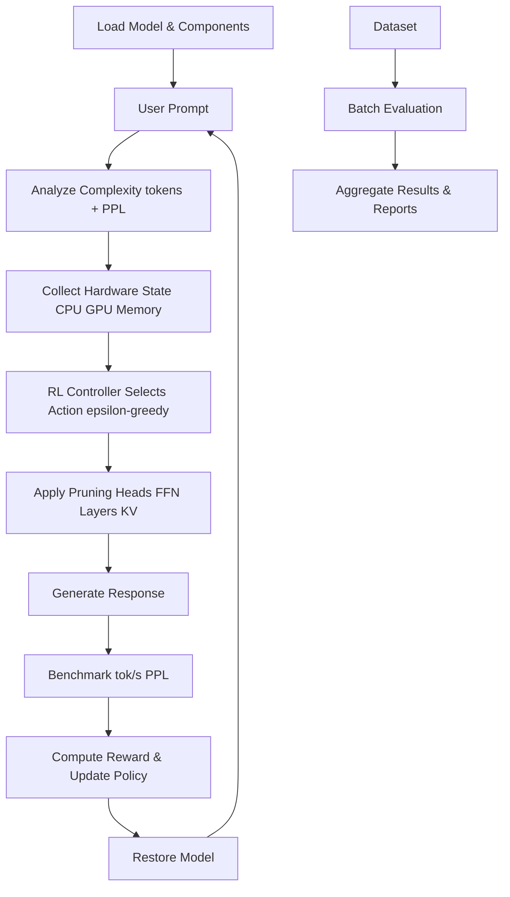

# CASRAP: Context Aware Structured Runtime Adaptive Pruning

A reinforcement learning (RL)-driven system for adaptive LLM pruning that balances inference speed, accuracy, and resource usage based on real-time hardware state and prompt complexity. Bridges static pruning (e.g., LLM-Pruner, SparseGPT) with dynamic runtime decisions using an interpretable yet learnable controller.

[](https://opensource.org/licenses/MIT)
## Table of Contents

- [Description](#description)
- [Key Innovations](#key-innovations)
- [Features](#features)
- [Requirements](#requirements)
- [Installation](#installation)
- [Quick Start](#quick-start)
- [Usage](#usage)
- [Architecture](#architecture)
- [Modules](#modules)
- [CLI Arguments](#cli-arguments)
- [Benchmarks](#benchmarks)
- [Workflow](#workflow)
- [Roadmap](#roadmap)
- [Troubleshooting](#troubleshooting)
- [Contributing](#contributing)
- [Citations](#citations)
- [Acknowledgments](#acknowledgments)

## Description

This project implements an RL-driven adaptive pruning system for LLMs that balances inference speed, accuracy, and resource usage based on real-time hardware state and prompt complexity. It bridges static pruning (e.g., LLM-Pruner, SparseGPT) with dynamic runtime decisions using a learnable controller (Double DQN).

### Key Improvements
- **RL Controller**: Epsilon-greedy policy over Q-network (Double DQN) replaces hand-written rules.
- **Real KV Pruning**: Sliding-window trimming of past_key_values during generation (reduces KV footprint).
- **Enhanced Evaluation**: Tokens/sec uses actual generated tokens; separate graphs with outlier removal.

The system is designed for A*-level research, comparing to SparseGPT, LLM-Pruner, PAT, RAP, with real pruning effects, standardized evaluation (lm-eval-harness), and rigorous training.

## Key Innovations

- **RL Controller**: Learnable policy maps hardware + prompt complexity to pruning actions.
- **Multi-Level Pruning**: Attention heads (GQA-safe), FFN channels, transformer layers, and sliding-window KV pruning.
- **Prompt-Centric Complexity**: Uses token length + model perplexity; no external NLP required.
- **Dataset Flexibility**: Automatic 80/20 splits for custom CSV datasets; standardized evaluation tooling.

## Features

- **RL Controller (DQN)**: RL-driven pruning policy with epsilon-greedy action selection. Reward balances speed (tok/s) vs accuracy (PPL).
- **Prompt-Centric Complexity**: Token length + model perplexity on the prompt. No external NLP.
- **Pruning Methods**:
  - Functional masking (hooks for validation).
  - Structural slicing (rebuilds Linear layers for speedups, GQA-safe head pruning).
  - Runtime KV cache pruning (sliding window on past_key_values).
- **Benchmarks**: WikiText-2 perplexity, lm-eval-harness tasks, latency/actual tokens/sec metrics.
- **Modes**: Separate train/test CLI modes with checkpointing.
- **Safety**: Reversible pruning, no permanent model damage.
- **Local Everything**: All caches, models, datasets stored in project folder.
## Installation

### 1. Clone Repository
```bash
git clone https://github.com/asief-iqbal/Thesis.git
cd Thesis
```

### 2. Create Virtual Environment
```bash
python -m venv venv
venv\Scripts\activate  # Windows
# source venv/bin/activate  # Linux/Mac
```

### 3. Install Dependencies
```bash
pip install torch transformers psutil numpy accelerate pynvml datasets lm-eval matplotlib
```

### 4. Additional Downloads
No additional downloads required.

### 5. Setup Environment
Create `.env` file:
```
HUGGINGFACE_HUB_TOKEN=your_hf_token_here
STRUCTURAL_PRUNING=0  # 1 for structural pruning
```

**Note**: All caches (HF models/datasets) stored locally in project folder.

## Quick Start

### Train RL Agent (Fast Mode)
```bash
venv\Scripts\activate
python Adaptive_pruning.py --mode train --episodes 10 --checkpoint checkpoints/rl_policy.pt --train-dataset "Prompt Dataset.csv" --train-samples 500 --max-new-tokens 20
```
Uses the custom `Prompt Dataset.csv` (80% for training, 20% for testing).

### Test Trained Agent
```bash
venv\Scripts\activate
python Adaptive_pruning.py --mode test --checkpoint checkpoints/rl_policy.pt --max-new-tokens 50 --wikitext-samples 200 --lm-eval
```

## Usage

### Training
Train the RL agent on a prompt dataset:
```bash
python Adaptive_pruning.py --mode train --episodes 100 --checkpoint checkpoints/rl_policy.pt --train-dataset "Prompt Dataset.csv" --train-samples 5000 --max-new-tokens 50
```
Uses 80% of the dataset for training.

**Faster Training Options** (for testing/debugging):
- `--episodes 50` (half episodes).
- `--train-samples 1000` (fewer prompts).
- `--max-new-tokens 20` (shorter generations).

Example fast run:
```bash
python Adaptive_pruning.py --mode train --episodes 10 --checkpoint checkpoints/rl_policy.pt --train-dataset "Prompt Dataset.csv" --train-samples 500 --max-new-tokens 20
```

### Testing
Evaluate the trained agent:
```bash
python Adaptive_pruning.py --mode test --checkpoint checkpoints/rl_policy.pt --max-new-tokens 50 --wikitext-samples 200 --lm-eval
```

### CLI Arguments

| Argument | Default | Description |
|----------|---------|-------------|
| `--mode` | - | `train` or `test` |
| `--episodes` | 50 | Number of training episodes |
| `--checkpoint` | - | Path to save/load RL policy |
| `--train-dataset` | Prompt Dataset.csv | Dataset for training (supports CSV with 80/20 split for train/test) |
| `--train-samples` | 5000 | Number of training prompts |
| `--max-new-tokens` | 50 | Generation length |
| `--wikitext-samples` | 200 | WikiText-2 eval samples |
| `--lm-eval` | False | Run lm-eval-harness |

## Architecture

### Core Components
- **RL Controller (DQN)**: State includes hardware (CPU/GPU, memory, battery) + prompt-centric complexity. Actions: pruning targets/intensities. Reward: 0.6 * tokens/sec - 0.4 * (PPL/10).
- **Prompt Analyzer**: Prompt-centric complexity (token length + model perplexity). No external NLP.
- **Model Engine**: Loads LLaMA-3.2-1B from HF, applies reversible pruning, generates responses, computes PPL.
- **Benchmark System**: Measures latency (ms), tokens/sec (actual generated tokens), PPL.

### Pruning Actions
- 0: `none` (0.0) - No pruning.
- 1: `kv_cache` (0.3) - Sliding-window KV cache pruning.
- 2: `attention_heads` (0.4) - Attention head pruning.
- 3: `ffn_neurons` (0.5) - FFN channel pruning.
- 4: `transformer_layers` (0.3) - Layer pruning.

### System Architecture Diagram



RL-driven with prompt-centric complexity; pruning includes GQA-safe heads, sliding-window KV. Evaluation on datasets.

## Modules

- `Adaptive_pruning.py`: Main script (RL agent, loops, eval runners).
- `model_loader.py`: HF loading, token auth, pruning apply/restore, save_pretrained.
- `nlp_analyzer.py`: Prompt analyzer (complexity via tokens + perplexity).
- `pruners/`: 
  - `head_pruner.py`, `ffn_pruner.py`, `layer_skipper.py` (functional masks).
  - `structured_ffn_slicer.py`, `structured_head_slicer.py` (structural slicing).
  - `kv_cache_pruner.py` (runtime KV cache size reduction).
- `.env`: Config (HF token, pruning mode).
- `checkpoints/`: RL policy files.
- `training_report.txt`: Post-training report.
- `training_metrics.png`: Graphs.

## Benchmarks

- **WikiText-2**: Perplexity and inference speed.
- **lm-eval-harness**: Standardized accuracy on ARC-E, HellaSwag, Winogrande, LAMBADA.
- **Custom Metrics**: Latency (ms), tokens/sec, perplexity in train/test.

## Detailed Methodology: How the RL-Driven Pruning Architecture Works

This section provides a comprehensive, step-by-step explanation of the system's workflow, calculations, and decision-making processes.

### 1. Initialization Phase
- **Model Loading**: Load LLaMA-3.2-1B from Hugging Face using `transformers`. Requires HF token for access.
- **Pruner Setup**: Initialize all pruners:
  - Functional pruners (hooks for masking).
  - Structural slicers (rebuild layers, GQA-safe head pruning).
  - KV cache pruner (sliding window on past_key_values).
- **Prompt Analyzer**: Prompt-centric complexity (token length + model perplexity). No external NLP.
- **Hardware Monitor**: NVML (if GPU) or torch memory; psutil for CPU/memory/battery.

### 2. Prompt Processing (Workflow)


**Step-by-step breakdown**:

1. **Tokenization**:
   - Use model tokenizer to count LLM tokens.

2. **Metrics**:
   - LLM tokens: Total tokens from model's tokenizer.
   - Prompt perplexity: PPL measured on the prompt by the current model.

3. **Normalization**:
   - llm_norm = min(1.0, llm_tokens / 200.0)
   - ppl_norm = min(1.0, ppl / 50.0)

4. **Complexity Score Calculation**:
   - Complexity Score = 0.6 * llm_norm + 0.4 * ppl_norm
   - Range: 0.0 (simple prompts) to 1.0 (complex prompts).

5. **Hardware State Collection**:
   - CPU utilization (%).
   - Memory available (GB).
   - GPU utilization (%) and free VRAM (GB).
   - Battery (%) if applicable.

### 3. Pruning Decision-Making (RL Policy) (Workflow)


Actions: `none`, `kv_cache`, `attention_heads`, `ffn_neurons`, `transformer_layers` with preset intensities. Policy learns to pick actions based on state.

### 4. Pruning Application

- **Attention Heads**:
  - Calculate importance: L2 norms of Q/K/V/O projections per head.
  - Remove lowest-scoring heads (e.g., intensity 0.4 → remove 40% heads).
  - Functional: Mask with hooks; Structural: Rebuild layer without heads (GQA-safe).

- **FFN Neurons**:
  - Importance: L2 norms of gate/up/down projections per channel.
  - Remove channels with lowest scores.
  - Functional: Mask channels; Structural: Rebuild Linear layers.

- **Transformer Layers**:
  - Skip layers from the end (e.g., intensity 0.3 → skip 30% layers).
  - Functional: Hook to bypass layers (cache-safe identity).

- **KV Cache**:
  - Sliding-window pruning of past_key_values to keep only the most recent context (window size scales with intensity).
  - Reduces KV cache footprint during generation without forcing shorter outputs.

- **None**: No changes to model.

### 5. Response Generation
- Apply pruning to model.
- Generate response: `model.generate(prompt, max_new_tokens=effective_max)`.
- For KV pruning, past_key_values are trimmed during forward passes.

### 6. Benchmarking and Evaluation
- **Perplexity Calculation**: 
  - Full text = prompt + generated response.
  - PPL = exp(cross-entropy loss) on full text.
- **Performance Metrics**:
  - Inference time (ms): Time to generate response.
  - Tokens/sec: generated_tokens / inference_time (uses actual generated length).
- **Reward (for evaluation)**: 0.6 * tokens/sec - 0.4 * (PPL / 10).
  - Balances speed (higher reward) vs. accuracy (lower PPL).

### 7. Model Restoration
- Restore all pruners to original state for next prompt.
- Ensures reversible pruning.

### 8. Training/Evaluation Loop
- For each prompt in dataset (80% train split):
  - Process prompt → Decide pruning → Apply → Generate → Benchmark → Log metrics.
- Generate reports: Overall stats, per-prune-type averages.
- Produce graphs: Inference time vs. episode (scatter + trendline, outliers removed), Perplexity vs. episode.

### 9. Testing on Holdout Set
- Use 20% test split from CSV.
- Same process, average metrics across test prompts.
- Optional: WikiText-2 PPL, lm-eval-harness tasks.

This methodology ensures learnable, hardware-aware pruning without randomness, adapting to prompt complexity for optimal speed-accuracy trade-offs.

## Roadmap

- **Phase 4**: Power/energy logging, baselines (SparseGPT, LLM-Pruner, quantization), Pareto plots.
- **Phase 5**: Expand RL state to more features, gradient-based saliency for pruning, ablations.

## Troubleshooting

### Common Issues

1. **ModuleNotFoundError**: Activate venv and install deps.
   ```bash
   venv\Scripts\activate
   pip install torch transformers psutil numpy accelerate pynvml datasets lm-eval matplotlib
   ```

2. **CUDA OOM**: Enable structural pruning or use smaller model.
   ```bash
   STRUCTURAL_PRUNING=1
   ```

3. **HF Token**: Ensure `.env` has valid token.

4. **NVML Unavailable**: GPU memory metrics fall back to torch; GPU util set to 0.0.

5. **Slow Training**: Use fast options or GPU.

### Logs

Check console for errors. Training auto-saves checkpoints/reports.

## Contributing

- Fork repo.
- Create feature branch.
- Submit PR with description.
- Report bugs with logs.

## License

MIT License. See LICENSE file for details.

## Citations

If you use this work in your research, please cite:

```bibtex
@misc{rl_adaptive_pruning_llm,
  title={RL-Driven Adaptive Pruning for Large Language Models},
  author={Asief Iqbal},
  year={2025},
  howpublished={\url{https://github.com/asief-iqbal/Thesis}},
  note={An RL-driven system for adaptive LLM pruning balancing inference speed, accuracy, and resource usage with prompt-centric complexity and GQA-safe pruning.}
}
```

## Acknowledgments

- Hugging Face Transformers and Datasets for model and data handling.
- PyTorch for deep learning framework.
- lm-eval-harness for standardized evaluation.
