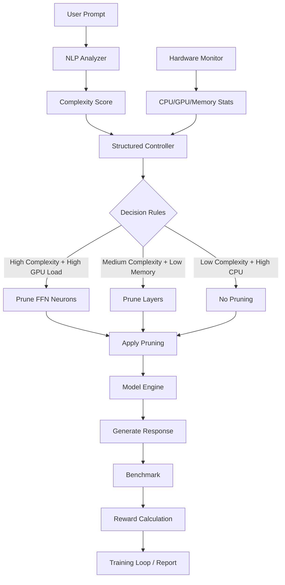

# Structured Adaptive Pruning for LLMs

A rule-based system for adaptive LLM pruning that balances inference speed, accuracy, and resource usage based on real-time hardware state and prompt complexity. Bridges static pruning (e.g., LLM-Pruner, SparseGPT) with dynamic runtime decisions using deterministic methodologies.

[](https://opensource.org/licenses/MIT)

## Table of Contents

- [Description](#description)
- [Key Innovations](#key-innovations)
- [Features](#features)
- [Requirements](#requirements)
- [Installation](#installation)
- [Quick Start](#quick-start)
- [Usage](#usage)
- [Architecture](#architecture)
- [Modules](#modules)
- [CLI Arguments](#cli-arguments)
- [Benchmarks](#benchmarks)
- [Workflow](#workflow)
- [Roadmap](#roadmap)
- [Troubleshooting](#troubleshooting)
- [Contributing](#contributing)
- [License](#license)
- [Citations](#citations)
- [Acknowledgments](#acknowledgments)

## Description

This project implements a **structured adaptive pruning system** for LLM pruning that balances inference speed, accuracy, and resource usage based on real-time hardware state and prompt complexity. Bridges static pruning (e.g., LLM-Pruner, SparseGPT) with dynamic runtime decisions using rule-based methodologies.

### Key Improvements
- **Structured Pruning**: Deterministic rules replace random RL exploration for interpretable decisions.
- **KV Cache Pruning**: Runtime reduction of generation length to limit cache usage.
- **Enhanced Evaluation**: Separate graphs (inference time & perplexity) with outliers removed and trendlines.
- **Comprehensive Training**: Automatic 80/20 split on custom CSV datasets, training on all 80% prompts.

The system is designed for A*-level research, comparing to SparseGPT, LLM-Pruner, PAT, RAP, with real pruning effects, standardized evaluation (lm-eval-harness), and rigorous training.

## Key Innovations

- **Structured Pruning**: Rule-based decisions based on prompt complexity and hardware state for interpretable, deterministic pruning.
- **Multi-Level Pruning**: Supports attention heads, FFN neurons, transformer layers, and KV cache pruning.
- **Enhanced Visualization**: Separate scatter plots with trendlines and outlier removal for inference time and perplexity.
- **Dataset Flexibility**: Automatic 80/20 splits for custom CSV datasets, training on all prompts in the split.
- **Custom Dataset Support**: Load and train/test on custom CSV files with automatic 80/20 splits.

## Features

- **Structured Controller**: Rule-based pruning decisions using prompt complexity and hardware telemetry.
- **NLP Analysis**: Hybrid spaCy/NLTK for rich prompt features (POS, noun chunks, dependency span).
- **Pruning Methods**:
  - Functional masking (hooks for validation).
  - Structural slicing (rebuilds Linear layers for speedups).
  - Runtime KV cache pruning (reduces generation length).
- **Benchmarks**: WikiText-2 perplexity, lm-eval-harness tasks, latency/tokens/sec metrics.
- **Modes**: Separate train/test CLI modes with checkpointing.
- **Safety**: Reversible pruning, no permanent model damage.
- **Local Everything**: All caches, models, datasets stored in project folder.
## Installation

### 1. Clone Repository
```bash
git clone https://github.com/asief-iqbal/Thesis.git
cd Thesis
```

### 2. Create Virtual Environment
```bash
python -m venv venv
venv\Scripts\activate  # Windows
# source venv/bin/activate  # Linux/Mac
```

### 3. Install Dependencies
```bash
pip install torch transformers psutil numpy accelerate pynvml spacy datasets lm-eval nltk matplotlib
```

### 4. Download Data Locally
```bash
# NLTK data
python -c "import nltk; nltk.data.path.append('nltk_data'); nltk.download('punkt', download_dir='nltk_data')"

# spaCy model (optional, falls back to NLTK)
python -c "import spacy.cli; spacy.cli.download('en_core_web_sm', data_path='spacy_data')"
```

### 5. Setup Environment
Create `.env` file:
```
HUGGINGFACE_HUB_TOKEN=your_hf_token_here
STRUCTURAL_PRUNING=0  # 1 for structural pruning
```

**Note**: All caches (HF models/datasets, NLTK, spaCy) stored locally in project folder.

## Quick Start

### Train RL Agent (Fast Mode)
```bash
venv\Scripts\activate
python Adaptive_pruning.py --mode train --episodes 10 --checkpoint checkpoints/rl_policy.pt --train-dataset databricks/databricks-dolly-15k --train-samples 500 --max-new-tokens 20
```

### Test Trained Agent
```bash
venv\Scripts\activate
python Adaptive_pruning.py --mode test --checkpoint checkpoints/rl_policy.pt --max-new-tokens 50 --wikitext-samples 200 --lm-eval
```

## Usage

### Training
Train the RL agent on a prompt dataset:
```bash
python Adaptive_pruning.py --mode train --episodes 100 --checkpoint checkpoints/rl_policy.pt --train-dataset databricks/databricks-dolly-15k --train-samples 5000 --max-new-tokens 50
```

**Faster Training Options** (for testing/debugging):
- `--episodes 50` (half episodes).
- `--train-samples 1000` (fewer prompts).
- `--max-new-tokens 20` (shorter generations).

Example fast run:
```bash
python Adaptive_pruning.py --mode train --episodes 10 --checkpoint checkpoints/rl_policy.pt --train-dataset databricks/databricks-dolly-15k --train-samples 500 --max-new-tokens 20
```

### Testing
Evaluate the trained agent:
```bash
python Adaptive_pruning.py --mode test --checkpoint checkpoints/rl_policy.pt --max-new-tokens 50 --wikitext-samples 200 --lm-eval
```

### CLI Arguments

| Argument | Default | Description |
|----------|---------|-------------|
| `--mode` | - | `train` or `test` |
| `--episodes` | 50 | Number of training episodes |
| `--checkpoint` | - | Path to save/load RL policy |
| `--train-dataset` | databricks/databricks-dolly-15k | Dataset for training |
| `--train-samples` | 5000 | Number of training prompts |
| `--max-new-tokens` | 50 | Generation length |
| `--wikitext-samples` | 200 | WikiText-2 eval samples |
| `--lm-eval` | False | Run lm-eval-harness |

## Architecture

### Core Components
- **RL Controller (DQN)**: State includes hardware (CPU/GPU, memory, battery) + prompt complexity score. Actions: pruning targets/intensities. Reward: 0.6 * tokens/sec - 0.4 * (perplexity/10).
- **NLP Analyzer**: Hybrid spaCy/NLTK scoring (verbs, questions, tokens, noun chunks, dep span).
- **Model Engine**: Loads LLaMA-3.2-1B from HF, applies reversible pruning, generates responses, computes PPL.
- **Benchmark System**: Measures latency (ms), tokens/sec, PPL, VRAM, power.

### Pruning Actions
- 0: `none` (0.0) - No pruning.
- 1: `kv_cache` (0.3) - KV cache pruning (reduces generation length).
- 2: `attention_heads` (0.4) - Attention head pruning.
- 3: `ffn_neurons` (0.5) - FFN channel pruning.
- 4: `transformer_layers` (0.3) - Layer pruning.

### System Architecture Diagram



This diagram illustrates the structured flow: prompt analysis, hardware monitoring, rule-based decisions, pruning application, response generation, and evaluation.

## Modules

- `Adaptive_pruning.py`: Main script (RL agent, loops, eval runners).
- `model_loader.py`: HF loading, token auth, pruning apply/restore, save_pretrained.
- `nlp_analyzer.py`: Prompt complexity analysis.
- `pruners/`: 
  - `head_pruner.py`, `ffn_pruner.py`, `layer_skipper.py` (functional masks).
  - `structured_ffn_slicer.py`, `structured_head_slicer.py` (structural slicing).
  - `kv_cache_pruner.py` (runtime KV cache size reduction).
- `.env`: Config (HF token, pruning mode).
- `checkpoints/`: RL policy files.
- `training_report.txt`: Post-training report.
- `training_metrics.png`: Graphs.

## Benchmarks

- **WikiText-2**: Perplexity and inference speed.
- **lm-eval-harness**: Standardized accuracy on ARC-E, HellaSwag, Winogrande, LAMBADA.
- **Custom Metrics**: Latency (ms), tokens/sec, perplexity in train/test.

## Workflow

1. **Initialization**: Load HF token, model (LLaMA-3.2-1B), NLP analyzer, pruners.
2. **Training Loop**:
   - Sample prompt from dataset (Dolly/Alpaca).
   - RL observes state (hardware + NLP complexity).
   - Selects action (prune heads/FFN/layers at intensity).
   - Apply pruning to model.
   - Generate response, compute reward (speed vs. accuracy).
   - RL train_step (update policy/target nets).
   - Restore model for next episode.
3. **Testing Loop**:
   - Load RL checkpoint (epsilon=0 for exploitation).
   - Run on test prompts, apply actions, benchmark, average metrics.
4. **Evaluation**:
   - WikiText-2: Average PPL, tokens/sec, time over samples.
   - lm-eval-harness: Export pruned model, evaluate on tasks.
5. **Report Generation**: Automatic report and plots.

## Roadmap

- **Phase 4**: Power/energy logging, baselines (SparseGPT, LLM-Pruner, quantization), Pareto plots.
- **Phase 5**: Expand RL state to full NLP feature vector, gradient-based saliency for pruning, ablations.

## Troubleshooting

### Common Issues

1. **ModuleNotFoundError**: Activate venv and install deps.
   ```bash
   venv\Scripts\activate
   pip install torch transformers psutil numpy accelerate pynvml spacy datasets lm-eval nltk matplotlib
   ```

2. **CUDA OOM**: Enable structural pruning or use smaller model.
   ```bash
   STRUCTURAL_PRUNING=1
   ```

3. **HF Token**: Ensure `.env` has valid token.

4. **spaCy Fail**: NLTK fallback works.

5. **Slow Training**: Use fast options or GPU.

### Logs

Check console for errors. Training auto-saves checkpoints/reports.

## Contributing

- Fork repo.
- Create feature branch.
- Submit PR with description.
- Report bugs with logs.

## License

MIT License. See LICENSE file for details.

## Citations

If you use this work in your research, please cite:

```bibtex
@misc{structured_adaptive_pruning_llm,
  title={Structured Adaptive Pruning for Large Language Models},
  author={Asief Iqbal},
  year={2025},
  howpublished={\url{https://github.com/asief-iqbal/Thesis}},
  note={A rule-based system for adaptive LLM pruning balancing inference speed, accuracy, and resource usage with deterministic methodologies.}
}
```

## Acknowledgments

- Hugging Face Transformers and Datasets for model and data handling.
- PyTorch for deep learning framework.
- lm-eval-harness for standardized evaluation.
