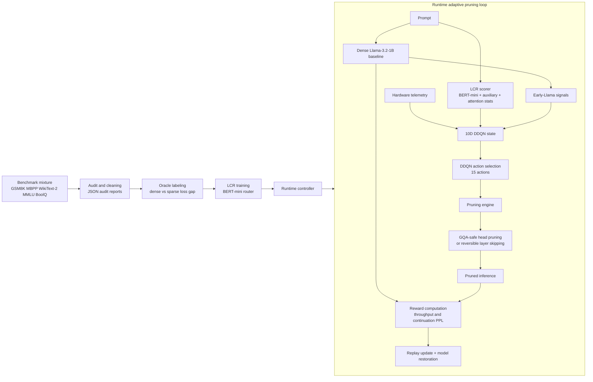
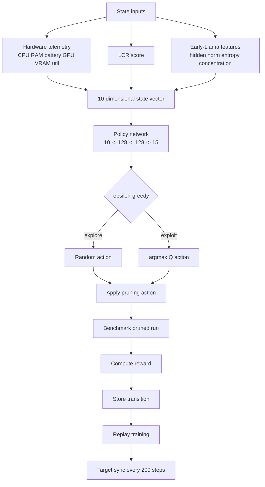
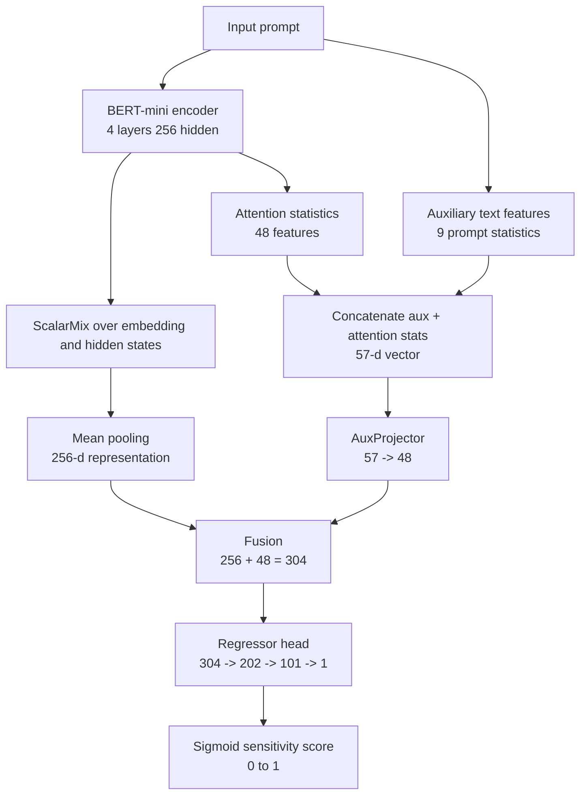

# CASRAP Diagram Set

This file stores the synchronized Mermaid diagrams for the current repository architecture. These diagrams match the updated methodology and README.

## 1. End-to-End System Diagram

## 2. Runtime Controller Diagram

## 3. LCR Architecture Diagram

